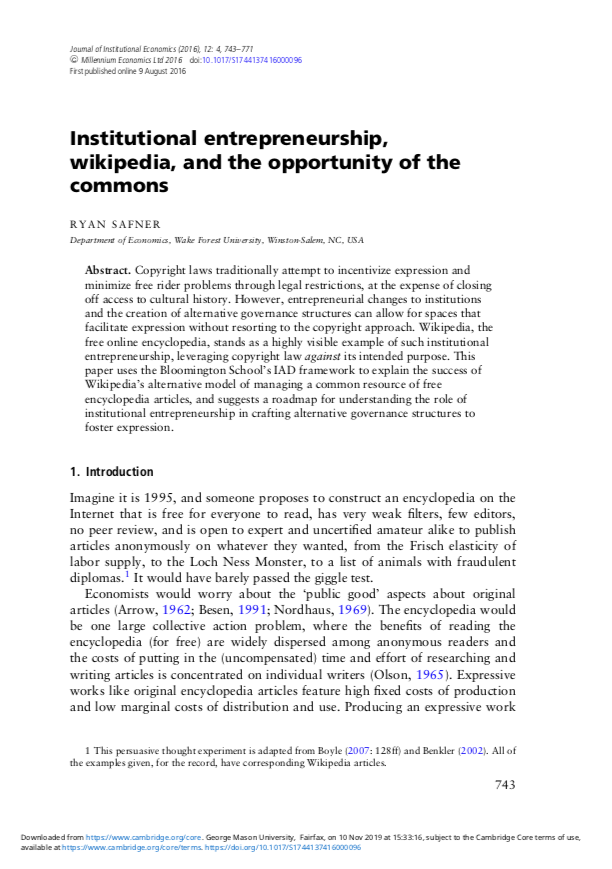
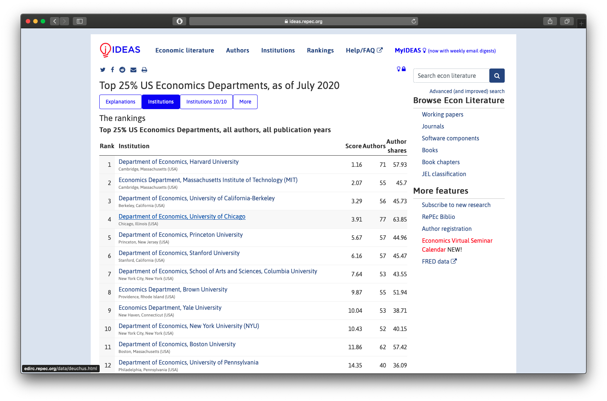

```{r setup, include=FALSE}
options(htmltools.dir.version = FALSE)
knitr::opts_chunk$set(echo=F,
                      message=F,
                      warning=F)
library(tidyverse)
set.seed(256)
update_geom_defaults("label", list(family = "Fira Sans Condensed"))
```

class: inverse, center, middle

### Why Care About the History of Economics?

### Some Sociology of the Economics Profession

### About This Course

---

class: inverse, center, middle

# Why Care About the History of Economics?

---

# Why Care About the History of Economics?

.pull-left[

> "History is just one damned thing after another." - Arnold Toynbee (attributed)

- Isn't our useful history captured in our current practice?
  - Have we keept the good, thrown out the bad?

]

.pull-right[
.center[

]

]

---

# Economics is a Liberal Art

.left-column[
.center[


.smallest[
Friedrich A. Hayek

1899-1992

Economics Nobel 1974
]
]
]

.right-column[

.smallest[

> “The physicist who is only a physicist can still be a first class physicist and a most valuable member of society. But nobody can be a great economist who is only an economist—and I am even tempted to add that the economist who is only an economist is likely to become a nuisance if not a positive danger.” 

]
]

.source[Hayek, Friedrich A, 21967, *Studies in Philosophy, Politics and Economics*]

---

# Economics is a Liberal Art

.left-column[
.center[


.smallest[
George L. S. Shackle

1903-1992

]
]
]

.right-column[

.smallest[

> “To be a complete economist, a man need only be a mathematician, a philosopher, a psychologist, an anthropologist, a historian, a geographer, and a student of politics; a master of prose exposition; and a man of the world with experience of practical business and finance, an understanding of the problems of administration, and a good knowledge of four or five languages. All this is, of course, in addition to familiarity with the economic literature itself...[The person best suited to economics is] the outstanding intellectual all-rounder with some leaning towards the arts rather than the natural science side.”

]
]

.source[Shackle, G. L. S., 1955, *Uncertainty in Economics and Other Reflections*]

---

# Progress: Female & POC John Bates Clark Medalists 

.center[

]

---

# Why Care About the History of Economics?

.pull-left[

- You have some interest in learning and applying economic way of thinking

- Most of you probably aren’t going to graduate school

BUT you can still build up your:

- Critical thinking skills

- Additional perspectives and tools (non-mainstream)

And we have made mistakes as a profession!
]

.pull-right[
.center[

]
]

---

# Warts and All

.pull-left[

]

.pull-right[

[](https://scholar.harvard.edu/files/alicewu/files/ejr2019.pdf)
]

---

# An Ongoing Critical Discourse

.pull-left[

- Limitations of models (equilibrium, perfect competition)

- How did certain ideas enter/get rejected from “the mainstream”
  - Which still persist as “heterodox” ideas?

- An .hi-purple[ongoing critical discourse]
  - Lots of agreement
  - Lots of disagreement
  - Competing religions (*especially* in macro!)
]

.pull-right[
.center[

]
]

---

# Think of Your Experience: What is Economics To You?

.pull-left[

- Modern economics sequence
  - principles + intermediate micro & macro
  - ECON 305, ECON 306

- Privileges .hi[techniques] over .hi[ideas]

- A .hi-purple[science of choice] to be applied to .hi-purple[find the optimum] in politics, business, life
]

.pull-right[
.center[

.tiny[
Income & substitution effects from a price change (remember this? 😅)
]
]
]

---

# What is Economics To Economists?

.pull-left[

- What counts as "scientific" or "economics"?

- Actual peer review on my 2<sup>nd</sup> academic article:

> "There is basically no 'economics' in the paper at all." - Reviewer #2

]

.pull-right[
.center[

]
]

---

# What is Economics To Economists?

.center[

]

---

# Example: RCTs are All the Rage

.pull-left[
.center[

<blockquote class="twitter-tweet" data-lang="en"><p lang="en" dir="ltr">Professors Esther Duflo and Abhijit Banerjee, co-directors of MIT&#39;s <a href="https://twitter.com/JPAL?ref_src=twsrc%5Etfw">@JPAL</a>, receive congratulations on the big news this morning. They share in the <a href="https://twitter.com/hashtag/NobelPrize?src=hash&amp;ref_src=twsrc%5Etfw">#NobelPrize</a> in economic sciences “for their experimental approach to alleviating global poverty.”<br> <br>Photo: Bryce Vickmark <a href="https://t.co/NWeTrjR2Bq">pic.twitter.com/NWeTrjR2Bq</a></p>&mdash; Massachusetts Institute of Technology (MIT) (@MIT) <a href="https://twitter.com/MIT/status/1183752282988564480?ref_src=twsrc%5Etfw">October 14, 2019</a></blockquote> <script async src="https://platform.twitter.com/widgets.js" charset="utf-8"></script> 

]
]

.pull-right[
.center[

Source: [Vox (Oct 14, 2019)](https://www.vox.com/future-perfect/2019/10/14/20913928/nobel-prize-economics-duflo-banerjee-kremer)


]
]

---

# But Not Everyone Agrees I

.left-column[

.center[


Angus Deaton

Economics Nobel 2015
]

]
.right-column[
.smaller[
> The RCT is a useful tool, but I think that is a mistake to put method ahead of substance. I have written papers using RCTs...[but] no RCT can ever legitimately claim to have established causality. My theme is that RCTs have no special status, they have no exemption from the problems of inference that econometricians have always wrestled with, and there is nothing that they, and only they, can accomplish.

]
]

.source[Deaton, Angus, 2019, [“Randomization in the Tropics Revisited: A Theme and Eleven Variations”](https://scholar.princeton.edu/sites/default/files/deaton/files/deaton_randomization_revisited_v2_2019_01.pdf), Working Paper]

---

# But Not Everyone Agrees II

.left-column[
.center[


Lant Pritchett

]
]

.right-column[
.smallest[
> “People keep saying that the recent Nobelists "studied global poverty." This is exactly wrong. They made a commitment to a method, not a subject, and their commitment to method prevented them from studying global poverty.”

> “At a conference at Brookings in 2008 Paul Romer (last years Nobelist) said: "You guys are like going to a doctor who says you have an allergy and you have cancer. With the skin rash we can divide you skin into areas and test variety of substances and identify with precision and some certainty the cause. Cancer we have some ideas how to treat it but there are a variety of approaches and since we cannot be sure and precise about which is best for you, we will ignore the cancer and not treat it.”

]
]

.source[[Source](https://www.facebook.com/lant.pritchett/posts/10218688602381690)]

---

# But Not Everyone Agrees III

.left-column[

.center[


Angus Deaton

Economics Nobel 2015
]

]
.right-column[

> “Lant Pritchett is so fun to listen to, sometimes you could forget that he is completely full of shit.”

]

.source[[Source](https://medium.com/@ismailalimanik/lant-pritchett-the-debate-about-rcts-in-development-is-over-ec7a28a82c17)]

---

# Economics is Partially Determined by History

.pull-left[

- Historical events partially determine the state of the mainstream

- Guided by current trends and fashions

]

.pull-right[
.center[

]
]

---

# Economics is Partially Determined by History

.pull-left[

- Historical events partially determine the state of the mainstream

- .hi[*Mis*]guided by current trends and fashions

]

.pull-right[
.center[

]
]

---

class: inverse, center, middle

# Some Sociology of the Economics Profession

---

# Some Sociology of the Economics Profession

> "Each year, almost every economics Ph.D. program produces more Ph.D.s than it can hire. As a result, candidates from the top departments trickle down, filling openings at lower-ranked departments, crowding most of the graduates of those departments to jobs in departments further down the rankings...the vast majority of new economics Ph.D.s ... moved to jobs in departments at least 50 ranks below their graduate department..." p. 7

.source[Cawley, John, 2018, ["A Guide and Advice for Economists on the U.S. Junior Academic Job Market, 2018-2019 Edition,"](https://www.aeaweb.org/content/file?id=869) Working Paper]

---

# Some Sociology of the Economics Profession

> "[T]here is a strong demand in numerous sectors for new economics Ph.D.s, and almost everyone lands a job that they like. In a survey of economics job candidates from 2007 to 2010, job candidates received on average 16.8 interviews at the ASSA meetings, 5.7 flyouts, and 2.9 job offers (McFall et al., 2015). By the end of summer, 92% of job candidates had accepted a job...only 6% received no job offers....64% of job candidates got their top choice of sector (among: four-year college, university, nonprofit/government, business/industry, and postdoc). Another 20% got their second choice, and only 7% placed into jobs they had ranked fourth or fifth out of the five types. In addition, more than two-thirds of respondents (69.1%) were either “very satisfied” or “extremely satisfied” with their placements...”"

.source[Cawley, John, 2018, ["A Guide and Advice for Economists on the U.S. Junior Academic Job Market, 2018-2019 Edition,"](https://www.aeaweb.org/content/file?id=869) Working Paper]

---

# Some Sociology of the Economics Profession

.pull-left[
.center[

]
]

.pull-right[
.center[

]
]

.source[Cawley, John, 2018, ["A Guide and Advice for Economists on the U.S. Junior Academic Job Market, 2018-2019 Edition,"](https://www.aeaweb.org/content/file?id=869) Working Paper]

---

# Some Sociology of the Economics Profession

> "[S]ince the year 2000,the real (inflation-adjusted) salaries of new assistant professors of economicsin Ph.D.-granting institutions have risen over 36%. In 2017-18, the salary offered to new assistant professors of economics by Ph.D.-granting institutions averaged $132,143 (Scott and Siegfried, 2018). Finally, National Science Foundation data indicate that Ph.D. economists have the lowest unemployment rate (0.9%) of any doctoral field, as well as one of the highest median salaries of any doctoral field." pp.7-8
]

.source[Cawley, John, 2018, ["A Guide and Advice for Economists on the U.S. Junior Academic Job Market, 2018-2019 Edition,"](https://www.aeaweb.org/content/file?id=869) Working Paper]

---

# Some Sociology of the Economics Profession


> "[S]ince the year 2000,the real (inflation-adjusted) salaries of new assistant professors of economicsin Ph.D.-granting institutions have risen over 36%. In 2017-18, the salary offered to new assistant professors of economics by Ph.D.-granting institutions averaged $132,143 (Scott and Siegfried, 2018). Finally, National Science Foundation data indicate that Ph.D. economists have the lowest unemployment rate (0.9%) of any doctoral field, as well as one of the highest median salaries of any doctoral field." pp.7-8
]


.source[Cawley, John, 2018, ["A Guide and Advice for Economists on the U.S. Junior Academic Job Market, 2018-2019 Edition,"](https://www.aeaweb.org/content/file?id=869) Working Paper]

---

# Some Sociology of the Economics Profession

.pull-left[

- Like many high-paying professions, professional economists are status whores

- Journal rankings (rePec)

- "Top 5":
  1. *American Economic Review (AER)*
  2. *Econometrica (ECMA)*
  3. *Journal of Political Economy (JPE)*
  4. *Quarterly Journal of Economics (QJE)*
  5. *Review of Economic Studies (ReStud)*

]

.pull-right[
.center[


Source: [RePEc](https://ideas.repec.org/top/top.journals.simple.html)
]
]

---

# Some Sociology of the Economics Profession

.pull-left[

- Ph.D-granting Economics Department rankings^[Not the same as undergraduate school rankings!]

- "Top 5" Departments (U.S.)
  1. MIT
  2. Harvard
  3. Chicago
  4. Stanford
  5. Yale/Princeton

]

.pull-right[
.center[


Source: [RePEc](https://ideas.repec.org/top/top.usecondept.html)
]
]

---

# Academic Incest

.center[

]

.source[Heckman, James M and Sidharth Moktan, 2020, "Publishing and Promotion in Economics: The Tyranny of the Top Five," *Journal of Economic Literature* 58(2): 419-470]

---

# Academic Incest

.pull-left[
.center[


]

]

.pull-right[
.quitesmall[

"Table 1 provides...a measure of the intellectual diversity in some top programs [using] the ratio of the number of different programs from which professors come to the total number of professors in the department. The higher the dispersion index number the wider the gene pool of graduates of that program. 

Thus, if there were 10 professors at a program, and they came from 10 different programs, the dispersion index would be 1. If, however, they all came from the same school, the dispersion index would be 0.1.

MIT and Harvard have...the smallest gene pool of the programs listed. Chicago has the largest, which is still only 0.5...professors at these top programs come from a relatively small group of programs, [and] the most inbreeding occurs at MIT and Harvard and the least at Chicago." (p.157)

]

]

.source[Colander, David, 2015, "Intellectual Incest on the Charles: Why Economists are a little bit off," *Eastern Economic Journal* 41:155-159]

---

# Academic Incest

.pull-left[
.center[


]

]

.pull-right[
.smallest[

"Because in the past they have hired so many of each other’s graduates they can be seen as at bestfirst cousins, and more...The mainstream profession seems to be following the path of the Spanish Habsburgs and not controlling inbreeding of close intellectual relative," (pp.158-159).
]

]

.source[Colander, David, 2015, "Intellectual Incest on the Charles: Why Economists are a little bit off," *Eastern Economic Journal* 41:155-159]

---

# Mainstream vs. Mainline Economics

.pull-left[

- .hi-purple["Mainstream"]: whatever current fashions the top 5 are following

- .hi-purple["Mainline"]: work in the tradition of Adam Smith
]

.pull-right[
.center[

]

]

.source[Boettke, Peter J, Alexander Fink, and Daniel J Smith, 2012, "The Impact of Nobel Prize Winners in Economics: Mainline vs. Mainstream," *American Journal of Economics and Sociology* 71(5):1219-1249]

---

# Mainstream vs. Mainline Economics

> "We understand .hi[mainline economists] to work in the .hi[tradition of Adam Smith]. They start with the postulate that shortsighted, cognitively limited /hi[individuals pursue their own self-interest]. They focus their scholarly efforts on studying how these individuals, acting in their own self-interest, .hi[create complex social arrangements] under the .hi[division of labor] that .hi[align individual interest with the social interest]. Thus, they tend to rely on invisible-hand theorizing to analyze how individuals coordinate individual plans in an .hi[orderly decentralized fashion]...Accordingly, mainline economists, tend to view economics primarily as the .hi[science of exchange]." (p.1220)


.source[Boettke, Peter J, Alexander Fink, and Daniel J Smith, 2012, "The Impact of Nobel Prize Winners in Economics: Mainline vs. Mainstream," *American Journal of Economics and Sociology* 71(5):1219-1249]

---

# Mainstream vs. Mainline Economics

> In contrast, we understand .hi[mainstream economists] to tend to .hi[follow the scientific trends of their days] and, at times, to be taken far afield from the mainline of economics by the pursuit of current fashions...[We have argued that] in the 1930s, mainstream economics moved away from the advancement of the propositions explored by mainline economists. Instead of viewing economics primarily as the science of exchange, economics became a .hi[science of choice]...modeling the choice of .hi[cognitively perfect individuals in ideal situations], leaving no room for institutional analysis and operative mechanisms to explain how markest work given behavioral deviations from the hypothesized ideal man...opening the door to the use of .hi[economics as a tool of social control]..." (pp.1220-1221).


.source[Boettke, Peter J, Alexander Fink, and Daniel J Smith, 2012, "The Impact of Nobel Prize Winners in Economics: Mainline vs. Mainstream," *American Journal of Economics and Sociology* 71(5):1219-1249]

---

# Mainstream vs. Mainline Economics

.pull-left[

.smaller[
> "Nobel Laureates working in the mainline of economics have had a more enduring impact on the social science profession than those working in the mainstream of economics. Our conjecture is that while mainstream economists engage in fashionable scholarly pursuits, these pursuits over the long run tend to have relatively weak enduring influence on the economics profession," (pp.1220-1221).

]
]
.pull-right[
.center[

]
]

.source[Boettke, Peter J, Alexander Fink, and Daniel J Smith, 2012, "The Impact of Nobel Prize Winners in Economics: Mainline vs. Mainstream," *American Journal of Economics and Sociology* 71(5):1219-1249]

---

# Mainstream vs. Mainline Economics

.pull-left[

> "Individually, mainline Nobel Laureates were cited more often than mainstream Laureates. In terms of electronic and non-electronic SSCI citations mainline Nobel Prize winners are more successful in maintaining an enduring impact on the social science profession than mainstream Nobel Prize winners," (pp.1228).

]

.pull-right[
.center[

]
]

.source[Boettke, Peter J, Alexander Fink, and Daniel J Smith, 2012, "The Impact of Nobel Prize Winners in Economics: Mainline vs. Mainstream," *American Journal of Economics and Sociology* 71(5):1219-1249]

---

class: inverse, middle, center
# About This Course

---

# Logistics: Hybrid Course

.smaller[
- .hi[hybrid]: more .hi-purple[synchronous] material than .hi-turquoise[asynchronous] material

- I will always be teaching .hi[remotely]
  - A classroom is available to you
  - I may make occasional visits to campus if you *need* something in person (TBD)

- Office hours: Tu/Th 3:30-5:00 PM on Zoom
  - <i class="fas fa-video"></i> Zoom link in Blackboard's `LIVE CLASS SESSIONS` link
  - <i class="fab fa-slack"></i> Slack channels

]

---

# Logistics: Hybrid Course

- We will have .hi-purple[synchronous] sessions Mon/Wed 2:00-3:15 PM on **<i class="fas fa-video"></i> Zoom**

- Lecture videos will be posted on **Blackboard** via Panopto for students unable to join synchronously
  - If you were present, you do not need to watch the video (again)!
  - You are not *required* to attend synchronously, but it will help you

- All graded assignments are .hi-turquoise[asynchronous]

---

# Learning Goals

By the end of this course, you will: 

- Identify key economic writers and their contributions to economic thought
- Discuss the influence and value of different writers and their contributions
- Identify and distinguish the major schools of economic thought: Classical, Marxist, Neoclassical, Austrian, Keynesian, Monetarist, New Classical
- Place theories and ideas studied within the context of the time
- Better comprehend the origins and context of orthodox economic theory today
- Explore critiques of orthodox economic theory from various heterodox schools of thought and understand contested areas
- Reflect on the nature of economics as a discipline
- Understand the origins of key economic concepts and models
- Trace the evolution of major ideas through time, via your own writing

---

# Assignments

```{r}
assignments <- tribble(
  ~"",  ~Assignment, ~Percent,
  "n"     , "Participation (Average)", "35%",
  "1"      , "Term Paper", "35%",
  "2", "Short Papers", "20%",
  "n", "Tournament Votes", "10%"
)

knitr::kable(assignments, "html")
```

---

# Online Discussions

.pull-left[

- My compromise between in-person discussions & asynchronous needs

- Weekly discussion board on topics (lectures & readings)

- Starting this week
]

.pull-right[

]

---

# Term Paper

.pull-left[

- Trace an idea through economic history

- Scaffolded - drafts of sections due after we finish a major era

- I'm writing my own HET research paper, so I'm with you
]

.pull-right[
.center[

]
]

---

# The Most Interesting Economist in History Tournament

.pull-left[
.center[


]

]

.pull-right[
.center[

]
]

---

# Primary Sources

.center[


]

---

# Secondary Sources

.pull-left[
.center[

]
]

.pull-right[
.center[

]

]

---

# Course Website


.pull-left[
.center[


]
]

.pull-right[
.center[

]
]

.center[
[thoughtF20.classes.ryansafner.com](https://thoughtF20.classes.ryansafner.com)
]

---

# Tips for Success, Or: How to College

.pull-left[
- Take notes. On paper. Really.

- Read the readings and join the conversation!

- Ask questions, come to office hours. Don't struggle in silence, you are not alone!

- You are learning how to learn

- See the [reference page](http://thoughtF20.classes.ryansafner.com/reference) for more
]

.pull-right[
.center[

]
]

---

# Roadmap for the Semester

.center[

]
