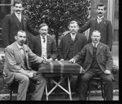
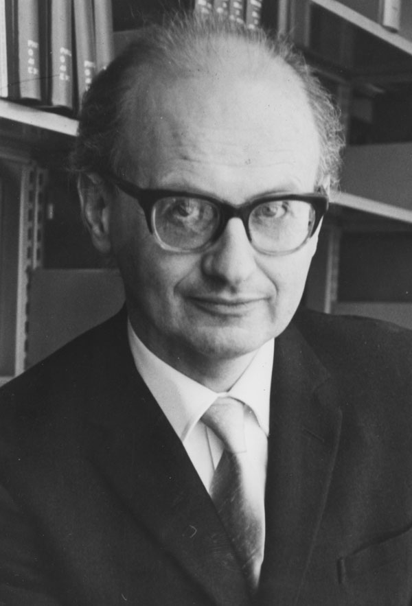
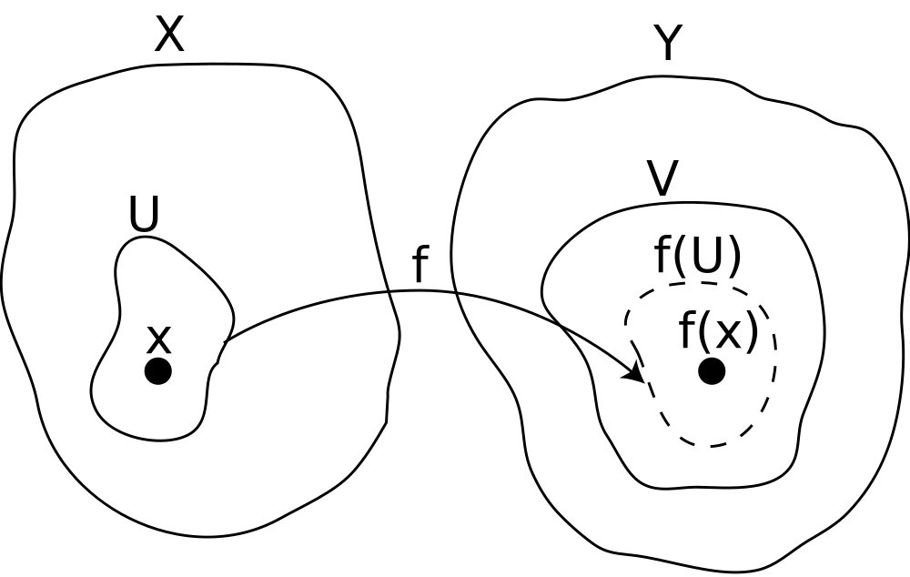

```{r setup, include=FALSE}
options(htmltools.dir.version = FALSE)
knitr::opts_chunk$set(echo=F,
                      message=F,
                      warning=F)
library(tidyverse)
set.seed(256)
update_geom_defaults("label", list(family = "Fira Sans Condensed"))
```

class: inverse

# Outline

## [Interpretations of Intellectual History](#3)

## [Some Philosophy of Science](#12)

## [So is Economics a Science?](#25)

---

# Two Interpretations of Intellectual History

.pull-left[

- .hi[Relativism]: all theories put forth in past are mere reflections of their contemporary history

- No objective “right or wrong,” no need for internal consistency, generalizability

- Test: do they accurately reflect their time?

]

.pull-right[
.center[

]
]

---

# Relativism Examples

.left-column[
.center[

.smaller[
Gustav von Schmoller

1838-1917
]
]
]


.right-column[

- .hi-purple[German Historical School] 
  - No *universal* laws of economics
  - All contingent on culture, history, politics of the time
  - Economics is history, more or less

- Opposition to (British) Classical economists; rising German (Prussian) nationalism

]

---

# Relativism Examples

.left-column[
.center[

.smaller[
Karl Marx

1818-1883
]
]

]

.right-column[

- .hi-purple[Marxist historiography]: history is material class struggles
  - Ideas & institutions are determined by which economic class controls the means of production

- Thinkers are the product of their “(false) class consciousness”
  - Can only (unwittingly) defend ideas & institutions that perpetuates their class interests
  - i.e. (post-Medieval) economists can only defend a burgeoise ideology because the burgeoise control the means of production

]

---

# Two Interpretations of Intellectual History 

.pull-left[

- .hi[Absolutism]: there exists some objective correct theory

- Each historical theory correctly or incorrectly describes some part of it

- Can compare historical theories as better or worse

]

.pull-right[
.center[

]
]

---

# Absolutism & Whig History

.pull-left[

- Absolutist mutation of .hi-purple[Whig history]: history is an inexorable climb towards *progress* (liberty, enlightenment, truth, liberal democracy, etc.)

- The past is always more barbaric, more ignorant, and worse than the present (“The Dark Ages”)

- The present (and future) is as close to ideal and will keep getting better

]

.pull-right[
.center[

]
]

---

# Orthodox and Heterodox Economics

.pull-left[

- .hi[Orthodox]: the mainstream<sup>.red[†]</sup> and generally accepted consensus views

- .hi-purple[Heterodox]: competing schools of thought that diverge from orthodoxy (but often still agree with some of its core tenets)

- Note: .hi-turquoise[“Mainline”] economics (last class) fits both from time to time!

.footnote[<sup>.red[†]</sup> Not *just* the Top 5 here!]
]

.pull-right[
.center[

]
]

---

# Modern Economic Orthodoxy

.pull-left[
.smaller[
- Neoclassical microeconomics; general equilibrium

- Macroeconomics: dynamic stochastic general equilibrium, New Keynesianism

- Mathematical formalism, empirical conometric testing

- Taught in undergraduate economics education

- Cutting edge of research in Top 5 journals/departments influences *future* orthodoxy
]
]

.pull-right[
.center[

]
]

---

# Modern Heterodox Economics

.pull-left[
.smaller[
- Critical of orthodoxy in some way; focuses on questions that orthodoxy ignores

- Sometimes fuse into part of mainstream
  - behavioral economics, public choice theory, experimental economics

- Common critiques of neoclassical assumptions (rationality, perfect competition, perfect information)

- .hi-green[Examples]: Post-Keynesian macro, Institutional, Austrian, feminist, ecological, Marxist economics
]
]

.pull-right[
.center[

]
]

---

# Orthodox and Heterodox Economics

.smallest[
> “[History of economic thought] shows [heterodox economists’] history and demonstrates that they are not simply malcontents but are the carriers of traditions that the modern mainstream has lost. For example, heterodox economists have often ventured beyond the boundaries of orthodox economic theory into a no man’s land among economics, sociology, anthropology, psychology, political science, history, and ethics. Modern economics is only now beginning to see the need to do that. Whereas modern orthodox theorists have largely focused on the four problems of allocation, distribution, stability, and growth, heterodox economists have studied the forces that produce changes in the society and economy...Often what orthodox writers take as given, heterodox writers try to explain; and what heterodox writers take as given, orthodox economists try to explain. Thus, the differences between heterodox and orthodox economists are often differences in focus, not diametrically opposed theories,” (pp.5-6).

> “Nonmainstream schools play important roles in the evolution of a discipline: they pollinate the mainstream view and keep it honest by pointing out its shortcomings or inconsistencies,” (p.7).

]

.source[Landreth, Harry and David Colander, 1996, *The History of Economic Thought*, 4th ed.]

---

class: inverse, center, middle

# Some Philosophy of Science

---

# Positivism

.left-column[
.center[


August Comte

1798-1857
]
]

.right-column[

- .hi-purple[Positivism]: knowledge is derived (only) from quantifiable empirical evidence
    - NOT from pure reason, revelation, or intuition

- Society and physical world operate under discoverable empirical & experimental laws

.smallest[
> "The law is this: that each of our leading conceptions [of both mind and society] – each branch of our knowledge – passes successively through three different theoretical conditions: the Theological, or fictitious; the Metaphysical, or abstract; and the Scientific, or positive." 

]

.source[Comte, Auguste, 1830-1842, *Course of Positive Philosophy*]

]

---

# Logical Positivism

.pull-left[
.smallest[
- .hi["Logical positivism"] (1920s-1930s): only *empirically-verifiable* statements are knowledge
  - anything *not* empirically-verifiable is unscientific and meaningless

> “The meaning of a method is the method of its verification.” – Moritz Schlick

> “If you cannot predict, you have not explained.” – Carl Hempel

- "Vienna Circle"
  - Notables members/associates: Moritz Schlick, F.A. Hayek, Ludwig Wittgenstein, Karl Popper
]
]

.pull-right[
.center[

.smallest[
"The Vienna Circle"
]
]
]

---

# Popperian Falsifiability

.left-column[
.center[


Karl Popper

1902-1994
]
]

.right-column[

- Two problems of science:
  1. Induction: can inductive reasoning produce new certain knowledge?
  2. Demarcation: what is the border between "science" and "non-science"

- Popper's answer to both is .hi-purple[falsifiability]

> “statements or systems of statements, in order to be ranked as scientific, must be capable of conflicting with possible, or conceivable observations,” (p.39)

.source[Popper, Karl, 1934, *The Logic of Scientific Discovery* (1959 English translation)]

]


---

# Popperian Falsifiability

.pull-left[
.smaller[
- A scientific proposition is capable of being .hi-purple[falsified]

- A hypothesis can be .hi-turquoise[corroborated] with evidence, but never *proven*
  - always .hi-turquoise[tentative] until it can be falsified (and a better hypothesis found)

- Example: “all swans are white” is a testable hypothesis, rejected upon discovery of a black swan

- Science is an endless sequence of .hi[conjectures and refutations]
]
]

.pull-right[
.center[

]
]

---

# Related: Hypothesis Testing in Statistics

.left-column[
.center[


Sir Ronald A. Fisher

1890-1962
]
]

.right-column[

> "The null hypothesis is never proved or established, but is possibly disproved, in the course of experimentation. Every experiment may be said to exist only in order to give the facts a chance of disproving the null hypothesis."

.source[Fisher, R. A., 1931, *The Design of Experiments*]
]

---

# Kuhn’s Paradigm Shifts & Scientific Revolutions

.left-column[
.center[


Thomas Kuhn

1798-1857
]
]

.right-column[
.smaller[
- Science has a .hi-purple[non-linear history]; research is driven by .hi[paradigms]

- .hi-purple["Normal Science"]: researchers working *within* an *established* paradigm
  - don't challenge underlying assumptions of theory

- Anomalies & problems accumulate that the standard paradigm can't account for
  - contra Popper, this doesn't *disprove* the theory, viewed as mistakes by researcher
]

.source[Kuhn, Thomas, 1962, *The Structure of Scientific Revolutions*]

]

---

# Kuhn’s Paradigm Shifts & Scientific Revolutions

.left-column[
.center[


Thomas Kuhn

1798-1857
]
]

.right-column[

.smallest[
- When the established paradigm reaches a crisis, a .hi[paradigm shift] 
  - "Scientific revolution"

- *New* paradigm with different assumptions, theory, and framework than prior

- .hi-green[Famous examples]:
  - Ptolomaic astronomy (geocentric) $\rightarrow$ Copernican astronomy (heliocentric)
  - Aristotelian physics $\rightarrow$ Newtonian physics $\rightarrow$ Relativity & quantum mechanics
  - Miasma theory of disease $\rightarrow$ germ theory of disease
]

.source[Kuhn, Thomas, 1962, *The Structure of Scientific Revolutions*]

]

---

# Kuhn’s Paradigm Shifts & Scientific Revolutions

.left-column[
.center[


Thomas Kuhn

1798-1857
]
]

.right-column[

- Different paradigms are *incommensurable* - can neither prove or disprove one paradigm with another's rules

- No neutral or objective language to compare paradigms...scientists "talking past one another"

.source[Kuhn, Thomas, 1962, *The Structure of Scientific Revolutions*]

]

---

# Kuhn’s Paradigm Shifts & Scientific Revolutions

.left-column[
.center[


Thomas Kuhn

1798-1857
]
]

.right-column[

.hi-green[Examples in economics] (?)

- Classical economics $\rightarrow$ marginalist *revolution*

- Classical macroeconomics $\rightarrow$ Keynesian revolution $\rightarrow$ counterrevolution

.source[Kuhn, Thomas, 1962, *The Structure of Scientific Revolutions*]

]

---

# Lakatos’ Scientific Research Programmes

.left-column[
.center[


Imre Lakatos

1922-1974
]
]

.right-column[
.smaller[
- Balance Popperian falsificationism & Kuhnian revolutions

- A .hi[scientific research programme (SRP)] based on a .hi-purple[“hard core”] of assumptions (unchallengeable without abandoning programme)
  - More modest, malleable, expendable .hi-turquoise["auxiliary hypotheses"] act as a .hi-turquoise[“protective belt”] to account for evidence that threatens the hard core

> "It is not that we propose a theory and Nature may shout NO; rather, we propose a maze of theories, and nature may shout INCONSISTENT," (p.30)

]

.source[Lakatos, Imre, 1970, "Falsification and the Methodology of Scientific Research Programmes," in Imre Lakatos and Alan Musgrave, eds, *Criticism and the Growth of Knowledge*]

]

---

# Lakatos’ Scientific Research Programmes

.left-column[
.center[


Imre Lakatos

1922-1974
]
]

.right-column[
.smaller[
- .hi-purple[Progressive research programme]: productive, expanding its explanatory and predictive power into new domains without threatening its hard core

- .hi-purple[Degenerative research programme]: losing explanatory power and having to adjust theory to protect hard core from threatening evidence
  - Sign that a more progressive research programme should be found

- *Multiple* research programmes coexist at any time and compete to be the most progressive
]

.source[Lakatos, Imre, 1970, "Falsification and the Methodology of Scientific Research Programmes," in Imre Lakatos and Alan Musgrave, eds, *Criticism and the Growth of Knowledge*]

]

---

# Lakatos’ Scientific Research Programmes

.left-column[
.center[


Imre Lakatos

1922-1974
]
]

.right-column[

.hi-green[Example in economics] (?) 

- The hard core of modern economics (?):

1. Maximizing agents (rationality)
2. Equilibrium tendencies 
3. Decentralized market prices coordinate behavior & resources

.source[Lakatos, Imre, 1970, "Falsification and the Methodology of Scientific Research Programmes," in Imre Lakatos and Alan Musgrave, eds, *Criticism and the Growth of Knowledge*]

]

---

class: inverse, center, middle

# So is Economics a Science?

---

# So is Economics a Science?

.center[

]

---

# A Canonical Definition of Economics

.left-column[
.center[


.smaller[
(Lord) Lionel Robbins

1898-1984
]
]
]

.right-column[

> “Economics is the science which studies human behaviour as a relationship between ends and scarce means which have alternative uses” (p.15)

.source[Robbins, Lionel, 1932, *Essay on the Nature and Significance of Economic Science*]
]

---

# Is Economics a Science?

.pull-left[
- As economists, we can't run experiments to falsify our theories

- Society is not our laboratory (probably a good thing!)

- Some exceptions:
  - Randomized control trials (development economics)
  - Experimental economics (in controlled university labs)
]

.pull-right[
.center[

]
]

---

# The Philosophy of Knowledge

.pull-left[

- .hi-purple[Epistemology]: the (philosophical) study of knowledge and what we can know

- Two common sources of knowledge:
  - .hi[*A priori* (“Rationalism”)]
  - .hi[*A posteriori* (“Empiricism”)]

]

.pull-right[
.center[

]
]

---

# A Priori vs. A Posteriori

.pull-left[

- .hi[*A priori* (“Rationalism”)]: knowledge .hi-purple[deduced] using .hi-purple[reason]
  - truth-preserving *tautologies*
  - already-true premises lead to a true conclusion that was "contained" in its premises (adds no new knowledge)
  - Key philosophers: Plato, Rene Descartes, Immanuel Kant
]

.pull-right[
.center[

]
]

---

# A Priori vs. A Posteriori

.pull-left[

- .hi[*A posteriori* (“Empiricism”)]: knowledge .hi-purple[inferred] from .hi-purple[experience]
  - Using the senses and experiments to *guess* at a broader principle & gain *new* knowledge
  - Key philosophers: Francis Bacon, John Locke, David Hume, John Stuart Mill, Bertrand Russell
]

.pull-right[
.center[

]
]

---

# Is Economics a Science?

.pull-left[
- How do you learn (or teach) economics?

- “The law of demand”

.quitesmall[
“Sometimes, certain very sophisticated statistical tests of the law [of demand] in which every allowance has been made for bias and incompleteness, have resulted, after a good deal of handwringing and computer-squeezing, in the diagonal elements of certain matrices being negative at the 5 percent level of significance. And sometimes they have not. Even the inventors of fully identified, complete systems of demand equations...have no great confidence in the results. A shift of one metaphor here, a shift of one appeal to authority there, and the “proof” would be valid no longer,” (McCloskey 1998, 24).

]

]

.pull-right[
.center[

]
]

---

# Modern Economics Constructs Models

.pull-left[

- Modern economists use fictional constructions to .hi-purple[logically] examine consequences
  - .hi-purple[deduction] from axioms

- Very different from other sciences
    - Purposive, strategic human beings 
    - Introspective understanding

> “All models lie. The art is telling useful lies.” - George Box

]

.pull-right[
.center[

]
]

---

# (How Much) Should We Use Mathematics?

.pull-left[

- Many have accused economists of suffering from “physics envy”

- 1870s+ neoclassical economics bases models on 300-year old physics
  - simple Newtonian mechanics
  - equilibrium

- Economics as third-rate applied mathematics

]

.pull-right[
.center[

]
]

---

# (How Much) Should We Use Mathematics?

.pull-left[

.smaller[
- Modern economics has done better, uses fancier mathematics
  - Does this make us more *accurate* or merely wrong more *precisely*?

- Micro: set theory, topology, real analysis

- Macro: dynamic stochastic general equilibrium models, chaos theory

- Econometric causal inference techniques since “credibility revolution” (1990s) *are* cutting edge!

]
]

.pull-right[
.center[

]
]

---

# (How Much) Should We Use Mathematics?

<blockquote class="twitter-tweet"><p lang="en" dir="ltr">It&#39;s come to my attention that many people don&#39;t understand how PhD microeconomics courses depend on so much high-level math.<br><br>So, I present to you how the textbook used in most micro PhD core courses kicks off a discussion of consumer preferences. <a href="https://t.co/zao3xNeh3u">pic.twitter.com/zao3xNeh3u</a></p>&mdash; Gray Kimbrough (@graykimbrough) <a href="https://twitter.com/graykimbrough/status/1291017699481575424?ref_src=twsrc%5Etfw">August 5, 2020</a></blockquote> <script async src="https://platform.twitter.com/widgets.js" charset="utf-8"></script> 

---

# Modeling, “Realism”, and Testability

.left-column[
.center[


.smallest[
Milton Friedman

1912-2016

Economics Nobel 1976
]
]
]

.right-column[

> “The .hi[ultimate goal] of a positive science is the development of a “theory” or, “hypothesis” that yields .hi[valid and meaningful] (i.e., not truistic) .hi[predictions] about phenomena not yet observed. ” (p.7)

> “Viewed as a body of substantive hypotheses, .hi[theory is to be judged by its predictive power] for the class of phenomena which it isintended to “explain.”...Factual evidence can never “prove” a hypothesis; it can only fail to disprove it, which is what we generally mean when we say, somewhat inexactly, that the hypothesis hasbeen “confirmed” by experience.” (p.8)

.source[Friedman, Milton, 1953, “The Methodology of Positive Economics,” in *Essays in Positive Economics*]
]

---

# Modeling, “Realism”, and Testability

.left-column[
.center[


.smallest[
Milton Friedman

1912-2016

Economics Nobel 1976
]
]
]

.right-column[

> “The .hi[choice among alternative hypotheses] equally consistent with the available evidence must to some extent be  arbitrary, though there is general agreement that relevant considerations are suggested by the criteria .hi[“simplicity” and “fruitfulness,”] themselves notions that defy completely objective specification. A theory is “simpler” the less the  initial  knowledge needed to make a prediction within a given field of phenomena; it is more “fruitful” the more precise  the resulting prediction, the wider the area within which the theory yields predictions, and the more additional lines for further research it suggests.” (p.10)

.source[Friedman, Milton, 1953, “The Methodology of Positive Economics,” in *Essays in Positive Economics*]
]

---

# Modeling, “Realism”, and Testability

.left-column[
.center[


.smallest[
Milton Friedman

1912-2016

Economics Nobel 1976
]
]
]

.right-column[
.smallest[

> “Truly important and significant hypotheses will be found to have “assumptions” that are wildly inaccurate descriptive representations of reality, and, in general, .hi[the more significant the theory, the more unrealistic the assumptions] (in this sense). The reason is simple. A hypothesis is important if it “explains” much by little, that is, if it abstract the common and crucial elements from the mass of complex and detailed circumstances surrounding the phenomena to be explained and permits valid predictions on the basis of them alone. .hi[To be important, therefore, a hypothesis must be descriptively false in its assumptions.]” (pp.14-15)

]

.source[Friedman, Milton, 1953, “The Methodology of Positive Economics,” in *Essays in Positive Economics*]
]

---

# Modeling, “Realism”, and Testability

.left-column[
.center[


.smallest[
Milton Friedman

1912-2016

Economics Nobel 1976
]
]
]

.right-column[

> "To put this point less paradoxically, the relevant question to ask about the “assumptions” of a theory is not whether they are descriptively “realistic,” for they never are, but whether they are sufficiently good approximations for the purpose in hand,” (p.16)


.source[Friedman, Milton, 1953, “The Methodology of Positive Economics,” in *Essays in Positive Economics*]
]

---

# Modeling, “Realism”, and Testability

.center[

]

---

# Is Economics Normative?

.pull-left[
- .hi[Positive economics]: descriptive statements about the world or consequences of actions 
  - e.g. “A fall in the price of bread will cause more people to buy more bread and less of other substitutes”

- .hi-purple[Normative economics]: prescriptions about what “we ought to do”
  - e.g. “We should raise the price of bread to support struggling wheat farmers”
]

.pull-right[
.center[

]
]

---

# Back to Robbins’ Canonical Definition

.left-column[
.center[


.smaller[
(Lord) Lionel Robbins

1898-1984
]
]
]

.right-column[

> “Economics is entirely neutral between ends;...in so far as any end is dependent on scarce means, it is germane to the preoccupations of the economist” (p.24)

> “Economics as science is about ‘ascertainable facts’ of the positive as distinct from normative (ethical) judgments on economic policy” (p.24)

.source[Robbins, Lionel, 1932, *Essay on the Nature and Significance of Economic Science*]
]

---

# Values

.pull-left[

- Historical writers wrote on political subjects, judged actions of State, advocated policies 

- Economists today recommend policy to policymakers

- What is the role of the economist?

- What values (if any) does economics promote?

]

.pull-right[
.center[

]
]

---

# What is Economics About?

.smallest[
> “In the first half of the 19th century, economics itself was regarded as an investigation of ‘the nature and causes of the wealth of nations’ (Smith), ‘the laws which regulate the distribution of the produce of the earth’ (Ricardo), and ‘the laws of motion of capitalism’ (Marx). After 1870, however, economics came to be regarded as a science that analyzed ‘human behaviour as a relationship between given ends and scarce means which have alternative uses’- an apt definition formulated in 1932 by Robbins, which, if taken strictly, would deny that much of what had gone before was economics. After two centuries of being concerned with the growth of resources and the rise of wants, economics after 1870 became largely a study of the principles that govern the efficient allocation of resources when both resources and wants are given. Classical economic theory was as much macro as microeconomics; neoclassical theory was nothing but microeconomics; macroeconomics came back into its own with Keynes and for a decade or so virtually replaced microeconomics.”

]

.source[Blaug, Mark, 1996, *Economic Theory in Retrospect*, p.4]
