```{r setup, include=FALSE}
options(htmltools.dir.version = FALSE)
knitr::opts_chunk$set(echo=F,
                      message=F,
                      warning=F)
library(tidyverse)
set.seed(256)
update_geom_defaults("label", list(family = "Fira Sans Condensed"))
```

class: inverse

# Outline

## [Themes of Ancient Writers](#3)

## [Ancient Greece](#14)

## [Plato](#25)

## [Aristotle](#33)

---

class: inverse, center, middle

# Themes of Ancient Writers

---

# A Few Common Themes

.pull-left[
.smaller[
- .hi[“Economics”] does not exist until 1870s, really 1890s (Marshall)

- .hi[“Political economy”] emerges in early modern Europe (Smith's time)
  - a branch of *moral* or “*natural*” philosophy

- Writers clearly write about things that touch on economic ideas
  - wealth, exchange, money, management, policy, statecraft

]
]
.pull-right[
.center[
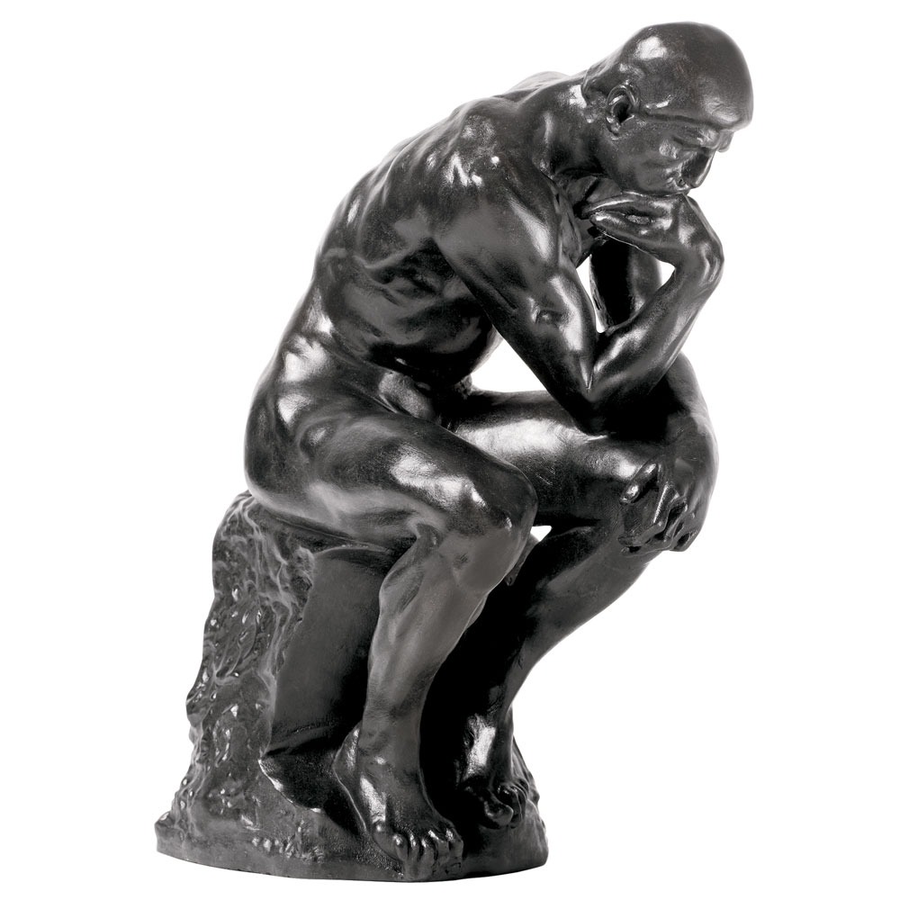
]
]

---

# Pre-Modern, Pre-Market Societies

.pull-left[

- Non-market systems of resource allocation

- Political, military, religious

]

.pull-right[
.center[
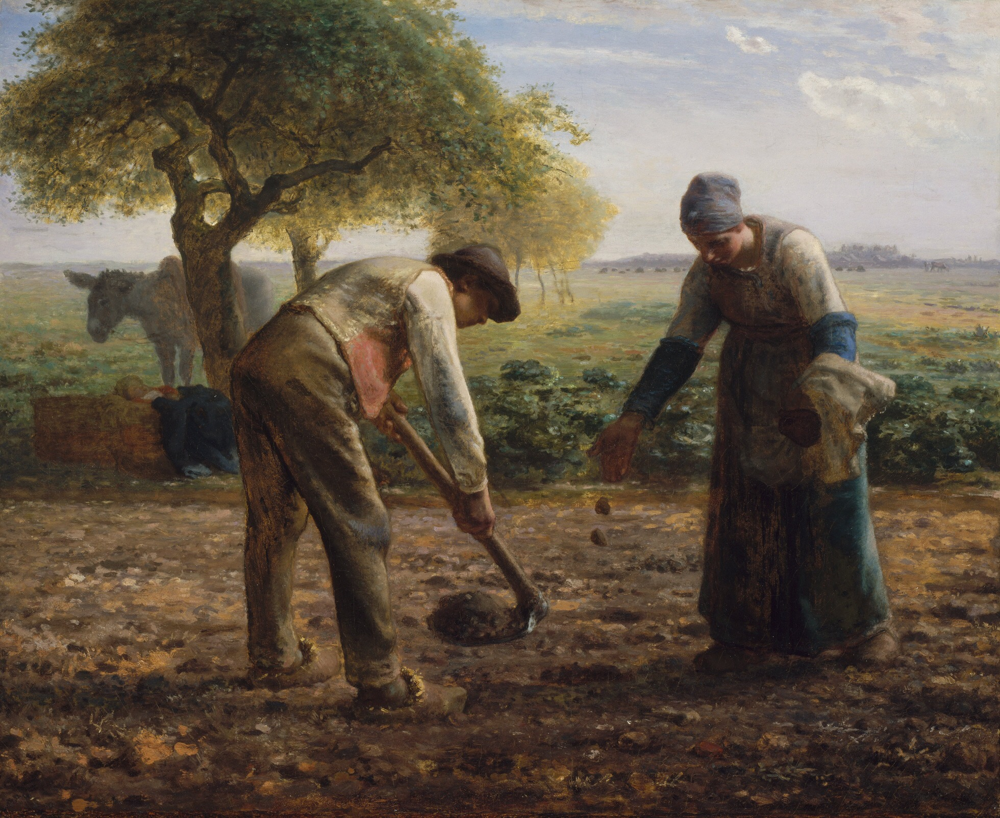
]
]

---

# Pre-Modern, Pre-Market Societies

.pull-left[

- Often a strong skepticism of merchants, commerce, middlemen, profits

- Focus more on “good life” and virtuous “career paths”
  - Politics
  - Bureaucracy
  - Military
  - Landownership

]

.pull-right[
.center[
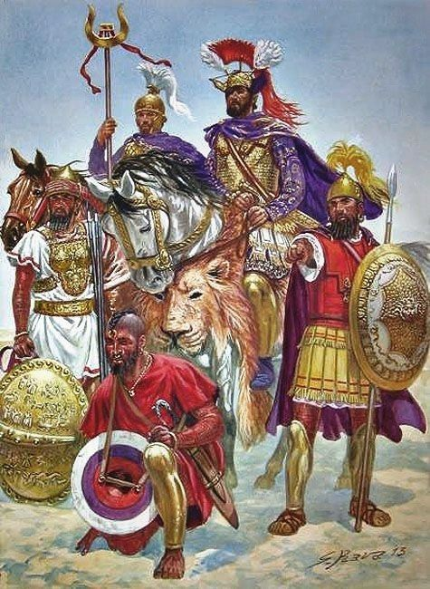
]
]

---

# The Liberty of the Ancients

.pull-left[

- Ancient writers focus on politics as the highest purpose of social life

- Envisioning the good society and promoting .hi["the good of the polity"]

- Guardian class or philosopher-kings charged with maintaining justice for the polity

- Often religious, theological, moral element
]

.pull-right[
.center[

]
]

---

# The Liberty of the Ancients

.pull-left[

- No private individual sphere of life
  - The collective is entitled to everything, including regulating social mores

- Citizens are privileged (& burdened) with responsibility of collective affairs
  - Active participation in government

- Politics as soulcraft, perfectability of human society

]

.pull-right[
.center[
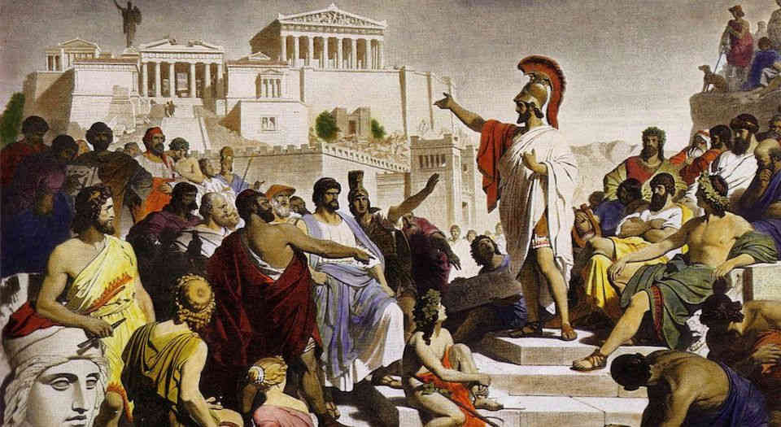
]
]

---

# The Liberty of the Ancients

.left-column[
.center[
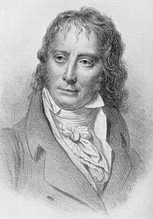
.smallest[
Benjamin Constant

1767-1830
]
]
]
.right-column[

> "As a citizen, he decides on peace and war; as [an individual], he is circumscribed, observed, repressed in all his movements,"

.source[Constant, Benjamin, 1819, "The Liberty of the Ancients Compared with that of the Moderns"]

]

---

# Liberty of the Moderns

.pull-left[
.smallest[
- A .hi[plurality] of goals: individual can go about her life for her own purposes unmolested

- Public institutions .hi-purple[protect the individual sphere of private life]

- Individual freedoms of speech, conscience, choice, religion, property, privacy

- Protection from arbitrary arrest or harassment by the collective

- Politics has .hi-purple[no ultimate goal (telos)], just .hi[rules] that allow *autonomous* individuals, with *their own goals*, to get along together

]
]
.pull-right[
.center[

]
]

---

# Some Non-Western Economics

.pull-left[
- Ancient Chinese writings focus on ethical frameworks or good administration

- Mandarin bureaucrats
  - Major source of prestige
  - Focus on imperial administration

]

.pull-right[
.center[
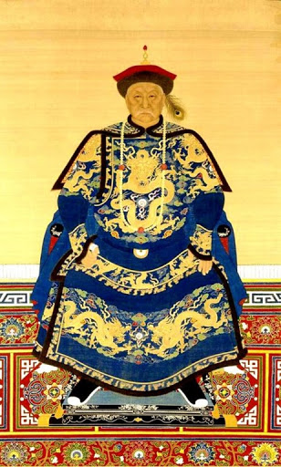
]
]

---

# Guan Zhong's *Guan Zi*

.left-column[
.center[


Guan Zhong

c.720-c.645 B.C.

]
]

.right-column[

- "Light/heavy" theory (proto-Supply & Demand?)
  - Abundant goods are "light", expect lower prices
  - When "locked away", it would become "heavy", expect higher prices
  - Goods flow in/out of markets based on heaviness

- Quantity theory of money
  - When money is "heavy", its price (price level) falls
  - When money is "light", its price (price level) rises
  - Advise State to buy/sell goods when money is heavy/light - price stabilization!

]

---

# Guan Zhong's *Guan Zi*

.left-column[
.center[


Guan Zhong

c.720-c.645 B.C.

]
]

.right-column[
- Recognition that individuals seek profit opportunities

- Implications (?):
  - supply & demand, quantity theory of money may be universal
  - all measuring aspects of an objective reality
  - not necessarily Western ideas imposed on the rest of the world

]

---

class: inverse, center, middle

# Ancient Greece

---

# Ancient Greece

.pull-left[

- Loose configurations of city-states (“polis”)

- Common “Hellenic” heritage, cultures, myths, religion

- As in all pre-modern societies, only small group were full citizens
  - slavery was common
]

.pull-right[
.center[
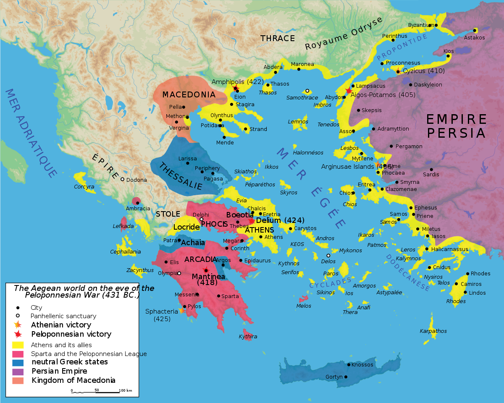
]
]

---

# Ancient Greece: Sparta

.pull-left[
.smaller[
- .hi-purple[Sparta (Lacedaemon)]: fascist military dictatorship
  - oligarchic; male citizens expected to go through rigorous military training
  - equality among citizens (including female, who could own property)
  - Self-sufficiency, autarky; farming by semi-enslaved helots
  
- All activity devoted to military and warfare

- Dominant land power, defeated Athens in Peloponnesian War

- No written records, literature, etc.

]
]

.pull-right[
.center[
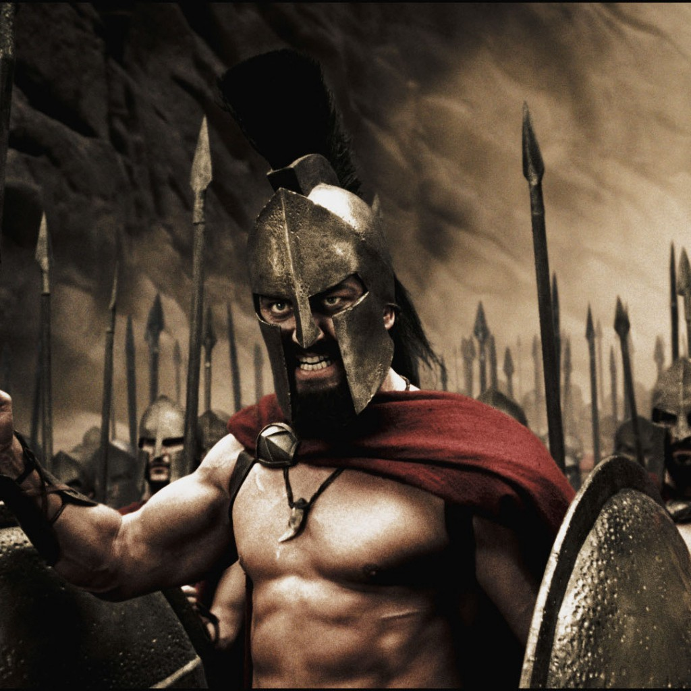
]
]

---

# Ancient Greece: Athens

.pull-left[

- .hi-purple[Athens]: direct democracy
  - All male citizens (about 1/3 of pop.) had right to vote and serve in office (by lot)

- Philosophy, Plato’s *Academy*, Aristotle’s *Lycaeum*

- Maritime empire, established trading colonies around the Aegean Sea

]

.pull-right[
.center[

]
]

---

# Touch on Economics Only Incidentally

.pull-left[

- Focus on consequences of economic activities
  - justice, virtuous
  - best management practices (manuals)
  
- No separation of activities as economic, political, individual, etc.
]

.pull-right[
.center[

]
]

---

# Touch on Economics Only Incidentally

.pull-left[

- No care for efficiency or allocating resources

- Markets played little role in society (debatable)

- Authority as resource allocator
  - Head of household, head of polis

- No interest in growth or progress (in an economic sense)
]

.pull-right[
.center[
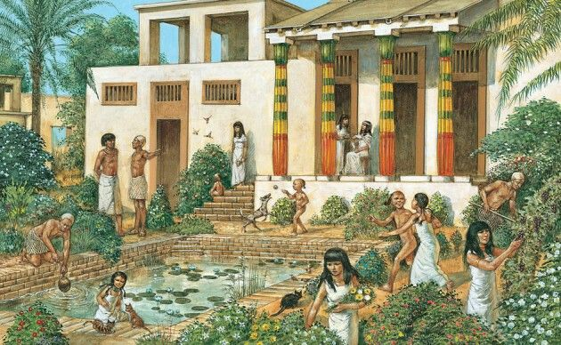
]
]

---

# Hesiod

.left-column[
.center[
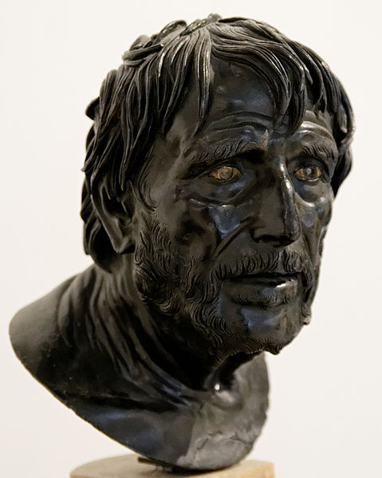

Hesiod

c.750-c.650 B.C.

]
]

.right-column[

- Famed verbal poet and contemporary of Homer, source of many Ancient Greek myths & culture

- *Theogony*: Mythical origin of the gods

]

---

# Hesiod

.pull-left[
- *Works and Days*

- Scarcity and the necessity of labor for survival are evils released when Pandora opened the Box

- Focus on *agricultural* efficiency (maximum output for a given input)

]

.pull-right[
.center[

]
]

.source[Hesiod, *Works and Days*]

---

# Xenophon & Oeconomicus

.left-column[
.center[
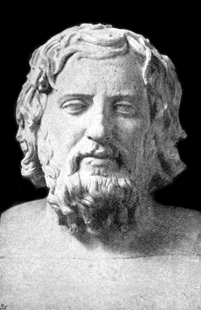

Xenophon

c.430-354 B.C.

]
]

.right-column[

- Athenian soldier<sup>.magenta[†]</sup> and historian

- A student of Socrates (we compare Plato’s accounts of Socrates to Xenophon’s) 

- Philosopher writing about the Spartan & Athenian constitutions

.footnote[<sup>.magenta[†]</sup> His [Anabasis](https://en.wikipedia.org/wiki/Anabasis_(Xenophon) is one of history's craziest stories]
]

<!--.source[Plato, *The Republic*]-->

---

# Xenophon & Oeconomicus

.left-column[
.center[


Xenophon

c.430-354 B.C.

]
]

.right-column[

- *Oeconomicus* (Οἰκονομικός)

- Study of household management (and agriculture)

- "Efficiency" as effective management of one's household (estate)
  - Head of household - male citizen
  - Women, children, slaves

- Division of labor can improve efficiency

- Extend principles to producer, military, public administrator

]

.source[Xenophon, *Oeconomicus*]

---

# Socrates

.left-column[
.center[
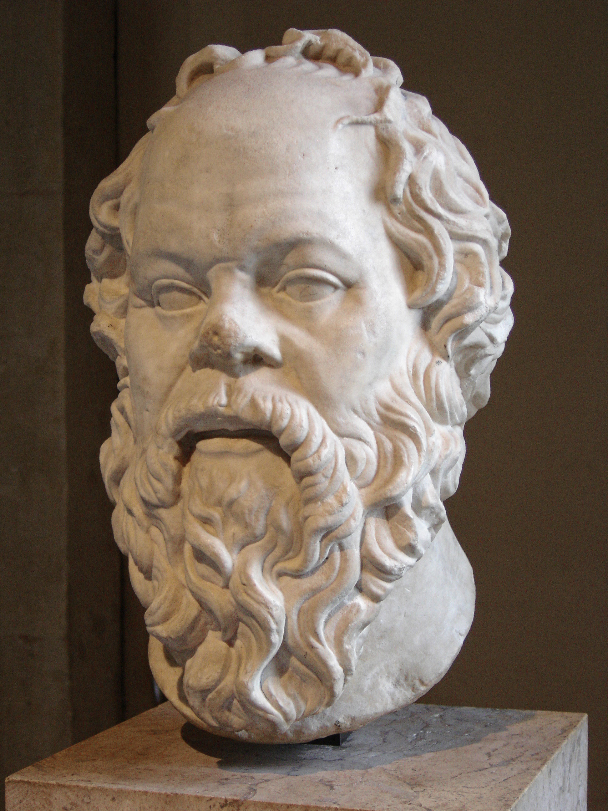

Socrates

c.470-399 B.C.

]
]

.right-column[

- Wrote nothing down, we know of him only through works of his students (Plato, Xenophon) and a few contemporaries

- Socratic method of dialogue and argumentation to discover truth, a social “gadfly”
  - famously “knew nothing” but was the “wisest man in Greece”

- Famously killed by Athenians for “corrupting the youth”
]

---

class: inverse, center, middle

# Plato

---

# Plato

.left-column[
.center[
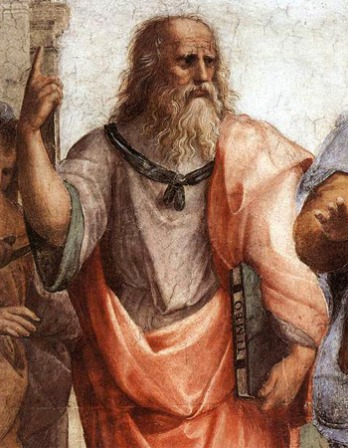

Plato

c.428-c.348 B.C.

]
]

.right-column[
> “European philosophical tradition is...a series of footnotes to Plato.” - Alfred North Whitehead 

- Socrates’ most famous student

- Wrote widely on metaphysics, epistemology, ethics, aesthetics, politics

- Writings are primarily .hi-purple[dialogues] with Socrates as the main character

]

---

# Platonism

.left-column[
.center[


Plato

c.428-c.348 B.C.

]
]

.right-column[

- Metaphysical .hi[theory of forms] (“Platonism”): the material world is a debased copy of reality

- Objects *appear* to exist in the changing/deceptive *material* world grasped by senses

- *Truly* exist in realm of abstract pure .hi[Forms], grasped only by .hi[pure reason]
  - e.g. the Pythagorean theorem $(a^2+b^2=c^2)$

- Extremely influential in the West!
]

---

# Plato’s Social Philosophy

.left-column[
.center[


Plato

c.428-c.348 B.C.

]
]

.right-column[
- Touches on economic subjects in famous dialogues on politics, *The Republic* and *The Laws*

- Theme: what is .hi[justice]?
  - What makes a *person* just?
  - What makes a *city-state* just?

- Political theory of describing the ideal State (“utopia”)

.source[Plato, *The Republic* and *The Laws*]

]

---

# Plato’s Social Philosophy

.left-column[
.center[


Plato

c.428-c.348 B.C.

]
]

.right-column[
> “[T]he law is not concerned with making any one class in this city do outstandingly well, but is **contriving to produce this condition in the city as a whole, harmonizing the citizens together through persuasion or compulsion**, and making them share with each other the benefit they can confer on the community. It produces such men in the city, not in order to allow them to turn in whatever direction each one wants, but **to make use of them to bind the city together**,” (Book VII)

.source[Plato, *The Republic*]
]


---

# Plato’s Social Philosophy

.left-column[
.center[


Plato

c.428-c.348 B.C.

]
]

.right-column[

- Division of labor, based on aspects of the soul:
  1. Productive (workers)
  2. Protective (guardians)
  3. Governing (rulers)

- Immutable and rigid, born into it
  - Even if literally untrue, enforce via a “noble lie” (the metals)

.source[Plato, *The Republic*]

]

---

# Plato’s Social Philosophy

.left-column[
.center[


Plato

c.428-c.348 B.C.

]
]

.right-column[
.smaller[
- Socities degenerate and pass through various types of government
  - Aristocracy $\rightarrow$ Oligarchy $\rightarrow$ Democracy $\rightarrow$ Tyranny

- Select few (have the requisite reason and) are fit to rule: 

> “Until philosophers rule as kings or those who are now called kings and leading men genuinely and adequately philosophize, that is, until political power and philosophy entirely coincide...cities will have no rest from evils,” (473c-d)

- Best type of government is rule by a philosopher-king

]

.source[Plato, *The Republic*]
]

---

# Plato’s Social Philosophy

.left-column[
.center[


Plato

c.428-c.348 B.C.

]
]

.right-column[

- Ruler and Guardian classes must live in a communistic society
  - no have private property (distractions from philosophy & virtue)
  - communal wives and communal children

- Commerce is beneath political, philosophic, civic, and artistic life

.source[Plato, *The Republic*]
]

---

class: inverse, center, middle

# Aristotle

---

# Aristotle

.left-column[
.center[
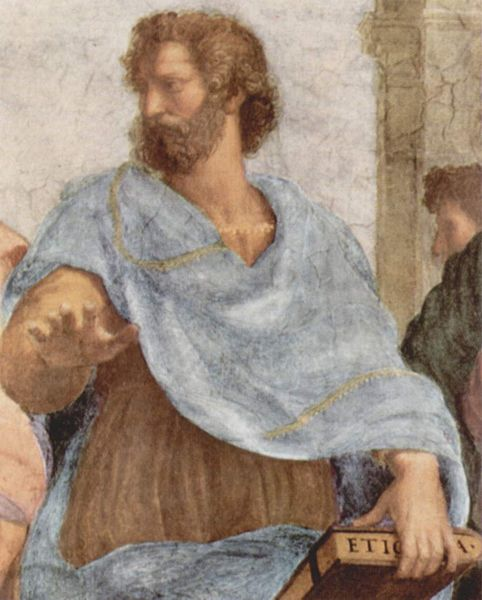

Aristotle

384 B.C.-322 B.C.

]
]

.right-column[

- Plato's student; tutor to Alexander the Great

- Called "*the* philosopher" by Medieval European writers

- Set the terms of Western philosophy & science (physics, biology,...and economics!) for 1000s of years

- Impossible to summarize Aristotle's thought and influence!

]

---

# Aristotelian Thought

.left-column[
.center[


Aristotle

384 B.C.-322 B.C.

]
]

.right-column[
.smallest[
- *Metaphysics*: unlike Plato's realm of Forms that reality imitates, reality is the instantiation of the universal into particulars
  - Much more .hi-purple[practical]; use of .hi-purple[induction] & .hi-purple[empiricism] (with reason and logic)

- .hi[Natural law]: all things have a nature (discoverable principles that are good for that thing)

- .hi[Aristotelian "virtue ethics"]: important to develop excellence (*arete*) of character
  - Virtues are traits of a virtuous person, who will tend to do the right thing
  - The ultimate goal is .hi-turquoise[living a good life; *eudamonia* (human flourishing)]
]
]

---

# Aristotle

.left-column[
.center[


Aristotle

384 B.C.-322 B.C.

]
]

.right-column[
.smallest[
- *Politics*: the purpose and nature of the *polis* (city-state) 

- Discusses (of interest to us):
  1. Origin and purpose of States
  2. Household management (oikonomia) vs. retail trade
  3. Importance and utility of property rights
  4. Origin and use of money

- *Nicomachean Ethics*: mast famous treatise on ethics

- Discusses (of interest to us):
  1. Origin and utility of money
  2. What is a just exchange (and a theory of prices?)
]

.source[Aristotle, *The Politics*]
]

---

# Aristotle: On Types of Government & Constitutions

.center[
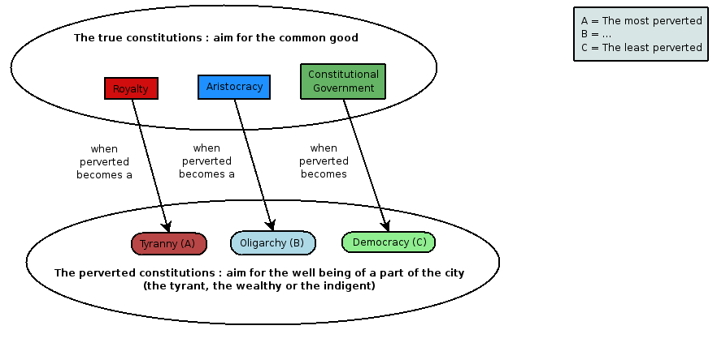
]

---

# Aristotle: On The Origin of States

.left-column[
.center[


Aristotle

384 B.C.-322 B.C.

]
]

.right-column[

- Goal of a State is to attain the highest good: justice

- Looks at essential parts to build up understanding
  - State is an extension of families (when several villages of families unite)

- Human beings are social creatures, the State facilitates this

.source[Aristotle, *The Politics*]
]

---

# Aristotle: The Origins of the State

.left-column[
.center[


Aristotle

384 B.C.-322 B.C.

]
]

.right-column[

- A defense of "natural slavery" 🤨
  - Some people slaves by nature, some by social convention
  - Natural slaves should be in slavery (best for their nature), but 

- Come back to this during European era of discovery & colonization

- One clever point: if material instruments (machines) could perform the tasks of slaves, would be no need for slavery

.source[Aristotle, *The Politics*]
]

---

# Aristotle: On The Origin of States

.left-column[
.center[


Aristotle

384 B.C.-322 B.C.

]
]

.right-column[

> "A social instinct is implanted in all men by nature, and yet he who first founded the state was the greatest of benefactors. For man, when perfected, is the best of animals, but, when separated from law and justice, he is the worst of all...[J]ustice is the bond of men in states, for the administration of justice, which is the determination of what is just, is the principle of order in political society," (p. 7 in *Reader*).

.source[Aristotle, *The Politics*]
]

---

# Aristotle: On Household Management

.left-column[
.center[


Aristotle

384 B.C.-322 B.C.

]
]

.right-column[

- Focus on .hi-purple[household management (oeconomicus)]
  - Overlaps with, but not fully equal to "art of getting wealth"
  - "riches" $\equiv$ "number of instruments to be used in a household or in a state"

- .hi-turquoise["Instruments of production"] vs. .hi-turquoise["instruments of action"]
  - production vs. consumption (?)

.source[Aristotle, *The Politics*]
]

---

# Aristotle: On Wealth-Getting

.left-column[
.center[


Aristotle

384 B.C.-322 B.C.

]
]

.right-column[

- All posessions have a .hi["proper"] (primary, natural) use and an .hi[improper] (secondary, unnatural) use
  - .hi-green[Example]: A shoe can be worn or sold

1. .hi-purple[Household production]
  - Natural
  - Measured in output
  - Natural limitations on production

2. .hu-purple[Retail exchange]
  - Unnatural
  - Measured in money
  - Unlimited

.source[Aristotle, *The Politics*]
]

---

# Aristotle: On Wealth-Getting

.left-column[
.center[


Aristotle

384 B.C.-322 B.C.

]
]

.right-column[

> "There are two sorts of wealth-getting...one is a part of household management, the other is retail trade: the former necessary and honorable, while that which consists in exchange is justly censured; for it is unnatural, and a mode by which men gain from one another. The most hated sort, and with the greatest reason, is usury, which makes a gain out of money itself, and not from the natural object of it. For money was intended to be used in exchange, but not to increase at interest...Wherefore of all modes of getting wealth this is the most unnatural," (p.11 in *Reader*)

.source[Aristotle, *The Politics*]
]

---

# Aristotle: On Division of Labor and Origin of Money

.left-column[
.center[


Aristotle

384 B.C.-322 B.C.

]
]

.right-column[
.smallest[
> "For the members of the family originally had all things in common; later, when the family divided in to parts, the parts shared in many things, and different parts in different things, which they had to give in exchange for what they wanted, a kind of barter...When the inhabitants of one country became more dependent on those of another, and they imported what they needed, and exported what they had too much of, money necessarily came into use. For the various necessaries of life are not easily carried about, and hence men agreed to employ in their dealings with each other something which was intrinsically useful and easily applicable to the purposes of life, for example, iron, silver, and the like. Of this the value was at first measured simply by size and weight, but in process of time they put a stamp upon it," (p.9 in *Reader*)

]
.source[Aristotle, *The Politics*]
]

---

# Aristotle: On Property Rights

.left-column[
.center[


Aristotle

384 B.C.-322 B.C.

]
]

.right-column[

.smallest[- Citizens of the perfect state should *not* have property in common

> "It is clearly better that property should be private, but the use of it common; and the special business of the legislator is to create in men this benevolent disposition," (p. 13 in *Reader*)

- Benefits of private property rights
  - An interesting argument:

> "there is greatest pleasure in doing a kindness or service to friends or guests or companions, which can only be rendered when a man has private property," (p.13 in *Reader*)

.]
source[Aristotle, *The Politics*]
]


---

# Aristotle: Problems with Communal Property

.left-column[
.center[


Aristotle

384 B.C.-322 B.C.

]
]

.right-column[

.smaller[> "When [users] are not the owners, the case will be different and easier to deal with; but when they till the ground for themselves the question of ownership will give a world of trouble. If they do not share equally enjoyments and toils, those who labor much and get little will necessarily complain of those who labor little and receive or consume much. But indeed there is always a difficulty in men living together ...but especially in their having common property...for they generally fall out over everyday matters and quarrel about any trifle which turns up," (p.12 in *Reader*)

.]
source[Aristotle, *The Politics*]
]

---

# Aristotle: On Plato

.left-column[
.center[


Aristotle

384 B.C.-322 B.C.

]
]

.right-column[

A.smaller[
 "Such legislation [common property advocated by Plato] may have a specious appearance of benevolence; men readily listen to it, and are easily induced to believe that in some wonderful manner everybody will become everybody's friend, especially when some one is head denouncing the evils now existing in states...which are said to arise out of the possession of private property. These evils, however, are due to a very different cause--the wickedness of human nature. Indeed, we have seen that there is much more quarrelling among those who have all things in common."

.]
source[Aristotle, *The Politics*]
]

---

# Aristotle: On Reciprocity and Exchange

.left-column[
.center[


Aristotle

384 B.C.-322 B.C.

]
]

.right-column[

- In *Nicomachean Ethics*, develops a theory of (just) exchange

- Another account of the origin and purpose of money, to equate different things

- Exchange is .hi[reciprocal] and .hi[equal]: the value of two sides of an exchange must be .hi[equal]
  - Money assists in making each side equal to the other

.source[Aristotle, *The Politics*]
]

---

# Aristotle: On Reciprocity and Exchange

.left-column[
.center[


Aristotle

384 B.C.-322 B.C.

]
]

.right-column[

.smaller[- Aristotle's Example:
  - A (builder) produces C (houses)
  - B (cobbler) produces D (shoes)

- C:D as A:B; relative prices determined by relative (supply? labor?) amounts of each tradesman

]

.smallest[
> "[Money measures] how many shoes are equal to a house or to a given amount of food. The number of shoes exchanged for a house (or for a given amount of food) must therefore correspond to the ratio of builder to shoemaker. For if this be not so, there will bno exchange and no intercourse. And this proportion will not be effected unless the goods are somehow equal." (pp.14-15 in *Reader*)

].source[Aristotle, *The Politics*]
]
