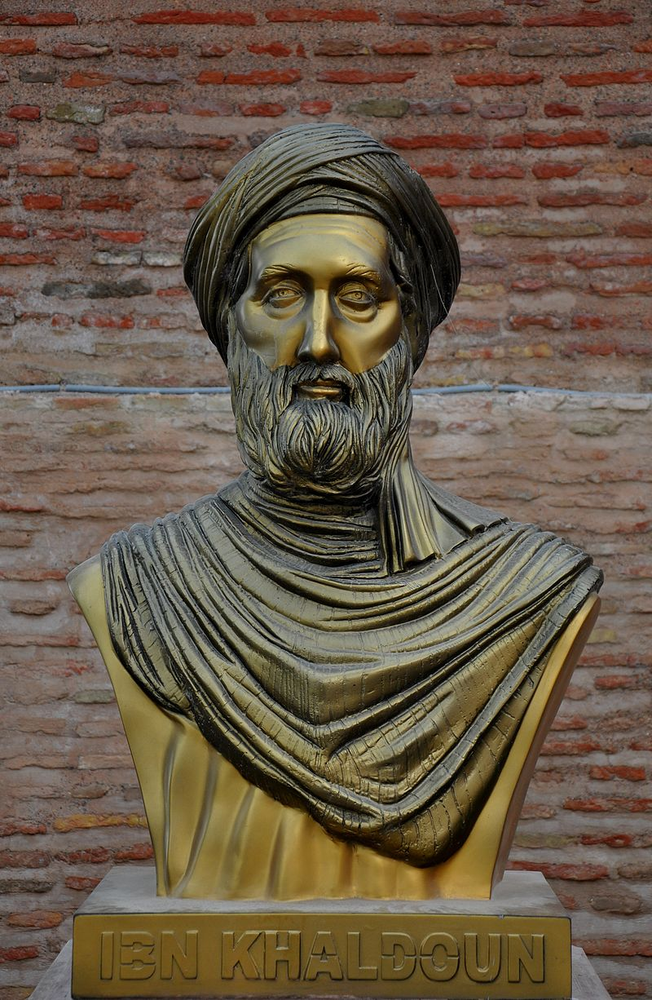
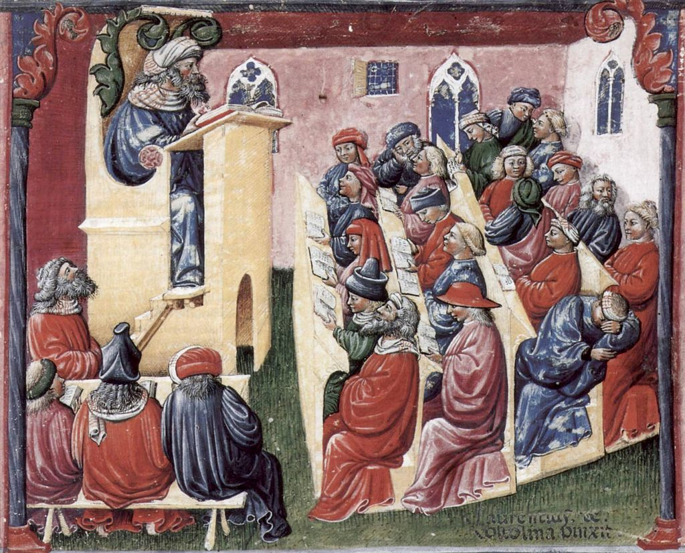
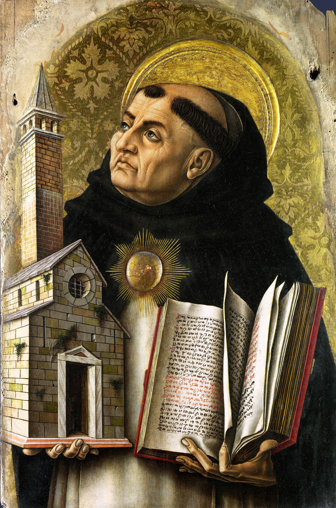

```{r setup, include=FALSE}
options(htmltools.dir.version = FALSE)
knitr::opts_chunk$set(echo=F,
                      message=F,
                      warning=F)
library(tidyverse)
set.seed(256)
update_geom_defaults("label", list(family = "Fira Sans Condensed"))
```

class: inverse

# Outline

## [From Ancient to the Medieval World](#3)

## [Arab-Islamic Writers](#32)

## [Thomas Aquinas and the Scholastics](#41)

---

class: inverse, center, middle

# From Ancient to the Medieval World

---

# European Feudalism

.center[

]

---

# European Feudalism (c.500-1500)

.pull-left[

- Why was feudalism such a stable equilibrium for about 1,000 years?

- How, when, and why did countries transition out of this equilibrium?
]

.pull-right[
.center[

]
]

---

# Formation of the Feudal System (c.500) I

.center[

]

---

# Formation of the Feudal System (c.500) II

.pull-left[
- Fall of Roman Empire and its dependencies by invasions of Germanic, Central Asian, later Scandinavian tribes 

- Lots of sources of violence: invaders, bandits, local disputes/feuds without central authority

]

.pull-right[
.center[

]
]

---

# Formation of the Feudal System (c.500) III

.pull-left[

- .hi[Patronage]: weaker individuals pledge themselves to strongmen (.hi-purple[lords]) who protect them from violence, dispense justice, resolve disputes, etc

- Most powerful warlords own large tracts of land that they can control

]

.pull-right[
.center[

]
]

---

# Formation of the Feudal System (c.500) IV

.pull-left[
- .hi[Feudalism]: most people who who *occupy* but *don't own* land hold it as **tenants** from sovereign in exchange for military (or other) service

- Wealth and power determined almost entirely by land-ownership

]

.pull-right[
.center[

]
]

---

# Formation of the Feudal System (c.500) IV

.pull-left[
- Lords own .hi-purple[manors] or .hi-purple[estates]
  - Constitute polities in themselves: entirely of political, economic, social, religious life for tenants

- Landowning elite have military power
  - Rent out land to tenants
  - Tenants constitute the elite's work force, and army - if needed

]

.pull-right[
.center[

]
]

---

# Formation of the Feudal System (c.500) V

.pull-left[
.smallest[
- Crystalized into a *very formal and ritualized* system of **oaths of** .hi-purple[fealty] to lords

- Reputation and honor are extremely valuable and depreciable assets
  - Being an "oathbreaker" deigns one as a social outcast (and is a virtual death sentence without protection from sovereign lords)

- Person would pledge .hi-purple[homage] to their superior, to literally *"become his man"* (*homme*)

- Lord would provide protection and justice in exchange for **knight-service**

]

]

.pull-right[
.center[

]
]

---

# Formation of the Feudal System (c.500) V

.pull-left[

- A political-military hierarchy that matched the landowner-tenant ownership hierarchy

- Lesser lords were .hi-purple[vassals] to their .hi-purple[liege] lord to whom they owe loyalty and service, all the way up to the .hi-purple[monarch]

]

.pull-right[
.center[

]
]

---

# Manorialism I

.pull-left[

- Nearly the entirety of Medieval life took place on the lord's .hi[manor] or .hi[fief]

- Subsistence agriculture by sharecropping tenants

- Tenants pay .hi[feudal dues] to their lord
  - often in-kind (fraction of agricultural surplus)
  - may be labor-service, military service, or (much later) **money rent**
]

.pull-right[
.center[

]
]

---

# Manorialism II

.pull-left[
.smaller[
- .hi-purple[No separation between political, economic, social, religious spheres of life]

- Lord of the manor is boss, political ruler, judge, policeman, godfather, sometimes religious leader3

- All institutions are **personal** and **partial**, no separate existence of organizations from person
  - Who the lord *is*, their *identity*, matters for patronage!
  - No such thing as rule of law

]

]

.pull-right[
.center[

]
]

---

# The "Ideology" of Feudalism I

.pull-left[

- Everyone, including serfs, had important role to uphold in feudal society

> Serfs and freemen "worked for all" while a knight or baron "fought for all" and a churchman "prayed for all"; thus everyone had a place

]

.pull-right[
.center[

]
]

---

# The "Ideology" of Feudalism II

.pull-left[

- Forged in the crucible of a breakdown of empires and constant threat of violence and invasion

- Feudalism is primarily about stability and custom, preserving the social order, minimizing violence

- The *last thing* it's okay with is innovation, competition, experimentation, and rocking the boat
]

.pull-right[
.center[

]
]

---

# Religion and Feudalism

.pull-left[

- The one thing everyone shares is religion

- Catholic Church is dominant, both in Medieval ethics and politics, the only "international" institution

- All actions, exchanges, social and political power are justified as moral (Christian), legitimate, and upholding ancient privileges and customs 

]

.pull-right[
.center[

]
]
---

# The "Ideology" of Feudalism III

.left-column[
.center[

]
]

.right-column[

> ".hi[[T]he medieval way of determining the terms of exchange was by custom, usage, and law, not by negotiation between traders.] The division of labor was well developed by the Middle Ages, and there was a corollary exchange of products and services among specialized workers. But the .hi[use of custom and law to set the terms of trade was as fundamental to the medieval economy as the unity of its political and economic institutions]," (p.38).


.source[Rosenberg, Nathan and L.E. Birdzell, Jr, (1986) *How the West Grew Rich: The Economic Transformation of the Industrial World*]
]

---

# The "Ideology" of Feudalism IV

.left-column[
.center[

]
]

.right-column[
.smaller[
> ".hi[Exchange was also usually compulsory], in that the great majority of .hi[artisans and agricultural workers were obligated to supply their products and services on terms dictated by custom or law.] Agricultural workers were bound to the land in a system of serfdom, a .hi[hereditary status assumed at birth, and they had no right to select a more attractive occupation.] Townspeople were not given much more choice of occupation, for having a trade...depended on an apprenticeship, usually arranged by one's father....hi[A member of the guild had to work and sell on the guild terms; there was no right to decline business at the fixed rates]," (p.38).

]

.source[Rosenberg, Nathan and L.E. Birdzell, Jr, (1986) *How the West Grew Rich: The Economic Transformation of the Industrial World*]

]
---

# The "Ideology" of Feudalism V

.left-column[
.center[

]
]

.right-column[

> ".hi[The ideology of the system was epitomized in the phrases "just price" and "just wage."] Prices and wages expressed a moral judgment of worth. .hi[Supply and demand were morally irrelevant]...it was mainly in time of famine or siege that prices forced their way into [equating supply and demand]," (p.38).


.source[Rosenberg, Nathan and L.E. Birdzell, Jr, (1986) *How the West Grew Rich: The Economic Transformation of the Industrial World*]

]
---

# Opposition to Creative Destruction I

.left-column[
.center[


Virginia Postrel
]
]

.right-column[

> "[I]f every voluntary experiment must answer the question, 'Are you going to affect the way I live?' with a no, there can be no experiments, no new communities, no realized dreams. A city, an economy, or a culture is, despite the best efforts of stasists, fundamentally a 'natural' system. As a whole, it is beyond anyone’s control. Any individual effort at improvement changes not just the particular target but the broader system. In the process, there may be progress, but there will also be disruptions, adjustments, and losers," (p.204).

]

.source[Postrel, Virginia, (1998) *The Future and Its Enemies*]

---

# Opposition to Creative Destruction II

.left-column[
.center[


Virginia Postrel
]
]

.right-column[

> "Stasist institutions shift the burden of proof from the people who want to block new ideas to those who want to experiment. Such institutions seek not simply to compensate for or mitigate extreme side effects but, rather, to treat any change as suspect," (p.204).

]

.source[Postrel, Virginia, (1998) *The Future and Its Enemies*]

---

# Opposition to Creative Destruction III

.pull-left[
.center[

]
]

.pull-right[
.smallest[
> "There is a story, repeated by a number of Roman writers, that a man - characteristically unnamed - invented un-breakable glass and demonstrated it to Tiberius in anticipation of a great reward. The emperor asked the inventor whether anyone shared his secret and was assured that there was no one else; whereupon his head was promptly removed, lest, said Tiberius, gold be reduced to the value of mud," (147). 

]

.source[Finley, Moses I, (1965), "Technical Innovation and Economic Progress in the Ancient World," *Economic History Review* 18: 29–45]
]
---

# Opposition to Creative Destruction IV

.pull-left[
.center[

]
]

.pull-right[

- Queen Elizabeth I to William Lee's request to a *letter patent* for his stocking frame:

> "Thou aimest high, master Lee. Consider thou what the invention could do to my poor subjects. It would assuredly bring to them ruin by depriving them of employment, thus making them beggars," (quoted in Acemoglu and Robinson 2012, pp. 182-183). 

]

---

# The Towns and Trade III

.pull-left[
.center[

]
]

.pull-right[
.smallest[
- Towns are dominated by .hi[urban craft guilds]

- Another feudal group with major economic and political power

- Essentially cartels that restrict entry into trades
  - illegal to produce in an industry without being a guild member
  - production, exchange, and prices must be according to guild laws and regulations
  - require patronage and apprenticeships, etc.

- Alliance with monarchs (exclusive privileges in exchange for tax revenues)
]
]

.source[Ogilvie, Sheilagh, (2014), "The Economics of Guilds," *Journal of Economic Perspectives* 28(4): 169-192

Greif, Avner, (1989), "Reputation and Coalitions in Medieval Trade: Evidence on Maghribi Traders," *Journal of Economic History* 49(4): 857-882.

Greif, Avner, Paul Milgrom, and Barry R Weingast, (1994), "Coordination, Commitment, and Enforcement: The Case of the Merchant Guild," *Journal of Political Economy* 102(4): 745-776]

---

# Early Islamic Conquests & the Golden Age of Islam

.center[

]

---

# The Crusades I

.pull-left[

- First Crusade 1095, goal of retaking the Holy Land from Arabs

- Lost Jerusalem to Saladin in 1187, never recaptured

- At least 9 crusades by 1291

]

.pull-right[
.center[

]
]

---

# The Crusades II

.pull-left[

- "Outremer" Crusader kingdoms in Levant for 200 years

- Last (in some form) until 1300

- Outlet for peasants, nobles, merchants, etc. fleeing hardships of Europe

- "International" institutions
  - Knights Templar
  - Knights Hospitalier

]

.pull-right[
.center[

]
]

---

# The Crusades III

.pull-left[

- Increase European interaction with rest of the world via Arabs (who trade with India and China)

- (Re)discovery of classical philosophy, mathematics, literature, art from Arabs (who retained it from Ancient Greece and Rome)

]

.pull-right[
.center[


]
]

---

# The Revival of International Trade (c.1100) I

.center[

]

---

# The Revival of International Trade (c.1100) II

.left-column[
.center[

]
]

.right-column[
.smallest[
- .hi["Commercial Revolution"] of 1100s-1200s

- *International* merchants can't depend on weak and biased States to enforce *international* contracts!

- Merchants adopted their own "laws" and best practices to minimize transaction costs

- For-profit merchant courts emerge to settle disputes and enforce international contracts
  - More efficient, cheaper, and less partisan than Royal courts
  - Legal and jurisdictional competition

- Developed contract law and advanced legal instruments - debt, credit, loans, equity contracts

- This is a major basis of international commercial law today!

]

.source[Benson, Bruce, 1989. "The Spontaneous Evolution of Commercial Law," *Southern Economic Journal* 55(3): 644-661

Milgrom, Paul R, Douglass C North, and Barry R Weingast, (1990), "The Role of Institutions in the Revival of Trade: The Law Merchant, Private Judges, and the Champagne Fairs," (Economics and Politics*2(1): 1-23]
]

---

class: inverse, center, middle

# Arab-Islamic Writers

---

# Ibn Khaldun

.left-column[
.center[

.smallest[
Ibn Khaldun

1332-1406
]
]
]
.right-column[
.smaller[
- Tunisian cleric and Islamic scholar during Hafsid dynasty

- Major contributions to sociology, history, demograph, economics

- Engages with Aristotle, focus on reason and logic

- *Muqaddimah* or *Prolegomena* (“introduction”)
  - a universal history and social science; scientific methods
  - study of “Asabiyyah” (tribalism, nationalism) binding groups together
    - strongest in small groups, but a more compelling version must emerge for larger, complex societies
]
]

---

# Ibn Khaldun

.left-column[
.center[

.smallest[
Ibn Khaldun

1332-1406
]
]
]
.right-column[

> When civilization [population] increases, the available labor again increases. In turn, luxury again increases in correspondence with the increasing profit, and the customs and needs of luxury increase. Crafts are created to obtain luxury products. The value realized from them increases, and, as a result, profits are again multiplied in the town. Production there is thriving even more than before. And so it goes with the second and third increase. All the additional labor serves luxury and wealth, in contrast to the original labor that served the necessity of life.

.source[Khaldun, Ibn, *Muqaddimah* (Rosenthal translation)]

]

---

# Ibn Khaldun on Division of Labor

.left-column[
.center[

.smallest[
Ibn Khaldun

1332-1406
]
]
]
.right-column[

.smallest[
> “The power of the individual human being is not sufficient for him to obtain (the food) he needs, and does not provide him with as much food as he requires to live. Even if we assume an absolute minimum of food – that is, food enough for one day, (a little) wheat, for instance – that amount of food could be obtained only after much preparation such as grinding, kneading, and baking. Each of these three operations requires utensils and tools that can be provided only with the help of several crafts, such as the crafts of the blacksmith, the carpenter, and the potter. Assuming that a man could eat unprepared grain, an even greater number of operations would be necessary in order to obtain the grain: sowing and reaping, and threshing to separate it from the husks of the ear. Each of these operations requires a number of tools and many more crafts than those just mentioned,” (Introduction, Ch.1 First Prefatory Discussion)

]

.source[Khaldun, Ibn, *Muqaddimah* (Rosenthal translation)]

]

---

# Ibn Khaldun on Division of Labor

.left-column[
.center[

.smallest[
Ibn Khaldun

1332-1406
]
]
]
.right-column[

.smaller[
> “It is beyond the power of one man alone to do all that, or (even) part of it, by himself. Thus, he cannot do without a combination of many powers from among his fellow beings, if he is to obtain food for himself and for them. Through co operation, the needs of a number of persons, many times greater than their own (number), can be satisfied,” (Introduction, Ch.1 First Prefatory Discussion)

]

.source[Khaldun, Ibn, *Muqaddimah* (Rosenthal translation)]

]

---

# Ibn Khaldun on Wealth

.left-column[
.center[

.smallest[
Ibn Khaldun

1332-1406
]
]
]
.right-column[

.smallest[
> “The common people who hear them think that the prosperity of these peoples is the result of the greater amount of property owned by them, or of the existence of gold and silver mines in their country in larger number (than elsewhere)… A large civilization yields large profits because of the large amount of (available) labor, which is the cause of (profit),” (4:280-281).

]

.source[Khaldun, Ibn, *Muqaddimah* (Rosenthal translation)]

]

---

# Ibn Khaldun on Growth & Capital Accumulation

.left-column[
.center[

.smallest[
Ibn Khaldun

1332-1406
]
]
]
.right-column[

.smallest[
> “(Man) obtains (some profits) through no efforts of his own, as, for instance, through rain that makes the fields thrive, and similar things. However, these things are only contributory. His own efforts must be combined with them, as will be mentioned. (His) profits will constitute his livelihood, if they correspond to his necessities and needs. They will be capital accumulation it they are greater than (his needs),” (2:311-12).

]

.source[Khaldun, Ibn, *Muqaddimah* (Rosenthal translation)]

]

---

# Ibn Khaldun on Taxes & “The Laffer Curve”

.left-column[
.center[

.smallest[
Ibn Khaldun

1332-1406
]
]
]
.right-column[

.smallest[
> “At the beginning of the dynasty taxation yields large revenues from small assessments. At the end of the dynasty taxation yields small revenue from large assessments….This is why we had to have the tax program as well as the budget cuts, because budget cuts, yes, would reduce government spending,” (2:89-90).

> “When tax assessments and imposts upon the subjects are low, the latter have the energy and desire to do things. Cultural enterprises grow and increase, because the low taxes bring satisfaction. When cultural enterprises grow, the number of individual imposts and assessments mount. In consequence, the tax revenue, which is the sum total of the individual assessments, increases,” (2:90).
]

.source[Khaldun, Ibn, *Muqaddimah* (Rosenthal translation)]

]

---

# Ibn Khaldun on Taxes & “The Laffer Curve”

.left-column[
.center[

.smallest[
Ibn Khaldun

1332-1406
]
]
]
.right-column[

```{r, fig.retina=3}
tr=function(x){10*x-x^2}

ggplot(data.frame(x=c(0,10)), aes(x=x))+
  stat_function(fun=tr, geom="line", size=2, color = "green")+
  geom_label(aes(x=8,y=tr(8)), color = "green", label="Tax Revenues", size = 6)+
    scale_x_continuous(breaks=c(0,5),
                       labels=c(0,expression(t^{o})),
                     limits=c(0,10),
                     expand=expand_scale(mult=c(0,0.1)))+
  scale_y_continuous(breaks=c(0,25),
                     labels=c(0,expression(R[max])),
                     expand=expand_scale(mult=c(0,0.1)))+
  # line at 5,5 
  geom_segment(aes(x=0,xend=5, y=25, yend=25), linetype="dashed")+
  geom_segment(aes(x=5,xend=5, y=25, yend=0), linetype="dashed")+
  
  #geom_label(aes(x=5, y=25), color="green", label=expression(paste(R[max])))+
  #coord_cartesian(clip="off")+
  labs(x = "Tax Rates",
       y = "Tax Revenues")+
  theme_classic(base_family = "Fira Sans Condensed", base_size=20)

```

]

---

class: inverse, center, middle

# Thomas Aquinas and the Scholastics

---

# Medieval Scholasticism

.pull-left[

- Originally monks in monasteries writing manuscripts

- First European universities in key cities, all run by church orders

- Explain and harmonize changes in world around them (new commerce!) with Catholic theology
  - Discovery of Aristotle's writings
]

.pull-right[
.center[

]
]

---

# The Scholastic Method

.pull-left[
.smallest[
- A very peculiar .hi-purple[Scholastic method] of inquiry & writing (if you noticed in Aquinas)

1. Investigate a book by a renowned scholar
2. Compare to Christian authorities written on the topic
3. Write down points of disagreement
4. Present both sides of each argument in a disagreement
5. Engage in dialectic until both sides are found to be in agreement
  - Logic & reason plus interpretation of ancient translations/words

]
]

.pull-right[
.center[

]
]

---

# Thomas Aquinas

.left-column[
.center[

.smallest[
Thomas Aquinas

1225-1274
]
]
]
.right-column[
- A Dominican friar and the greatest Scholastic writer and thinker

- Enormously influential on Catholic dogma (one of the “church fathers”, canonized as a saint)

- Wrote widely on philosophy, theology, the law, ethics, commentaries on Aristotle

- Attempted to synthesize Aristotelian philosophy, natural law, and commerce with Catholic theology

- *Summa Theologica* his master work
]

---

# Thomas Aquinas

.left-column[
.center[

.smallest[
Thomas Aquinas

1225-1274
]
]
]
.right-column[
- His broad philosophy and approach, .hi[“Thomism”]:

- We should accept truth no matter where it is found
  - Church teaches that revelation from God (scripture) alone is true
  - But .hi-purple[reason] is a valid source of truth

- Project to reconcile reason (Aristotelianism) with dogma

> "In reason, there is God."

]

---

# Thomas Aquinas

.left-column[
.center[

.smallest[
Thomas Aquinas

1225-1274
]
]
]
.right-column[
.smallest[
- Writes on economic issues of main interest to us:

- Focuses not on analysis of what *determines* prices

- Focuses instead on .hi-purple[ethical issues of pricing], e.g.:
  - raise the price?
  - lie or cheat in business?
  - pursuit of profits?
  - usury (interest on loans)?

- Main focus: .hi[“just prices and wages”]
]
]

---

# Thomas Aquinas on Property

.left-column[
.center[

.smallest[
Thomas Aquinas

1225-1274
]
]
]
.right-column[

> "We might say that for man to be naked is of the natural law, because nature did not give him clothes, but art invented them. In this sense, the possession of all things ... [is] said to be of the natural law, because, namely, the distinction of possession ... [was] not brought in by nature, but devised by human reason for the benefit of human life."

.source[Aquinas, Thomas, *Summa Theologica*]
]

---

# Thomas Aquinas on Just Prices

.left-column[
.center[

.smallest[
Thomas Aquinas

1225-1274
]
]
]
.right-column[
.smallest[
> "[B]uying and selling seem to be established for the common advantage of both parties, one of whom requires that which belongs to the other, and vice versa, as the Philosopher states...[and] should not be more of a burden to one party than to another, and consequently all contracts between them should observe equality of thing and thing...Therefore if either the price exceed the quantity of the thing’s worth, or, conversely, the thing exceed the price, there is no longer the equality of justice: and consequently, to sell a thing for more than its worth, or to buy it for less than its worth, is in itself unjust and unlawful," (p. 19 in *Reader*).

]

.source[Aquinas, Thomas, *Summa Theologica*]
]

---
# Thomas Aquinas on Just Prices

.left-column[
.center[

.smallest[
Thomas Aquinas

1225-1274
]
]
]
.right-column[
What exactly is the “just price”?

- Price that reflects labor cost?

- Prevailing price in a (competitive) market?

.source[Aquinas, Thomas, *Summa Theologica*]
]

---

# Thomas Aquinas on Morality of Commerce

.left-column[
.center[

.smallest[
Thomas Aquinas

1225-1274
]
]
]
.right-column[
.smaller[
> "According to the Philosopher, exchange of things is twofold; one, natural as it were, and necessary, whereby one commodity is exchanged for another, or money taken in exchange for a commodity, in order to satisfy the needs of life...[The first] belongs rather to housekeepers or civil servants who have to provide the household or the state with the necessaries of life. The other kind of exchange is either that of money for money, or of any commodity for money, not on account of the necessities of life, but for profit...The former kind of exchange is commendable because it supplies a natural need: but the latter is justly deserving of blame, because, considered in itself, it satisfies the greed for gain, which knows no limit and tends to infinity..." (p. 23 in *Reader*).

]

.source[Aquinas, Thomas, *Summa Theologica*]
]

---

# Thomas Aquinas on Morality of Commerce

.left-column[
.center[

.smallest[
Thomas Aquinas

1225-1274
]
]
]
.right-column[
.smaller[
> "Nevertheless, gain which is the end of trading, though not implying, by its nature, anything virtuous or necessary, does not, in itself, connote anything sinful or contrary to virtue: wherefore nothing prevents gain from being directed to some necessary or even virtuous end, and thus trading becomes lawful. Thus, for instance, a man may intend the moderate gain which he seeks to acquire by trading for the upkeep of his household, or for the assistance of the needy: or again, a man may take to trade for some public advantage..." (p. 23 in *Reader*).

]

.source[Aquinas, Thomas, *Summa Theologica*]
]

---

# Thomas Aquinas on Usury

.left-column[
.center[

.smallest[
Thomas Aquinas

1225-1274
]
]
]
.right-column[
.smallest[
> "I answer that, to take usury for money lent is unjust in itself, because this is to sell what does not exist, and this evidently leads to inquality which is contrary to justice...If a man wanted to sell wine separately from the use of the wine, he would be selling the same thing twice, or he would be selling what does not exist, wherefore he would evidently coomit a sin of injustice...[by] ask[ing] for double payment, namely one, the return of the thing in equal measure, the other, the price of the use, which is called usury." (pp. 24-25 in *Reader*).

]

.source[Aquinas, Thomas, *Summa Theologica*]
]
