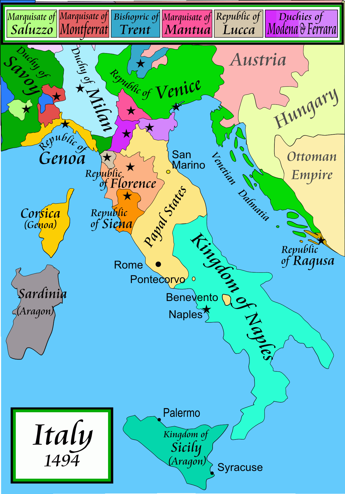

```{r setup, include=FALSE}
options(htmltools.dir.version = FALSE)
knitr::opts_chunk$set(echo=F,
                      message=F,
                      warning=F)
library(tidyverse)
set.seed(256)
update_geom_defaults("label", list(family = "Fira Sans Condensed"))
```

class: inverse

# Outline

## [Machiavellianism](#3)

## [The Turbulent 17th Century in England](#8)

## [Thomas Hobbes](#12)

## [The Glorious Revolution & John Locke](#26)

---

class: inverse, center, middle

# Machiavellianism

---

# Early Modern Realpolitik

.pull-left[

.smaller[
- Independent city-states in Northern Italy
  - Commercial trade centers, not feudal agriculture
  
- Combined with religious warfare, rise of early European States in constant competition

- Rising “market for good advice” for effective statecraft
  - Military and economic prowess
  - Writers writing to/for individual rulers

]
]

.pull-right[
.center[


]
]


---

# Machiavelli

.left-column[
.center[


Niccolo Machiavelli

1469-1527
]
]

.right-column[
- Official in Renaissance Florence c.1498-1512

- "Father of modern political philosophy"

- .hi-purple["Machiavellian"] adjective for "deceit, deviousness, or realpolitik"
  - "the ends justify the means"

]

---

# Machiavelli

.left-column[
.center[


Niccolo Machiavelli

1469-1527
]
]

.right-column[

- Public life often thought to be about theological and lofty goals

- One of the first **empirical** and **practical** students of politics

- Focus on .hi-purple[politics as it actually is, not what it should be]

- .hi-purple[Practical advice] for *actual* human rulers

- .hi[Self-interested rulers]

]


---

# Machiavelli

.left-column[
.center[


Niccolo Machiavelli

1469-1527
]
]

.right-column[

.smaller[
> "I shall depart from the methods of other people...it being my intention to write a thing which shall be useful to him who apprehends it, it appears to me more appropriate to follow up the real truth of the matter than the imagination of it; for many have pictured republics and principalities which in fact have never been known or seen, because how one lives is so far distant from how one ought to live, that he who neglects what is done for what ought to be done, sooner effects his ruin than his preservation."  

]

.source[Machiavelli, Niccolo, 1532, [*The Prince*](http://www.gutenberg.org/files/1232/1232-h/1232-h.htm)]
]

---

class: inverse, center, middle

# The Turbulent 17th Century in England

---

# England I

.pull-left[
.smaller[
- Constant pressure internally and externally, King desperate for revenues
  - Hundred Years War vs. France (1337-1453)
  - Wars of the Roses (1455-1487)
  
- Powerful kings (Edward I, Henry VII, Henry VIII) recognize they can get more of what they want if they ask nicely (via Parliament)

- Parliament represents the lords (laity and clergy, all large landowners) and the commons (lesser gentry, towns)
  - But constituencies are fixed for centuries
  - No representation in towns where industrial revolution would occur!

]
]

.pull-right[
.center[


]
]

.source[North and Thomas, (1986), *The Rise of the Western World: A New Economic History, Ch. 12]

---

# England: The 17th Century Turning Point

.pull-left[
.smallest[

- Growing merchant elite disgruntled with Stuart kings' monopolies, arbitrary justice, forced loans, restriction of speech

- Parliament passes 1623 .hi-purple[Statue of Monopolies]
  - removes Crown's ability to grant *letters patent* to cronies
  - *Parliament* gains authority to grant *limited* patents for *novel and non-obvious* inventions

- View emerging among nobles (Tories) & merchants (Whigs): .hi-purple[Crown is not above the law]
  - Growing .hi-purple[intolerance of arbitrary invasions of individual rights]
]
]

.pull-right[
.center[


]
]

.source[North and Thomas, (1986), *The Rise of the Western World: A New Economic History, Ch. 12]

---

# England: The 17th Century Turning Point

.pull-left[
.smallest[
- Charles I's behavior pushes country into the .hi[English Civil War(s)] (1642-1651)

- Parliamentarians vs. Royalists
  - most .hi[Parliamentarians] are merchants and lesser gentry (.hi["Whigs"])
    - also religious dissidents
  - most .hi-purple[Royalists] are nobles and landowning aristocracy (.hi-purple["Tories"])

- Parliamentarians win, try and execute Charles I for high treason

- Brief dictatorship under Oliver Cromwell (1649-1660); Restoration of monarchy: Charles II (1661)

]
]

.pull-right[
.center[
.smallest[
The Trial of Charles Stuart, King of England
]


]
]

.source[North and Thomas, (1986), *The Rise of the Western World: A New Economic History, Ch. 12]

---

class: inverse, center, middle

# Thomas Hobbes

---

# Hobbes: Modern Pluralism

.left-column[
.center[


Thomas Hobbes

1588-1679
]
]

.right-column[

> "[T]here is no such *finis ultimus* (utmost aim) nor *summum bonum* (greatest good) as is spoken of in the books of the old moral philosophers...And therefore voluntary actions and inclinations of all men tend not only to [attaining a contented life] differ only in the way [in] which produce the effect desired, (Ch. XVIII).
]

.source[Hobbes, Thomas, 1651, [*Leviathan: Or the Matter, Forme and Power of a Commonwealth, Ecclesiasticall and Civil*](https://www.gutenberg.org/files/3207/3207-h/3207-h.htm)]

---

# Hobbes: State of Nature

.left-column[
.center[


Thomas Hobbes

1588-1679
]
]

.right-column[

> "In [the state of nature], there is no place for Industry; because the fruit thereof is uncertain; and consequently no Culture of the Earth...no Knowledge of the face of the Earth; no account of Time; no Arts; no Letters; no Society; and which is worst of all, continuall feare, and danger of violent death; .ji[And the life of man, solitary, poore, nasty, brutish, and short], (Ch. XVIII).
]

.source[Hobbes, Thomas, 1651, [*Leviathan: Or the Matter, Forme and Power of a Commonwealth, Ecclesiasticall and Civil*](https://www.gutenberg.org/files/3207/3207-h/3207-h.htm)]

---

# Hobbes: State of Nature

.left-column[
.center[


Thomas Hobbes

1588-1679
]
]

.right-column[

> "Nature hath made men so equal in the faculties of body and mind...From this equality of ability ariseth equality of hope in the attaining of our ends...And from this diffidence of one another, there is no way for any man to secure himself so reasonable as anticipation..to master the persons of all men he can so long till he see no other power great enough to endanger him...[M]en have no pleasure...in keeping company where there is no power able to overawe them all. (Ch. XVIII).
]

.source[Hobbes, Thomas, 1651, [*Leviathan: Or the Matter, Forme and Power of a Commonwealth, Ecclesiasticall and Civil*](https://www.gutenberg.org/files/3207/3207-h/3207-h.htm)]


---

# Hobbes: War of All Against All

.left-column[
.center[


Thomas Hobbes

1588-1679
]
]

.right-column[

> "And because the condition of man...is a condition of .hi[war of every one against every] one...it followeth that in such a condition .hi[every man has a right to every thing, even to one another's body]. And therefore, as long as this natural right of every man to every thing endureth, .hi[there can be no security to any man]...The .hi[first fundamental law of nature] is: .hi[to seek peace and follow it] (Ch. XVIV).
]

.source[Hobbes, Thomas, 1651, [*Leviathan: Or the Matter, Forme and Power of a Commonwealth, Ecclesiasticall and Civil*](https://www.gutenberg.org/files/3207/3207-h/3207-h.htm)]

---

# Hobbes: War of All Against All

.center[

]

---

# The Hobbesian Dilemma

.left-column[
.center[


Thomas Hobbes

1588-1679
]
]

.right-column[

> "For the Lawes of Nature (as Justice, Equity, Modesty, Mercy, and (in summe) Doing To Others, As Wee Would Be Done To,) if themselves, without the terrour of some Power, to cause them to be observed, are contrary to our naturall Passions, that carry us to Partiality, Pride, Revenge, and the like. And .hi[Covenants, without the Sword, are but Words, and of no strength to secure a man at all], (Ch. XVIII).
]

.source[Hobbes, Thomas, 1651, [*Leviathan: Or the Matter, Forme and Power of a Commonwealth, Ecclesiasticall and Civil*](https://www.gutenberg.org/files/3207/3207-h/3207-h.htm)]

---

# The Hobbesian Dilemma 

.pull-left[

- Consider society a .hi[prisoner's dilemma] for social cooperation or conflict:
  - $a$: everyone else obeys the law, but I don't
  - $b$: everyone obeys the law
  - $c$: no one obeys the law
  - $d$: I obey the law, but no one else does

]

.pull-right[
.center[

]
]

---

# The Hobbesian Dilemma 

.pull-left[

- .hi[Nash equilibrium]: everyone *defects*! 

- .hi-purple[Socially optimal equilibrium]: everyone *cooperates*

- Hobbes' insight: .hi-purple[no _individual_ has an incentive to cooperate when everyone defects!]

]

.pull-right[
.center[

]
]

---

# The Hobbesian Solution I

.center[

]

---

# The Hobbesian Solution

.left-column[
.center[


Thomas Hobbes

1588-1679
]
]

.right-column[
.smaller[
> "The only way to erect such a common power, as may be able to defend them from the invasion of foreigners, and the injuries of one another, and thereby to secure them in such sort as that by their own industry and by the fruits of the earth they may nourish themselves and live contendely, is .hi[to confer all their power and strength upon one man, or upon one assembly of men, that may reduce all their wills, by plurality of voices, unto one will]:...and therein to submit their wills, everyone one to his will, and their judgments to his judgment," (Ch. XVII).
]
]

.source[Hobbes, Thomas, 1651, [*Leviathan: Or the Matter, Forme and Power of a Commonwealth, Ecclesiasticall and Civil*](https://www.gutenberg.org/files/3207/3207-h/3207-h.htm)]

---

# The Hobbesian Solution

.left-column[
.center[


Thomas Hobbes

1588-1679
]
]

.right-column[

> "It is a real unity of them all in one and the same person, made by covenant of every man with every man, in such manner as ife every man should say to every man: .hi[I authorise and give up my right of governing myself to this man, or to this assembly of men, on this condition; that thou give up, thy right to him, and authorise all his actions in like manner]. This done, the multitude so united in one person is called a .hi[COMMONWEALTH]," (Ch. XVII).

]

.source[Hobbes, Thomas, 1651, [*Leviathan: Or the Matter, Forme and Power of a Commonwealth, Ecclesiasticall and Civil*](https://www.gutenberg.org/files/3207/3207-h/3207-h.htm)]

---

# The Hobbesian Solution

.pull-left[

- .hi-purple[The State is our commitment device]

- Citizens (in principle) sign a .hi[social contract], i.e. a ".hi[constitution]" that deliberately restricts their liberties

- In each of our interests to give up some liberties that restrict the liberties of others (e.g. theft, violence)

]

.pull-right[
.center[

]

]

---

# The Hobbesian Solution

.pull-left[

- In exchange, we empower .hi[the State as our agent] to punish those of us that fail to uphold the social contract

- .hi-purple[Politics]: decisions under rules which we agree are legitimate that determine an outcome for all of us, even if we *disagree* (or are harmed by) the outcome 
]

.pull-right[
.center[

]

]

---

class: inverse, center, middle

# The Glorious Revolution & John Locke

---

# England: The 17th Century Turning Point

.pull-left[

- Openly-Catholic James II comes to throne

- Previous Stuart kings were smart enough to play factions off against one another

- James II manages to anger *both* the Whigs and the Tories who unite against him

]

.pull-right[
.center[
James II of England


]
]

.source[North and Thomas, (1986), *The Rise of the Western World: A New Economic History, Ch. 12]

---

# England: The Glorious Revolution

.pull-left[
.smallest[
- James II is ousted in a coup, the .hi["Glorious Revolution"] 1688-1689

- Parliament makes a deal with William of Orange (Netherlands) to co-reign with Mary (Protestant daughter of James II)

- Establishes .hi[Parliamentary sovereignty] and a **constitutionally-limited** monarchy
  - credibly commits (from past actions) to oust the monarch if s/he acts without Parliament's consent
  
]
]

.pull-right[
.center[
William and Mary


]
]

.source[North and Thomas, (1986), *The Rise of the Western World: A New Economic History, Ch. 12]

---

# England: The Glorious Revolution

.pull-left[

- Glorious Revolution is a Whig victory
  - liberty, property, commerce

- English Bill of Rights, 1689
  - right of regular parliaments, free elections, freedom of speech, confirms habeaus corpus, taxation with consent
  - hese are rights *for Parliament*, not for the average citizen

.source[North and Thomas, (1986), *The Rise of the Western World: A New Economic History, Ch. 12]

]

.pull-right[
.center[
William and Mary


]
]

---

# England: The Glorious Revolution

.pull-left[

.smallest[
- Parliament made a perpetual organization and source of lawmaking and taxation power

- Credible commitment: Parliament can commit to always pay State debts via taxes
  - No more arbitrary will of the Crown
  - Credit to England goes from 5% of GDP to 40% of GDP
  - Interest rates plummet!

- Creates an *enormous* rise in State capacity and tax revenue as a percent of GDP compared to anywhere in the world

]
]

.pull-right[
.center[
William and Mary


]
]

.source[North, Douglass C and Barry R Weingast, (1989), "Constitutions and Commitment: The Evolution of Institutions Governing Public Choice in Seventeenth-Century England," *Journal of Economic History* 49(4): 803-832]

---

# England: The Glorious Revolution

.pull-left[

- Liberal attitudes forged in the 17<sup>th</sup> Century turmoil and oppression
  - freedom of speech, press, trial by jury, habeas corpus

- The "English Constitution" creates a government to protect rights

- Act of Settlement 1701: personal union with Scotland, becomes United Kingdom of Great Britain
]

.pull-right[
.center[
A meeting of the anti-slavery society


]
]

.source[North, Douglass C and Barry R Weingast, (1989), "Constitutions and Commitment: The Evolution of Institutions Governing Public Choice in Seventeenth-Century England," *Journal of Economic History* 49(4): 803-832]

---

# Locke's Economic Writings: Money & Interest

.left-column[
.center[


.smallest[
John Locke

1632-1704
]
]
]

.right-column[

- Locke is a Whig, writing political theory to justify the Glorious Revolution and its principles
  - *First* and *Second Treatise on Government*
  - Tremendously important and influential in political philosophy
    - U.S. Declaration of Independence (87 years later) is pure Lockean

- A major empiricist philosopher as well

- But also some clear economic writings on money & interest

]

---

# Locke's Theory of the State of Nature

.left-column[
.center[


.smallest[
John Locke

1632-1704
]
]
]

.right-column[

.smallest[
> "[W]e must consider, what state all men are naturally in, and that is, a state of perfect freedom to order their actions, and dispose of their possessions and persons, as they think fit, .hi[within the bounds of the law of nature]...But though this be a state of liberty, yet .hi[it is not a state of license]....hi[The state of nature has a law of nature to govern it], which obliges every one: and .hi[reason, which is that law], teaches all mankind....hi[no one ought to harm another in his life, health, liberty, or possessions]... ," (Ch. II).

]

.source[Locke, John, 1689, *Second Treatise on Government*]
]

---

# Locke's Theory of the State of Nature

.left-column[
.center[


.smallest[
John Locke

1632-1704
]
]
]

.right-column[

.smallest[
> "And that .hi[all men may be restrained from invading others rights], and from doing hurt to one another, and the law of nature be observed....hi[the execution of the law of nature is, in that state, put into every man's hands]...every man hath a right to punish the offender, and be executioner of the law of nature" (Ch. II).

]

.source[Locke, John, 1689, *Second Treatise on Government*]
]

---

# Locke's Theory of the Origin of Government

.left-column[
.center[


.smallest[
John Locke

1632-1704
]
]
]

.right-column[

.smallest[
> "Why will he part with his freedom? ... Though .hi[in the state of nature he hath such a right, yet the enjoyment of it is very uncertain, and constantly exposed to the invasion of others]...the enjoyment of the property he has in this state is very unsafe very unsecure....hi[[He] is willing to join in society with others...for the mutual preservation of their lives, liberties, and estates], which I call by the general name, .hi[property.]" (Ch. IX).

]

.source[Locke, John, 1689, *Second Treatise on Government*]
]

---

# Recall: Locke's Theory of Property

.left-column[
.center[


.smallest[
John Locke

1632-1704
]
]
]

.right-column[

.smallest[
> "Though .hi[the earth], and all inferior creatures, .hi[be common to all men], yet .hi[every man has a property in his own person]: this no body has any right to but himself. .hi[The labour of his body, and the work of his hands, we may say, are properly his]. Whatsoever then he removes out of the state that nature hath provided, and left it in, .hi[he hath mixed his labour with, and joined to it something that is his own, and thereby makes it his property]...that .hi[excludes the common right of other men]: for this labour being the unquestionable property of the labourer, no man but he can have a right to what that is once joined to, .hi[at least where there is enough, and as good, left in common for others]," (Ch. V).

]

.source[Locke, John, 1689, *Second Treatise on Government*]
]

---

# Locke's Theory of the Origin of Government

.left-column[
.center[


.smallest[
John Locke

1632-1704
]
]
]

.right-column[

.smallest[
> "The great and chief end, therefore, of men's uniting into commonwealths, and putting themselves under government, is the preservation of their property." (Ch. IX).

- Three great "inconveniences" of the state of nature:
  1. We lack rules that set common standards for all
  2. We lack an impartial third party to judge disputes
  3. We may be unable to enforce the law of nature on our own 
]

.source[Locke, John, 1689, *Second Treatise on Government*]
]

---

# Locke's Economic Writings: Money & Interest

.left-column[
.center[


.smallest[
John Locke

1632-1704
]
]
]

.right-column[

- Controversy in England 

- Bank of England recently founded

- Money was primarily silver coin, had been debased & devalued
  - Its weight did not represent its actual value

- National debate about “raising the value of money”
  - i.e. debasing the currency; rasing the price level; inflation

.source[Locke, John, 1691, *Some Considerations of the Consequences of the Lowering of Interest, and Raising the Value of Money*]
]

---

# Locke's Economic Writings: Money & Interest

.left-column[
.center[


.smallest[
John Locke

1632-1704
]
]
]

.right-column[

- Locke writes like an early monetarist, but a hard metallist
  - Money is worth the value of its weight (silver, gold, etc) not whatever number the government stamps on it
  - Argued money must be recoined at the original rate

> "For an ounce of silver, whether in pence, groats, or crown-pieces, stivers, or duca- toons, or in bullion, is, and always eternally will be, of equal value to any other ounce of silver, under what stamp or denomination soever," (p. 71 in *Reader*)

.source[Locke, John, 1691, *Some Considerations of the Consequences of the Lowering of Interest, and Raising the Value of Money*]

]

---

# Locke's Economic Writings: Money & Interest

.left-column[
.center[


.smallest[
John Locke

1632-1704
]
]
]

.right-column[

- A second debate about lowering (by law) interest rates in England
  - Observed that the Dutch had a much lower interest rate, and was more prosperous
  - Inferred that lowering interest rates would bring the same prosperity as the Dutch

- Locke argued against lowering the rate of interest by law

.source[Locke, John, 1691, *Some Considerations of the Consequences of the Lowering of Interest, and Raising the Value of Money*]
]

---

# Locke's Economic Writings: Money & Interest

.left-column[
.center[


.smallest[
John Locke

1632-1704
]
]
]

.right-column[

.smaller[
> "The first thing to be considered is, ‘Whether the price of the hire of money can be regulated by law?’ And to that I think...it is manifest it cannot....it will be impossible, by any contrivance of law, to hinder men, skilled in the power they have over their own goods...to purchase money to be lent to them, at what rate soever their occasions shall make it necessary for them to have it...no man borrows money, or pays use, out of mere pleasure: it is the want of money that drives men to that trouble and charge of borrowing; and proportionably to this want, so will every one have it, whatever price it cost him," (p.63 in *Reader*)

]

.source[Locke, John, 1691, *Some Considerations of the Consequences of the Lowering of Interest, and Raising the Value of Money*]

]

---

# Locke's Economic Writings: Money & Interest

.left-column[
.center[


.smallest[
John Locke

1632-1704
]
]
]

.right-column[

.smallest[
> "What then will be the unavoidable consequences of such a law?

> 1. It will make the difficulty of borrowing and lending much greater, whereby trade...will be obstructed

> 2. It will be a predjuce to none, but those who need most assistance and help...whose estates lying in money...to have no more profit of their money, than what interest the law barely allows.

> 3. It will increase the advantage of bankers and scriveners, and other such expert brokers..." (p.63 in *Reader*)

]

.source[Locke, John, 1691, *Some Considerations of the Consequences of the Lowering of Interest, and Raising the Value of Money*]

]

---

# Locke's Economic Writings: Money & Interest

.left-column[
.center[


.smallest[
John Locke

1632-1704
]
]
]

.right-column[

- Has no problem with usury or interest

- Likens it to rent on land, but for money

.smallest[
> "Money, therefore, in buying and selling, being perfectly in the same condition with other commodities, and subject to all the same laws of value, let us next see how it comes to be of the same nature with land, by yielding a certain yearly income, which we call use, or interest." (p.63 in *Reader*)

.source[Locke, John, 1691, *Some Considerations of the Consequences of the Lowering of Interest, and Raising the Value of Money*]

]
]
---

# Locke's Economic Writings: Money & Interest

.left-column[
.center[


.smallest[
John Locke

1632-1704
]
]
]

.right-column[

- Idea of a .hi-purple[natural rate of interest]
  - important in 20th century macroeconomic debates

.smallest[
> "Now, I think, the natural interest of money is raised two ways: first, when the money of a country is but little, in proportion to the debts of the inhabitants, one amongst another...Second, that, which constantly raises the natural interest of money, is, when money is little, in proportion to the trade of a country...It is in vain, therefore, to go about effectually to reduce the price of interest by a law; and you may as rationally hope to set a fixed rate upon the hire of houses, or ships, as of money." (p.65 in *Reader*)

.source[Locke, John, 1691, *Some Considerations of the Consequences of the Lowering of Interest, and Raising the Value of Money*]

]
]

---

# Locke's Economic Writings: Money & Interest

.left-column[
.center[


.smallest[
John Locke

1632-1704
]
]
]

.right-column[

- A clear quantity theory of money!

.smallest[
> "[T]he measure of the value of money, in proportion to any thing purchaseable by it, is the quantity of the ready money we have in comparison with the quantity of that thing, and its vent; or, which amounts to the same thing, the price of any commodity rises or falls, by the proportion of the number of buyers and sellers: this rule holds universally in all things that are to be bought and sold, (p.68 in *Reader*)

.source[Locke, John, 1691, *Some Considerations of the Consequences of the Lowering of Interest, and Raising the Value of Money*]

]
]
