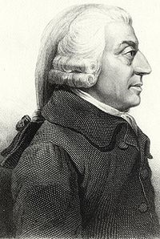
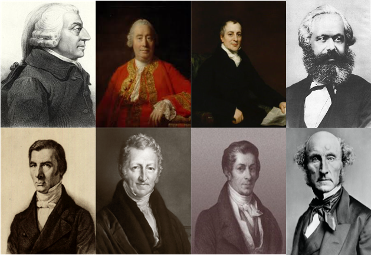
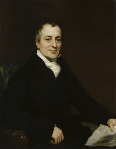
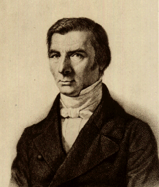

```{r setup, include=FALSE}
options(htmltools.dir.version = FALSE)
knitr::opts_chunk$set(echo=F,
                      message=F,
                      warning=F)
library(tidyverse)
set.seed(256)
update_geom_defaults("label", list(family = "Fira Sans Condensed"))
```

class: inverse

# Outline

## [The Scottish Enlightenment](#3)

## [David Hume](#7)

## [Adam Smith the Philosopher: *Theory of Moral Sentiments*](#34)

---

# The Breadth of the Smithean Vision

.left-column[
.center[


Adam Smith

1723-1790
]
]
.right-column[
.smaller[
- The breadth and influence of Smith's *Wealth of Nations (WON)* is incredible
  - theory + history + analogies + policy recommendations
  - borrows concepts from others, but unique in systematization, style, & vision
  
- Everyone should read Smith, those with an interest in economics should read all the Smith you can get your hands on
  - readable, entertaining, insightful

> [Wealth of Nations (Online)](https://www.econlib.org/library/Smith/smWN.html)

- We will break Smith up over this week
]
]

---

# The Breadth of the Smithean Vision

.left-column[
.center[


Adam Smith

1723-1790
]
]
.right-column[
.smallest[
- **Today**: overview of what ties the Classical Economists together & some economic history
  - Smith's (and others) attack on the mercantilist system
    - **Book IV** of Wealth of Nations (*Of the Systems of Political Oeconomy*)
  - Smith's arguments about the emergence of commercial society out of feudalism
    - **Book III** of Wealth of Nations (*Of the different Progress of Opulence in different Nations*)

- **Next class**: Smith's analysis of markets, prices, and growth
  - **Books I-II** of the Wealth of Nations (*Of the Causes of Improvement in the productive Powers of Labour*) and (*Of the Nature, Accumulation, and Employment of Stock*)
  - **Book V** (*Of the Revenue of the Sovereign or Commonwealth*)
]
]

---

class: inverse, center, middle

# The Classical System

---

# The Classical Economists

.pull-left[
.smaller[
- .hi[“Classical School”] of economics 1776-c.1870

- Dominant form of economics in English-speaking world

- Leaders of school based on their great works:
  - Smith 1776-c.1820
  - Ricardo c.1820-c.1850
  - Mill c.1850-c.1870

- Famous critics (but commonly considered classical)
  - Malthus
  - Marx
]
]
.pull-right[
.center[

]
]

---

# Common Themes of Classical Writers

.pull-left[

- Rejection of mercantilism

- Believe in .hi-purple[a natural harmony of interests]
  - markets channel self-interest into social benefit

- Focus on competitive markets in full-employment
  - reject monopolies, mercantilist restrictions & privileges

- Advocate free trade, lassiez-faire, minimal government interference

- Focus on the determinants of “the wealth of nations” and economic growth

- Focus on the distribution of income across classes
  - Labor, landowners, capitalists
]

.pull-right[
.center[

]
]

---

# Common Themes of Classical Writers

.pull-left[

- Believe in .hi-purple[a natural harmony of interests]
  - markets channel self-interest into social benefit

- Like physiocrats, belief in discoverable natural laws or Newtonian principles of motion of society


]

.pull-right[
.center[

]
]

---

# Common Themes of Classical Writers: Liberalism

.pull-left[

- .hi-purple[(Classical) liberalism]: individual liberty & autonomy is the highest value, good in and of itself, but empirically, also brings prosperity

> Smith: “the simple and obvious system of natural liberty”

- political freedom and economic freedom

- Equality, pluralism, and cosmopolitanism
  - against class & privilege (remnants of feudal tyranny)
  - A society of “contract” rather than a society of “status”

- “Liberal” in U.S. politics today is correlated with, but quite different from, “classical liberalism” 
  - U.S. left-wing politics today: 20<sup>th</sup> Century Progressivism + some elements of socialism
]

.pull-right[

]

---

# Morality of Trade & Analytic Egalitarianism

.pull-left[
.smallest[
- Ricardian view of trade emphasizes how our differences benefit all of us
  - .hi-purple[Diversity *with trade* is strength!]

- Smith & Ricardo were .hi[analytic egalitarians]: view all members of humanity as equals, all can participate in exchange and flourish
  - economics is universally applicable to all
  - class, race, other social divisions are distractions

- Read [How the Dismal Science Got its Name](https://www.econlib.org/library/Columns/LevyPeartdismal.html) (believe me, it’s not at all what you think!)
  - [Part II](https://www.econlib.org/library/Columns/LevyPeartdismal2.html); [Part III](https://www.econlib.org/library/Columns/LevyPeartdismal3.html); [Part IV](https://www.econlib.org/library/Columns/LevyPeartdismal4.html); [Part V](https://www.econlib.org/library/Columns/LevyPeartdismal5.html); [Part VI](https://www.econlib.org/library/Columns/LevyPeartdismal6.html)
  
]
]
.pull-right[
.center[
 
]
]

---

class: inverse, center, middle

# Classical Rejection of Mercantilism

---

# Mercantilism: Wrong on the Wealth of Nations I

.left-column[
.center[


Adam Smith

1723-1790
]
]
.right-column[

> We trust with perfect security that the freedom of trade, without any attention of government, will always supply us with the wine which we have occasion for: and we trust with equal security that it will always supply us with all the gold and silver which we can afford to purchase or to employ, (Book IV, Chapter 1: Of the Principle of the Mercantile System).

]

.source[Smith, Adam, 1776, *An Enquiry into the Nature and Causes of the Wealth of Nations*]

---

# Mercantilism: Wrong on Trade I

.left-column[
.center[


Adam Smith

1723-1790
]
]
.right-column[

> As every individual, therefore, endeavours as much as he can ... to employ his capital [in] that industry that its produce may be of the greatest value; every individual necessarily labours to render the annual revenue of the society as great as he can. He generally, indeed, neither intends to promote the public interest, nor knows how much he is promoting it. By preferring the support of domestic to that of foreign industry ... and by directing that industry in such a manner as its produce may be of the greatest value, he intends only his own gain, and he is in this, as in many other cases, led by an invisible hand to promote an end which was no part of his intention...By pursuing his own interest he frequently promotes that of the society more effectually than when he really intends to promote it., (Book IV, Chapter 2: Of restraints upon the importation from foreign countries of such goods as can be produced at home).

]

.source[Smith, Adam, 1776, *An Enquiry into the Nature and Causes of the Wealth of Nations*]

---

# Mercantilism: Wrong on Trade II

.left-column[
.center[


Adam Smith

1723-1790
]
]
.right-column[

> Nothing, however, can be more absurd than this whole doctrine of the balance of trade, upon which, not only these restraints, but almost all the other regulations of commerce are founded. When two places trade with one another, this doctrine supposes that, if the balance be even, neither of them either loses or gains; but if it leans in any degree to one side, that one of them loses and the other gains in proportion to its declension from the exact equilibrium. Both suppositions are false. A trade which is forced by means of bounties and monopolies may be and commonly is disadvantageous to the country in whose favour it is meant to be established, as I shall endeavour to show hereafter.  But that trade which, without force or constraint, is naturally and regularly carried on between any two places is always advantageous, though not always equally so, to both., (Book IV, Chapter 3: Of the extraordinary Restraints upon the Importation of Goods of almost all Kinds, from those Countries with which the Balance is supposed to be Disadvantageous, Part II).

]

.source[Smith, Adam, 1776, *An Enquiry into the Nature and Causes of the Wealth of Nations*]

---

# Mercantilism: Wrong on Trade III

.left-column[
.center[


Frederic Bastiat

1801-1850
]
]
.right-column[

> [A]ccording to the theory of the balance of trade, France has a quite simple means of doubling her capital at any moment.  It suffices merely to pass its products through the customhouse, and then throw them into the sea.  In that case the exports will equal the amount of her capital; imports will be nonexistent and even impossible, and we shall gain all that the ocean has swallowed up, ([The Balance of Trade](http://www.econlib.org/library/Bastiat/basEss13.html\#Chapter 13l) 1848).

]

---

# Mercantilism: Wrong on Trade IV

.left-column[
.center[


Frederic Bastiat

1801-1850
]
]
.right-column[

> The truth is we should reverse the principle ... and calculate the national profit from foreign trade in terms of the excess of imports over exports...But this theory, which is the correct one, leads directly to the principle of free trade...Assume, if it amuses you, that foreigners flood our shores with all kinds of useful goods, without asking anything from us; even if our imports are *infinite* and our exports *nothing*, I defy you to prove to me that we should be the poorer for it., ([The Balance of Trade](http://www.econlib.org/library/Bastiat/basEss13.html\#Chapter 13l) 1848).

]

---

# Mercantilism: Wrong on Trade V

.left-column[
.center[


Adam Smith

1723-1790
]
]
.right-column[

> Consumption is the sole end and purpose of all production; and the interest of the producer ought to be attended to only so far as it may be necessary for promoting that of the consumer. The maxim is so perfectly self-evident that it would be absurd to attempt to prove it. But in the mercantile system the interest of the consumer is almost constantly sacrificed to that of the producer; and it seems to consider production, and not consumption, as the ultimate end and object of all industry and commerce., (Book IV, Chapter 9: Conclusion of the Mercantile system).

]

.source[Smith, Adam, 1776, *An Enquiry into the Nature and Causes of the Wealth of Nations*]

---

# Mercantilism: A Corporate Welfare Scheme I

.left-column[
.center[


Adam Smith

1723-1790
]
]
.right-column[

> It cannot be very difficult to determine who have been the contrivers of this whole mercantile system; not the consumers, we may believe, whose interest has been entirely neglected; but the producers, whose interest has been so carefully attended to; and among this latter class our merchants and manufacturers have been by far the principal architects, (Book IV, Chapter 9: Conclusion of the Mercantile system).

]

.source[Smith, Adam, 1776, *An Enquiry into the Nature and Causes of the Wealth of Nations*]

---

# Mercantilism: A Corporate Welfare Scheme II

.left-column[
.center[


Frederic Bastiat

1801-1850
]
]
.right-column[

> From the Manufacturers of Candles, Tapers, Lanterns, Candlesticks, Street Lamps, Snuffers and Extinguishers, and from the Producers of Tallow, Oil, Resin, Alcohol, and Generally of Everything Connected with Lighting.

> To the Honorable Members of the Chamber of Deputes.
> We are suffering from the ruinous competition of a foreign rival who apparently works under conditions far superior to our own for the production of light that he is *flooding* the *domestic market* with it at an incredibly low price; for the moment he appears, our sales cease, all the consumers turn to him, and a branch of French industry whose ramifications are innumerable is all at once reduced to complete stagnation., ([The Candlemakers Petition](http://bastiat.org/en/petition.html) 1845).

]

---

# Mercantilism: A Corporate Welfare Scheme III

.left-column[
.center[


Frederic Bastiat

1801-1850
]
]
.right-column[

> We ask you to be so good as to pass a law requiring the closing of all windows, dormers, skylights, inside and outside shutters, curtains, casements, bulls'-eyes, deadlights, and blinds - in short, all openings, holes, chinks, and fissures through which the light of the sun is wont to enter houses, to the detriment of the fair industries with which, we are proud to say, we have endowed the country, a country that cannot, without betraying ingratitude, abandon us today to so unequal a combat.

> [This will] encourage industry and increase employment...If you grant us a monopoly over the production of lighting during the day...we shall buy large amounts of tallow, charcoal, oil, resin, wax...and moreover, we and our numerous suppliers, having become rich, will consume a great deal and spread prosperity into all areas of domestic industry., ([The Candlemakers Petition](http://bastiat.org/en/petition.html) 1845).

]

---

# Mercantilism: End the Artificial Restrictions I

.left-column[
.center[


Adam Smith

1723-1790
]
]
.right-column[

> Let the same natural liberty of exercising what species of industry they please, be restored to all his Majesty's subjects...break down the exclusive privileges of corporations, and repeal the statute of apprenticeship, both which are real encroachments upon natural liberty, and add to these the repeal of the [anti-migration laws] so that a poor workman, when thrown out of employment either in one trade or in one place, may seek for it in another trade or in another place without the fear either of a prosecution or of a removal, (Book IV, Chapter 9: Conclusion of the Mercantile system).

]

.source[Smith, Adam, 1776, *An Enquiry into the Nature and Causes of the Wealth of Nations*]

---

# Mercantilism: End the Artificial Restrictions II

.left-column[
.center[


Adam Smith

1723-1790
]
]
.right-column[

> The natural effort of every individual to better his own condition...is so powerful, that it is alone, and without any assistance, not only capable of carrying on the society to wealth and prosperity, but of surmounting a hundred impertinent obstructions with which the folly of human laws too often encumbers its operations. (Book IV, Chapter V)

]

.source[Smith, Adam, 1776, *An Enquiry into the Nature and Causes of the Wealth of Nations*]

---

# Mercantilism: Wrong on Colonies I

.left-column[
.center[


Adam Smith

1723-1790
]
]
.right-column[

> Of all those expensive and uncertain projects, however, which bring bankruptcy upon the greater part of the people who engage in them, there is none perhaps more ruinous than the search after new silver and gold mines. It is perhaps the most disadvantageous lottery in the world, or the one in which the gain of those who draw the prizes bears the least proportion to the loss of those who draw the blanks: for though the prizes are few and the blanks many, the common price of a ticket is the whole fortune of a very rich man, (Book IV, Chapter VII, Part I: Of the Motives for establishing new Colonies)

]

.source[Smith, Adam, 1776, *An Enquiry into the Nature and Causes of the Wealth of Nations*]

---

# Mercantilism: Wrong on Colonies II

.left-column[
.center[


Adam Smith

1723-1790
]
]
.right-column[

> Folly and injustice seem to have been the principles which presided over and directed the first project of establishing those colonies; the folly of hunting after gold and silver mines, and the injustice of coveting the possession of a country whose harmless natives, far from having ever injured the people of Europe, had received the first adventurers with every mark of kindness and hospitality., (Book IV, Chapter VII, Part I: Of the Motives for establishing new Colonies)

]

.source[Smith, Adam, 1776, *An Enquiry into the Nature and Causes of the Wealth of Nations*]

---

# Mercantilism: Wrong on Colonies III

.left-column[
.center[


Adam Smith

1723-1790
]
]
.right-column[

> To prohibit a great people, however, from making all that they can of every part of their own produce...is a manifest violation of the most sacred rights of mankind. Unjust, however, as such prohibitions may be, they have not hitherto been very hurtful to the colonies..

> We must carefully distinguish between the effects of the colony trade and those of the monopoly of that trade. The former are always and necessarily beneficial; the latter always and necessarily hurtful. But the former are so beneficial that the colony trade, though subject to a monopoly, and notwithstanding the hurtful effects of that monopoly, is still upon the whole beneficial, and greatly beneficial; though a good deal less so than it otherwise would be...Under the present system of management, therefore, Great Britain derives nothing but loss from the dominion which she assumes over her colonies., (Book IV, Chapter VII, Part II: Causes of Prosperity of new Colonies)

]

.source[Smith, Adam, 1776, *An Enquiry into the Nature and Causes of the Wealth of Nations*]

---

# Mercantilism: Wrong on Slavery

.left-column[
.center[


Adam Smith

1723-1790
]
]
.right-column[

> Fortune never exerted more cruelly her empire over mankind, than when she subjected those nations of heroes to the refuse of the jails of Europe, to wretches who possess the virtues neither of the countries which they come from, nor of those which they go to, and whose levity, brutality, and baseness, so justly expose them to the contempt of the vanquished, (Part V, Chapter 2: Of the Influence of Custom and Fashion upon Moral Sentiments)

]

.source[Smith, Adam, 1749, *Theory of Moral Sentiments*]

---

class: inverse, center, middle

# Adam Smith 


---

# The Life of Adam Smith

.left-column[
.center[


.smaller[
Adam Smith

1723-1790
]
]

]

.right-column[
.smallest[
- Born in Kirkaldy in 1723, studied at Glasgow University under Francis Hutcheson, later Oxford

- Gave lectures at Edinburgh U. 1748-1750

- Chair of Moral Philosophy at Glasgow U (Hutcheson's chair) in 1752
  - 1759: *Theory of Moral Sentiments*

- Travelled to France as tutor to (English) Duke of Buccleuch (1764-1766)
  - met Quesnay & Turgot
  - earned a pension to live off of later

- Travelled & wrote *Wealth of Nations* published in 1776

- Made a Commissioner of Customs (1778) and died in 1790

]
]

---

# The Life of Adam Smith

.left-column[
.center[


.smaller[
Adam Smith

1723-1790
]
]

]

.right-column[
.smallest[
- Famously an absent-minded professor

- Smith had all of his papers burned at his death

- Students loved him and took copious notes
  - We have has *Lectures on Justice, Police, Revenue, and Arms* (1763) and other works via student notes

- Never married
]
]

---

# Theory of Moral Sentiments

.left-column[
.center[


.smaller[
Adam Smith

1723-1790
]
]

]

.right-column[

]

---

# Theory of Moral Sentiments

.left-column[
.center[


.smaller[
Adam Smith

1723-1790
]
]

]

.right-column[

> “As we have no immediate experience of what other men feel, we can form no idea of the manner in which they are affected, but by conceiving what we ourselves should feel in the like situation. Though our brother is on the rack, as long as we ourselves are at our ease, our senses will never inform us of what he suffers. They never did, and never can, carry us beyond our own person, and it is by the imagination only that we can form any conception of what are his sensations....hi[By the imagination, we place ourselves in his situation.]”

.source[Smith, Adam, 1759, [*The Theory of Moral Sentiments*](https://www.econlib.org/library/Smith/smMS.html)]

]

---

# Theory of Moral Sentiments

.left-column[
.center[


.smaller[
Adam Smith

1723-1790
]
]

]

.right-column[
.smallest[
- Humans are self-interested by nature, guided by their own needs

> “To man is allotted a much humbler department, but one much more suitable to the weakness of his powers, and to the narrowness of his comprehension: the care of his own happiness, of that of his family, his friends, his country...But though we are...endowed with a very strong desire of those ends, it has been entrusted to the slow and uncertain determinations of our reason to find out the proper means of bringing them about. Nature has directed us to the greater part of these by original and immediate instincts. Hunger, thirst, the passion which unites the two sexes, and the dread of pain, prompt us to apply those means for their own sakes, and without any consideration of their tendency to those beneficent ends which the great Director of nature intended to produce by them.”

]

.source[Smith, Adam, 1759, [*The Theory of Moral Sentiments*](https://www.econlib.org/library/Smith/smMS.html)]

]

---

# Theory of Moral Sentiments

.left-column[
.center[


.smaller[
Adam Smith

1723-1790
]
]

]

.right-column[
.smallest[
- But there is .hi-purple[order and harmony in human society] because we can sympathize with others

> “How selfish soever man may be supposed, there are evidently some principles in his nature, which interest him in the fortune of others, and render their happiness necessary to him, though he derives nothing from it except the pleasure of seeing it.”

> “The all-wise Author of Nature has, in this manner, taught man to .hi[respect the sentiments and judgments of his brethren]; to be more or less pleased when they approve of his conduct, and to be more or less hurt when they disapprove of it. He has made .hi[man, if I may say so, the immediate judge of mankind].”

]

.source[Smith, Adam, 1759, [*The Theory of Moral Sentiments*](https://www.econlib.org/library/Smith/smMS.html)]

]

