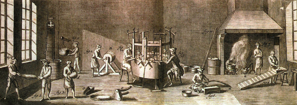
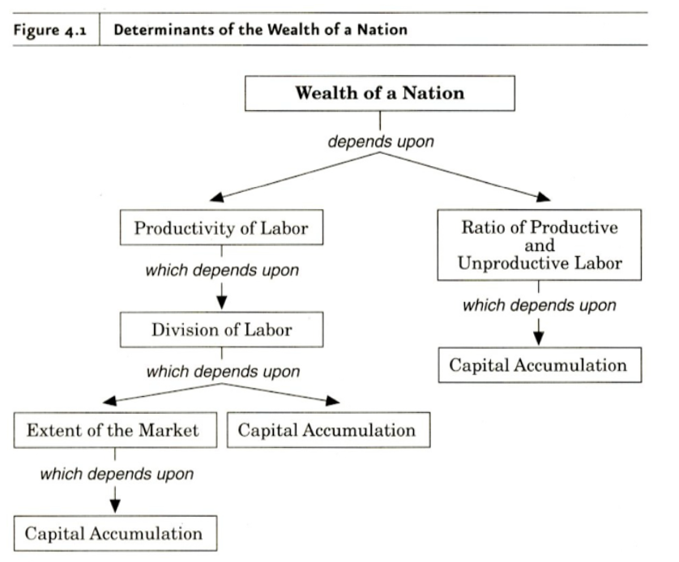

```{r setup, include=FALSE}
options(htmltools.dir.version = FALSE)
knitr::opts_chunk$set(echo=F,
                      message=F,
                      warning=F)
library(tidyverse)
set.seed(256)
update_geom_defaults("label", list(family = "Fira Sans Condensed"))
```

class: inverse

# Outline

## [Economic Growth & the Division of Labor](#3)

## [Smithean Price Theory](#14)

## [Capital Theory](#17)

---

# Adam Smith’s Economic Analysis

.left-column[
.center[


Adam Smith

1723-1790
]
]
.right-column[
.quitesmall[
Book I: *Of the Causes of Improvement in the productive Powers of Labour*
  - Division of Labor (Chs. 1-3)
  - Origin of money (Ch. 4); real vs. nominal prices (Ch.5)
  - Prices: component parts (Ch.6); natural vs. market prices (Ch. 7)
  - Wages (Ch. 8, ~10); Profits (Ch. 9, ~10); Rents (Ch.11)
  
Book II: *Of the Nature, Accumulation, and Employment of Stock*
  - Function of capital (Ch. 1)
  - Money & financial capital (Ch.2)
  - Capital accumulation & productive/unproductive labor (Ch. 3)
  - Lending & interest (Ch. 4)

Book V: *Of the Revenue of the Sovereign or Commonwealth*
  - Government spending (Ch. 1)
  - Principles of taxation (Ch. 2)
  - War & national debt (Ch. 3)
]
]

---

class: inverse, center, middle

# Economic Growth & The Division of Labor

---

# The Division of Labor I

.left-column[
.center[


Adam Smith

1723-1790
]
]

.right-column[

> “The greatest improvement in the productive powers of labour, and the greater part of the skill, dexterity, and judgment with which it is any where directed, or applied, seem to have been the effects of the .hi[division of labour],” (Book I, Chapter 1).
]

.source[Smith, Adam, 1776, [*An Enquiry into the Nature and Causes of the Wealth of Nations*](https://www.econlib.org/library/Smith/smWN.html)]

---

# Smith's Pin Factory Example I

.left-column[
.center[


Adam Smith

1723-1790
]
]

.right-column[
.smallest[
> "To take an example...from a very trifling manufacture...the trade of the .hi[pin-maker]. [I]n the way in which this business is now carried on, not only the whole work is a peculiar trade, but it is divided into a number of branches, of which the greater part are likewise peculiar trades. One man draws out the wire, another straights it, a third cuts it, a fourth points it, a fifth grinds it at the top for receiving the head...and .hi[the important business of making a pin is, in this manner, divided into about eighteen distinct operations]....hi[Ten men only were employed [and they] could make among them upwards of forty-eight thousand pins in a day...But if they had all wrought separately and independently [they] certainly could not each of them have made twenty, perhaps not one pin in a day...]" (Book I, Chapter 1).

]
]
.source[Smith, Adam, 1776, [*An Enquiry into the Nature and Causes of the Wealth of Nations*](https://www.econlib.org/library/Smith/smWN.html)]

---

# Smith's Pin Factory Example II

.center[


Adam Smith's pin factory illustration
]

---

# How Division of Labor Enhances Productivity

.left-column[
.center[


Adam Smith

1723-1790
]
]

.right-column[
.smallest[
> "This great increase of the quantity of work which, in consequence of the division of labour, the same number of people are capable of performing, is owing to three different circumstances; first to the .hi[increase of dexterity] in every particular workman; secondly, to the .hi[saving of the time] which is commonly lost in passing from one species of work to another; and lastly, to the .hi[invention of a great number of machines] which facilitate and abridge labour, and enable one man to do the work of many." (Book I, Chapter 1).

]
]
.source[Smith, Adam, 1776, [*An Enquiry into the Nature and Causes of the Wealth of Nations*](https://www.econlib.org/library/Smith/smWN.html)]


---

# DOL Facilitates Cooperation on a Grand Scale

.left-column[
.center[


Adam Smith

1723-1790
]
]

.right-column[
.quitesmall[
> “The woollen coat, for example, which covers the day-labourer, as coarse and rough as it may appear, is the produce of the joint labour of a great multitude of workmen. The shepherd, the sorter of the wool, the wool-comber or carder, the dyer, the scribbler, the spinner, the weaver, the fuller, the dresser, with many others, must all join their different arts in order to complete even this homely production. How many merchants and carriers, besides, must have been employed in transporting the materials from some of those workmen to others who often live in a very distant part of the country! how much commerce and navigation in particular, how many ship-builders, sailors, sail-makers, rope-makers, must have been employed in order to bring together [resources] from the remotest corners of the world!...If we examine, I say, all these things, and consider what a variety of labour is employed about each of them, we shall be sensible that without .hi[the assistance and co-operation of many thousands], the very meanest person in a civilized country could not be provided, even according to what we very falsely imagine, the easy and simple manner in which he is commonly accommodated.” (Book I, Chapter 1).

]
]
.source[Smith, Adam, 1776, [*An Enquiry into the Nature and Causes of the Wealth of Nations*](https://www.econlib.org/library/Smith/smWN.html)]

---

# Division of Labor: Origins

.left-column[
.center[


Adam Smith

1723-1790
]
]

.right-column[

> "This division of labour, from which so many advantages are derived, is .hi[not originally the effect of any human wisdom], which foresees and intends that general opulence to which it gives occasion. It is the necessary, though very slow and gradual, .hi[consequence of a certain propensity in human nature] which has in view no such extensive utility; the .hi[propensity to truck, barter, and exchange one thing for another,]" (Book I, Chapter 2).

]

.source[Smith, Adam, 1776, [*An Enquiry into the Nature and Causes of the Wealth of Nations*](https://www.econlib.org/library/Smith/smWN.html)]

---

# Exchange is What Makes Us Human

.left-column[
.center[


Adam Smith

1723-1790
]
]

.right-column[

> "Whether this propensity be one of those original principles in human nature, of which no further account can be given...It is common to all men, and to be .hi[found in no other race of animals], which seem to know neither this nor any other species of contracts...Nobody ever saw a dog make a fair and deliberate exchange of one bone for another with another dog...Nobody ever saw one animal by its gestures and natural cries signify to another, this is mine, that yours; I am willing to give this for that." (Book I, Chapter 2).

]

.source[Smith, Adam, 1776, [*An Enquiry into the Nature and Causes of the Wealth of Nations*](https://www.econlib.org/library/Smith/smWN.html)]

---

# Exchange is What Makes Us Human

.left-column[
.center[


Adam Smith

1723-1790
]
]

.right-column[

.smallest[
> "In civilized society [man] stands at all times in need of the cooperation and assistance of great multitudes, while his whole life is scarce sufficient to gain the friendship of a few persons...man has almost constant occasion for the help of his brethren, and .hi[it is in vain for him to expect it from their benevolence only]."

> "Whoever offers to another a bargain of any kind, proposes to do this. .hi[Give me that which I want, and you shall have this which you want]...and it is in this manner that we obtain from one another the far greater part of those good offices which we stand in need of. .hi[It is not from the benevolence of the butcher, the brewer, or the baker, that we expect our dinner, but from their regard to their own interest.] (Book I, Chapter 2).

]
]
.source[Smith, Adam, 1776, [*An Enquiry into the Nature and Causes of the Wealth of Nations*](https://www.econlib.org/library/Smith/smWN.html)]

---

# Division of Labor is *Cause* not *Effect* of Talents

.left-column[
.center[


Adam Smith

1723-1790
]
]

.right-column[
.quitesmall[
> “The .hi[difference of natural talents] in different men is, in reality, .hi[much less than we are aware of]; and...is .hi[not upon many occasions so much the cause, as the effect of the division of labour.] The difference between the most dissimilar characters, between a philosopher and a common street porter, for example, seems to .hi[arise not so much from nature, as from habit, custom, and education.]...[F]or the first six or eight years of their existence, they were perhaps, very much alike...About that age, or soon after, they come to be employed in very different occupations. The difference of talents comes then to be taken notice of, and widens by degrees, till at last the vanity of the philosopher is willing to acknowledge scarce any resemblance. But .hi[without the disposition to truck, barter, and exchange, every man must have procured to himself every necessary and conveniency of life which he wanted.] All must have had the same duties to perform, and the same work to do, and .hi[there could have been no such difference of employment as could alone give occasion to any great difference of talents.]” (Book I, Chapter 2).

]

.source[Smith, Adam, 1776, [*An Enquiry into the Nature and Causes of the Wealth of Nations*](https://www.econlib.org/library/Smith/smWN.html)]

]

---

# DOL Is Limited By the Extent of the Market

.left-column[
.center[


Adam Smith

1723-1790
]
]

.right-column[

> "As it is the power of exchanging that gives occasion to the division of labour, so .hi[the extent of this division must always be limited by...the extent of the market.] When the market is very small, no person can have any encouragement to dedicate himself entirely to one employment, for want of the power to exchange all that surplus part of the produce of his own labour, which is over and above his own consumption, for such parts of the produce of other men's labour as he has occasion for," (Book I, Chapter 3).
]

.source[Smith, Adam, 1776, [*An Enquiry into the Nature and Causes of the Wealth of Nations*](https://www.econlib.org/library/Smith/smWN.html)]

---

# The Division of Labor: Summary

.pull-left[
.smallest[

- .hi[Division of labor]: process where people *specialize* in production and then *exchange* their produce with others to acquire all of their desired goods

- Two senses:
    1. **Factory system**: splitting up production process into specialized discrete steps boosts productivity
    2. **Economic system**: an economy of people specialize & exchange for all needs, leading to widespread prosperity
    
- .hi-purple[The more trading opportunities, the greater the benefits of specialization]

]
]

.pull-right[
.center[

]
]

---

# A Commercial Society

.left-column[
.center[


Adam Smith

1723-1790
]
]

.right-column[

> "It is but a very small part of a man's wants which the produce of his own labour can supply. He supplies the far greater part of them by exchanging that surplus part of the produce of his own labour, which is over and above his own consumption, for such parts of the produce of other men's labour as he has occasion for. .hi[Every man thus lives by exchanging], or becomes in some measure a merchant, and the society itself grows to be what is properly a commercial society," (Book I, Chapter 4).
]

.source[Smith, Adam, 1776, [*An Enquiry into the Nature and Causes of the Wealth of Nations*](https://www.econlib.org/library/Smith/smWN.html)]

---

# Downsides of the Division of Labor

.left-column[
.center[


Adam Smith

1723-1790
]
]

.right-column[
.quitesmall[
> “In the progress of the division of labour, the employment of the far greater part of those who live by labour, that is, of the great body of the people, comes to be confined to a few very simple operations...The man whose whole life is spent in performing a few simple operations, of which the effects are perhaps always the same, or very nearly the same, has no occasion to exert his understanding or to exercise his invention...He naturally loses, therefore, the habit of such exertion, and generally becomes as stupid and ignorant...The torpor of his mind renders him not only incapable of relishing or bearing a part in any rational conversation, but of conceiving any generous, noble, or tender sentiment...Of the great and extensive interests of his country he is altogether incapable of judging...The uniformity of his stationary life naturally corrupts the courage of his mind...It corrupts even the activity of his body...His dexterity at his own particular trade seems, in this manner, to be acquired at the expence of his intellectual, social, and martial virtues. But in every improved and civilized society this is the state into which the labouring poor, that is, the great body of the people, must necessarily fall, unless government takes some pains to prevent it.” (Book V, Ch. 1)

]
.source[Smith, Adam, 1776, [*An Enquiry into the Nature and Causes of the Wealth of Nations*](https://www.econlib.org/library/Smith/smWN.html)]

]

---

class: inverse, center, middle

# Smithean Price Theory

---

# Price Theory

.left-column[
.center[


Adam Smith

1723-1790
]
]

.right-column[
.smaller[
- A vision of consumer sovereignty, and harmony of the marketplace, guided by the self-interest of capitalists

- Profits are greatest in the industries with highest consumer demand
  - Capitalists bid for various factors of production, applying them to where they find the highest profit

- Competition between capitalists for investment opportunities will drive profits down to opportunity cost of paying factors
  - High profit attracts entry, bidding input prices up
]
]

---

# Conflating Price and Value

.left-column[
.center[


Adam Smith

1723-1790
]
]

.right-column[

.smallest[

> “Value has two different meanings, and sometimes expresses the utility of some particular object, and sometimes the power of purchasing other goods which the possession of that object conveys. The one may be called .hi[“value in use”]; the other, .hi[“value in exchange.”] The things which have the greatest value in use have frequently little or no value in exchange; and on the contrary, those which have the greatest value in exchange have frequently little or no value in use. Nothing is more useful than water: but it will purchase scarce any thing; scarce any thing can be had in exchange for it. A diamond, on the contrary, has scarce any value in use; but a very great quantity of other goods may frequently be had in exchange for it.” (Book I, Ch. 6)

]
]
.source[Smith, Adam, 1776, [*An Enquiry into the Nature and Causes of the Wealth of Nations*](https://www.econlib.org/library/Smith/smWN.html)]

---

# Conflating Price and Value

.left-column[
.center[


Adam Smith

1723-1790
]
]

.right-column[

- .hi-purple[Value in exchange]: power to purchase other goods, i.e. good’s market price

- .hi-purple[Value in use] ??? 🤨😓
  - Smith focusing on total utility (not marginal utility!)
  - famous diamond-water paradox
  - ethical & normative judgments creeping in
  - would confuse classical economists for 100 years

]

.source[Smith, Adam, 1776, [*An Enquiry into the Nature and Causes of the Wealth of Nations*](https://www.econlib.org/library/Smith/smWN.html)]

---

# Prices in a Primitive Society

.left-column[
.center[


Adam Smith

1723-1790
]
]

.right-column[

> "In that early and rude state of society which precedes both the accumulation of stock and the appropriation of land, the proportion between the quantities of labour necessary for acquiring different objects seems to be the only circumstance which can afford any rule for exchanging them for one another. If among a nation of hunters, for example, it usually costs twice the labour to kill a beaver which it does to kill a deer, one beaver should naturally exchange for or be worth two deer." (Book I, Chapter 6).

]

.source[Smith, Adam, 1776, [*An Enquiry into the Nature and Causes of the Wealth of Nations*](https://www.econlib.org/library/Smith/smWN.html)]

---

# Prices in a Primitive Society

.left-column[
.center[


Adam Smith

1723-1790
]
]

.right-column[

> "In this state of things, the whole produce of labour belongs to the labourer; and the quantity of labour commonly employed in acquiring or producing any commodity, is the only circumstance which can regulate the quantity of labour which it ought commonly to purchase, command, or exchange for." (Book I, Chapter 6).

]

.source[Smith, Adam, 1776, [*An Enquiry into the Nature and Causes of the Wealth of Nations*](https://www.econlib.org/library/Smith/smWN.html)]

---

# Prices in an Advanced Society: Capital

.left-column[
.center[


Adam Smith

1723-1790
]
]

.right-column[

.smallest[

> “As soon as stock [capital!] has accumulated in the hands of particular persons, some of them will naturally employ it in setting to work industrious people, whom they will supply with materials and subsistence, in order to make a profit by the sale of their work, or by what their labour adds to the value of the materials. In exchanging the complete manufacture...for money...over and above what may be sufficient to pay the price of the materials, and the wages of the workmen, something must be given for the profits of the undertaker of the work who hazards his stock in this adventure,” (Book I, Chapter 6).

- Capitalist supplies tools to workers making them more productive

]


]

.source[Smith, Adam, 1776, [*An Enquiry into the Nature and Causes of the Wealth of Nations*](https://www.econlib.org/library/Smith/smWN.html)]

---

# Prices in an Advanced Society: Capital

.left-column[
.center[


Adam Smith

1723-1790
]
]

.right-column[

.quitesmall[

- Profits to capital depend on supply & demand of capital

> “The profits of stock, it may perhaps be thought, are only a different name for the wages of a particular sort of labour, the labour of inspection and direction. They are, however, altogether different, are regulated by quite different principles, and bear no proportion to the quantity, the hardship, or the ingenuity of this supposed labour of inspection and direction. They are regulated altogether by the value of the stock employed, and are greater or smaller in proportion to the extent of this stock.”

- Output price must compensate capitalist

> “In this state of things, the whole produce of labour does not always belong to the labourer. He must in most cases share it with the owner of the stock which employs him.” (Book I, Chapter 6).

- An opening for Marx!
]


]

.source[Smith, Adam, 1776, [*An Enquiry into the Nature and Causes of the Wealth of Nations*](https://www.econlib.org/library/Smith/smWN.html)]

---

# Prices in an Advanced Society: Land

.left-column[
.center[


Adam Smith

1723-1790
]
]

.right-column[

> “As soon as the land of any country has all become private property, the landlords, like all other men, love to reap where they never sowed, and demand a rent even for its natural produce...This portion, or, what comes to the same thing, the price of this portion, constitutes the rent of land, and in the price of the greater part of commodities makes a third component part,” (Book I, Chapter 6).

]
.source[Smith, Adam, 1776, [*An Enquiry into the Nature and Causes of the Wealth of Nations*](https://www.econlib.org/library/Smith/smWN.html)]

---

# Prices in an Advanced Society

.left-column[
.center[


Adam Smith

1723-1790
]
]

.right-column[
> "The .hi[real value] of all the different .hi[component parts of price], it must be observed, is measured by the quantity of labour which they can, each of them, purchase or command. Labour measures the value not only of that part of price which .hi[resolves itself into labour], but of that which resolves itself .ji[into rent], and of that which resolves itself .hi[into profit],” (Book I, Chapter 6).
]

.source[Smith, Adam, 1776, [*An Enquiry into the Nature and Causes of the Wealth of Nations*](https://www.econlib.org/library/Smith/smWN.html)]

---

# Two Models of Prices

.left-column[
.center[


Adam Smith

1723-1790
]
]

.right-column[
.smaller[
1) Primitive society: land is not scarce, and no capital exists; all output is produced only by labor

- relative prices of goods reflect the relative labor needed to produce

- Inconsistency in Smith:
  - Price as reflecting “labor cost”
  - Price as reflecting “the quantity of labour which it can enable them to purchase or command.”

- Further problem: labor differs by “ingenuity or skill” and “disagreeableness”

]
]
.source[Smith, Adam, 1776, [*An Enquiry into the Nature and Causes of the Wealth of Nations*](https://www.econlib.org/library/Smith/smWN.html)]

---

# Two Models of Prices

.left-column[
.center[


Adam Smith

1723-1790
]
]

.right-column[

2) Modern society
  - land is scarce and owned, capital has been accumulated
  - prices reflect labor, capital, and land’s contributions

“Natural price” = land rent + labor wages + capital profits

.source[Smith, Adam, 1776, [*An Enquiry into the Nature and Causes of the Wealth of Nations*](https://www.econlib.org/library/Smith/smWN.html)]

]

---

# Price Theory: Natural Price vs. Market Price

.left-column[
.center[


Adam Smith

1723-1790
]
]

.right-column[

.smaller[
> “When the price of any commodity is [equivalent to the amount] to pay the rent of the land, the wages of the labour, and the profits of the stock employed...the commodity is then sold for what may be called its .hi[natural price]...The commodity is then sold precisely for what it is worth, or for .hi[what it really costs the person who brings it to market.]"

> “The .hi[market price] of every particular commodity is .hi[regulated by the proportion between the quantity]...brought to market, .hi[and the demand of those...willing to pay],” (Book I, Chapter 7).

]

]

.source[Smith, Adam, 1776, [*An Enquiry into the Nature and Causes of the Wealth of Nations*](https://www.econlib.org/library/Smith/smWN.html)]

---

# Price Theory: “Demand” vs. Effectual Demand

.left-column[
.center[


Adam Smith

1723-1790
]
]

.right-column[

.smaller[
> “[Buyers who are willing and able to pay the natural price] may be called the effectual demanders, and their demand the .hi[effectual demand]; since it may be sufficient to effectuate the bringing of the commodity to market. It is different from the absolute demand. A very poor man may be said in some sense to have a demand for a coach and six; he might like to have it; but his demand is not an effectual demand, as the commodity can never be brought to market in order to satisfy it,” (Book I, Chapter 7).

- Pay attention to this for when we get to Malthus!

]
]
.source[Smith, Adam, 1776, [*An Enquiry into the Nature and Causes of the Wealth of Nations*](https://www.econlib.org/library/Smith/smWN.html)]

---

# Price Theory: Market Prices vs. Natural Prices

.left-column[
.center[


Adam Smith

1723-1790
]
]

.right-column[

.quitesmall[
- Can interpret .hi-purple[“natural price”] as $\approx$ “competitive market price” (?)
  - Where price equals opportunity cost $(p=MC)$
  - Entirely determined on supply-side (costs)

- Can interpret .hi-purple[“market price”] as *short run* price
  - Affected by supply & demand

- When the market price $>$ natural price
  - An abnormally high rate of profit, attracting more investment and production
  - Increase in supply until prices fall back down

- When the market price $<$ natural price
  - Producers stop selling, capitalists leave for other markets
  - Decrease in supply until prices rise to normal

]
]

.source[Smith, Adam, 1776, [*An Enquiry into the Nature and Causes of the Wealth of Nations*](https://www.econlib.org/library/Smith/smWN.html)]

---

# On Wages

.left-column[
.center[


Adam Smith

1723-1790
]
]

.right-column[

.smallest[
- Smith believes wages are always set near a subsistence level

- Employers never want to raise wages

> We rarely hear...of the combination of masters, though frequently of those of workmen. But whoever imagines, upon this account, that masters rarely combine, is as ignorant of the world as of the subject. Masters are always and every where in a sort of tacit, but constant and uniform combination, not to raise the wages of labour above their actual rate...We seldom, indeed, hear of this combination, because it is the usual, and one may say, the natural state of affairs which nobody ever hears of.

]

.source[Smith, Adam, 1776, [*An Enquiry into the Nature and Causes of the Wealth of Nations*](https://www.econlib.org/library/Smith/smWN.html)]

]

---

# On Wages

.left-column[
.center[


Adam Smith

1723-1790
]
]

.right-column[

.smallest[

- But they never can lower wages beyond subsistence

> “A man must always live by his work, and his wages must...at least be sufficient to maintain him. They must even upon most occasions be somewhat more; otherwise it would be impossible for him to bring up a family,” (Book I, Chapter 8).

]

.source[Smith, Adam, 1776, [*An Enquiry into the Nature and Causes of the Wealth of Nations*](https://www.econlib.org/library/Smith/smWN.html)]

]

---

# On Wages

.left-column[
.center[


Adam Smith

1723-1790
]
]

.right-column[
.smallest[
- But he *observes* wages are *above* subsistence in England (and America)

- Because production is increasing, so is the demand for labor, and thus, wages:

> “When in any country the demand for those who live by wages...is continually increasing; when every year furnishes employment for a greater number than had been employed the year before, the workmen have no occasion to combine in order to raise their wages. The scarcity of hands occasions competition among masters, who bid against one another, in order to get workmen, and thus voluntarily break through the natural combination of masters not to raise wages...It is [the continual increase in productivity], which occasions a rise in the wages of labour,” (Book I, Chapter 8).
]

.source[Smith, Adam, 1776, [*An Enquiry into the Nature and Causes of the Wealth of Nations*](https://www.econlib.org/library/Smith/smWN.html)]

]

---

# On Wages, Progress, and Benefitting the Poor

.left-column[
.center[


Adam Smith

1723-1790
]
]

.right-column[

> “It deserves to be remarked, perhaps, that it is in the progressive state, while the society is advancing...that the condition of the labouring poor, of the great body of the people, seems to be the happiest and the most comfortable. It is hard in the stationary, and miserable in the declining state. The progressive state is in reality the cheerful and the hearty state to all the different orders of society. The stationary is dull; the declining melancholy”

(Book I, Chapter 8).

.source[Smith, Adam, 1776, [*An Enquiry into the Nature and Causes of the Wealth of Nations*](https://www.econlib.org/library/Smith/smWN.html)]

]

---

# On Wages, Progress, and Benefitting the Poor

.left-column[
.center[


Adam Smith

1723-1790
]
]

.right-column[

.smaller[
- .hi-purple[“Wages fund” doctrine]: a fixed fund of capital is destined to pay wages during production

$$w = \frac{\text{wage fund}}{\text{labor force}}$$

- Comes from view of capital as sustenance-during-production from saved surplus, provided to workers by capitalist

- Very important in classical system
  - Will show up in Ricardo, Malthus, Marx
  
]
]
---

# On Profits

.left-column[
.center[


Adam Smith

1723-1790
]
]

.right-column[

.smaller[
- Profits determined by supply and demand

> “The rise and fall in the profits of stock depend upon the same causes with the rise and fall in the wages of labour, the increasing or declining state of the wealth of the society”

- Thought profits naturally decrease over time
  - competition in output markets
  - competition in labor market
  - competition in investments

]
.source[Smith, Adam, 1776, [*An Enquiry into the Nature and Causes of the Wealth of Nations*](https://www.econlib.org/library/Smith/smWN.html)]

]

---

# On Profits and Cartels

.left-column[
.center[


Adam Smith

1723-1790
]
]

.right-column[

.smaller[

> “People of the same trade seldom meet together, even for merriment and diversion, but the conversation ends in a conspiracy against the public, or in some contrivance to raise prices. It is impossible indeed to prevent such meetings, by any law which either could be executed, or would be consistent with liberty and justice. But though the law cannot hinder people of the same trade from sometimes assembling together, it ought to do nothing to facilitate such assemblies; much less to render them necessary,” (Book I, Chapter 9).
]

.source[Smith, Adam, 1776, [*An Enquiry into the Nature and Causes of the Wealth of Nations*](https://www.econlib.org/library/Smith/smWN.html)]

]

---

# On Rent

.left-column[
.center[


Adam Smith

1723-1790
]
]

.right-column[
.smallest[
> “As soon as the land of any country has all become private property, the landlords, like all other men, love to reap where they never sowed, and demand a rent even for its natural produce. The wood of the forest, the grass of the field, and all the natural fruits of the earth, which, when land was in common, cost the labourer only the trouble of gathering them, come, even to him, to have an additional price fixed upon them. He must then pay for the licence to gather them; and must give up to the landlord a portion of what his labour either collects or produces. This portion, or, what comes to the same thing, the price of this portion, constitutes the rent of land.” (Book I, Chapter 11).

]


.source[Smith, Adam, 1776, [*An Enquiry into the Nature and Causes of the Wealth of Nations*](https://www.econlib.org/library/Smith/smWN.html)]

]
---

# On Rent

.left-column[
.center[


Adam Smith

1723-1790
]
]

.right-column[

> “The .hi[rent of land], therefore, considered as the price paid for the use of the land, .hi[is naturally a monopoly price [!]]. It is not at all proportioned to what the landlord may have laid out upon the improvement of the land, or to what he can afford to take; but to what the farmer can afford to give,” (Book I, Chapter 11).

]
.source[Smith, Adam, 1776, [*An Enquiry into the Nature and Causes of the Wealth of Nations*](https://www.econlib.org/library/Smith/smWN.html)]

---

class: inverse, center, middle

# Capital Theory

---

# Price Theory

.left-column[
.center[


Adam Smith

1723-1790
]
]

.right-column[

- The .hi[capitalist] is the central player bringing about coordination in the economy, according to Smith

- Smith’s understanding of capital is remarkable, but maybe a bit confused? 🤨

- Confusing functions of the .hi[entrepreneur] and the .hi[capitalist]; thus, conflating .hi[profit] and .hi[interest]
  - These may be the same person, but often not
  - Compare Cantillon on “undertakers” and also Turgot
]

---

# Price Theory

.left-column[
.center[


Adam Smith

1723-1790
]
]

.right-column[

- To be fair, capital is a really difficult concept in economics! 🧐

- Modern economists still can’t really agree on what capital is!
  - See [Cambridge Capital Controversy](https://en.wikipedia.org/wiki/Cambridge_capital_controversy) in 20<sup>th</sup> century

- To Smith: capital $\approx$ resources saved up to be used in sustaining workers during a long-term project
]

---

# On Capital

.left-column[
.center[


Adam Smith

1723-1790
]
]

.right-column[

.quitesmall[
> When the stock which a man possesses is no more than sufficient to maintain him for a few days...His revenue is, in this case, derived from his labour only. This is the state of the greater part of the labouring poor in all countries.

> [W]hen he possesses stock sufficient to maintain him for months or years, he naturally endeavours to derive a revenue from the greater part of it; reserving only so much for his immediate consumption as may maintain him till this revenue begins to come in. His whole stock, therefore, is distinguished into two parts. That part which, he expects, is to afford him this revenue, is called his capital. The other is that which supplies his immediate consumption; and which consists either, first, in that portion of his whole stock...or his revenue, from whatever source derived, as it gradually comes in

> “he “stock of goods of different kinds...must be stored up...sufficient to maintain [those who participate in a division of labour which is at all advanced, supplying] with the materials and tools of his work, till such time, at least, as both these events can be brought about,” (Book II, Chapter 1).

]


.source[Smith, Adam, 1776, [*An Enquiry into the Nature and Causes of the Wealth of Nations*](https://www.econlib.org/library/Smith/smWN.html)]

]

---

# On Capital Accumulation

.left-column[
.center[


Adam Smith

1723-1790
]
]

.right-column[

> “There is one sort of labour which adds to the value of the subject upon which it is bestowed: there is another which has no such effect. The former, as it produces a value, may be called .hi[productive]; the latter, .hi[unproductive labour],” (Book II, Chapter 3).

.source[Smith, Adam, 1776, [*An Enquiry into the Nature and Causes of the Wealth of Nations*](https://www.econlib.org/library/Smith/smWN.html)]

]

---

# On Unproductive and Productive Labor

.left-column[
.center[


Adam Smith

1723-1790
]
]

.right-column[
.smallest[

> “The labour of some of the most respectable orders in the society is, like that of menial servants, unproductive of any value, and does not fix or realize itself in any permanent subject, or vendible commodity, which endures after that labour is past, and for which an equal quantity of labour could afterwards be procured. The sovereign, for example, with all the officers both of justice and war who serve under him, the whole army and navy, are unproductive labourers. They are the servants of the public, and are maintained by a part of the annual produce of the industry of other people. Their service, how honourable, how useful, or how necessary soever, produces nothing for which an equal quantity of service can afterwards be procured,” (Book II, Chapter 3).

]


.source[Smith, Adam, 1776, [*An Enquiry into the Nature and Causes of the Wealth of Nations*](https://www.econlib.org/library/Smith/smWN.html)]

]

---

# On Unproductive and Productive Labor

.left-column[
.center[


Adam Smith

1723-1790
]
]

.right-column[

.smallest[

> “In the same class must be ranked, some both of the gravest and most important and some of the most frivolous professions: churchmen, lawyers, physicians, men of letters of all kinds; players, buffoons, musicians, opera-singers, opera-dancers, &c. The labour of the meanest of these has a certain value, regulated by the very same principles which regulate that of every other sort of labour; and that of the noblest and most useful, produces nothing which could afterwards purchase or procure an equal quantity of labour. Like the declamation of the actor, the harangue of the orator, or the tune of the musician, the work of all of them perishes in the very instant of its production,” (Book II, Chapter 3).

]

.source[Smith, Adam, 1776, [*An Enquiry into the Nature and Causes of the Wealth of Nations*](https://www.econlib.org/library/Smith/smWN.html)]

]

---

# Capital Accumulation

.left-column[
.center[


Adam Smith

1723-1790
]
]

.right-column[
.smallest[

> “Capitals are increased by parsimony and diminished by prodigality and misconduct.”

> “Whatever a person saves from his revenue he adds to his capital, and either employs it himself in maintaining an additional number of productive hands, or enables some other person to do so, by lending it to him for an interest, that is, for a share of the profits. As the capital of an individual can be increased only by what he saves from his annual revenue...so the capital of a society, which is the same with that of all the individuals who compose it, can be increased only in the same manner,” (Book II, Chapter 3).

]

.source[Smith, Adam, 1776, [*An Enquiry into the Nature and Causes of the Wealth of Nations*](https://www.econlib.org/library/Smith/smWN.html)]

]

---

# Capital Accumulation

.left-column[
.center[


Adam Smith

1723-1790
]
]

.right-column[
.smallest[

> “What is annually saved is as regularly consumed as what is annually spent, and nearly in the same time too; but it is consumed by a different set of people. That portion of his revenue which a rich man annually spends, is in most cases con- sumed by idle guests, and menial servants, who leave nothing behind them in return for their consumption. That portion which he annually saves, as for the sake of the profit it is immediately employed as a capital, is consumed in the same manner, and nearly in the same time too, but by a different set of people, by labourers, manufacturers, and artificers, who re-produce with a profit the value of their annual consumption,” (Book II, Chapter 3).

]
.source[Smith, Adam, 1776, [*An Enquiry into the Nature and Causes of the Wealth of Nations*](https://www.econlib.org/library/Smith/smWN.html)]

]

---

# Division of Labor Depends on Capital Accumulation

.left-column[
.center[


Adam Smith

1723-1790
]
]

.right-column[
.smallest[
> “The annual produce of the land and labour of any nation can be increased in its value by no other means, but by increasing either the number of its productive labourers, or the productive powers of those labourers who had before been employed. The number of its productive labour- ers, it is evident, can never be much increased, but in consequence of an increase of capital, or of the funds destined for maintaining them. The productive powers of the same number of labour- ers cannot be increased, but in consequence either of some addition and improvement to those machines and instruments which facilitate and abridge labour; or of a more proper division and distribution of employment. In either case an additional capital is almost always required,” (Book II, Chapter 3).

]

.source[Smith, Adam, 1776, [*An Enquiry into the Nature and Causes of the Wealth of Nations*](https://www.econlib.org/library/Smith/smWN.html)]

]

---

# Division of Labor Depends on Capital Accumulation

.center[

]

.source[Landreth & Colander, p. 94]

---

# Capital and Interest

.left-column[
.center[


Adam Smith

1723-1790
]
]

.right-column[
.smallest[

> “The .hi[stock which is lent at interest] is always considered as a .hi[capital by the lender]. He expects that .hi[in due time it is to be restored to him], and that in the meantime the borrower is to pay him .hi[a certain annual rent for the use of it (interest)]. The borrower .hi[may use it either as a capital], .hi[or] as a stock reserved .hi[for immediate consumption]. If he uses it as a capital, he employs it in the maintenance of productive labourers, who reproduce the value with a profit...If he uses it...for immediate consumption, he acts the part of a .hi[prodigal], and dissipates in the maintenance of the idle what was destined for the support of the industrious. He can, in this case, neither restore the capital nor pay the interest without either alienating or encroaching upon some other source of revenue, such as the property or the rent of land,” (Book II, Chapter 3).

]

.source[Smith, Adam, 1776, [*An Enquiry into the Nature and Causes of the Wealth of Nations*](https://www.econlib.org/library/Smith/smWN.html)]

]

---

# Capital and Interest

.left-column[
.center[


Adam Smith

1723-1790
]
]

.right-column[

- Smith makes some normative judgments about lending and interest!

- Money can be lent for investment or for consumption
  - For investment is good, productive
  - For consumption is wasteful, prodigal, siphoning money away from production!

- Seems to advocate regulating interest rates
> “The legal rate [of interest] … ought not to be much above the lowest market rate.”

.source[Smith, Adam, 1776, [*An Enquiry into the Nature and Causes of the Wealth of Nations*](https://www.econlib.org/library/Smith/smWN.html)]

]
