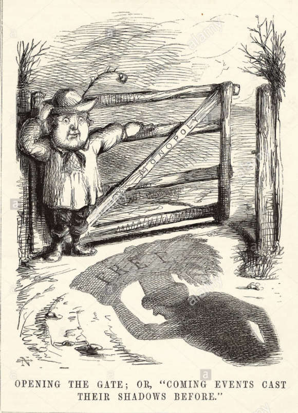
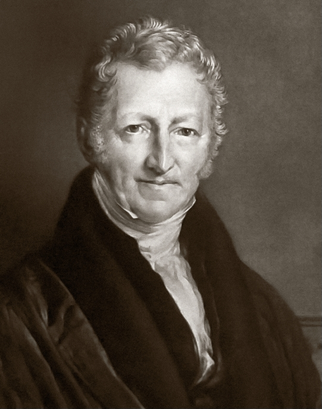
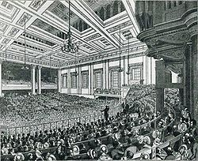
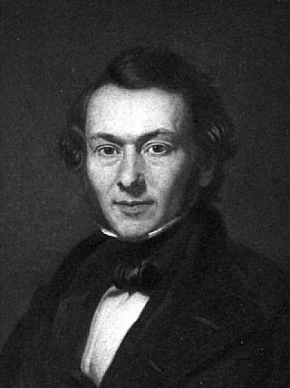
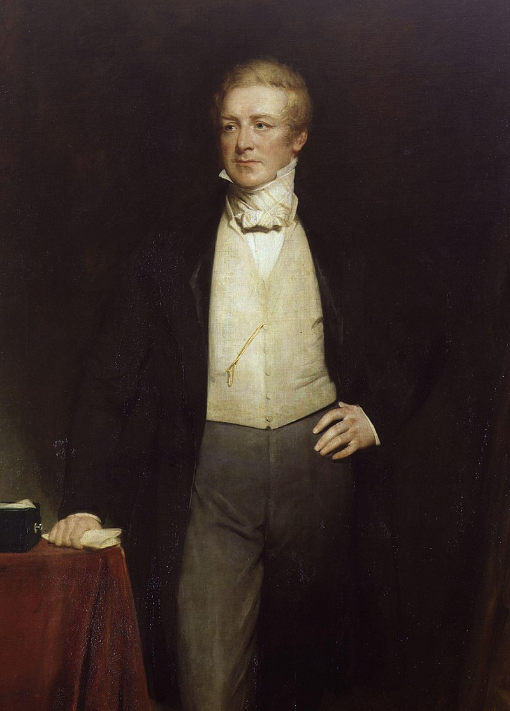

```{r setup, include=FALSE}
options(htmltools.dir.version = FALSE)
knitr::opts_chunk$set(echo=F,
                      message=F,
                      warning=F)
library(tidyverse)
set.seed(256)
update_geom_defaults("label", list(family = "Fira Sans Condensed"))
```

class: inverse

# Outline

## [The Corn Laws](#18)

## [The Ricardian System](#31)

## [Ricardian Rent Theory](#37)

---

# David Ricardo

.left-column[
.center[


David Ricardo

1772-1823
]
]
.right-column[
.smallest[
- Family of Portuguese Jewish refugees emigrated to England
  - David elopes with a Quaker woman, converts to Unitarianism, gets disowned by his family

- A stockbroker, became independently wealthy and retired
  - careful investment earned him a large fortune (approx £1m)
  - became quite a large landowner himself (compare to his views on landlords!)

- Became a Member of Parliament for last 4 years of his life (died suddenly in his 50s)

]
]

---

# David Ricardo

.left-column[
.center[


David Ricardo

1772-1823
]
]
.right-column[
.smallest[
- First writes pamphlets in response to British political crises
  - *The High Price of Bullion, a Proof of the Depreciation of Bank Notes* (1810)
  - *Essay on the Influence of a Low Price of Corn on the Profits of Stock* (1815)

- Then writes his master treatise
  - *On the Principles of Political Economy and Taxation* (1817)

- A flurry of letters between him and Malthus (1810-1823)
  - We now have as voluminous *The works and correspondence of David Ricardo* thanks to tremendous efforts of Piero Sraffa

]
]

---

# David Ricardo

.left-column[
.center[


David Ricardo

1772-1823
]
]
.right-column[

- Smith is extremely quotable, Ricardo is not

- Ricardo was a businessman, did not have university education

- Yet ironically, he wrote very abstractly and theoretically

- So we will primarily understand him via his theoretical system

]

---

class: inverse, center, middle

# The Corn Laws

---

# The Corn Laws

.pull-left[

.smallest[
- Britain, long an exporter of corn, with population growth was no longer self-sufficient, became a net *importer* of corn after 1790
  - “Corn” = grains, wheat, barley, corn, etc.
  
- Corn prices (and land rents) rising rapidly
]

.quitesmall[
| Period | Price per quarter ton |
|--------|-------|
| 1770-1779 | 45 shillings |
| 1780-1789 | 45 shillings |
| 1790-1799 | 55 shillings |
| 1800-1809 | 82 shillings |
| 1810-1813 | 106 shillings |

]
]

.pull-right[
.center[


]
]

---

# The Corn Laws

.pull-left[

- Britain at war with France in Napoleonic Wars (1803-1815)

- Further disrupting imports of corn into Britain (and further raising corn prices)
  - and artificially protecting British corn producers from cheaper foreign competition

]

.pull-right[
.center[


]
]

---

# The Corn Laws

.pull-left[

- Landlords, fearing the end of the war, petitioned Parliament to get legal protection from cheaper, imported Corn

- .hi[The Corn Laws]: a series of tariffs and price floors by Parliament
  - 1791: Floor at 50 shillings
  - 1803: Floor at 63 shillings
]

.pull-right[
.center[



]
]

---

# The Corn Laws

.pull-left[
.smaller[
- In 1813 nearing the end of the war, proposal to keep high price floor of 80 schillings per quarter ton

- Becomes the major political issue of the day, riots in London

- David Ricardo, Robert Torrens, Thomas Malthus, and Edward West enter the debate
  - Malthus thinks the laws are good...

- Parliament collects facts and issues an 1814 report
]
]

.pull-right[
.center[


]
]

---

# The Corn Laws

.pull-left[

- Landlords argues high tariffs will keep grain prices low
  - Encourages greater investment in British agriculture, increasing supply which would lower prices

- Also argue that it corn prices allowed to fall, land would no longer be cultivated, leading to a greater shortage of corn than ever
]

.pull-right[
.center[


]
]

---

# The Corn Laws

.pull-left[
.smallest[
- If Ricardo and his allies could show:
  1. increased investment in agriculture had *diminishing returns*, and 
  2. price of corn was partially determined by quantity of labor used in production

- Then they could show that high price of corn was caused by extension of cultivation and increase of labor needed to produce more marginal land
  - Inefficient use of labor, better for England to import corn from abroad!
]
]

.pull-right[
.center[


]
]

---

# Opposition to the Corn Laws

.pull-left[
- Ricardo, Malthus, West, and Torrens all formulated a concept of .hi-purple[diminishing returns] in agriculture, and a theory of differential rent

- Reductio ad absurdum: if diminishing returns were not true, could grow the entire world’s food supply in a flowerpot!
]

.pull-right[
.center[

]
]
---

# Opposition to the Corn Laws

- Edward West’s pamphlet

- Note .hi-purple[diminishing returns] and the .hi-purple[distinction between average and marginal returns]:

> “each equal additional quantity of work bestowed on agriculture, yields an actually diminished return, and of course if each equal additional quantity of work yields an actually diminished return, the whole of the work bestowed on agriculture in the progress of improvement, yields an actually diminished proportionate return.”

.source[West, Edward, 1815, *Essay on the Application of Capital to Land, with Observations Shewing the Impolicy of Any Great Restriction of the Importation of Corn*]

---

# Opposition to the Corn Laws

.left-column[
.center[


David Ricardo

1772-1823
]
]

.right-column[
.smallest[
- Extend Adam Smith’s primitive idea of labor as measuring the price (beaver & deer example)
]

.quitesmall[
> “The exchangeable value of all commodities, rises as the difficulties of their pro- duction increase. If then new difficulties occur in the production of corn, from more labour being necessary, whilst no more labour is required to produce gold, silver, cloth, linen, etc. the exchangeable value of corn will necessarily rise, as compared with those things. On the contrary, facilities in the production of corn, or of any other commodity of whatever kind, which shall afford the same produce with less labour, will lower its exchangeable value.”

]
.smallest[
- Continuing to extend cultivation will *lower* value due to diminishing returns!
  - Prohibiting importations is like prohibiting superior land at home!
]

.source[Ricardo, David, 1815, *Essay on the Influence of a Low Price of Corn on the Profits of Stock*]

]

---

# Apology for The Corn Laws 

.left-column[
.center[


Thomas Robert Malthus

1766-1834
]
]
.right-column[

- Malthus writes a pamphlet defending the Corn laws

- In process, writes a pamphlet *Inquiry into the Nature and Progress of Rent* (1815)

- Argues that rent is due to three causes:
  1. Land produces a surplus over the expenses of cultivation
  2. This surplus always creates new demand (and boosts population)
  3. The most fertile land is scarce

- Rent is a useful social institution
]

---

# Ricardo vs. Malthus: Round 1

.left-column[
.center[


David Ricardo

1772-1823
]
]

.right-column[
.smallest[

- Ricardo strongly disagrees with Malthus

- Only Malthus’ reason #3 makes any sense, rent is only paid because of the “[fickleness] of nature in providing fertile land”, and rent is only profits transferred away from capitalists to landlords
]

.quitesmall[
> “If all land had the same properties, if it were unlimited in quantity, and uniform in quality, no charge could be made for its use, unless where it possessed peculiar advantages of situation...It is only, then, because land is not unlimited in quantity and uniform in quality...that rent is ever paid for the use of it.”

]

.source[Ricardo, David, 1815, *Essay on the Influence of a Low Price of Corn on the Profits of Stock*]

]


---

# Ricardo vs. Malthus: Round 1

.left-column[
.center[


David Ricardo

1772-1823
]
]

.right-column[

- Ricardo believes landlords are in fact always *opposed* to the interests of society

.quitesmall[
> “If the interests of the landlord be of sufficient consequence, to determine us not to avail ourselves of all the benefits which would follow from importing corn at a cheap price, they should also influence us in rejecting all improvements in agriculture, and in the implements of husbandry; for it is as certain that corn is rendered cheap, rents are lowered, and the ability of the landlord to pay taxes, is for a time, at least, as much impaired by such improvements, as by the importation of corn. To be consistent then, let us by the same act arrest improvement, and prohibit importation.”

]

- 👆 last sentence is satire!

.source[Ricardo, David, 1815, *Essay on the Influence of a Low Price of Corn on the Profits of Stock*]

]

---

# Ricardian Comparative Advantage

.left-column[
.center[


David Ricardo

1772-1823
]
]

.right-column[

.smallest[

> “To produce the wine in Portugal, might require only the labour of 80 men for one year, and to produce the cloth in the
same country, might require the labour of 90 men for the same time. It would therefore be advantageous for her to export wine in exchange for cloth. This exchange might even take place, notwithstanding that the commodity imported by Portugal could be produced there with less labour than in England. Though she could make the cloth with the labour of 90 men, she would import it from a country where it required the labour of 100 men to produce it, because it would be advantageous to her rather to employ her capital in the production of wine, for which she would obtain more cloth from England, than she could produce by diverting a portion of her capital from the cultivation of vines to the manufacture of cloth.”
]
]

.source[Ricardo, David, 1817, [*Principles of Political Economy and Taxation*](https://www.econlib.org/library/Ricardo/ricP.html?chapter_num=7#book-reader)]

---

# Ricardian Comparative Advantage

.left-column[
.center[


David Ricardo

1772-1823
]
]

.right-column[

.center[
Maximum Possible Production
]

|    | Wine | Cloth |
|----|-----:|--------:|
| .blue[England] | 5 | 10 |
| .red[Portugal] | 4 | 2 |

.center[
Opportunity Costs
]

|    | 1 Wine | 1 Cloth |
|----|-----:|--------:|
| .blue[England] | 2c | .b[0.5w] |
| .red[Portugal] | .b[0.5c] | 2w |

]

---

# Ricardian Comparative Advantage

.left-column[
.center[


David Ricardo

1772-1823
]
]

.right-column[
.smallest[
- Even in the presence of .hi[absolute advantage] (one country is more efficient at producing *all* goods), still better for them to specialize
  - A high opportunity cost of producing everything

- Pay others to perform a task, or purchase a good, and specialize in producing goods where you have the .hi-purple[lowest opportunity cost]

- This is the principle of .hi[comparative advantage]

- Ricardo called this the principle of “comparative cost”; Torrens calls it “comparative advantage” (and to be fair, Torrens wrote about it first)
  - in favor of free trade (import cheaper corn!)
  - preventing imports is like preventing superior production at home!
]
]

---

# The Corn Laws

.pull-left[
.smallest[
- Another claim that high prices were caused by high rents
  - Ricardo disgreed: believed rent was price-determined, not price-determining

- Ricardo concerned about how high tariffs would affect economic distribution in society: clearly favors landlords at others’ expense
  - Smith wasn’t clear enough on this

- Clear how the Corn Laws controversy forced Ricardo to think about these issues and build his own theory...
]
]
.pull-right[
.center[


]
]

---

# The Corn Laws Controversy...After Ricardo

.pull-left[
.smaller[
- Corn Laws remained a huge political issue in England in 1830s-1840s

- Industralization, rising population, but rising price of bread

- Great Famine in Ireland 1845-1849

- Radical liberals Richard Cobden & John Bright create the *Anti-Corn Law League* 1838
  - large rallies, major riots in London
  - Classical economists wrote vehemently against Corn Laws

]
]

.pull-right[
.center[
A Meeting of the Anti-Corn Law League



]
]

---

# The Corn Laws Controversy...After Ricardo

.left-column[
.center[


Richard Cobden

1804-1865

]

]

.right-column[

.smallest[
> "[Repealing the Corn laws would solve four problems.] First, it would guarantee the prosperity of the manufacturer by affording him outlets for his products. Second, it would relieve the Condition of England question by cheapening the price of food and ensuring more regular employment. Third, it would make English agriculture more efficient by stimulating demand for its products in urban and industrial areas. Fourth, it would introduce through mutually advantageous international trade a new era of international fellowship and peace. The only barrier to these four beneficent solutions was the ignorant self-interest of the landlords, the "bread-taxing oligarchy, unprincipled, unfeeling, rapacious and plundering."

]
]

---

# The Corn Laws Controversy...After Ricardo

.left-column[
.center[


Robert Peel

1788-1850

]

]

.right-column[

- Tory Robert Peel becomes P.M. 1841-1846

- Repeals the Corn Laws in 1846
  - ruins his political career
  - splits the Tory Party into the Whigs; radicals leave and become the Liberal Party

- Price of corn plummets
  - working classes can now afford food, more shift from farms to factories
  - last vestiges of feudal privileges eroding
]

---

# The Corn Laws Controversy...After Ricardo

.left-column[
.center[


]

]

.right-column[

- Tory Robert Peel becomes P.M. 1841-1846

- Repeals the Corn Laws in 1846
  - ruins his political career
  - splits the Tory Party into the Whigs; radicals leave and become the Liberal Party

- Price of corn plummets
  - working classes can now afford food, more shift from farms to factories
  - last vestiges of feudal privileges eroding
]


---

class: inverse, center, middle

# The Ricardian System

---

# Ricardo on the Scope of Economics

.left-column[
.center[


David Ricardo

1772-1823
]
]

.right-column[

- Focus is on the .hi-purple[long-run] & on the .hi-purple[income distribution] across economic groups (land, labor, capital)

> “To determine the laws which regulate this distribution [of income], is the principal problem in Political Economy: much as the science has been improved by the writings of Turgot, Stuart, Smith, Say, Sismondi, and others, they afford very little satisfactory information respecting the natural course of rent, profit, and wages.”

.source[Ricardo, David, 1817, *On the Principles of Political Economy and Taxation*]
]


---

# The Ricardian Vice

.left-column[
.center[


David Ricardo

1772-1823
]
]

.right-column[

- Ricardo wrote very abstractly, making heroic assumptions, to construct a theoretical model isolated from complex reality, from which he could deduce policy implications
  - deductive reasoning but not mathematical (no equations, all verbal!)

- .hi-purple[“The Ricardian vice”]: economists’ predilections towards abstract theory above all else

- Very different from Smith (and later, Mill and Marshall)

.source[Ricardo, David, 1817, *On the Principles of Political Economy and Taxation*]
]

---

# Fundamentals of the Ricardian System

.left-column[
.center[


David Ricardo

1772-1823
]
]

.right-column[

- .hi-purple[Diminishing returns]: holding all other factors of production costant, increasing intensive use of one factor will increase output at a decreasing rate
  - focused primarily on diminishing returns to *agriculture*
  - seem to have assumed *increasing returns* to *manufacturing* (less clear on this, but a good Smithean argument: extending the market, extending division of labor, increasing productivity)

]

---

# Diminishing Returns

.pull-left[
- Applying Ricardian logic *beyond* agriculture, we arrive at the modern .hi-purple[law of diminishing returns]
  - .hi-purple[“Law of variable proportions” or “variation of returns”]

- For any one variable factor (holding all others constant), increasing use will eventually yield a diminishing marginal product
  - use labor as example


]

.pull-right[
```{r}
prod_2=function(x){-0.5*x^3+6*x^2-x}

total<-ggplot(data.frame(x=c(0,10)), aes(x=x))+
  stat_function(fun=prod_2, geom="line", size=2, color="red")+
  geom_label(aes(x=9.5,y=prod_2(9.5)), color = "red", label="Total Product", size = 5)+
  geom_vline(xintercept=6, size=1.5, linetype="dashed")+
  geom_segment(x=4, xend=4, y=0, yend=prod_2(4), size=1, linetype="dotted")+
  geom_label(x=4.5,y=50, label="Stage I")+
  geom_vline(xintercept=8, size=1.5, linetype="dashed")+
  geom_label(x=7,y=50, label="Stage II")+
  geom_label(x=9,y=50, label="Stage III")+
    scale_x_continuous(breaks=seq(0,10,1),
                     limits=c(0,10),
                     expand=expand_scale(mult=c(0,0.1)))+
  scale_y_continuous(breaks=seq(0,120,20),
                     limits=c(0,120),
                     expand=expand_scale(mult=c(0,0.1)))+
  scale_colour_manual("I.C. equations", values = colors)+
  guides(color = F)+
  labs(x = "Input, Labor (l)",
       y = "Output (q)",
       title = "Total Output")+
  theme_classic(base_family = "Fira Sans Condensed", base_size=20)

mp=function(x){-1.5*x^2+12*x-1}
ap=function(x){-0.5*x^2+6*x-1}

marginal<-ggplot(data.frame(x=c(0,10)), aes(x=x))+
  stat_function(fun=mp, geom="line", size=2, color="blue")+
  geom_label(aes(x=7.5,y=mp(7.5)), color = "blue", label=expression(MP[l]), size = 5)+
  stat_function(fun=ap, geom="line", size=2, color="purple")+
  geom_label(aes(x=9.5,y=ap(9.5)), color = "purple", label=expression(AP[l]), size = 5)+
  geom_vline(xintercept=6, size=1.5, linetype="dashed")+
  geom_segment(x=4, xend=4, y=0, yend=mp(4), size=1, linetype="dotted")+
  geom_label(x=4.5,y=8, label="Stage I")+
  geom_vline(xintercept=8, size=1.5, linetype="dashed")+
  geom_label(x=7,y=8, label="Stage II")+
  geom_label(x=9,y=8, label="Stage III")+
    scale_x_continuous(breaks=seq(0,10,1),
                     limits=c(0,10),
                     expand=expand_scale(mult=c(0,0.1)))+
  scale_y_continuous(breaks=seq(0,24,4),
                     limits=c(0,24),
                     expand=expand_scale(mult=c(0,0.1)))+
  scale_colour_manual("I.C. equations", values = colors)+
  guides(color = F)+
  labs(x = "Input, Labor (l)",
       y = "Output per Worker (q/l)",
       title = "Output per Input")+
  theme_classic(base_family = "Fira Sans Condensed", base_size=20)

library(patchwork)
total/marginal
```

]

---

# Diminishing Returns

.pull-left[
.smallest[
- .hi[Marginal product of labor `\\((MP_l)\\)`]: additional output produced by adding one more unit of labor (holding $k$ constant)
$$MP_l = \frac{\Delta q}{\Delta l}$$
  - $MP_l$ is slope of $TP$ at each value of $l$

- .hi[Average product of labor `\\((AP_l)\\)`]: additional output produced by adding one more unit of labor (holding $k$ constant)
$$AP_l = \frac{q}{l}$$
  - $AP_l$ is slope of a ray from the origin to the production function at any quantity of $l$
]

]

.pull-right[
```{r}
total/marginal
```

]

---

# Fundamentals of the Ricardian System

.left-column[
.center[


David Ricardo

1772-1823
]
]

.right-column[
- .hi-purple[Labor theory of value]: a good enough approximation for most purposes
  - Tried to extend Smith’s beaver-deer example
  - Recognized a pure labor theory of value has problems (Smith’s different levels of “ingenuity” and “disagreeableness”)
  - Stigler: Ricardo had a 93 $\frac{1}{2}$% labor theory of value
]


---

# Fundamentals of the Ricardian System

.left-column[
.center[


David Ricardo

1772-1823
]
]

.right-column[
- Ricardo clearly recognized this does not work for:
  - goods with fixed supply (Rembrandt paintings, etc.)
  - paper money
  - monopolized products
  - international trade (if capital and labor are immobile across countries)
]


---

class: inverse, center, middle

# Ricardian Rent Theory

---

# Ricardian Production Theory

.left-column[
.center[


David Ricardo

1772-1823
]
]

.right-column[

- .hi[“Ricardian Corn model”]: models the economy as if it were a single firm, producing corn as the output

- Assumptions:
  - Labor cost theory of value
  - Money is neutral
  - Diminishing returns in agriculture
  - Constant or increasing returns in manufacturing
  - 
  - Fixed coefficients in production
]

---

# Ricardian Production Theory

.pull-left[
.smallest[
- Assumption of fixed coefficients in production

$$q=\min(l,k)$$
  - a Leontief production function
  - i.e. perfect complements

- Labor and capital must be combined in a fixed proportion, a constant $\frac{L}{K}$ ratio

- Ex: 1 worker and 1 shovel can produce 1 bushel of corn

- Ricardo will talk about adding constant .hi-turquoise[“doses” of labor & capital] (combined)
]
]

.pull-right[

```{r}
library("plotly")
x_vec = seq(0,5,1)
y_vec = seq(0,5,1)
x_matrix = matrix(c(x_vec), nrow = 6, ncol = 1)
y_matrix = matrix(c(y_vec), nrow = 1, ncol = 6)


z_matrix = rbind(
      c(0, 0, 0, 0, 0, 0),
      c(0, 1, 1, 1, 1, 1),
      c(0, 1, 2, 2, 2, 2),
      c(0, 1, 2, 3, 3, 3),
      c(0, 1, 2, 3, 4, 4)
)
plot_ly(x = x_vec,
           y = y_vec,
           z = z_matrix) %>%
  add_surface(
  contours = list(
    z = list(
      show=TRUE,
      usecolormap=TRUE,
      highlightcolor="#ff0000",
      project=list(z=TRUE)
      )
    )
  ) %>%
  layout(scene = list(xaxis = list(title="L",
                                   dtick = 1),
                      yaxis = list(title="K",
                                   dtick = 1),
                      zaxis = list(title="Output",
                                   dtick = 1),
                      legend = list(title = "Output"))
  )
```

]

---

# Ricardian Production Theory

.pull-left[

- .hi-purple[Intensive Margin]: adding an additional dose of labor & capital to an existing site
  - experiences diminishing returns to doses of L+K

- .hi-purple[Extensive Margin]: bringing new sites of land into cultivation
  - diminishing returns to land, start at superior site, extend into inferior sites

]

.pull-right[
```{r}
library(kableExtra)
tot<-tribble(
  ~"", ~"K+L Dose", ~"Plot A", ~"Plot B", ~"Plot C",
  "Intensive Margin 👇", "1", "120", "110", "100",
  "Intensive Margin 👇", "2", "230", "210", "",
  "Intensive Margin 👇", "3", "330", "", "",
)


# row.names(df)<-c("Cooperate", "Defect")

kable(tot, caption = "Total Product of Land", format="html") %>%
  kable_styling(full_width=F, font_size = 12) %>%
  add_header_above(c(" " = 2, "Extensive Margin 👉" = 3)) %>%
  column_spec(c(1), bold=T) %>%
  collapse_rows(columns = 1, latex_hline = "major", valign = "middle") 
```

```{r}
mar<-tribble(
  ~"", ~"K+L Dose", ~"Plot A", ~"Plot B", ~"Plot C",
  "Intensive Margin 👇", "1", "120", "110", "100",
  "Intensive Margin 👇", "2", "110", "100", "",
  "Intensive Margin 👇", "3", "100", "", "",
)


# row.names(df)<-c("Cooperate", "Defect")

kable(mar, caption = "Marginal Product of Land", format="html") %>%
  kable_styling(full_width=F, font_size = 12) %>%
  add_header_above(c(" " = 2, "Extensive Margin 👉" = 3)) %>%
  column_spec(c(1), bold=T) %>%
  collapse_rows(columns = 1, latex_hline = "major", valign = "middle") 
```

]

---

# Ricardian Production Theory

.left-column[
.center[


David Ricardo

1772-1823
]
]

.right-column[

- “Rent” to landowner in everyday language is not precise!
  - Contains both elements of “profits” and “rents” (payment for land improvements)

> “If, then, good land existed in quantity much more abundant than the production of food for an increasing population required, or if capital could be indefinitely employed without a diminished return on the old land, there could be no rise of rent; for rent invariably proceeds from the employment of an additional quantity of labour with a proportionally less return.”

.source[Ricardo, David, 1817, *On the Principles of Political Economy and Taxation*]
]

---

# Ricardian Production Theory

.pull-left[

- Example adapted from Blaug (1996)

- Suppose the price of corn is $1 per bushel
  - so marginal physical product = marginal value product (just add a $ in front)

- Price of one homogenous unit of K+L (“man-with-shovel”) is $100

- Assume each farmer (A, B, C) will apply a K+L dose so long as $MR>MC$

]

.pull-right[
```{r}
kable(tot, caption = "Total Product of Land", format="html") %>%
  kable_styling(full_width=F, font_size = 12) %>%
  add_header_above(c(" " = 2, "Extensive Margin 👉" = 3)) %>%
  column_spec(c(1), bold=T) %>%
  collapse_rows(columns = 1, latex_hline = "major", valign = "middle") 
```

```{r}
kable(mar, caption = "Marginal Product of Land", format="html") %>%
  kable_styling(full_width=F, font_size = 12) %>%
  add_header_above(c(" " = 2, "Extensive Margin 👉" = 3)) %>%
  column_spec(c(1), bold=T) %>%
  collapse_rows(columns = 1, latex_hline = "major", valign = "middle") 
```

]

---

# Ricardian Production Theory

.pull-left[
.smallest[
- Farmer on C will apply only 1 K+L dose ($100) to produce $100 of output

- Competition will equalize marginal (value) product of K+L at all plots of land
  - Plot C is the extensive margin (where $MR=MC)$
  - If it pays to apply K+L to C, it should also pay to apply them more intensively to A and B
  - Continues until extensive margin equalizes with intensive margin
    - Last increment of K+L on superior land $MR=MC$
]
]

.pull-right[
```{r}
kable(tot, caption = "Total Product of Land", format="html") %>%
  kable_styling(full_width=F, font_size = 12) %>%
  add_header_above(c(" " = 2, "Extensive Margin 👉" = 3)) %>%
  column_spec(c(1), bold=T) %>%
  collapse_rows(columns = 1, latex_hline = "major", valign = "middle") 
```

```{r}
kable(mar, caption = "Marginal Product of Land", format="html") %>%
  kable_styling(full_width=F, font_size = 12) %>%
  add_header_above(c(" " = 2, "Extensive Margin 👉" = 3)) %>%
  column_spec(c(1), bold=T) %>%
  collapse_rows(columns = 1, latex_hline = "major", valign = "middle") 
```

]

---

# Ricardian Production Theory

.pull-left[
.smallest[
- C will produce $100 using 1 K+L (costs $100); profit $0
- B will produce $210 using 2 K+L (costs $200); profit $10
- A will produce $330 using 3 K+L (costs $300); profit $30

- .hi[Rent]: payment to landlord that equalizes profits on land of different fertilities

- Competitive markets $\implies$ profits to A, B, C will eventually equalize
  - Farmers working B or C willing to pay landlord owning A to use A instead!

- Rent to A: $30
- Rent to B: $10
- Rent to C: $0
]

]

.pull-right[
```{r}
kable(tot, caption = "Total Product of Land", format="html") %>%
  kable_styling(full_width=F, font_size = 12) %>%
  add_header_above(c(" " = 2, "Extensive Margin 👉" = 3)) %>%
  column_spec(c(1), bold=T) %>%
  collapse_rows(columns = 1, latex_hline = "major", valign = "middle") 
```

```{r}
kable(mar, caption = "Marginal Product of Land", format="html") %>%
  kable_styling(full_width=F, font_size = 12) %>%
  add_header_above(c(" " = 2, "Extensive Margin 👉" = 3)) %>%
  column_spec(c(1), bold=T) %>%
  collapse_rows(columns = 1, latex_hline = "major", valign = "middle") 
```

]
---


# Ricardian Rents

.pull-left[

- .hi-purple[Rent comes from differential productivities of land]

- .hi-purple[Rent] to equalize the profits of plots A, B, and C
  - C: $0 
  - B: $10
  - A: $30

- Rent on any plot = differences between marginal product of dose of L&K at intensive margin and the marginal product of earlier, inframarginal doses

]
.pull-right[

```{r}
ggplot(data = tibble(x = c("Plot A", "Plot B", "Plot C"),
                     y = c(330, 210, 100)))+
  aes(x = as.factor(x),
      y = y)+
  geom_col(aes(fill = x), alpha = 0.75)+
  
  geom_rect(xmin= 0.55, xmax=1.45, ymin=300, ymax=330, fill = "gray", alpha = 0.5)+
  geom_label(x = 1, y = 315, label = "Rent = $30", color = "gray")+
  geom_segment(x = 0, xend = 1.45, y = 330, yend = 330, linetype = "dashed")+
  geom_segment(x = 0, xend = 1.45, y = 300, yend = 300, linetype = "dashed")+
  
  geom_rect(xmin= 1.55, xmax=2.45, ymin=200, ymax=210, fill = "gray", alpha = 0.5)+
  geom_segment(x = 0, xend = 2.45, y = 210, yend = 210, linetype = "dashed")+
  geom_segment(x = 0, xend = 2.45, y = 200, yend = 200, linetype = "dashed")+
  geom_label(x = 2, y = 220, label = "Rent = $10", color = "gray")+
  
  geom_segment(x = 0, xend = 3.45, y = 100, yend = 100, linetype = "dashed")+
  geom_label(x = 3, y = 110, label = "Rent = $0", color = "gray")+

  labs(x = "Extensive Margin of Land",
       y = "Total Output")+
  scale_y_continuous(breaks = c(0,100,200,210,300,330),
                     labels = scales::dollar)+
  ggthemes::theme_pander()+
  scale_colour_viridis_d()+
  theme(legend.position = "none")
```

]

---

# Ricardian Rent Theory

.left-column[
.center[


David Ricardo

1772-1823
]
]

.right-column[

- In Ricardian theory, the .hi-purple[fixed factor of production] (land) earns all inframarginal residuals, i.e. gets paid rent
  - variable factors are paid their marginal products 

- Ricardo assumed .hi-purple[land is fixed, and has no opportunity cost]
  - Assumes “land” in general, rather than modern assumption: *land for specific uses* (which would have opportunity costs)!
  - That is why the extensive margin of land earns *no rent* (has no alternative use)

.source[Ricardo, David, 1815, *Essay on the Influence of a Low Price of Corn on the Profits of Stock*]

]

---

# Ricardian Rent Theory

.left-column[
.center[


David Ricardo

1772-1823
]
]

.right-column[

.smallest[
- When people use the term “rent” in ordinary language, they mean “contract rent” (what you pay your landlord)
  - this constitutes multiple things: profit, payment for their improvements to land, and pure (Ricardian) rents

- .hi-purple[Ricardian rents] or .hi-purple[Scarcity rents]: Ricardo’s careful definition of rent “the use of the original and indestructible powers of the soil”
  - i.e. permission for using something that already exists (and the landlord did not create)!
  - only exists because of a fixed supply (of land)

- Can apply .hi-purple[Ricardian Rents] to *anything* in scarce supply:
  - talent, intellectual property, monopoly!
]

.source[Ricardo, David, 1815, *Essay on the Influence of a Low Price of Corn on the Profits of Stock*]

]

---

# Ricardian Rent Theory

.left-column[
.center[


David Ricardo

1772-1823
]
]

.right-column[

- Because land is fixed in supply, .hi-purple[rent is price-determined, not price-determining]!
  - Rents change to equalize all profits
  - “Rent does not enter into price”

> “Corn is not high because a rent is paid, but a rent is paid because corn is high.”

.source[Ricardo, David, 1817, *On the Principles of Political Economy and Taxation*]

]

---

# Ricardian Rent Theory and Tax Incidence

.left-column[
.center[


David Ricardo

1772-1823
]
]

.right-column[

- It would make no difference if landlords were thrown to the wolves
  - Expropriation of rents by the State would have no impact on production!
  - Georgism: A tax on land rent (Henry George)

]