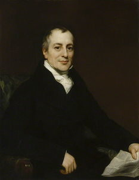
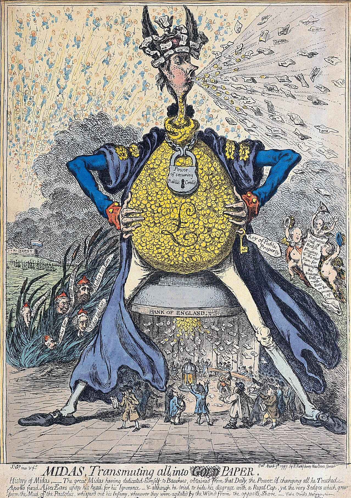
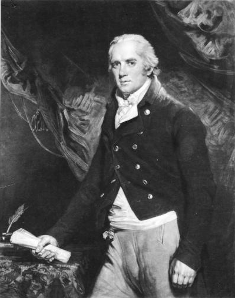
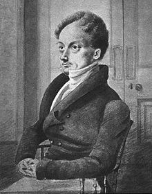
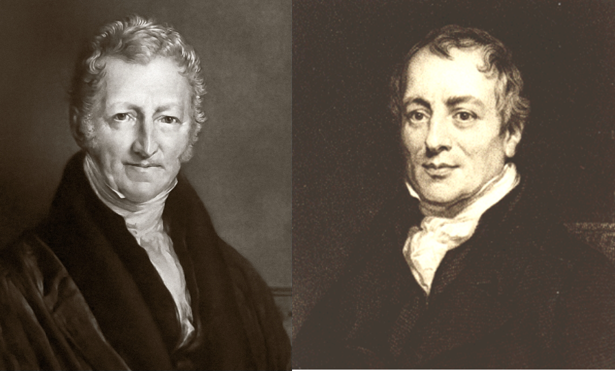

```{r setup, include=FALSE}
options(htmltools.dir.version = FALSE)
knitr::opts_chunk$set(echo=F,
                      message=F,
                      warning=F)
library(tidyverse)
library(ggrepel)
library(ggthemes)
set.seed(256)
update_geom_defaults("label", list(family = "Fira Sans Condensed"))
```

class: inverse

# Outline

## [The Corn Laws](#18)

## [The Ricardian System](#31)

## [Ricardian Rent Theory](#37)

---

# Recap & Influence of Ricardian Rent Theory

.left-column[
.center[


David Ricardo

1772-1823
]
]
.right-column[
.smallest[
- Ricardo hit on a fundamental principle in economics with his rent theory

- If he had applied it *beyond* land to *all factors*, and considered land as having an opportunity cost, we would essentially arrive at our modern .hi[marginal productivity theory] of production and distribution

- rent is the excess of the product over the marginal farmer paying costs to labor and capital
  - price is determined by marginal costs, but the marginal costs of the inframarginal farmer (A and B) exceed his average cost, and this excess goes to the landowner as rent

- Rent comes from scarcity of some fixed factor, and differential productivities

]
]

---

# Recap & Influence of Ricardian Rent Theory

.left-column[
.center[


David Ricardo

1772-1823
]
]
.right-column[
.smallest[
- Classicals treated land as a "free gift of Nature"
  - but of course, in reality, must be improved and maintained for production, 

- As homogenous land, it being fixed or scarce, creates scarcity rent: the difference between the product of all capital and labor and the product of the final dose at the intensive margin
  - If (in real life) land differs in quality, scarcity of acres of *high* quality gives rise to differential rents

- In reality, land does have a supply price that can create new land (reclaim from ocean, Netherlands, New York, etc)
  - are paying cost of using land and taking it out of alternative uses (grazing, parking lot, etc)
]
]

---


# Recap & Influence of Ricardian Rent Theory

.left-column[
.center[


David Ricardo

1772-1823
]
]
.right-column[
.smallest[

- From the perspective of *society*, rent is price-determined; it equalizes returns across different uses of the scarce factor (land for Ricardo)
  - implies it could be taxed away without affecting supply

- From the perspective of *a single firm*, rent is price-determining (it is a cost to the firm)
  - firm will pay 


- Cost of any input cannot be less than what input can earn in the most remunerative alternative use (opportunity cost!)
    - any earnings of input in excess of its opportunity cost = rent
    - from POV of firm, rent is a (price-determining) cost; from POV os society, they are price-determined; can be taxed away without affecting the supply of the agent

- If supply of a factor is fixed and services specific to one use, it *has no opportunity cost* and the whole of its reward is rent!
    - but no agent is ever completely nonreproducible or has no substitutes or alternative use

- In short-run, fixed capital earns quasi-rents, not interest: supply is fixed; but in long run, can change capital, so quasi-rents always eroded

]
]

---

class: inverse, center, middle

# Ricardian Distribution Theory

---

# Wages

.left-column[
.center[


David Ricardo

1772-1823
]
]

.right-column[

- Ricardo’s main concern is describing laws of distribution of national income in the long run

- Three factors of production (and their owners):
  - Labor
  - Capital
  - Land

.source[Ricardo, David, 1815, *Essay on the Influence of a Low Price of Corn on the Profits of Stock*]

]

---

# Wages

.left-column[
.center[


David Ricardo

1772-1823
]
]

.right-column[

- Extends the .hi-purple[Wages fund doctrine] from Smith plus .hi-purple[Malthusian population principle] to explain the *real* wage of labor:

$$\text{real wage} = \frac{\text{wages fund}}{\text{labor force}}$$

- If wages fund increases (from capital accumulation), real wages rise in short run
  - but in long run, this will raise population, and hence, labor force, and lower real wages

.source[Ricardo, David, 1815, *Essay on the Influence of a Low Price of Corn on the Profits of Stock*]

]

---

# Wages

.left-column[
.center[


David Ricardo

1772-1823
]
]

.right-column[

- Wages tend to subsistence level in the long run
  - a .hi-purple[“psychological subsistence”] level rather than a “physical” subsistence level (i.e. minimal caloric inake)
  - varies by culture and time, minimal “acceptable level” of well-being

- Like Smith, Ricardo showed that capital accumulation can increase wages, and hoped that accumulation would continue (faster than population growth)
  - and have workers experience higher quality of life, so the minimal “psychological subsistence” level can increase

.source[Ricardo, David, 1815, *Essay on the Influence of a Low Price of Corn on the Profits of Stock*]

]

---


# Wages

.left-column[
.center[


David Ricardo

1772-1823
]
]

.right-column[

> “The friends of humanity cannot but wish that in all countries the labouring classes should have a taste for comforts and enjoyments, and that they should be stimulated by all legal means in their exertions to procure them. There cannot be a better security against a superabundant population. In those countries, where the labouring classes have the fewest wants, and are contented with the cheapest food, the people are exposed to the greatest vicissitudes and miseries.”

.source[Ricardo, David, 1815, *Essay on the Influence of a Low Price of Corn on the Profits of Stock*]

]

---

# Profits

.left-column[
.center[


David Ricardo

1772-1823
]
]

.right-column[
.smallest[
- Using his labor theory of value, Ricardo essentially defines .hi-turquoise[capital as *indirect* labor], or .hi-turqoise[“stored-up labor time”]
  - i.e. using machines makes labor more productive (produce with less time)
  - machines were made by labor in a previous period

- A problem with interest (again, classicals confused profit and interest)
  - how would price of final good change if the machine used were made 1 year ago vs. 2 years ago? 

- Wages fund is paid to labor out of capital

- Profits were a residual value, leftover after wages and rents had been paid
]

.source[Ricardo, David, 1815, *Essay on the Influence of a Low Price of Corn on the Profits of Stock*]

]

---

# Rents

.left-column[
.center[


David Ricardo

1772-1823
]
]

.right-column[

- Landlords contribute nothing to production, are pure parasites
  - earn rents merely for *holding* a factor of production without providing anything socially useful

- Ricardo critical of landlords’s spending on consumption, luxuries, servants
  - viewed as keeping critical resources out of production (which would increase economic growth!)
  - compare Smith’s idea of *unproductive* labor!
]

.source[Ricardo, David, 1815, *Essay on the Influence of a Low Price of Corn on the Profits of Stock*]

]

---

# Functional Distribution of Income

.pull-left[

- Again, imagine the economy is one giant farm (firm) 🌾🌾

- Applying homogenous “doses” of K+L on land

- Assume demand for corn is perfectly inelastic (function of population only)

]

.pull-right[
```{r}
mp=function(x){10-x}
ap=function(x){10-0.5*x}

base<-ggplot(data = tibble(x = 1:10))+
  aes(x=x)+
  stat_function(fun = mp, geom = "line", size = 2, color = "blue")+
  geom_label(x = 8, y = mp(8), color = "blue", label = expression(MP[LK]))+
  #stat_function(fun = ap, geom = "line", size = 2, color = "orange")+
  # geom_label(x = 8, y = ap(8), color = "orange", label = expression(AP[LK]))+
  scale_x_continuous(breaks = c(0,5),
                     labels = c(0, "x"),
                     limits = c(0,15),
                     expand = c(0,0))+
  scale_y_continuous(breaks = c(0,2,5,10),
                     labels = c(0,"w","MP(x)", "MP(0)"),
                     limits = c(0,11),
                     expand = c(0,0))+
  labs(x = "Variable Input (Doses of K+L)",
       y = "Output (Bushels of Corn)")+
  theme_pander(base_family = "Fira Sans Condensed", base_size =16)
base
```
]

---

# Functional Distribution of Income

.pull-left[

- Again, imagine the economy is one giant farm (firm) 🌾🌾

- Applying homogenous “doses” of K+L on land

- Assume demand for corn is perfectly inelastic (function of population only)
  - as soon as we know population, output of corn determined

- Total product = sum of marginal products (area under MP curve)
]

.pull-right[
```{r}

base+
  geom_segment(x = 0, y = 5, xend = 5, yend = 5, size = 1, linetype = "dashed")+
  geom_segment(x = 5, y = 5, xend = 5, yend = 0, size = 1, linetype = "dashed")

```
]

---

# Functional Distribution of Income

.pull-left[
.smaller[
- Doses of K+L produce their marginal product along $MP_{LK}$ curve

- Will produce $q$ units of output (needed by population) with $x$ doses
  - $x$ is the intensive margin
  - in equilibrium, equal to extensive margin where rent = 0

]

]

.pull-right[
```{r}
base+
  geom_segment(x = 0, y = 5, xend = 5, yend = 5, size = 1, linetype = "dashed")+
  geom_segment(x = 5, y = 5, xend = 5, yend = 0, size = 1, linetype = "dashed")

```
]

---

# Functional Distribution of Income

.pull-left[
.smallest[

- Marginal product of $x^{th}$ dose, $MP_x$, then divided between capital and labor
  - The .red[“wages fund”], paid out of the earnings of capital, goes to workers
  - Subsistence wage (w) determined by Malthusian population principle
  - Remaining MP goes to capital owners as .green[profit]

- Surplus of marginal product of all inframarginal doses of L+K go to landowners as .blue[rent]
]

]

.pull-right[
```{r}
rent_tri<-tribble(
  ~x, ~y,
  0, 5,
  0, 10,
  5, 5
)

base+
  geom_rect(xmin = 0, ymin = 0, xmax = 5, ymax = 2, fill = "red", alpha = 0.3)+
  geom_label(x = 2.5, y = 1, color = "red", label = "Wages")+
  geom_rect(xmin = 0, ymin = 2, xmax = 5, ymax = 5, fill = "green", alpha = 0.3)+
  geom_label(x = 2.5, y = 3.5, color = "green", label = "Profit")+
  geom_polygon(data = rent_tri, aes(x = x , y =y), fill = "blue", alpha = 0.4)+
  geom_label(x = 2.5, y = 6.5, color = "blue", label = "Rent")+
  
  geom_segment(x = 0, y = 5, xend = 5, yend = 5, size = 1, linetype = "dashed")+
  geom_segment(x = 5, y = 5, xend = 5, yend = 0, size = 1, linetype = "dashed")+
  
  # wage fund
  geom_segment(x = 0, y = 2, xend = 15, yend = 2, size = 1, linetype = "dashed")+
  geom_label(x = 12, y = 2, label = "Subsistence Wage")

```
]

---
# Functional Distribution: Another (Modern) View

.pull-left[
.smaller[
- Another, modern view

- Total product = average product $\times$ quantity of doses (x)

- x doses of K+L produce AP(x) $\times$ x units of output
  - Total product is *entire* shaded rectangle

- Marginal product of final dose MP(x) earnings to capital, who pays wages out of wages fund

- Rent $=$ difference between average product and marginal product
]
]

.pull-right[
```{r}

base+
  stat_function(fun = ap, geom = "line", size = 2, color = "orange")+
  geom_label(x = 8, y = ap(8), color = "orange", label = expression(AP[LK]))+
  geom_rect(xmin = 0, ymin = 0, xmax = 5, ymax = 2, fill = "red", alpha = 0.2)+
  geom_label(x = 2.5, y = 1, color = "red", label = "Wages")+
  geom_rect(xmin = 0, ymin = 2, xmax = 5, ymax = 5, fill = "green", alpha = 0.2)+
  geom_label(x = 2.5, y = 3.5, color = "green", label = "Profit")+
  geom_rect(xmin = 0, ymin = 5, xmax = 5, ymax = ap(5), fill = "blue", alpha = 0.4)+
  geom_label(x = 2.5, y = 6.5, color = "blue", label = "Rent")+
  
  geom_segment(x = 0, y = ap(5), xend = 5, yend = ap(5), size = 1, linetype = "dashed")+
  geom_segment(x = 5, y = 5, xend = 5, yend = 0, size = 1, linetype = "dashed")+
  
  # wage fund
  geom_segment(x = 0, y = 2, xend = 15, yend = 2, size = 1, linetype = "dashed")+
  geom_label(x = 12, y = 2, label = "Subsistence Wage")
  scale_y_continuous(breaks = c(0,2,5,ap(5),10),
                     labels = c(0,"w", "MP(x)", "AP(x)", "MP(0)"),
                     limits = c(0,11),
                     expand = c(0,0))

```
]

---

# Effect of Changes

.pull-left[

- Ricardo’s main interest is focusing on changes in relative income shares between laborers, landowners, and capitalists over time

- Notice level of profits depends upon:
  1. marginal product of marginal (last) dose of K+L
  2. level of subsistence wages

]

.pull-right[
```{r}
rent_tri<-tribble(
  ~x, ~y,
  0, 5,
  0, 10,
  5, 5
)

base+
  geom_rect(xmin = 0, ymin = 0, xmax = 5, ymax = 2, fill = "red", alpha = 0.3)+
  geom_label(x = 2.5, y = 1, color = "red", label = "Wages")+
  geom_rect(xmin = 0, ymin = 2, xmax = 5, ymax = 5, fill = "green", alpha = 0.3)+
  geom_label(x = 2.5, y = 3.5, color = "green", label = "Profit")+
  geom_polygon(data = rent_tri, aes(x = x , y =y), fill = "blue", alpha = 0.4)+
  geom_label(x = 2.5, y = 6.5, color = "blue", label = "Rent")+
  
  geom_segment(x = 0, y = 5, xend = 5, yend = 5, size = 1, linetype = "dashed")+
  geom_segment(x = 5, y = 5, xend = 5, yend = 0, size = 1, linetype = "dashed")+
  
  # wage fund
  geom_segment(x = 0, y = 2, xend = 15, yend = 2, size = 1, linetype = "dashed")+
  geom_label(x = 12, y = 2, label = "Subsistence Wage")

```
]

---

# Effect of Changes: Increase in Subsistence Wages

.pull-left[

- Suppose (psychological) subsistence wages increase

- Capitalists are forced to increase the wages fund for same marginal product

- Increases share of income going to .red[wages] to workers

- Reduces .green[profits] to capitalists

- Does not affect .blue[rent] to landowners

]

.pull-right[
```{r}
base+
  geom_rect(xmin = 0, ymin = 0, xmax = 5, ymax = 3, fill = "red", alpha = 0.3)+
  geom_label(x = 2.5, y = 1, color = "red", label = "Wages")+
  geom_rect(xmin = 0, ymin = 3, xmax = 5, ymax = 5, fill = "green", alpha = 0.3)+
  geom_label(x = 2.5, y = 4, color = "green", label = "Profit")+
  geom_polygon(data = rent_tri, aes(x = x , y =y), fill = "blue", alpha = 0.4)+
  geom_label(x = 2.5, y = 6.5, color = "blue", label = "Rent")+
  
  geom_segment(x = 0, y = 5, xend = 5, yend = 5, size = 1, linetype = "dashed")+
  geom_segment(x = 5, y = 5, xend = 5, yend = 0, size = 1, linetype = "dashed")+
  
  # wage fund
  geom_segment(x = 0, y = 2, xend = 15, yend = 2, size = 1, linetype = "dashed")+
  geom_label(x = 12, y = 2, label = "Subsistence Wage")+
  
  # wage fund 2
  geom_segment(x = 0, y = 3, xend = 15, yend = 3, size = 1, linetype = "dotted")+
  geom_label(x = 12, y = 3, label = "New Subsistence Wage")+
  
  scale_y_continuous(breaks = c(0,2,3,5,10),
                     labels = c(0,expression(w[1]), expression(w[2]), "MP(x)", "MP(0)"),
                     limits = c(0,11),
                     expand = c(0,0))

```
]

---

# Effect of Changes: Long Run Trends

.left-column[
.center[


Adam Smith

1723-1790
]
]

.right-column[

- Recall Smith believed in the long run, the rate of profit will fall, due to:
  - Competition in labor markets
  - Competition in investment opportunities
  - Competition in output markets

]


---

# Effect of Changes: Long Run Trends

.left-column[
.center[


David Ricardo

1772-1823
]
]

.right-column[

- Ricardo agrees with Smith’s conclusion (profit rates will fall over time), but disagrees with Smith over the mechanisms

- Recall profit is the source of savings, and hence, capital accumulation, in Ricardo’s view

]

---

# Effect of Changes: Long Run Trends

.left-column[
.center[


David Ricardo

1772-1823
]
]
.right-column[
.smallest[
- A growing economy will have high rate of profit, and thus a high rate of capital accumulation

- $\implies$ increases wages

- $\implies$ (following Malthus’s population principle), population increases, requiring more food

- $\implies$ production of corn must increase
  - increase extensive margin: bring more worse land into cultivation
  - increase intensive margin: work better land more intensively (more doses of K+L)

- $\implies$ rents will rise, profits will fall
]
]

---

# Effect of Changes: Long Run Trends

.left-column[
.center[


David Ricardo

1772-1823
]
]
.right-column[

- Process continues until higher rents and higher wages squeeze profits to 0

- As profits approach 0, capital accumulation ceases, and thus, economic growth ceases

- Population growth stops, wages rest at subsistence level

- Rents are very high

]

---

# Effect of Changes: Long Run Trends

.left-column[
.center[


David Ricardo

1772-1823
]
]
.right-column[
.smaller[
- True that in agriculture, with diminishing returns, profits must fall

- What about manufacturing (with constant or increasing returns)?

- With competitive markets, profits must equalize across industries over the long run (i.e. all to 0)

- .hi[The Stationary State] of the economy: zero long run economic growth
  - profits are 0, wages are subsistence level, rents are high
  - “The dismal science”
]
]

---

# Effect of Changes: Extending the Extensive Margin 

.pull-left[

- As the economy produces more, lower $MP(x_2)$

- Higher .blue[rents] coming at the expense of lower .green[profits]

]

.pull-right[
```{r}
rent_2<-tribble(
  ~x, ~y,
  0, 10,
  0, 3,
  7,3
)

base+
  geom_rect(xmin = 0, ymin = 0, xmax = 7, ymax = 2, fill = "red", alpha = 0.3)+
  geom_label(x = 2.5, y = 1, color = "red", label = "Wages")+
  geom_rect(xmin = 0, ymin = 2, xmax = 7, ymax = 3, fill = "green", alpha = 0.3)+
  geom_label(x = 2.5, y = 2.5, color = "green", label = "Profit")+
  geom_polygon(data = rent_2, aes(x = x , y =y), fill = "blue", alpha = 0.4)+
  geom_label(x = 2.5, y = 5.5, color = "blue", label = "Rent")+
  
  geom_segment(x = 0, y = 5, xend = 5, yend = 5, size = 1, linetype = "dashed")+
  geom_segment(x = 5, y = 5, xend = 5, yend = 0, size = 1, linetype = "dashed")+
  
  # wage fund
  geom_segment(x = 0, y = 2, xend = 15, yend = 2, size = 1, linetype = "dashed")+
  geom_label(x = 12, y = 2, label = "Subsistence Wage")+
  
  # new output 
  geom_segment(x = 0, y = 3, xend = 7, yend = 3, size = 1, linetype = "dashed")+
  geom_segment(x = 7, y = 3, xend = 7, yend = 0, size = 1, linetype = "dashed")+
  
  scale_x_continuous(breaks = c(0,5, 7),
                     labels = c(0, expression(x[1]), expression(x[2])),
                     limits = c(0,15),
                     expand = c(0,0))+
  scale_y_continuous(breaks = c(0,2,3,5,10),
                     labels = c(0,expression(w[1]), expression(MP(x[2])), expression(MP(x[1])), "MP(0)"),
                     limits = c(0,11),
                     expand = c(0,0))

```
]

---

# Effect of Changes: Extending the Extensive Margin 

.pull-left[

- In the long run .hi[steady state equilibrium], .green[profits] are squeezed to 0
  - whole of capital income goes to the wages fund

- .red[Wages] remain at subsistence level

- .blue[Rents] are very high
  - large difference between marginal product and average product
  - many inframarginal gains

]

.pull-right[
```{r}
rent_3<-tribble(
  ~x, ~y,
  0, 10,
  0, 2,
  8,2
)

base+
  geom_rect(xmin = 0, ymin = 0, xmax = 8, ymax = 2, fill = "red", alpha = 0.3)+
  geom_label(x = 2.5, y = 1, color = "red", label = "Wages")+
  geom_polygon(data = rent_3, aes(x = x , y =y), fill = "blue", alpha = 0.4)+
  geom_label(x = 2.5, y = 5.5, color = "blue", label = "Rent")+
  
  geom_segment(x = 0, y = 5, xend = 5, yend = 5, size = 1, linetype = "dashed")+
  geom_segment(x = 5, y = 5, xend = 5, yend = 0, size = 1, linetype = "dashed")+
  
  # wage fund
  geom_segment(x = 0, y = 2, xend = 15, yend = 2, size = 1, linetype = "dashed")+
  geom_label(x = 12, y = 2, label = "Subsistence Wage")+
  
  # new output 
  geom_segment(x = 0, y = 3, xend = 7, yend = 3, size = 1, linetype = "dashed")+
  geom_segment(x = 7, y = 3, xend = 7, yend = 0, size = 1, linetype = "dashed")+
  
  # SS 
  geom_segment(x = 8, y = 2, xend = 8, yend = 0, size = 1, linetype = "dashed")+

  scale_x_continuous(breaks = c(0,5, 7, 8),
                     labels = c(0, expression(x[1]), expression(x[2]), expression(x[SS])),
                     limits = c(0,15),
                     expand = c(0,0))+
  scale_y_continuous(breaks = c(0,2,3,5,10),
                     labels = c(0,expression(MP(x[SS])), expression(MP(x[2])), expression(MP(x[1])), "MP(0)"),
                     limits = c(0,11),
                     expand = c(0,0))

```
]

---

# The Steady State & the Corn Laws 

.pull-left[

- Although Ricardo concluded long run trend in the economy would result in the steady state, opposed the Corn Laws because it would accelerate the process

- Corn Laws raised corn prices (and thus rents), squeezed out profits

- Clear that Corn Laws benefitted landlords and hurt capitalists (primarily)

- Don’t forget - Ricardo himself was a landowner!

]

.pull-right[
```{r}
rent_3<-tribble(
  ~x, ~y,
  0, 10,
  0, 2,
  8,2
)

base+
  geom_rect(xmin = 0, ymin = 0, xmax = 8, ymax = 2, fill = "red", alpha = 0.3)+
  geom_label(x = 2.5, y = 1, color = "red", label = "Wages")+
  geom_polygon(data = rent_3, aes(x = x , y =y), fill = "blue", alpha = 0.4)+
  geom_label(x = 2.5, y = 5.5, color = "blue", label = "Rent")+
  
  geom_segment(x = 0, y = 5, xend = 5, yend = 5, size = 1, linetype = "dashed")+
  geom_segment(x = 5, y = 5, xend = 5, yend = 0, size = 1, linetype = "dashed")+
  
  # wage fund
  geom_segment(x = 0, y = 2, xend = 15, yend = 2, size = 1, linetype = "dashed")+
  geom_label(x = 12, y = 2, label = "Subsistence Wage")+
  
  # new output 
  geom_segment(x = 0, y = 3, xend = 7, yend = 3, size = 1, linetype = "dashed")+
  geom_segment(x = 7, y = 3, xend = 7, yend = 0, size = 1, linetype = "dashed")+
  
  # SS 
  geom_segment(x = 8, y = 2, xend = 8, yend = 0, size = 1, linetype = "dashed")+

  scale_x_continuous(breaks = c(0,5, 7, 8),
                     labels = c(0, expression(x[1]), expression(x[2]), expression(x[SS])),
                     limits = c(0,15),
                     expand = c(0,0))+
  scale_y_continuous(breaks = c(0,2,3,5,10),
                     labels = c(0,expression(MP(x[SS])), expression(MP(x[2])), expression(MP(x[1])), "MP(0)"),
                     limits = c(0,11),
                     expand = c(0,0))

```
]

---

class: inverse, center, middle

# The Bullion Controversy

---

# The Bullion Controversy

.pull-left[
.smallest[
- Banking and currency controversy in early 19<sup>th</sup> century Britain

- Britain on the gold standard (all paper currency able to be exchanged for gold at fixed rate)

- Napoleonic Wars led Britain to suspend convertibility of its money in 1797
  - government printed money and accumulated massive national debt

- Bank of England becoming a lender of last resort supporting local bank panics
  - new to the role, results very mixed
  - suddenly contracted money supply right when wars started

]
]
.pull-right[
.center[


.smallest[
1797 political cartoon criticizing the government for going off the gold standard
]
]
]

---

# The Bullion Controversy

.pull-left[

- Led to high inflation as banks/Bank of England printed money without limit
  - a “high price of bullion”

- War ends in 1815, 1816 was “The Year Without a Summer” — massive crop failures, high prices of Corn
  - possibly a climactic event (1815 volcanic eruption of Mt Tambora)

- Finally returns to convertibility of money in 1821
]

.pull-right[
.center[


.smallest[
1797 political cartoon criticizing the government for going off the gold standard
]
]
]

---

# Henry Thornton on Paper Currency

.left-column[
.center[


.smallest[
Henry Thornton

1760-1815
]
]
]

.right-column[

- One of the top bankers in Britain, and Member of Parliament
  - Famous reformer, abolitionist, supporter of an independent U.S., deaf education

- Wrote Parliament’s “Report of the Bullion Committee” (1811)
  - advocated returning to gold standard to solve the currency crisis

]

---

# Henry Thornton on Paper Currency

.left-column[
.center[


.smallest[
Henry Thornton

1760-1815
]
]
]

.right-column[
.smallest[
- Wrote *An Enquiry into the Nature and Effects of the Paper Credit of Great Britain* (1802)
  - one of the greatest works of macroeconomics and monetary theory until the 20<sup>th</sup> century
  
- Purpose “to expose some popular errors which related chiefly to the suspension of the cash payments of the Bank of England, and to the influence of our paper currency on the price of provisions”

]

]

---

# Henry Thornton on Paper Currency

.left-column[
.center[


.smallest[
Henry Thornton

1760-1815
]
]
]

.right-column[
.smallest[
- First to really discuss the .hi-purple[velocity of money] in the quantity theory of money
  - Deflationary spiral from contraction of money & credit

- Thorough examination of role & history of Bank of England as 

- Role of foreign exchange, as countries are starting to use paper currency
  - Modifies Hume’s price-specie flow: as a country prints more of its currency, leads to a drain of gold outflows under gold standard

]

]

---

# Alternative Explanations: Real Bills Doctrine

.left-column[
.center[


.smallest[
Henry Thornton

1760-1815
]
]
]

.right-column[

- Some mixed origins in John Law & Adam Smith

- .hi-purple[“Real Bills Doctrine”]: impossible for banks to overissue paper currency so long as it matches the needs of trade
  - lend currency against commercial paper (short term corporate debt) that has claims on real goods and services

- This will be important in later macroeconomic crises!
]

---

# Alternative Explanations: Real Bills Doctrine

.left-column[
.center[


.smallest[
Henry Thornton

1760-1815
]
]
]

.right-column[

- Thornton thought the real bills doctrine was nonsense:

- Nobody paid attention to the short-term interest rate

- Thornton distinguished between:
  1. the money rate of interest vs. the real rate of profitability (natural interest rate)
  2. nominal interest rates vs. real interest rates

- With interest rate of 17% and 17% inflation rate, real return is 0%!

- Pay attention for later macroeconomics!
  - Irving Fisher, Knut Wicksell, Bohm-Bawerk, Mises, Hayek
]

---

# Saving and Investment

.pull-left[

- Classical economists believed that saving and investment would always equilibrate

- Smith: “What is annually saved is as regularly consumed as what is annually spent, and nearly in the same time too; but it is consumed by a different set of people.” (*WON* Book II, Ch.3)


]

.pull-left[
.center[

]
]

---

# Jean-Baptiste Say

.left-column[
.center[


.smallest[
Jean-Baptiste Say

1767-1832
]
]
]

.right-column[
.smaller[
- Classical liberal writer in France

- Wrote pamphlets popularizing Adam Smith in France

- A brief political position in the revolutionary government

- Wrote his own *Treatise on Political Economy* (1803)
  - A general treatise on political economy
  - Napoleon famously forced him to retract the section of his book that argued against tariffs & protectionism (Napoleon’s policy at the time), banned the book in France when Say refused
  - largely forgotten, except for...
]
]

---

# Say’s Law of Markets

.left-column[
.center[


.smallest[
Jean-Baptiste Say

1767-1832
]
]
]

.right-column[

- .hi[“Say’s Law of Markets”]: while there can be temporary gluts (surplus, excess supply) in individual markets, there can be no *general* glut in the economy (insufficient Aggregate Demand)

- Countless macroeconomists have written about Say’s Law (often trying to refute it), and demonstrate that they never understood Say’s Law
  - Baumol (1977): possibly eight versions of Say’s Law

- Led to famous debate between Ricardo & Malthus; John Maynard Keynes further revived & denounced it in 1936
  - Keynes’ (in)famous version of Say’s law: “supply creates its own demand”

- Much better summary by John Stuart Mill: “commodities are paid for by commodities (including money)”

- I wrote my undergraduate HET term paper on Say’s Law
]

---

# What Say Actually Said

.left-column[
.center[


.smallest[
Jean-Baptiste Say

1767-1832
]
]
]

.right-column[

> “A man who applies his labor to the investing of objects with value by the creation of utility of some sort, can not expect such a value to be appreciated and paid for, unless where other men have the means of purchasing it. Now of what do these means consist? Of other values of other products, likewise the fruits of industry, capital, and land. Which leads us to a conclusion that may at first sight appear paradoxical, namely that it is production which opens a demand for product,” I.XV.3

]

---

# What Say Actually Said

.left-column[
.center[


.smallest[
Jean-Baptiste Say

1767-1832
]
]
]

.right-column[
.smaller[

> “But it may be asked, if this be so, how does it happen, that there is at times so great a glut of commodities in the market, and so much difficulty in finding a vent for them? I answer that the glut of a particular commodity arises from its having outrun the total demand for it in one or two ways; either because it has been produced in excessive abundance, or because the production of other commodities has fallen short.,” I.XV.10

]
]

---

# What Say Actually Said

.left-column[
.center[


.smallest[
Jean-Baptiste Say

1767-1832
]
]
]

.right-column[

> “The encouragement of mere consumption is no benefit to commerce; for the difficulty lies in supplying the means, not in stimulating the desire of consumption; and we have seen that production alone furnishes those means. Thus, it is the aim of good government to stimulate production, of bad government to encourage consumption,” I.XV.20

]

---
# Mill on Say’s Law

.left-column[
.center[


James Mill

1773-1836
]
]
.right-column[

.quitesmall[
> “No proposition...in political œconomy seems to be more certain than this which I am going to announce, how paradoxical soever it may at first sight appear...The production of commodities creates, and is the one and universal cause which creates a market for the commodities produced...When goods are carried to market what is wanted is somebody to buy. But to buy, one must have wherewithal to pay. It is obviously therefore the collective means of payment which exist in the whole nation that constitute the entire market of the nation. But wherein consist the collective means of payment of the whole nation? Do they not consist in its annual produce, in the annual revenue of the general mass of its inhabitants? But if a nation’s power of purchasing is exactly measured by its annual produce, as it undoubtedly is; the more you increase the annual produce, the more by that very act you extend the national market, the power of purchasing and the actual purchases of the nation...[T]he demand of a nation is always equal to the produce of a nation”

]

.source[Mill, James, 1808, *Commerce Defended*]
]

---

# Malthus on Say’s Law

.left-column[
.center[


Thomas Robert Malthus

1766-1834
]
]
.right-column[
.smaller[
- Malthus looked around him in 1815-1816, seeing chaos not lining up with Say & Ricardo’s ideal theory
  - unemployment, inflation, the year without a summer

- Develops an .hi-purple[underconsumptionist theory of gluts] in his 1820 *Principles of Political Economy*
  - Full employment was not always guaranteed
  - Money and savings could be hoarded rather than spent
  - As a result, insufficient aggregate demand (we would say)

- Launches an argument between Malthus and Ricardo that overshadows everything else

]
]

---

# Malthus on Say’s Law

.left-column[
.center[


Thomas Robert Malthus

1766-1834
]
]
.right-column[

- Malthus saw general gluts as clearly existing, at least in the short run

> “[The] tendency, in the natural course of things, to cure a glut or scarcity, is no more a proof that such evils have never existed, than the tendency of the healing processes of nature to cure some disorders without assistance from man, is a proof that such disorders never existed.”


.source[Malthus, Thomas, 1820, *Principles of Political Economy*]
]

---

# Malthus on Say’s Law

.left-column[
.center[


Thomas Robert Malthus

1766-1834
]
]
.right-column[
.smallest[

> “We see in almost every part of the world vast powers of production which are not put into action...From the want of a proper distribution of the actual produce adequate motives are not furnished to continue production...I don’t at all wish to deny that some persons or others are entitled to consume all that is produced; but the grand question is whether it is distributed in such a manner between the different parties concerned as to occasion the most effective demand for future produce: and I distinctly maintain that an attempt to accumulate very rapidly which necessarily implies a considerable diminution of unproductive consumption by greatly impairing the usual motives to production must prematurely check the progress of wealth,”

]

.source[1821 Letter from Malthus to Ricardo]
]

---

# Malthus on Say’s Law

.left-column[
.center[


Thomas Robert Malthus

1766-1834
]
]
.right-column[

- Insufficient .hi-purple[effectual demand] can cause general gluts

> “It has appeared then that, in the ordinary state of society, the master producers and capitalists, though they may have the power, have not had the will, to consume to the necessary extent. And with regard to their workmen, it must be allowed that, if they possessed the will, they have not the power.”

- Workers don’t earn enough to have high effectual demand

- Capitalists don’t spend their money on consumption, at worst they merely save (and hoard), or at best they invest it

.source[Malthus, Thomas, 1820, *Principles of Political Economy*]
]

---

# Malthus on Say’s Law

.left-column[
.center[


Thomas Robert Malthus

1766-1834
]
]
.right-column[
.smaller[

- Believes that landlords can prop up effectual demand

> “Every society must have a body of unproductive labourers; as every society...must have statesmen to govern it, soldiers to defend it, judges and lawyers to administer justice and protect the rights of individuals…No civilized state has ever been known to exist without a certain portion of all these classes of society in addition to those who are directly employed in production.”

- Landlords don’t contribute to production, but (wastefully, in the eyes of Smith and Ricardo) spend their high rents on consumption and luxuries

]

.source[Malthus, Thomas, 1820, *Principles of Political Economy*]
]

---

# Malthus on Say’s Law

.left-column[
.center[


Thomas Robert Malthus

1766-1834
]
]
.right-column[

- Perhaps even government (though he is cautious and skeptical) can prop up effectual demand

> “The government would function as another perfect outlet to stimulate consumption, contributing nothing to production and only consuming resources, since it cannot be denied that they contributed powerfully to distribution and demand...they ensure that consumption which is necessary to give proper stimulus to production...”

.source[Malthus, Thomas, 1820, *Principles of Political Economy*]
]

---

# Malthus on Say’s Law

.left-column[
.center[


Thomas Robert Malthus

1766-1834
]
]
.right-column[

- Argued against Ricardo’s position that money is neutral and just a medium of exchange

- Forerunner of Keynes’s .hi-purple[“paradox of thrift”]: saving and hoarding money can reduce *demand* for consumption goods, and investment will increase the *supply* of consumption goods
  - again, a general glut of goods
  
- Could have anticipated a monetary theory of depressions, but did not elaborate

.source[Malthus, Thomas, 1820, *Principles of Political Economy*]
]

---

# Ricardo on Malthus and Say’s Law

.left-column[
.center[


David Ricardo

1772-1823
]
]
.right-column[

- Ricardo in the bullionist debates, took a hard monetarist position: 
  - inflation was always a monetary phenomenon
  - money is just a veil hiding real economic activities that determine output
  - opposition to the real bills doctrine (which thought inflation came from *real*, not *monetary* factors), suspicion of excess paper currency

- Overshadowed Henry Thornton, who was a more careful economist and saw the possibility of monetary disequilibrium

.source[Ricardo, David, 1820, *Notes on Malthus*]
]

---

# Ricardo on Malthus and Say’s Law

.left-column[
.center[


David Ricardo

1772-1823
]
]
.right-column[

- For Ricardo, saving $=$ investment

> “I deny that the wants of the consumers generally are diminished by parsimony—they are transferred with the power to consume to another set of consumers.”

- Thus:

$$\begin{align*}
\text{demand for final goods} & = \text{supply of final goods}\\
\text{factor payments} - \text{saving} & = \text{output} - \text{investment}\\
\end{align*}$$

.source[Ricardo, David, 1820, *Notes on Malthus’ Principles of Political Economy*]
]

---

# Ricardo on Malthus and Say’s Law

.left-column[
.center[


David Ricardo

1772-1823
]
]
.right-column[
.smallest[
- Ricardo’s restatement of Say’s Law:

> “Whoever is possessed of a commodity is necessarily a demander, either he wishes to consume the commodity himself, and then no purchaser is wanted; or he wishes to sell it, and purchase some other thing with the money, which shall either be consumed by him, or be made instrumental to future production”

> “What I wish to impress on the readers mind is that it is at all times the bad adaptation of the commodities produced to the wants of mankind which is the specific evil, and not the abundance of commodities. Demand is only limited by the will and power to purchase. Whoever has commodities has the power to consume.”

]

.source[Ricardo, David, 1820, *Notes on Malthus’ Principles of Political Economy*]
]

---

# Ricardo on Malthus and Say’s Law

.left-column[
.center[


David Ricardo

1772-1823
]
]
.right-column[

- There can be, and often are, gluts in *individual* markets

> “Mistakes can be made, and commodities not suited to demand may be produced - of these there may be a glut; they may not sell at their usual price; but then this is owing to the mistake, and not to the want of demand for productions...[But] if the commodities produced be suited to the wants of the purchasers, they cannot exist in such abundance as not to find a market.”

.source[Ricardo, David, 1820, *Notes on Malthus’ Principles of Political Economy*]
]

---

# Ricardo on Malthus and Say’s Law

.left-column[
.center[


David Ricardo

1772-1823
]
]
.right-column[

- Parodies Malthus:

.quitesmall[
> “If the people entitled to consume will not consume the commodities produced...and consequently a general stagnation of trade has ensued, we cannot do better than follow the advice of Mr. Malthus, and oblige the Government to supply the deficiency of the people. We ought in that case to petition the King to...more effectually promote the best interests of the country by promoting public extravagance and expenditure. We are it seems a nation of producers and have few consumers amongst us, and the evil has at last become of that magnitude that we shall be irretrievably miserable if the parliament or the ministers do not immediately adopt an efficient plan of expenditure.”

]

- Note that Keynes would *embrace* this advice!


.source[Ricardo, David, 1820, *Notes on Malthus’ Principles of Political Economy*]
]

---

# Say’s Law and Monetary Disequilibrium

.left-column[
.center[


.smallest[
Jean-Baptiste Say

1767-1832
]
]
]

.right-column[
.smallest[
- .hi-purple[Say’s law assumes monetary equilibrium]

> “For what, in point of fact, do you want the money? Is it not for the purchase of raw materials or stock for your trade, or victuals for your support? Wherefore, it is products that you want, and not money.”

> “Sales cannot be said to be dull because money is scarce, but because other products are so.”

- But in truth, sales in general *can* be dull (in short run) if there is an excess demand *for money*
  - people spend less to acquire more desired money balances
  - in aggregate, pushes down price level
]
]

---

# Say’s Law and Monetary Disequilibrium

.left-column[
.center[


.smallest[
Jean-Baptiste Say

1767-1832
]
]
]

.right-column[

- In the long run, fall in price level restores equilibrium
  - But sales slow during short run adjustment of people spending less 

]

---

# Say’s Law and Monetary Disequilibrium

.left-column[
.center[


.smallest[
Jean-Baptiste Say

1767-1832
]
]
]

.right-column[

> “In such cases, merchants know well enough how to find substitutes for the product serving as the medium of exchange or money: and money itself soon pours in, for this reason, that all produce naturally gravitates to that place where it is most in demand”

- Say assumed price level wouldn’t need to adjust, because of gold standard and Hume’s price-specie flow mechanism:
  - excess demand for money would cause gold inflows (and more gold mining)

- But in non-gold standard (or fiat) economy, price level must adjust
]

---

# *John Stuart* Mill Recognized This

.left-column[
.center[


John Stuart Mill

1806-1873
]
]
.right-column[

.smallest[
> “In this last case [economic depression], it is commonly said that there is a general superabundance...[The proposition that aggregate supply equals aggregate demand] is evidently founded on the supposition of a state of barter...When two persons perform an act of barter, each of them is at once a seller and a buyer. He cannot sell without buying.”

]

.source[Mill, John Stuart, 1844, “On the Influence of Production on Consumption” in *Essays on Unsettled Questions of Political Economy*]
]

---

# *John Stuart* Mill Recognized This

.left-column[
.center[


John Stuart Mill

1806-1873
]
]
.right-column[

.quitesmall[

> “If however, we suppose that money is used, these propositions cease to be exactly true...[T]he effect of the employment of money...is, that it enables this one act of interchange to be divided into two separate acts or operations...Although he who sells, really sells only to buy, he needs not buy at the same moment when he sells; and he does not therefore necessarily add to the immediate demand for one commodity when he adds to the supply of another...[T]here may be...a very general inclination to sell with as little delay as possible, accompanied with an equally general inclination to defer all purchases as long as possible....to render the argument for the impossibility of an excess of all commodities applicable to the case in which a circulating medium is employed, money must itself be considered as a commodity [in demand and supply]. It must, undoubtedly, be admitted .hi[there cannot be an excess of all other commodities, and an excess of money at the same time].”

.source[Mill, John Stuart, 1844, “On the Influence of Production on Consumption” in *Essays on Unsettled Questions of Political Economy*]
]

---

# Takeaways from the Debate

.pull-left[
.center[

]
]

.pull-right[
.smallest[
- The first great controversy in economics

- Ricardo clearly “won” the debate, but a mere band-aid for classical theory in LR
  - Latched onto simplified version, additional assumptions
  - but his position was more logically consistent and impressive

- Malthus could not articulate his opposition well, and had no alternative theory
  - was correct that *something was wrong*
  - *could have* provided a monetary theory of depressions, but didn’t
  - was forgotten for a century, revived by John Maynard Keynes during Great Depression
]
]