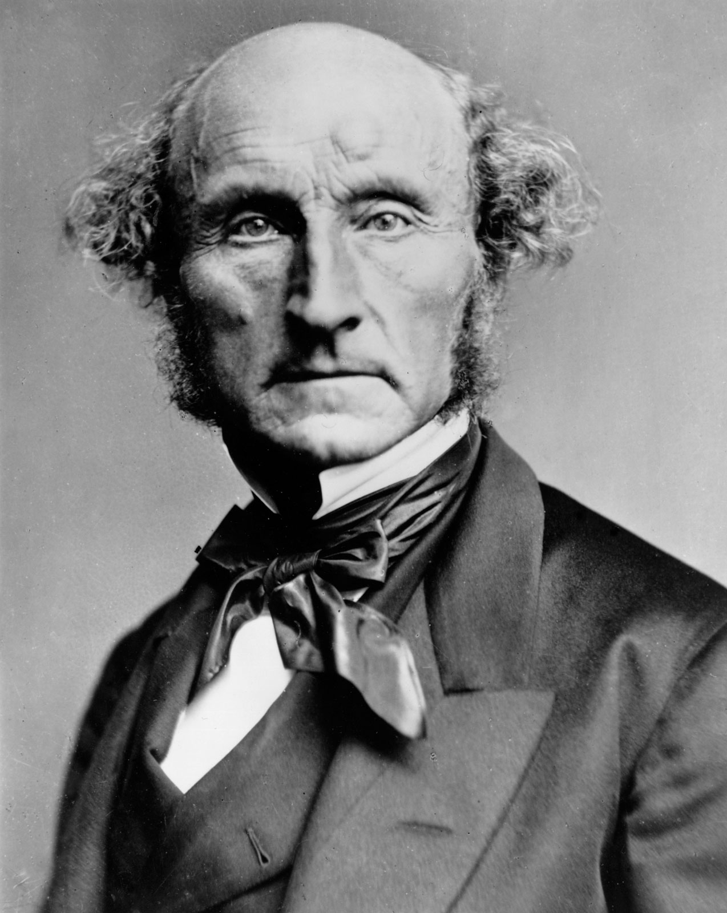
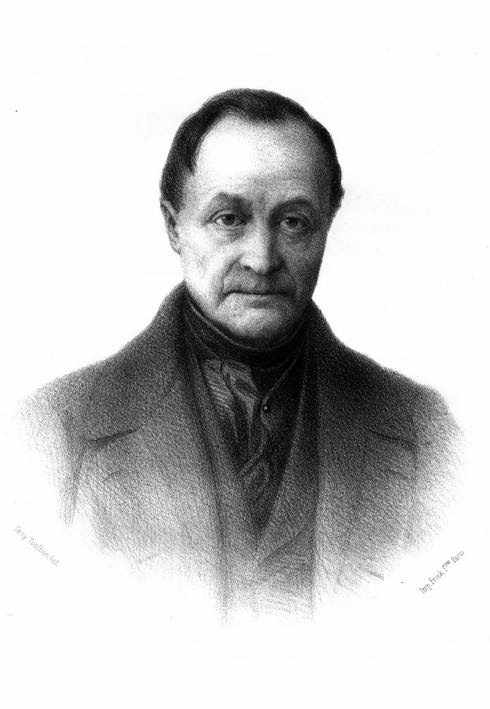

```{r setup, include=FALSE}
options(htmltools.dir.version = FALSE)
knitr::opts_chunk$set(echo=F,
                      message=F,
                      warning=F)
library(tidyverse)
library(ggrepel)
library(ggthemes)
set.seed(256)
update_geom_defaults("label", list(family = "Fira Sans Condensed"))
```

class: inverse

# Outline

## [Problems With Ricardian Economics](#18)

## [Mill's Contributions](#31)

---

# John Stuart Mill

.left-column[
.center[


John Stuart Mill

1806-1873
]
]
.right-column[

- Son of James Mill

- One of the most important writers in the 19<sup>th</sup> century, in general
  - philosophy, logic, ethics, social reforms, politics, and economics

- A very careful and deliberate thinker

- Politics are a blend of classical liberal, philosophical radical, utilitarian, sympathetic to (pre-Marxian) socialism
]

---

# John Stuart Mill: Utilitarianism

.left-column[
.center[


John Stuart Mill

1806-1873
]
]

.right-column[
.quitesmall[
- *Autobiography*
  - insane private education under father James Mill (groomed J.S. to be the new prophet of Bentham’s utilitarianism)
  - disillusioned with Bentham’s (version of) utilitarianism (maximize pleasure, minimize pain for society)
  - nervous breakdown at 21

- Broke with Bentham (and James Mill) on utilitarianism
  - Benthamites too dogmatic and certain of their optimal policies; Mill is more open-minded
  - Pleasure-pain calculus is too *hedonistic*, humans are different from animals!
  - much more left-leaning than his father & Bentham
  - writes his own defense of utilitarianism; intent on improving the role of the individual in society

]

]

---

# John Stuart Mill: On Liberty

.left-column[
.center[


John Stuart Mill

1806-1873
]
]

.right-column[

- *On Liberty*: establish proper relationship between governemnt and people
  - One of the greatest defenses of freedom of speech ever written
  - The .hi-purple[“harm principle”]: people should be free to do anything they please so long as does no harm to others

]

---

# John Stuart Mill: On Liberty

.left-column[
.center[


John Stuart Mill

1806-1873
]
]

.right-column[

- Very classically liberal in general

.quitesmall[
> “Lassiez-faire, in short, should be the general practice: every departure from it, unless required by some greater good, is a certain evil”
]

- But clear roles for government intervention

.quitesmall[
> “it is not admissible that the protection of persons and that of property are the sole purposes of government. The ends of government are as comprehensive as those of the social union. They consist of all the good, and all the immunity from evil, which the existence of government can be made directly or indirectly to bestow”

]
]
---

# John Stuart Mill: Influence of Comte

.left-column[
.center[


August Comte

1798-1857
]
]

.right-column[
.smaller[
- .hi-purple[Positivism]: knowledge is derived (only) from quantifiable empirical evidence
  - Society and physical world operate under discoverable empirical & experimental laws

- “Father of sociology”
  - saw economics as just one part of the study of humanity (Mill agreed)
  - Distinction between “statics” and “dynamics”
  - would find way into Mill’s *Principles*

- Thought some cranky things about women, that Mill would disavow

]

.source[Comte, Auguste, 1830-1842, *Course of Positive Philosophy*]

]

---

# John Stuart Mill, Harriet Taylor, and Reforms

.left-column[
.center[


(J.S. with) Harriet Taylor

1807-1858
]
]

.right-column[
- (Platonic!) affair and marriage to Harriet Taylor
  - feminist & socialist reformer
  - J.S.’s *The Subjection of Women* (1870)
  - J.S. is instrumental in bringing about women’s voting rights, and more importantly the *Married Women's Property Act 1882*

- Becomes sympathetic to a form of (pre-Marx) socialism, unions, cooperative production
  - wants a more equitable distribution in society
  - but never anti-private property or anti-competition
]

---

# John Stuart Mill: On Economics

.left-column[
.center[


John Stuart Mill

1806-1873
]
]
.right-column[

- *Essays on Some Unsettled Questions of Political Economy* (1836)

- *Principles of Political Economy with Some Applications to Social Philosophy* (1848)
  - intended to be the final word on economic theory
  - went through 7 editions, was the standard book in political economy until end of century
  - extended & corrected Smithean & Ricardian economics, responding to criticisms

.smallest[
> “Happily, there is nothing in the laws of value which remains for the present or any future writer to clear up, the theory of the subject is complete.”

]

]

---

class: inverse, center, middle

# Problems with Ricardian Economics

---

# Problems with Ricardian Economics

.left-column[
.center[


David Ricardo

1772-1823
]
]

.right-column[

1. Evidence against Malthusian population principle and diminishing returns to agriculture

2. Logical inconsistencies in Ricardian theory
  - wages fund, diminishing returns, labor theory of value, role of demand/utility

3. Socialist critiques of classical economics and market economy
]

---

# The Ricardian Vice

.left-column[
.center[


David Ricardo

1772-1823
]
]

.right-column[

- Ricardo (and followers, like Senior) are very theoretical:
  - abstract away from complexities of reality
  - make assumptions
  - logically deduce conclusions and policy implications from model

- Ignore real world evidence that suggests the contrary?
  - retool theoretical models
]

---

# The Ricardian Vice

.left-column[
.center[


Nassau Senior

1790-1864
]
]

.right-column[

- One of Ricardian economics’ biggest proponents after Ricardo’s death

- *An Outline of the Science of Political Economy* (1836)
  - political economy as “the Nature, the Production, and the Distribution of Wealth”

- Political economy was a deductive science:

,quitesmall[
> “[P]remises consist of a very few general propositions...and scarcely requiring proof, or even formal statement, which almost every man, as soon as he hears them, admits as familiar to his thoughts...and his inferences are nearly as general, and, if he has reasoned correctly, as certain, as his premises.”

]
]

---

# The Ricardian Vice

.left-column[
.center[


Nassau Senior

1790-1864
]
]

.right-column[

- Four self-evident principles of political economy:
  1. Rationality (people attempt to acquire wealth and minimize sacrifice)
  2. Malthusian population principle
  3. Diminishing returns in agriculture
  4. Principle of increasing returns for industry

- Political economy should strictly be a *positive* science, not normative:

.quitesmall[
> “conclusions, whatever their generality and their truth, do not authorize [an economist] in adding a single syllable of advice.”

]
]
---

# Mounting Evidence Against Ricardian Economics

.pull-left[
.smallest[
- Ricardian economists believed that technological improvements in agriculture would not offset diminishing returns

- By 1830s, clear that food production greatly *exceeding* population growth (due to technological improvement)!

- Ricardians (like Senior) did not change their models, kept holding out that it would not last

- Blaug: “The divorce between theory and facts was probably never more complete than in the heydey of Ricardian economics”
  - Have modern economists internalized this lesson yet? 😅
]
]

.pull-right[
.center[

]
]

---

# Socialist Critiques of Ricardian Economics

.pull-left[
.smallest[
- Following Godwin and the utopians, a new socialist writers launching critiques of market economy and classical (Ricardian) economics
  - Henri Sant-Simon, Charles Fourier, Robert Owen

- Viewed society in market economy not as harmonious, but full of conflicts
  - private property a major cause of the evils of society
  - competition creates chaos, better to have a rational ordering of production
  - implications of LTV: if all value is from labor content, why are workers not paid the full value of the product?
]
]

.pull-right[
.center[

]
]

---

# Mill on Socialist Critiques

.left-column[
.center[


John Stuart Mill

1806-1873
]
]
.right-column[
.smallest[
- If we can attain a more just distribution, then 

> “the principle of individual property would have been found to have no necessary connection with the physical and social evils which almost all Socialist writers assume to be inseparable from it.”

- View that competition is beneficial to society:

> “Competition is beneficial to society; “every restriction of it is an evil, and every extension of it, even if for the time injuriously affecting some classes of labourers, is always an ultimate good.”

]
]

---

# Mill on Landlords

.left-column[
.center[


John Stuart Mill

1806-1873
]
]
.right-column[

- Following Smith and Ricardo, Mill criticizes landlords:

> “[Landlords] grow richer, as it were in their sleep, without working, risking, or economizing. What claim have they, on the general principle of social justice, to this accession of riches?”

- Advocated a tax on land rent, just like Ricardo

]

---

class: inverse, center, middle

# Mill’s Contributions

---

# Mill’s Contributions

.left-column[
.center[


John Stuart Mill

1806-1873
]
]
.right-column[

- Key distinction between the .hi[laws of production] vs. the .hi[laws of distribution]
  - Production is governed by nature (unchangeable)
  - Distribution is affected by human institutions and thus can be changed

- Another distinction between “statics” and “dynamics’ of political economy

]
