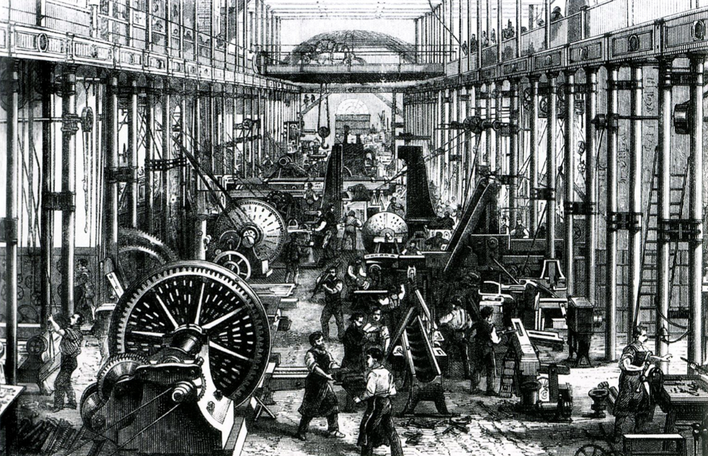

```{r setup, include=FALSE}
options(htmltools.dir.version = FALSE)
knitr::opts_chunk$set(echo=F,
                      message=F,
                      warning=F)
library(tidyverse)
library(ggrepel)
library(ggthemes)
set.seed(256)
update_geom_defaults("label", list(family = "Fira Sans Condensed"))
```

class: inverse

# Outline

## [Problems With Ricardian Economics](#10)

## [Mill's Contributions](#22)

## [Digression: A Tax on Land Rent](#35)

---

# John Stuart Mill

.left-column[
.center[


John Stuart Mill

1806-1873
]
]
.right-column[

- Son of James Mill

- One of the most important writers in the 19<sup>th</sup> century, in general
  - philosophy, logic, ethics, social reforms, politics, and economics

- A very careful and deliberate thinker

- Politics are a blend of classical liberal, philosophical radical, utilitarian, sympathetic to (pre-Marxian) socialism
]

---

# John Stuart Mill: Utilitarianism

.left-column[
.center[


John Stuart Mill

1806-1873
]
]

.right-column[
.quitesmall[
- *Autobiography*
  - insane private education under father James Mill (groomed J.S. to be the new prophet of Bentham’s utilitarianism)
  - disillusioned with Bentham’s (version of) utilitarianism (maximize pleasure, minimize pain for society)
  - nervous breakdown at 21

- Broke with Bentham (and James Mill) on utilitarianism
  - Benthamites too dogmatic and certain of their optimal policies; Mill is more open-minded
  - Pleasure-pain calculus is too *hedonistic*, humans are different from animals!
  - much more left-leaning than his father & Bentham
  - writes his own defense of utilitarianism; intent on improving the role of the individual in society

]

]

---

# John Stuart Mill: On Liberty

.left-column[
.center[


John Stuart Mill

1806-1873
]
]

.right-column[

- *On Liberty*: establish proper relationship between governemnt and people
  - One of the greatest defenses of freedom of speech ever written
  - The .hi-purple[“harm principle”]: people should be free to do anything they please so long as does no harm to others

]

---

# John Stuart Mill: On Liberty

.left-column[
.center[


John Stuart Mill

1806-1873
]
]

.right-column[

- Very classically liberal in general

.quitesmall[
> “Lassiez-faire, in short, should be the general practice: every departure from it, unless required by some greater good, is a certain evil”
]

- But clear roles for government intervention

.quitesmall[
> “it is not admissible that the protection of persons and that of property are the sole purposes of government. The ends of government are as comprehensive as those of the social union. They consist of all the good, and all the immunity from evil, which the existence of government can be made directly or indirectly to bestow”

]
]
---

# John Stuart Mill: Influence of Comte

.left-column[
.center[


August Comte

1798-1857
]
]

.right-column[
.smaller[
- .hi-purple[Positivism]: knowledge is derived (only) from quantifiable empirical evidence
  - Society and physical world operate under discoverable empirical & experimental laws

- “Father of sociology”
  - saw economics as just one part of the study of humanity (Mill agreed)
  - Distinction between “statics” and “dynamics”
  - would find way into Mill’s *Principles*

- Thought some cranky things about women, Mill would disavow

]

.source[Comte, Auguste, 1830-1842, *Course of Positive Philosophy*]

]

---

# John Stuart Mill, Harriet Taylor, and Reforms

.left-column[
.center[


(J.S. with) Harriet Taylor

1807-1858
]
]

.right-column[
- (Platonic!) affair and marriage to Harriet Taylor
  - feminist & socialist reformer
  - J.S.’s *The Subjection of Women* (1870)
  - J.S. is instrumental in bringing about women’s voting rights, and more importantly the *Married Women's Property Act 1882*

- Becomes sympathetic to a form of (pre-Marx) socialism, unions, cooperative production
  - wants a more equitable distribution in society
  - but never anti-private property or anti-competition
]

---

# John Stuart Mill: On Economics

.left-column[
.center[


John Stuart Mill

1806-1873
]
]
.right-column[
.smaller[
- *Essays on Some Unsettled Questions of Political Economy* (1836)

- *Principles of Political Economy with Some Applications to Social Philosophy* (1848)
  - intended to be the final word on economic theory
  - went through 7 editions, was the standard book in political economy until end of century
  - extended & corrected Smithean & Ricardian economics, responding to criticisms

.smallest[
> “Happily, there is nothing in the laws of value which remains for the present or any future writer to clear up, the theory of the subject is complete.” 😅

]

]
]
---

class: inverse, center, middle

# Problems with Ricardian Economics

---

# Problems with Ricardian Economics

.left-column[
.center[


David Ricardo

1772-1823
]
]

.right-column[

1. Evidence against Malthusian population principle and diminishing returns to agriculture

2. Logical inconsistencies in Ricardian theory
  - wages fund, diminishing returns, labor theory of value, role of demand/utility

3. Socialist critiques of classical economics and market economy
]

---

# Methodology: The Ricardian Vice

.left-column[
.center[


David Ricardo

1772-1823
]
]

.right-column[

- Ricardo (and followers, like Senior) are very theoretical:
  - abstract away from complexities of reality
  - make assumptions
  - logically deduce conclusions and policy implications from model

- Ignore real world evidence that suggests the contrary?
  - retool theoretical models
]

---

# Methodology: The Ricardian Vice

.left-column[
.center[


Nassau Senior

1790-1864
]
]

.right-column[

- One of Ricardian economics’ biggest proponents after Ricardo’s death

- *An Outline of the Science of Political Economy* (1836)
  - political economy as “the Nature, the Production, and the Distribution of Wealth”

- Political economy was a deductive science:

.quitesmall[
> “[P]remises consist of a very few general propositions...and scarcely requiring proof, or even formal statement, which almost every man, as soon as he hears them, admits as familiar to his thoughts...and his inferences are nearly as general, and, if he has reasoned correctly, as certain, as his premises.”

]
]

---

# Methodology: The Ricardian Vice

.left-column[
.center[


Nassau Senior

1790-1864
]
]

.right-column[

- Four self-evident principles of political economy:
  1. Rationality (people attempt to acquire wealth and minimize sacrifice)
  2. Malthusian population principle
  3. Diminishing returns in agriculture
  4. Principle of increasing returns for industry

- Political economy should strictly be a *positive* science, not normative:

.quitesmall[
> “conclusions, whatever their generality and their truth, do not authorize [an economist] in adding a single syllable of advice.”

]
]
---

# Mounting Evidence Against Ricardian Assumptions

.pull-left[
.smallest[
- Cornerstone of Ricardian economics — diminishing returns to agriculture; what about technological improvements?

- An empirical question, not a theoretical conclusion!
  - technological improvements can surpass, equal, or fail to offset diminishing returns

- Ricardo believed that technology would not offset diminishing returns, and so predicted .hi-purple[“historical diminishing returns”]

]
]

.pull-right[
.center[

]
]

---

# Mounting Evidence Against Ricardian Assumptions

.pull-left[
.smallest[
- By 1830s, clear that food production greatly *exceeding* population growth (technological improvement)!

- Ricardians (like Senior) did not change their models, kept holding out that it would not last
  - always saying diminishing returns are coming!

- Blaug: *“The divorce between theory and facts was probably never more complete than in the heydey of Ricardian economics”
  - Have modern economists internalized this lesson yet?* 😅
]
]

.pull-right[
.center[

]
]

---

# Socialist Critiques of Ricardian Economics

.pull-left[
.smallest[
- Following Godwin and the utopians, a new socialist writers launching critiques of market economy and classical (Ricardian) economics
  - Henri Sant-Simon, Charles Fourier, Robert Owen

- Viewed society in market economy not as harmonious, but full of conflicts
  - private property a major cause of the evils of society
  - competition creates chaos, better to have a rational ordering of production
]
]

.pull-right[
.center[

]
]

---

# Socialist Critiques of Ricardian Economics

.pull-left[
.smallest[
- Socialists used Ricardo’s labor theory of value to critique profit:
  - if all value is from labor content, why are workers not paid the full value of the product?
  - profit deducted from labor’s rightful share
  - capitalists are parasites just as the landlords, performing no social function

]
]

.pull-right[
.center[

]
]

---

# Almost an Answer: Abstinence and Interest

.left-column[
.center[


Nassau Senior

1790-1864
]
]

.right-column[
.smallest[
- Senior had an innovative response to critiques of profit theory
  - attempted to separate profit and interest

- .hi-purple[Abstinence theory]: capital comes from the abstinence of consumption, someone must *save* their income
  - labor is paid due to the disutility of labor
  - capitalists are analogously paid for their patience and the disutility of abstaining from consumption

- Labor & capital are both necessary to production, thus profits are the payment earned by capital
  - Again, classical failure to separate interest from profit
  - Faintest beginnings of interest theory in macroeconomics
]
]

---

# Mill on Socialist Critiques

.left-column[
.center[


John Stuart Mill

1806-1873
]
]
.right-column[
.smallest[
- If we can attain a more just distribution, then 

> “the principle of individual property would have been found to have no necessary connection with the physical and social evils which almost all Socialist writers assume to be inseparable from it.”

- View that competition is beneficial to society:

> “Competition is beneficial to society; every restriction of it is an evil, and every extension of it, even if for the time injuriously affecting some classes of labourers, is always an ultimate good.”

]
]

---

# Mill on Landlords

.left-column[
.center[


John Stuart Mill

1806-1873
]
]
.right-column[

- Following Smith and Ricardo, Mill criticizes landlords:

> “[Landlords] grow richer, as it were in their sleep, without working, risking, or economizing. What claim have they, on the general principle of social justice, to this accession of riches?”

- Advocated a tax on land rent, just like Ricardo

]

---

class: inverse, center, middle

# Mill’s Economics

---

# Mill’s Approach to Economics

.left-column[
.center[


John Stuart Mill

1806-1873
]
]
.right-column[

- Blend of Smith and Ricardo in his methodology

- Views political economy as a (non-experimental) science:
  - Conclusions and hypotheses are deduced from assumptions *a priori*
  - But then hypotheses must be verified by real world evidence!
  - Evidence overturning a hypothesis can generate new hypotheses 

- Comte’s influence: economics is useful, but only part of a larger study of humanity
]

---

# Mill’s Contributions

.left-column[
.center[


John Stuart Mill

1806-1873
]
]
.right-column[
.smallest[
- Competition and custom together govern the distribution of income
  - Classicals only focus on the former, ignore the latter

> “They are apt to express themselves as if they thought that competition actually does, in all cases, whatever it can be shown to be the tendency of competition to do.”

- Historically, market societies are young; most of history income was governed by tradition and custom (e.g. feudalism)
  - modern, profit-maximizing businesses are a new thing
  - and yet: 

> “Only through the principle of competition has political economy any pretensions to the character of a science.”

]
]

---

# Mill’s Contributions

.left-column[
.center[


John Stuart Mill

1806-1873
]
]
.right-column[

- Key distinction between the .hi[laws of production] vs. the .hi[laws of distribution]
  - Production is governed by nature (unchangeable)
  - Distribution is affected by human institutions and thus can be changed

]

---

# Mill as a Classical Economist

.left-column[
.center[


John Stuart Mill

1806-1873
]
]
.right-column[

- Very much agreed with Smith, Ricardo, and Malthus on general principles

- Malthusian population thesis
  - Mill spent a night in jail for distributing pamphlets encouraging the use of contraceptives
]

---

# Mill’s Originality

.left-column[
.center[


John Stuart Mill

1806-1873
]
]
.right-column[

- Often believed that Mill was a mere systematizer of Classical thought, but he had some original contributions:
  - theory of non-competing groups and effects on relative wages
  - recognized land has an opportunity cost, rent-less margin in Ricardo is false - rent is a cost in production
  - first focus on economics of the firm, economies of scale
  - treats supply and demand as functions relating price and quantity
  - nicely treated Say’ Law with money
  
]

---

# Mill’s Value Theory

.left-column[
.center[


John Stuart Mill

1806-1873
]
]
.right-column[

- Rejected Ricardian labor theory of value, and saw that land had an opportunity cost

- Yet still maintained a cost of production theory (like Smith), that prices depend more on cost of production (supply) than utility (demand)
]

---

# Mill’s Value Theory

.pull-left[

- Mill did not use these diagrams, but they he explains several cases that we can visualize:
  1. Supply of nonrenewable commodities (old wine, rare paintings); monopolies
  2. Supply of manufactured goods (constant costs)
  3. Supply of agricultural goods (diminishing returns/increasing costs)
]

.pull-right[
```{r, fig.height=3.5}
demand=function(x){10-x}

case_1<-ggplot(data = tibble(x = 1:10), aes(x = x))+
  stat_function(fun = demand, geom = "line", size = 2, color = "blue")+
  geom_label(x = 8, y = demand(8), color = "blue", label = "Demand")+
  geom_vline(xintercept = 5, size = 2 , color = "red")+
  geom_label(x = 5 , y = 8, color = "red", label = "Supply")+
  geom_segment(x = 0, y = 5, xend = 5, yend = 5, linetype = "dotted")+
  labs(x = "Quantity",
       y = "Price",
       title = "Case 1")+
  scale_x_continuous(breaks = c(5),
                     labels = c("q*"),
                     limits = c(0,10),
                     expand = c(0,0))+
  scale_y_continuous(breaks = c(5),
                     labels = c("p*"),
                     limits = c(0,10),
                     expand = c(0,0))+
  theme_classic(base_family = "Fira Sans Condensed", base_size = 14)

case_2<-ggplot(data = tibble(x = 1:10), aes(x = x))+
  stat_function(fun = demand, geom = "line", size = 2, color = "blue")+
  geom_label(x = 8, y = demand(8), color = "blue", label = "Demand")+
  geom_hline(yintercept = 5, size = 2 , color = "red")+
  geom_label(x = 8 , y = 5, color = "red", label = "Supply")+
  geom_segment(x = 5, y = 5, xend = 5, yend = 0, linetype = "dotted")+
  labs(x = "Quantity",
       y = "",
       title = "Case 2")+
  scale_x_continuous(breaks = c(5),
                     labels = c("q*"),
                     limits = c(0,10),
                     expand = c(0,0))+
  scale_y_continuous(breaks = c(5),
                     labels = c("p*"),
                     limits = c(0,10),
                     expand = c(0,0))+
  theme_classic(base_family = "Fira Sans Condensed", base_size = 14)

supply=function(x){x}

case_3<-ggplot(data = tibble(x = 1:10), aes(x = x))+
  stat_function(fun = demand, geom = "line", size = 2, color = "blue")+
  geom_label(x = 8, y = demand(8), color = "blue", label = "Demand")+
  stat_function(fun = supply, geom = "line", size = 2, color = "red")+
  geom_label(x = 8 , y = supply(8), color = "red", label = "Supply")+
  geom_segment(x = 5, y = 5, xend = 5, yend = 0, linetype = "dotted")+
  geom_segment(x = 0, y = 5, xend = 5, yend = 5, linetype = "dotted")+
  labs(x = "Quantity",
       y = "",
       title = "Case 3")+
  scale_x_continuous(breaks = c(5),
                     labels = c("q*"),
                     limits = c(0,10),
                     expand = c(0,0))+
  scale_y_continuous(breaks = c(5),
                     labels = c("p*"),
                     limits = c(0,10),
                     expand = c(0,0))+
  theme_classic(base_family = "Fira Sans Condensed", base_size = 14)

library(patchwork)

case_1+case_2+case_3
```
]

---

# Mill’s Value Theory

.left-column[
.center[


John Stuart Mill

1806-1873
]
]
.right-column[

> “[T]he proper mathematical analogy is that of an equation. Demand and supply, the quantity demanded and the quantity supplied, will be made equal. If unequal at any moment, competition equalizes them, and the manner in which this is done is by an adjustment of the value. If the demand increases, the value rises; if the demand diminishes, the value falls: again, if they supply falls off, the value rises; and falls if the supply is increased.”

]

---

# Mill’s Value Theory

.left-column[
.center[


John Stuart Mill

1806-1873
]
]
.right-column[

- Other contributions:

- Theory of non-competing groups in labor markets
  - labor is not perfectly mobile; often specialized and specific
  - certain types of labor (e.g. chimney sweeps) will not really compete with other types (shipbuilders)

- Economies of scale
]

---

# Mill’s Value Theory

.left-column[
.center[


John Stuart Mill

1806-1873
]
]
.right-column[
.smallest[
- We have already seen he was better than Ricardo regarding Say’s Law (and rediscovered Henry Thornton): there is a monetary component to it!
  - *Can* have general gluts in monetary disequilibrium

- Often brought about by (1) overissue of credit by banks & (2) sudden pessimism in business community and a contraction of credit
]

.quitesmall[
> “At such times there is really an excess of all commodities above the money demand: in other words, there is an undersupply of money. From the sudden annihilation of a great mass of credit, every one dislikes to part with ready money, and many are anxious to procure it at any sacrifice. Almost everybody therefore is a seller, and there are scarcely any buyers.”

]

.smallest[
- A monetary and psychological theory of business cycles!
]
]

---

# Mill’s Applications of Economics

.left-column[
.center[


John Stuart Mill

1806-1873
]
]
.right-column[

- Focus on proprietorship 

- Big believer in organizing production into cooperatives
  - some debate about his views: individualist or collectivist? socialist?
  
- In favor of some State ownership of certain industries (public utilities, railways)

- Utterly opposed to a progressive income tax, but in favor of absolute limit on inheritance, favored a tax on land rent
  
]

---

# Mill’s Applications of Economics

.left-column[
.center[


John Stuart Mill

1806-1873
]
]
.right-column[
.quitesmall[
- Wages fund theory (it was he who coined the term)
  - short-run demand of labor fixed by the amount that capitalists can advance to labor
  - increases in real wages have little effect in short run (takes time for population to increase and children to mature into laborers)
  - in long-run, Malthusian population principle dictates population growth depresses real wages to subsistence

- Theory allegedly used to argue against formation of unions (who aim to raise wages)
  - But no evidence classical economists argued against unions, many favored them

- But with decline of pop. principle, how to explain long run wages?

- Mill (famously) changes his mind about wages fund theory by 1869

]
]

---

class: inverse, center, middle

# Digression: A Tax on Land Rent

---

# Tax on Land Rent

.left-column[
.center[


John Stuart Mill

1806-1873
]
]
.right-column[

- Mill, along with Ricardo and Smith, naturally are skeptical of landlords and their lack of contribution to society

- Because land rent is price-determined, not price-determining (assuming land is fixed and has no opportunity cost), rent to landowners is mere surplus, not affecting production
  - Land does not contribute to production, merely a payment to “allow” production to take place
  - It’s really just standing space that somebody owns

- This implies that it would make no difference at all if rent goes to the landowners or to the government
  - Would have no effect on production
  - Classicals and their followers advocated tax on land rent for these reasons
]

---

# Georgism

.left-column[
.center[

.smaller[
Henry George

1839-1897
]
]
]

.right-column[

.smallest[
> "The nineteenth century saw an enormous increase in the ability to produce wealth. Steam and electricity, mechanization, specialization, and new business methods greatly increased the power of labor...Surely, these new powers would elevate society from its foundations, lifting the poorest above worry for the material needs of life...Yet we must now face facts we cannot mistake. All over the world we hear complaints of...labor condemned to involuntary idleness; capital going to waste...Where do we find the deepest poverty, the hardest struggle for existence, the greatest enforced idleness? Why, wherever material progress is most advanced...This relation of poverty to progress is the great question of our time."

]

.source[George, Henry, 1879, *Progress and Poverty* (quoted in Posner and Weyl, 2017, pp.36-37)]
]

---

# Georgist Solutions

.left-column[
.center[

.smaller[
Henry George

1839-1897
]
]
]

.right-column[

- A "simpler, easier and quieter way" (than socialism) to fix problems is to “appropriate land rent for public use, by taxation”

- .hi-purple[Land] (classical “free gifts of nature”) vs. .hi-purple[“artifical capital”] (human-made improvements)

- Solution: allow private ownership in artificial capital, but abolish private ownership in land
  - but not centrally-planned, competitively managed

]

---

# Georgist Solutions

.left-column[
.center[

.smaller[
Henry George

1839-1897
]
]
]

.right-column[

- .hi-purple[“Competitive common ownership”]

- Government owns all land, and *leases* it out to those it thinks make the most productive use of it
  - Terminates lease when a better buyer (higher WTP) comes along

- Individuals and businesses *rent*, but *cannot own*, land

]

---

# Georgist Solutions: A Land Value Tax

.left-column[
.center[

.smaller[
Henry George

1839-1897
]
]
]

.right-column[

- Modern (State and local) property taxes:
  - low rates (1 or 2%)
  - assess the full value of your house (land lot + structures)
  - determined by a government assessor

- Versus George's .hi-purple[land value tax]:
  - tax the *full* value (100%) of rent needed to occupy *land*
  - artificial capital (i.e. structures) *not taxed*
  - assessors need to evaluate value of the unimproved land (i.e. if structures were bulldozed)

]

---

# Consequences of a Land Value Tax

.left-column[
.center[

.smaller[
Henry George

1839-1897
]
]
]

.right-column[

- Occupants enjoy full value of improvements and structures built on land (privately owned)

- Act as a tenant of the land (government is landlord), pay full rent value in taxes

- People who can productively use land have high WTP the tax, those who would leave it idle would sell at low prices to avoid tax (no more absentee landlords)

- Georgists often believed this .hi-purple[“single tax”] could replace all other taxes

]

---

# *Monopoly* and *The Landlord's Game*

.pull-left[
.center[


]
]

.pull-right[

- [*"The Landlord's Game"*](https://en.wikipedia.org/wiki/The_Landlord%27s_Game) created in 1902 to popularize Georgism

- The famous Parker Brothers "*Monopoly*" board game based on this around 1930s (and interesting [disputes about who invented it](https://en.wikipedia.org/wiki/History_of_the_board_game_Monopoly))

]

---

# *Monopoly* and *The Landlord's Game*

.pull-left[
.center[


]
]

.pull-right[

- [*"The Landlord's Game"*](https://en.wikipedia.org/wiki/The_Landlord%27s_Game) created in 1902 to popularize Georgism

- The famous Parker Brothers "*Monopoly*" board game based on this around 1930s (and interesting [disputes about who invented it](https://en.wikipedia.org/wiki/History_of_the_board_game_Monopoly))

]

---

# One Final Lens into Ricardian Rents

.pull-left[
.smallest[
- Consider a market for a factor of production (inputs: land, labor, capital, etc.)

- Recall .hi-blue[market demand] is the **maximum willingness of firms to pay factor owners** for use of the factor

- Recall .hi-red[market supply] is the **minimum willingness of factor owners to accept**, the minimum price necessary to bring a resource to market

- But all (equivalent) factor units are paid the market price, $p^*$ determined by market factor supply and factor demand
]
]

.pull-right[

```{r, fig.retina=3}
demand<-function(x){10-x}
supply<-function(x){x}
#supply=function(x){2+2*x}

rent<-tribble(
  ~x, ~y,
  0, 0,
  5, 5,
  0, 5
)
# make plot 

ggplot(data.frame(x=c(0,10)), aes(x=x))+
  #geom_polygon(data=rent, aes(x=x,y=y, fill="red"), alpha=0.5)+ #CS
  stat_function(fun=demand, geom="line", size=2, color = "blue")+
    geom_label(aes(x=9,y=demand(9)), color = "blue", label="Demand", size = 5)+
  stat_function(fun=supply, geom="line", size=2, color = "red")+
    geom_label(aes(x=9,y=supply(9)), color = "red", label="Supply", size = 5)+
  geom_segment(x=5, xend=5, y=0, yend=5, size=1, linetype="dotted")+
  geom_segment(x=0, xend=5, y=5, yend=5, size=1, linetype="dotted")+
    scale_x_continuous(breaks=c(0,5),
                       labels=c(0,"q*"),
                     expand=expand_scale(mult=c(0,0.1)))+
  scale_y_continuous(breaks=c(0,5),
                     labels=c(0,"p*"),
                     limits=c(0,10),
                     expand=expand_scale(mult=c(0,0.1)))+
  guides(fill=F)+
  labs(title = "A Factor Market",
       x = "Quantity of Factor (q)",
       y = "Price of Factor, (p)")+
  theme_classic(base_family = "Fira Sans Condensed", base_size=20)
```
]


---

# One Final Lens into Ricardian Rents

.pull-left[

- Some factor owners would have accepted a job for less than $p^*$

- Those owners earn .hi[economic rent] in excess of what is needed to bring their factor into the market (its opportunity cost)

]

.pull-right[

```{r, fig.retina=3}

rent<-tribble(
  ~x, ~y,
  0, 0,
  5, 5,
  0, 5
)
# make plot 

ggplot(data.frame(x=c(0,10)), aes(x=x))+
  geom_polygon(data=rent, aes(x=x,y=y, fill="red"), alpha=0.5)+ #CS
  stat_function(fun=demand, geom="line", size=2, color = "blue")+
    geom_label(aes(x=9,y=demand(9)), color = "blue", label="Demand", size = 5)+
  stat_function(fun=supply, geom="line", size=2, color = "red")+
    geom_label(aes(x=9,y=supply(9)), color = "red", label="Supply", size = 5)+
  geom_segment(x=5, xend=5, y=0, yend=5, size=1, linetype="dotted")+
  geom_segment(x=0, xend=5, y=5, yend=5, size=1, linetype="dotted")+
    scale_x_continuous(breaks=c(0,5),
                       labels=c(0,"q*"),
                     expand=expand_scale(mult=c(0,0.1)))+
  scale_y_continuous(breaks=c(0,5),
                     labels=c(0,"p*"),
                     limits=c(0,10),
                     expand=expand_scale(mult=c(0,0.1)))+
  guides(fill=F)+
  labs(title = "A Factor Market",
       x = "Quantity of Factor (p)",
       y = "Price of Factor, (q)")+
  theme_classic(base_family = "Fira Sans Condensed", base_size=20)
```
]


---

# Rent with a Fixed Factor Supply 

.pull-left[

- Consider a factor (such as “land”) for which the supply is *perfectly inelastic* (e.g. a *fixed* supply)

- Then the **entire value of the land is economic rent**!

- .hi-purple[The *less* elastic the supply of a factor, the *more* economic rent it generates!]

]

.pull-left[

```{r, fig.retina=3}

ggplot(data.frame(x=c(0,10)), aes(x=x))+
  geom_rect(xmin=0,xmax=5,ymin=0,ymax=5, fill="red", alpha=0.3)+ #CS
  stat_function(fun=demand, geom="line", size=2, color = "blue")+
    geom_label(aes(x=9,y=demand(9)), color = "blue", label="Demand", size = 5)+
  geom_vline(xintercept=5, size=2, color = "red")+
    geom_label(aes(x=5,y=10), color = "red", label="Supply", size = 5)+
  geom_segment(x=5, xend=5, y=0, yend=5, size=1, linetype="dotted")+
  geom_segment(x=0, xend=5, y=5, yend=5, size=1, linetype="dotted")+
    scale_x_continuous(breaks=c(0,5),
                       labels=c(0,"T*"),
                     expand=expand_scale(mult=c(0,0.1)))+
  scale_y_continuous(breaks=c(0,5),
                     labels=c(0,"r*"),
                     limits=c(0,10),
                     expand=expand_scale(mult=c(0,0.1)))+
  guides(fill=F)+
  labs(title = "Land Market",
       x = "Quantity of Land (T)",
       y = "Price of Land, (r)")+
  theme_classic(base_family = "Fira Sans Condensed", base_size=20)
```
]


---

# Rent with a Fixed Factor Supply 

.pull-left[

- An increase in demand raises the price of the factor, and creates *more* economic rents

- Think of land during the industrial revolution
  - Lazy landowners earn more income by doing nothing, don’t need to produce for industry

]

.pull-right[

```{r, fig.retina=3}
demand_2=function(x){12-x}

ggplot(data.frame(x=c(0,10)), aes(x=x))+
  geom_rect(xmin=0,xmax=5,ymin=0,ymax=5, fill="red", alpha=0.3)+ #CS
    geom_rect(xmin=0,xmax=5,ymin=5,ymax=7, fill="darkred", alpha=0.3)+ #CS
  stat_function(fun=demand, geom="line", size=2, color = "blue")+
    geom_label(aes(x=9,y=demand(9)), color = "blue", label="Demand", size = 5)+
    stat_function(fun=demand_2, geom="line", size=2, color = "darkblue")+
    geom_label(aes(x=9,y=demand_2(9)), color = "darkblue", label="Demand 2", size = 5)+

  geom_vline(xintercept=5, size=2, color = "red")+
    geom_label(aes(x=5,y=10), color = "red", label="Supply", size = 5)+
  geom_segment(x=5, xend=5, y=0, yend=5, size=1, linetype="dotted")+
  geom_segment(x=0, xend=5, y=5, yend=5, size=1, linetype="dotted")+
  geom_segment(x=0, xend=5, y=7, yend=7, size=1, linetype="dotted")+

    scale_x_continuous(breaks=c(0,5),
                       labels=c(0,"T*"),
                     expand=expand_scale(mult=c(0,0.1)))+
  scale_y_continuous(breaks=c(0,5, 7),
                     labels=c(0,expression(r[1]), expression(r[2])),
                     limits=c(0,10),
                     expand=expand_scale(mult=c(0,0.1)))+
  guides(fill=F)+
  labs(title = "Land Market",
       x = "Quantity of Land (T)",
       y = "Price of Land, (r)")+
  theme_classic(base_family = "Fira Sans Condensed", base_size=20)
```
]


---

# A Tax on Land Rent

.pull-left[

- A tax on land, $\color{purple}{\tau}$, (if supply is perfectly inelastic) would *not be distortionary*!

- Gross price to buyers $(r_g)$ remains the same, quantity of land used T*, remains the same!

- No deadweight loss!

- .hi-purple[Landowners bear the full economic incidence of the tax]

]

.pull-right[

```{r, fig.retina=3}
CS<-tribble(
  ~x, ~y,
  0, 10,
  0, 5,
  5, 5
)

ggplot(data.frame(x=c(0,10)), aes(x=x))+
  geom_polygon(data=CS,aes(x=x,y=y),fill="blue",alpha=0.3)+
  geom_rect(xmin=0,xmax=5,ymin=3,ymax=5, fill="green", alpha=0.3)+ #CS
  geom_rect(xmin=0,xmax=5,ymin=0,ymax=3, fill="red", alpha=0.3)+ #CS
  stat_function(fun=demand, geom="line", size=2, color = "blue")+
    geom_label(aes(x=9,y=demand(9)), color = "blue", label="Demand", size = 5)+
  geom_vline(xintercept=5, size=2, color = "red")+
    geom_label(aes(x=5,y=10), color = "red", label="Supply", size = 5)+
  geom_segment(x=5, xend=5, y=0, yend=5, size=1, linetype="dotted")+
  geom_segment(x=0, xend=5, y=5, yend=5, size=1, linetype="dotted")+
  geom_segment(x=0, xend=5, y=3, yend=3, size=1, linetype="dotted")+
  
annotate("segment", x = 2.5, xend = 2.5, y = 5, yend = 3, color = "purple", size=2.5, alpha=1, arrow=arrow(length=unit(0.5,"cm"), ends="last", type="closed"))+
  geom_label(aes(x=2.5,y=4), color = "purple", label=expression(tau), size = 5)+

    scale_x_continuous(breaks=c(0,5),
                       labels=c(0,"T*"),
                     expand=expand_scale(mult=c(0,0.1)))+
  scale_y_continuous(breaks=c(0,3,5),
                     labels=c(0,expression(r[n]),expression(r[g])),
                     limits=c(0,10),
                     expand=expand_scale(mult=c(0,0.1)))+
  guides(fill=F)+
  labs(title = "Land Market",
       x = "Quantity of Land (T)",
       y = "Price of Land, (r)")+
  theme_classic(base_family = "Fira Sans Condensed", base_size=20)
```
]


---

# A 100% Tax on Land Rent

.pull-left[

- A tax on land, $\color{purple}{\tau}$, (if supply is perfectly inelastic) would *not be distortionary*!

- Gross price to buyers $(r_g)$ remains the same, quantity of land used T*, remains the same!

- No deadweight loss!

- .hi-purple[Landowners bear the full economic incidence of the tax]

- At the limit, a 100% tax on land rent!
]

.pull-right[

```{r, fig.retina=3}
CS<-tribble(
  ~x, ~y,
  0, 10,
  0, 5,
  5, 5
)

ggplot(data.frame(x=c(0,10)), aes(x=x))+
  geom_polygon(data=CS,aes(x=x,y=y),fill="blue",alpha=0.3)+
  geom_rect(xmin=0,xmax=5,ymin=0,ymax=5, fill="green", alpha=0.3)+ #CS
  stat_function(fun=demand, geom="line", size=2, color = "blue")+
    geom_label(aes(x=9,y=demand(9)), color = "blue", label="Demand", size = 5)+
  geom_vline(xintercept=5, size=2, color = "red")+
    geom_label(aes(x=5,y=10), color = "red", label="Supply", size = 5)+
  geom_segment(x=5, xend=5, y=0, yend=5, size=1, linetype="dotted")+
  geom_segment(x=0, xend=5, y=5, yend=5, size=1, linetype="dotted")+
  geom_segment(x=0, xend=5, y=3, yend=3, size=1, linetype="dotted")+
  
annotate("segment", x = 2.5, xend = 2.5, y = 5, yend = 0, color = "purple", size=2.5, alpha=1, arrow=arrow(length=unit(0.5,"cm"), ends="last", type="closed"))+
  geom_label(aes(x=2.5,y=2.5), color = "purple", label=expression(tau==100), size = 5)+

    scale_x_continuous(breaks=c(0,5),
                       labels=c(0,"T*"),
                     expand=expand_scale(mult=c(0,0.1)))+
  scale_y_continuous(breaks=c(0,5),
                     labels=c(0,expression(r[g])),
                     limits=c(0,10),
                     expand=expand_scale(mult=c(0,0.1)))+
  guides(fill=F)+
  labs(title = "Land Market",
       x = "Quantity of Land (T)",
       y = "Price of Land, (r)")+
  theme_classic(base_family = "Fira Sans Condensed", base_size=20)
```
]
