```{r setup, include=FALSE}
options(htmltools.dir.version = FALSE)
knitr::opts_chunk$set(echo=F,
                      message=F,
                      warning=F)
library(tidyverse)
library(ggrepel)
library(ggthemes)
set.seed(256)
update_geom_defaults("label", list(family = "Fira Sans Condensed"))
```

class: inverse

# Outline

## [Background Events: Reform and Revolution](#3)

## [Marx’s Methodology and Theory of History](#31)

## [Marx’s Economic Analysis of Capitalism](#36)
---

# Karl Marx

.left-column[
.center[
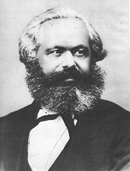
.smaller[
Karl Marx

1818-1883
]
]
]

.right-column[

- Perhaps the most consequential thinker who ever lived; testament to the real world power of ideas

- A historian and philosopher (Ph.D in philosophy); journalist in early days

- Born and educated in Prussia (Germany), but his radical views got him kicked out of the country
  - Same in Paris and Brussels
  - Finally settled in London for rest of his life, working in British Museum
]

---

# Karl Marx

.left-column[
.center[

.smaller[
Karl Marx

1818-1883
]
]
]

.right-column[

- A philosopher and historian first, an economist only as a means to those ends

- Partisan advocate but made some objective contributions

- Wrote primarily about the flaws of capitalism, very little on how the economics of a socialist or communist society would (or should) work
]

---

# Friedrich Engels

.left-column[
.center[
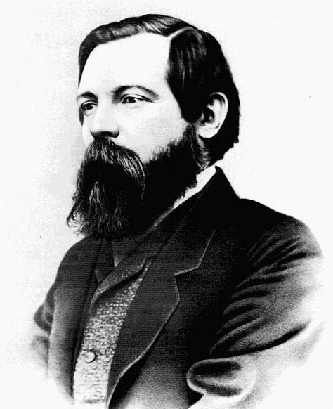
.smaller[
Friedrich Engels

1820-1895
]
]
]

.right-column[

- Prussian born businessman and journalist in Britain

- Father owned large textile factories in Manchester, England

- Published *The Condition of the Working Class in England* (1845) based on his personal observations

- Meets Marx, they write the *Communist Manifesto* together in 1848

- Engels would financially support Marx for the rest of his life using his (Engels’s) father’s factory profits
]

---

class: inverse, center, middle

# Background Events: Reform and Revolution

---

# The Industrial Revolution in Britain

.pull-left[

- .hi[Industrial revolution] (c.1740s-c.1840) in England
  - major innovations and technological improvements:
  - steam power, coal, factory system, mechanization, railroads, mass production

- Countless ink has been spilled writing about the origins and explanation for why the IR happened in Britain in 19<sup>th</sup> century
  - one of the greatest questions in all of social science

- Nonetheless, changing industrial landscape of major cities: London, Birmingham, Manchester
]

.pull-right[
.center[
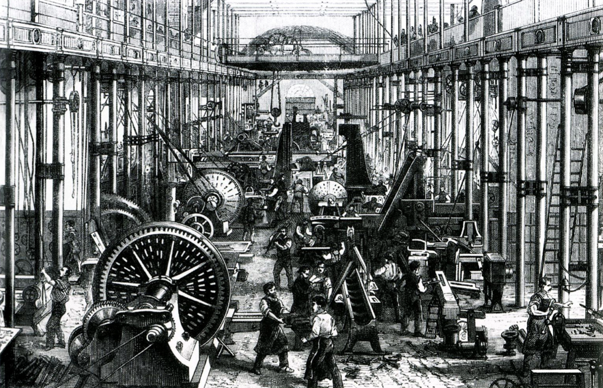
]
]

---

# The Industrial Revolution in Britain

.center[
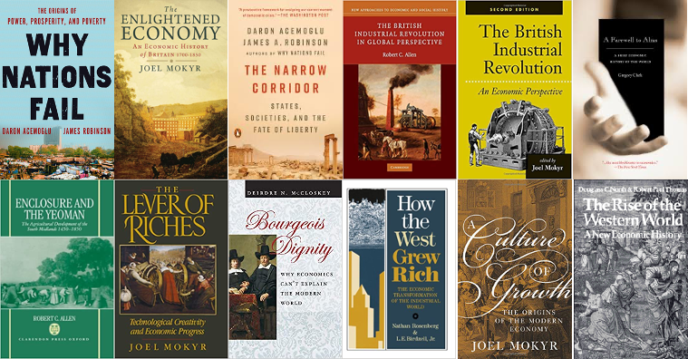
]

---

# The Industrial Revolution in Britain: Living Standards

.pull-left[

- The benefits of the IR were far from widely shared for a long time

- Working conditions were very poor (“the condition of England question”)
  - child labor
  - urban poverty, disease, pollution & squalor as many people moved from countryside to cities

]

.pull-right[
.center[

]
]

---

# The Industrial Revolution in Britain: Living Standards

.pull-left[
.smaller[
- Eventually, wages and living standards would *continually rise* for *most* people, for the first time in human history
  - Classical economists thought this was impossible!

- Benefits *would* be widely shared in late 19<sup>th</sup> century
  - Massive declines in malnutrition, childhood mortality, increase in life expectancy in Britain
  - British people grew taller than others
]
]

.pull-right[
.center[

]
]

---

# The Industrial Revolution in Britain: “Engels’ Pause”

.center[
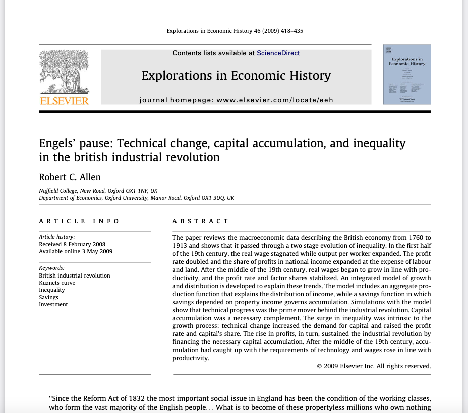
]

.source[Allen, Robert C, 2009, “Engels’ pause: Technical change, capital accumulation, and inequality in the british industrial revolution,” *Explorations in Economic History* 46: 418-435]

---

# The Industrial Revolution in Britain: “Engels’ Pause”

.pull-left[
.center[
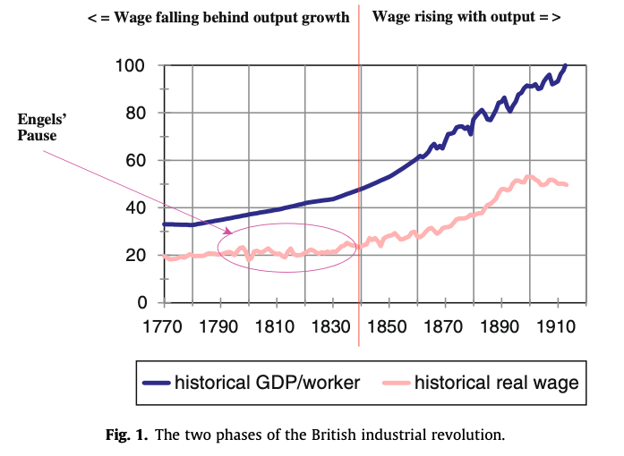
]
]

--

.pull-left[
.center[
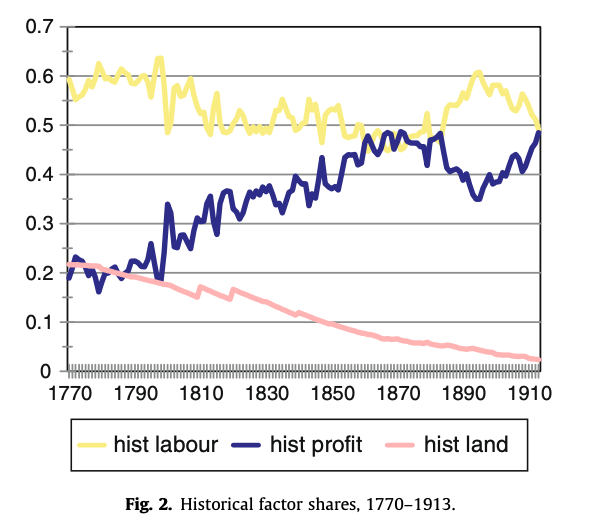
]
]

.source[Allen, Robert C, 2009, “Engels’ pause: Technical change, capital accumulation, and inequality in the british industrial revolution,” *Explorations in Economic History* 46: 418-435]

---

# The Industrial Revolution in Britain: “Engels’ Pause”

> “First, inequality rose substantially in the first four decades of the 19th century. The share of capital income expanded at the expense of both land and labour income. The average real wage stagnated, while the rate of profit doubled. Second, these trends can be explained without reference to contingent events like the Napoleonic Wars or the settlement of the American West...Third...the explanation of growth cannot be separated from the discussion of inequality since each influenced the other. In the first instance, it was the acceleration of productivity growth that led to the rise in inequality. Reciprocally, it was the rising share of profits that induced the savings that met the demand for capital and allowed output to expand.”

.source[Allen, Robert C, 2009, “Engels’ pause: Technical change, capital accumulation, and inequality in the british industrial revolution,” *Explorations in Economic History* 46: 418-435]

---

# The Industrial Revolution in Britain: “Engels’ Pause”

.quitesmall[
> “[W]e can outline the story of the industrial revolution as follows: the prime mover was technical progress beginning with the famous inventions of the 18th century including mechanical spinning, coke smelting, iron puddling, and the steam engine. It was only after 1800 that the revolutionized industries were large enough to affect the national economy. Their impact was reinforced by a supporting boost from rising agricultural productivity and further inventions like the power loom, the railroad, and the application of steam power more generally...The adoption of these inventions led to a rise in demand for capital – for cities, housing, and infrastructure as well as for plant and equipment. Consequently, the rate of return rose and pushed up the share of profits in national income. With more income, capitalists saved more, but the response was limited, the capital–labour ratio rose only modestly, the urban enviro ment suffered as cities were built on the cheap, and the purchasing power of wages stagnated...Real wages rising in line with the growth of labour productivity was not a viable option since income had to shift in favour of property owners in order for their savings to rise enough to allow the economy to take advantage of the new productivity raising methods. Hence, the upward leap in inequality.”

]

.source[Allen, Robert C, 2009, “Engels’ pause: Technical change, capital accumulation, and inequality in the british industrial revolution,” *Explorations in Economic History* 46: 418-435]

---

# The Industrial Revolution in Britain: “Engels’ Pause”

> “The rise in inequality, however, had ramifications that made it self-extinguishing. The increase in profits induced enough capital formation by the middle of the 19th century for the economy to realize a balanced growth path with 
capital and augmented labour growing at the same rate. Under this condition, the real wage grew in line with productivity...productivity growth and capital accumulation were principally responsible for the rise in working class living standards after 1850, just as they had been responsible for their stagnation in the first half of the 19th century. Even sustained, rapid population growth was not enough to prevent labour incomes from rising once the accumulation conditions were right.”

.source[Allen, Robert C, 2009, “Engels’ pause: Technical change, capital accumulation, and inequality in the british industrial revolution,” *Explorations in Economic History* 46: 418-435]

---

# The Great Reform Acts

.pull-left[

- Parliament had elections, but not competitive, full of “pocket and rotten boroughs”

- Parliamentary constituencies were fixed centuries before!

- Industrial revolution primarily occurring in Manchester, Liverpool, Lancaster
  - these cities had no seats in Parliament!
  - Parliament still dominated by large landowners (the aristocracy)
  
]

.pull-right[
.center[
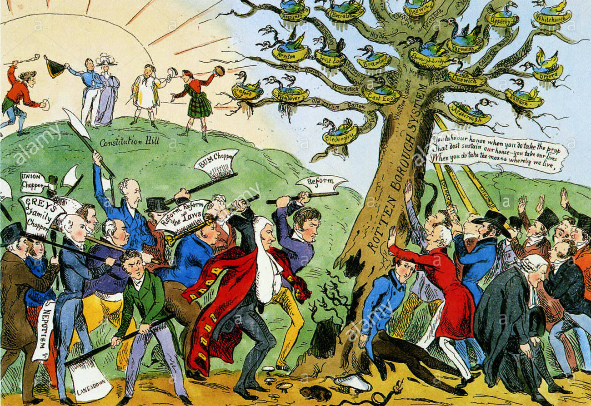
]
]

---

# The Great Reforms

.pull-left[

- 1830s a great period of reform in Parliament

- 1832 Great Reform Act
  - abolished tiny districts, gave seats to cities
  - Extends the franchise: all males owning/leasing £10 of property
  - a big change in the right direction (compared to before!)
  
]

.pull-right[
.center[
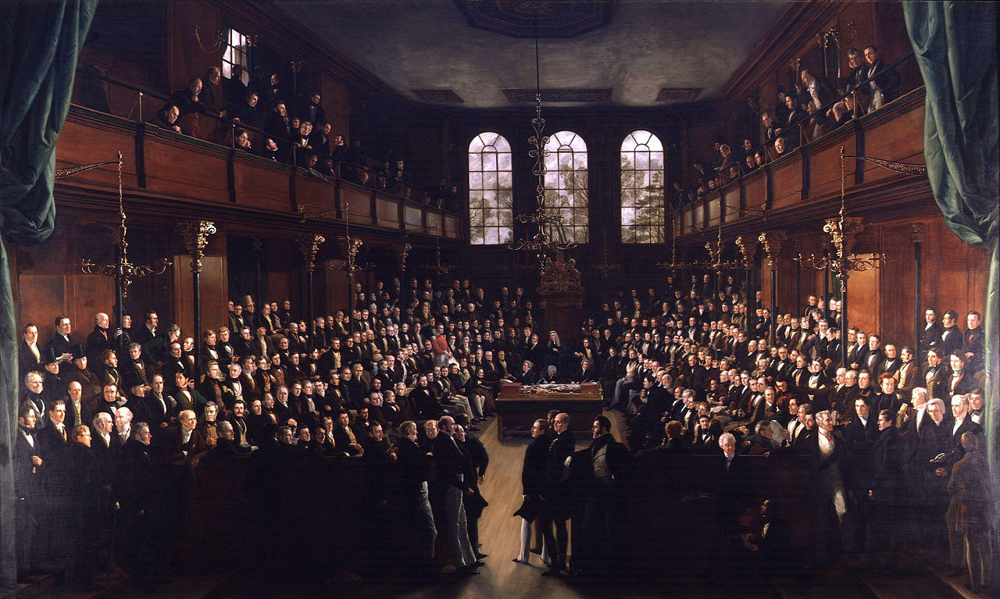
]
]

---

# The Great Reforms

.pull-left[
.quitesmall[
- Rising .hi-purple[Chartist movement] in 1830s-1850s, demands of the people for universal (male) suffrage and electoral reform

- “The People’s Charter” gathered millions of signatures with objectives:
  - Universal adult male sufferage
  - Secret ballot
  - No property qualifications for MPs
  - Salary for MPs
  - Equal constituencies
  - Annual elections

- Led to protests, riots, clashes with authorities, anti-monarchy conspiracies
  - mild compared to what was happening in Europe at this time!
]
]

.pull-right[
.center[
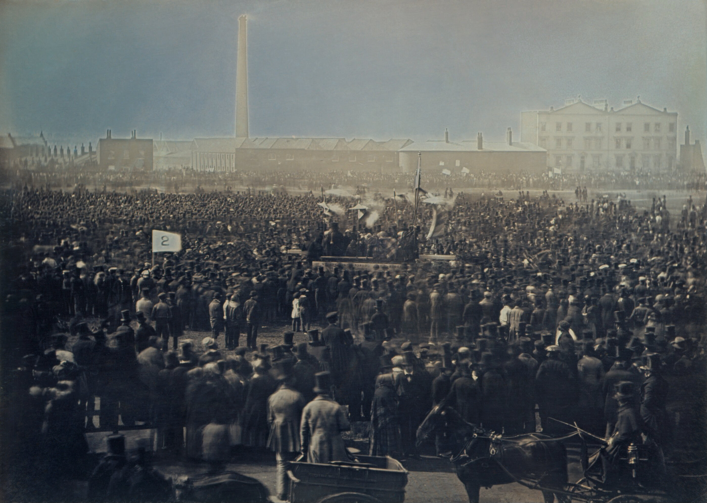
]
]

---

# The Great Reforms

.pull-left[
.quitesmall[
- *Gradually*, great reforms took place in Parliament over the latter half of 19<sup>th</sup> century

- Reform Acts 1867, 1884 — extends franchise to most male urban workers and then country farmers
- Reform Acts 1918, 1928 - removes property requirements to vote, extends franchise to women

- Other key changes
  - *Married Women's Property Act 1882*
  - Repeal of Corn Laws (1848)
  - Slavery Abolition Act (1833)

- Rise of competitive elections, mass political parties (Liberal and Conservative/Tory)
]
]
.pull-right[
.center[

]
]

---

# Meanwhile, in the Rest of Europe

.center[
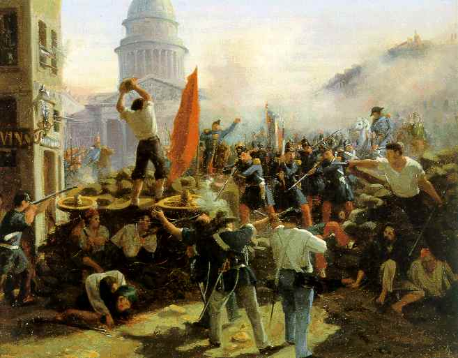
]

---

# “The Spring of Nations”

.pull-left[

- .hi[Revolutions of 1848]: largest widespread revolution in European history
  - goals to overthrow oppressive monarchy and enact liberal democracies
  - upsurge of nationalism in each country; populism & liberalism against monarchy and conservatism

- Primarily in France, “Germany”, Austrian Empire, and Italy

]

.pull-right[
.center[

]
]

---

# “The Spring of Nations”

.center[
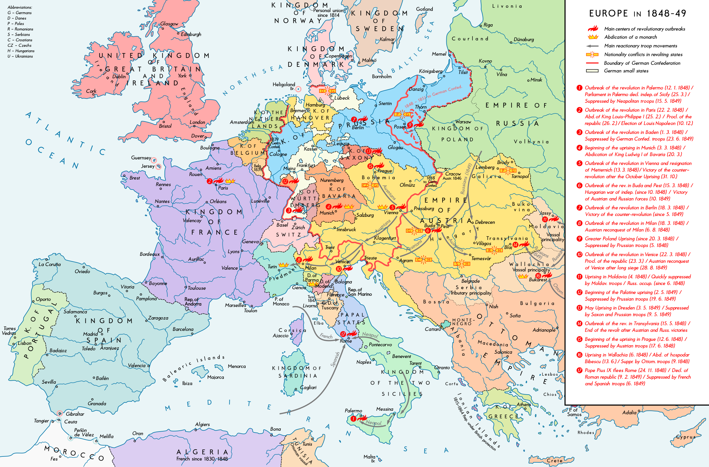
]

---

# The Revolutions of 1848: France

.pull-left[
- France overthrows King Louis Phillipe I

- Creates Second French Republic, elects President Charles-Louis Napoleon

- 3 years later, stages a coup and declares himself Emperor Napoleon III
]

.pull-right[
.center[
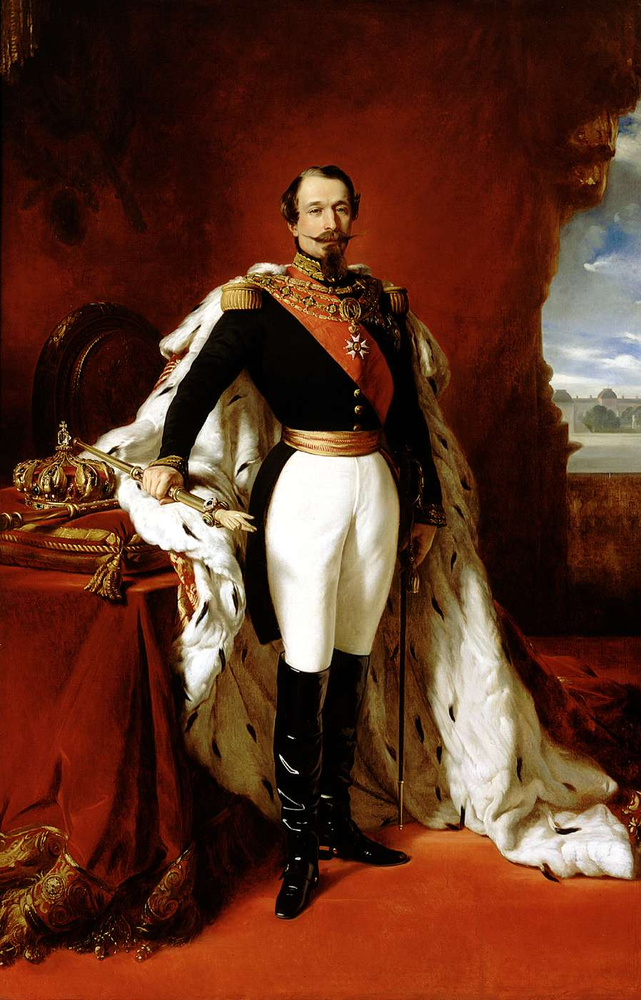
.smallest[
Charles-Louis Napoleon (Napoleon III)
]

]
]

---

# The Revolutions of 1848: Austrian Empire

.pull-left[

- In Austria, Czechs and Hungarians (among many others) revolt for national independence
  
- Revolts were suppressed by conservative monarchists

- But did get some reforms: end of serfdom (finally) 

- Will eventually lead to joint Austria-Hungary monarchy, and more autonomy for Bohemia (Czechs)
]

.pull-right[
.center[
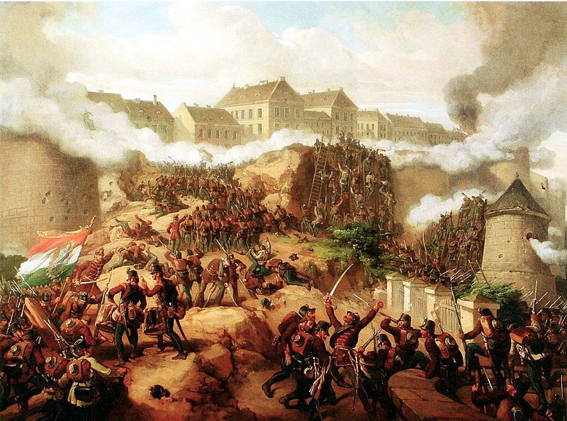
.smallest[
The Battle of Buda
]

]
]

---

# The Revolutions of 1848: German States

.pull-left[
.smallest[
- In German states, “pan-German” nationalism
  
- Rise against the oppressive monarchies
  - New middle class: liberalism
  - Working class/peasants: sought improvement in working conditions
  - Both classes split, and were suppressed by the conservative aristocracy; liberals forced into exile

- Conservative backlash in (rising) Prussia
  - Rising German nationalism will bring German Unification under a militaristic, dominant (conservative) Prussia 
]
]

.pull-right[
.center[
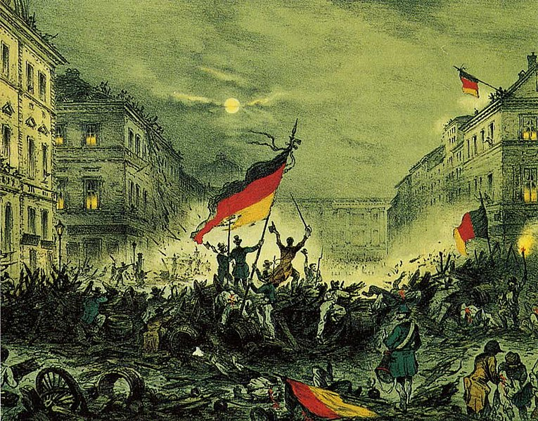
]
]

---

# Against this Backdrop: Communism!

.left-column[
.center[


Karl Marx (1818-1883)

Friedrich Engels (1820-1895)

]
]

.right-column[

.smallest[
> "A spectre is haunting Europe — the spectre of communism. All the powers of old Europe have entered into a holy alliance to exorcise this spectre: Pope and Tsar, Metternich and Guizot, French Radicals and German police-spies. Where is the party in opposition that has not been decried as communistic by its opponents in power? Where is the opposition that has not hurled back the branding reproach of communism, against the more advanced opposition parties, as well as against its reactionary adversaries? ... It is high time that Communists should openly, in the face of the whole world, publish their views, their aims, their tendencies, and meet this nursery tale of the Spectre of Communism with a manifesto of the party itself,” (Preamble).
]

.source[Marx, Karl and Friedrich Engels, 1848, [*Manifesto of the Communist Party*](https://www.marxists.org/archive/marx/works/1848/communist-manifesto/)]

]

---

# *Marxian* -Socialism: Motivating Ideals I

.left-column[
.center[


Karl Marx (1818-1883)

Friedrich Engels (1820-1895)

]
]

.right-column[

.quitesmall[
> "The history of all hitherto existing society is the .hi[history of class struggles]."

> "In the earlier epochs of history, we find almost everywhere a complicated arrangement of society into various orders, a manifold gradation of social rank. In ancient Rome we have patricians, knights, plebeians, slaves; in the Middle Ages, feudal lords, vassals, guild-masters, journeymen, apprentices, serfs; in almost all of these classes, again, subordinate gradations."

> "Our epoch, the epoch of the bourgeoisie, possesses, however, this distinct feature: it has simplified class antagonisms. Society as a whole is more and more splitting up into two great hostile camps, into two great classes directly facing each other — .hi[Bourgeoisie] and .hi[Proletariat]," (Bourgeois and Proletarians)

]


.source[Marx, Karl and Friedrich Engels, 1848, [*Manifesto of the Communist Party*](https://www.marxists.org/archive/marx/works/1848/communist-manifesto/)]

]
---


# *Marxian* -Socialism: Motivating Ideals II

.left-column[
.center[


Karl Marx (1818-1883)

Friedrich Engels (1820-1895)

]
]

.right-column[

.quitesmall[
> "In the national struggles of the proletarians of the different countries, .hi[[the Communists] point out and bring to the front the common interests of the entire proletariat, independently of all nationality.] [In] the various stages of development which the struggle of the working class against the bourgeoisie has to pass through, they always and everywhere represent the interests of the movement as a whole."

> "The immediate aim of the Communists is the same as that of all other proletarian parties: formation of the proletariat into a class, overthrow of the bourgeois supremacy, conquest of political power by the proletariat."

> "In this sense, the theory of the Communists may be summed up in the single sentence: .hi[Abolition of private property,] (Proletarians and Communists)

]
.source[Marx, Karl and Friedrich Engels, 1848, [*Manifesto of the Communist Party*](https://www.marxists.org/archive/marx/works/1848/communist-manifesto/)]

]


---

# *Marxian*-Socialism: Motivating Ideals III

.left-column[
.center[


Karl Marx (1818-1883)

Friedrich Engels (1820-1895)

]
]

.right-column[

.quitesmall[
> "The Socialist and Communist systems, properly so called, those of Saint-Simon, Fourier, Owen, and others, spring into existence in the early undeveloped period, described above, of the struggle between proletariat and bourgeoisie."

> "The undeveloped state of the class struggle, as well as their own surroundings, causes Socialists of this kind to consider themselves far superior to all class antagonisms. They want to improve the condition of every member of society, even that of the most favoured. Hence, they habitually appeal to society at large, without the distinction of class; nay, by preference, to the ruling class."

> "Hence, they reject all political, and especially all revolutionary action; they wish to attain their ends by peaceful means, necessarily doomed to failure, and by the force of example, to pave the way for the new social Gospel."

> "Such fantastic pictures of future society, painted at a time when the proletariat is still in a very undeveloped state and has but a fantastic conception of its own position...are of a purely Utopian character," (Socialist and Communist Literature)

]
.source[Marx, Karl and Friedrich Engels, 1848, [*Manifesto of the Communist Party*](https://www.marxists.org/archive/marx/works/1848/communist-manifesto/)]

]


---

class: inverse, center, middle

# Marx’s Methodology and Theory of History

---

# Hegelian Methodology

.left-column[
.center[


.smallest[
Georg Wilhelm Friedrich Hegel

1770-1831

]
]
]

.right-column[
.smallest[
- .hi[German idealism]: History<sup>.magenta[†]</sup> is a clear trend of abstract and unstoppable forces, manifested in *Zeitgeist*, the “spirit of the age”

- To understand History (and the future), one should not study the past, but study ideas

- Can be instantiated in *Volksgeist*, the “national spirit”, guided by the State to achieve the goals of History

- Praised/blamed for the rise of existentialism, communism, fascism, death of God theology, and historicist nihilism

- *Phänomenologie des Geistes, 1807* (*Phenomenology of Spirit*)
]

.footnote[<sup>.magenta[†]</sup> That’s History, with a capital H, mind you!]

]

---

# Hegelian Methodology

.left-column[
.center[


.smallest[
Georg Wilhelm Friedrich Hegel

1770-1831

]
]
]

.right-column[
.smallest[
- History unfolds in linear fashion as a constant march towards transcendence and Truth, as a .hi-purple[dialectical] struggle between a triad of ideological forces:
  - A **thesis**
  - An **antithesis** arises which contradicts the thesis
  - The death struggle between thesis and antithesis breeds a **synthesis**
  - This produces a new thesis, which will ultimately be opposed by an antithesis, which ... 
]

]

---

# Hegelian-Marxian Methodology

.left-column[
.center[

.smaller[
Karl Marx

1818-1883
]
]
]

.right-column[

- Marx adapts Hegel’s ideological dialectic and describes the unstoppable forces of History as a .hi-purple[*materialist* dialectic] between thesis & antithesis

]

---

# Marxian Methodology

.left-column[
.center[

.smaller[
Karl Marx

1818-1883
]
]
]

.right-column[

.quitesmall[
> [T]he leading thread in my studies, may be briefly summed up as follows: In the social production which men carry on they enter into definite relations that are indispensable and independent of their will; .hi[these relations of production] .hi[correspond to a definite stage] of development of their .hi[material powers of production]. The sum total of these .hi[relations of production constitutes the economic structure of society]—the real foundation, on which rise .hi[legal and political superstructures] and to which correspond definite forms of social consciousness. .hi[The mode of production in material life determines the general character of the social, political, and spiritual processes of life.] It is not the consciousness of men that determines their existence, but, on the contrary, their .hi[social existence determines their consciousness]. At a certain stage of their development, .hi[the material forces of production in society come in conflict with the existing relations of production]...with the property relations within which they had been at work before. From forms of development of the forces of production these relations turn into their fetters. .hi[Then comes the period of social revolution. With the change of the economic foundation the entire immense superstructure is more or less rapidly transformed.]

]

.source[Marx, Karl, *A Contribution to the Critique of Political Economy*]

]

---

# Marxian Methodology

.pull-left[
.center[


]
]

.pull-right[

- History pre-determined by material (economic) forces
  - .hi-purple[Base]: determined by what social class controls the .hi-purple[modes of production (MOP)]
  - Creates the .hi-purple[superstructure] of institutions (ideas, culture, religion, politics, the State) to *reinforce class relations*
  - Superstructure creates .hi[“class consciousness”] of beliefs

]

---

# Marxian Methodology

.pull-left[
.center[


]
]

.pull-right[
.smallest[
- In each period of History, .hi-purple[forces of production], the technology used in production, dictates the social .hi-purple[relations of production]
  - Agriculture & hand mills $\implies$ feudal lord oversees serf on common property
  - Steam mills & factories $\implies$ capitalist oversees laborer under private property

- Often about which group *owns* the .hi-purple[means of production]
  - private property vs. communal property
  - workers owning their own tools vs. company-owned tools, etc
]
]

---

# Marxian Methodology

.pull-left[
.center[


]
]

.pull-right[
.smallest[
- Materialist forces create the .hi-purple[superstructure] of ideas, institutions, religion, etc. to enforce a .hi-purple[consciousness] that protects the status quo

- But changes in forces of production (tech.) $\implies$ changes in the “correct” relations of production!
  - Creates contradictions within the system
  - Empowers underclass to overthrow ruling class, seize the means of production
  - Old superstructure collapses, creates a new base & new superstructure
]
]

---

# Marxian Methodology

.pull-left[
.center[


]
]

.pull-right[
.smaller[
Stages of History:

- **Primitive communism**: hunter-gatherers with no social classes
- **Ancient MOP**: Citizens $>$ Slaves
- **Feudal MOP**: Nobility $>$ Serfs & Bourgeoisie
- **Capitalist MOP**: Bourgeoisie $>$ Proletariat
- **Communist MOP**: Proletariat ushers in classless, stateless, society
]
]

---

# Capitalism and Socialism I

.center[

]

---

class: inverse, center, middle

# Marx’s Economic Analysis of Capitalism

---

# Alienation

.left-column[
.center[

.smaller[
Karl Marx

1818-1883
]
]
]

.right-column[
.smallest[
- In law, property is .hi-purple[alienable], it can be separated from a person and transferred (as in a gift or an exchange)
  - e.g. Declaration of Independence: natural rights are “unalienable”

- Marx: under capitalism, labor services are *alienated* from workers for production and market exchange
  - Labor is .hi-purple[commodified] and sold on markets; corrupting or hollowing out human flourishing

- Alienation and commodification are *essential* to market exchange and private propety: the point is to produce and sell something that another will own
]
]

---

# Alienation

.left-column[
.center[

.smaller[
Karl Marx

1818-1883
]
]
]

.right-column[
.smaller[
- Classical economists accepted all of this, did not discuss effects of market commodification on people

- Marx thought economists were neglecting this, and we need to study:

> “[P]rivate property, avarice and the separation of labor, capital, and landed property; between exchange and competition, value and the devaluation of men, monopoly and competition, etc.; the connection between this whole estrangement and the money system.”

]

.source[Marx, Karl, 1844, *Economic and Philosophical Manuscripts of 1844*]

]

---

# Capitalism and Social Classes

.left-column[
.center[

.smaller[
Karl Marx

1818-1883
]
]
]

.right-column[

- Marx’s goal to understand and explain the relations of production & the superstructure and how it affects individuals

- Separation of labor from ownership of the means of production (owned by capitalists)
  - workers no longer own their own workshops, tools, or raw materials

- Classical society largely two classes: .hi[bourgeoisie] (capitalists) and .hi[proletariat] (labor, primarily urban)

]

---

# Relative Price Theory & Labor Theory of Value

.left-column[
.center[

.smaller[
Karl Marx

1818-1883
]
]
]

.right-column[

- Essentially uses Ricardo’s .hi-purple[labor cost theory of value]: relative prices of goods on markets are determined by their relative labor time necessary to produce

- Faces same unsolvable problems as Smith & Ricardo
  - differing skills, disagreeableness, amount of capital, fertility of land

- Marx simplifies (away from differing skills, etc.) to .hi-purple[“socially necessary labor time”] as the main input, an abstract, homogenous, amount of labor with *average* skills, needed to produce one unit of a good

]

---

# Relative Price Theory & Labor Theory of Value

.left-column[
.center[

.smaller[
Karl Marx

1818-1883
]
]
]

.right-column[

- Marx: “capital” defined as indirect, stored-up labor (like Ricardo), resolving all goods into labor-time

- Assumes constant labor/capital ratio across industries (same “capital intensity”)

- Ignores differing fertility of lands in production
  - Apparently by the end of his life he used Ricardian rent theory

]

---

# Value Theory and Exploitation

.left-column[
.center[

.smaller[
Karl Marx

1818-1883
]
]
]

.right-column[

- Recall: Smithean .hi[use value vs. exchange value]
  - In primitive society, all production was for immediate consumption (use value), no market exchange

- Marx: price of good resolved into two components:
  - cost of production (i.e. labor-time)
  - .hi-purple[“surplus value”]: difference between price and cost

- Labor is the only source of value, but .hi-purple[workers aren’t paid the full value of the product]!

]

---

# Value Theory and Exploitation

.left-column[
.center[

.smaller[
Karl Marx

1818-1883
]
]
]

.right-column[
.smallest[
- .hi-purple[Labor is exploited by capital]; .hi-purple[Proletariat is exploited by Bourgeoisie]

- Capitalist direct production to produce goods for their *exchange value* on the marketplace, in pursuit of profit, rather than for their use value
  - trying to get more exchange value *beyond* mere use value, i.e. profit

- Marxist methodology: because capitalists *own* the means of production (private property, factories, tools, etc) and workers do not, capitalists can control & exploit labor
  - Keep wages low so profits are high
]
]

---

# Marxian “Laws of Capitalism”

.left-column[
.center[

.smaller[
Karl Marx

1818-1883
]
]
]

.right-column[

- Using Marx’s methodology, given the current (then and now) modes and relations of production, and the ideological superstructure defending bourgeois capitalism, contradictions must arise

- These contradictions (continue to) set in motion the materialist dialectic of History, and sow the seeds of capitalism’s future destruction and transformation into socialism

]

---

# Marxian “Laws of Capitalism”

.left-column[
.center[

.smaller[
Karl Marx

1818-1883
]
]
]

.right-column[

- Marxian major .hi-purple[principles] or .hi-purple[“laws of capitalism”]:
  1. reserve army of the unemployed
  2. declining rate of profit
  3. business crises
  4. concentration of industry/capital
  5. immiseration of the Proletariat

]

---

# Marx as Mostly Classical Economist

.left-column[
.center[

.smaller[
Karl Marx

1818-1883
]
]
]

.right-column[
.smallest[
- In his analysis, uses most of the classical (Ricardian) tools and assumptions to analyze:
  - Labor cost theory of value
  - Neutral money
  - Diminishing returns in agriculture
  - Constant returns in manufacturing
  - Perfect competition
  - Rational agents
  - Wages fund doctrine

- Rejected Malthusian population principle, full employment (Say’s Law), and Ricardo’s production function (i.e. homogenous “doses” of L+K)

- Differences vs. Classicals/Ricardo are not in analysis, only in ideology!
]
]

---

# The Reserve Army of the Unemployed

.left-column[
.center[

.smaller[
Karl Marx

1818-1883
]
]
]

.right-column[
.smallest[

- Rejects Malthusian population principle
  - But it explains why, with economic growth (capital accumulation), wages don’t squeeze profits to zero (population increases, depressing real wages to subsistence)

- Marx needs to explain existence of surplus value & profits under capital accumulation and rising wages
  - Solution: .hi-purple[“reserve army of the unemployed”], an excess supply *always* exists in labor markets!
  - This depresses wages, keeping surplus value & profits positive
  - Machines replacing labor (wage increases cause capitalists to substitute cheaper capital for labor)

]
]

---

# Declining Rate of Profit

.left-column[
.center[

.smaller[
Karl Marx

1818-1883
]
]
]

.right-column[
.smallest[

- Smith, Ricardo, Mill: in long run, profit declines from more competition

- Marx: With capital accumulation, and rising wages, capitalists substitute machinery for labor, further increasing supply of capital and pushing down profits

- Problem — two opposing forces affect rate of profits:
  - capital subject to diminishing returns, increases in capital lower profits
  - technological improvement increases profits
  - so an *empirical* question: compare rate of capital accumulation with rate of technological improvement
]
]

---

# Declining Rate of Profit

.left-column[
.center[


Vladimir Lenin 

(1870-1924)

]
]

.right-column[

- Lenin would extend Marx to say that capitalists’ continual search for profits while they are declining force the search for new markets

- Imperialism and colonialism

- Dump the surplus of overproduction in other countries

.source[Lenin, Vladmir, 1917, *Imperialism: The Highest Stage of Capitalism*]

]

---

# Business Crises

.left-column[
.center[

.smaller[
Karl Marx

1818-1883
]
]
]

.right-column[
.smallest[

- Recognized that occasional depressions happen under capitalism

- Overproduction, violations of Say’s Law

- But Marx had no *theory* of the business cycle (why it happens and what causes it)

- Hypothesized that sudden bursts of technological change could generate a depression
  - increase capital accumulation $\rightarrow$ increased wages & smaller reserve army $\rightarrow$ fall of profit and surplus value $\rightarrow$ spiral into depression
  - but this creates opportunity for expansion: unemployed labor $\rightarrow$ lowers wages $\rightarrow$ restores profits & production again
]
]

---

# Concentration of Capital

.left-column[
.center[

.smaller[
Karl Marx

1818-1883
]
]
]

.right-column[
.smaller[

- With greater capital accumulation, firms will grow larger and fewer, more centralized command of capital, leading to monopolies

> “The battle of competition is fought by cheapening of commodities. The cheapness of commodities depends, ceteris paribus, on the productiveness of labor, and this again on the scale of production. Therefore, the larger capitals beat the smaller.”

- Larger firms achieve economies of scale, outcompete smaller firms, grow market power
]
]

---

# Concentration of Capital

.left-column[
.center[

.smaller[
Karl Marx

1818-1883
]
]
]

.right-column[
.smallest[

- Corporations further increase centralization

- Corporation $\implies$ .hi-purple[separation of ownership and control]

.quitesmall[
> “enterprises assume the form of social enterprises as distinguished from individual enterprises. It is the abolition of capital as private property within the boundaries of capitalist production itself. Transformation of the actually functioning capitalist into a mere manager, an administrator of other people’s capital, and of the owners of capital into mere owners, mere money capitalists”
]

- Lenin and later socialists will argue that monopoly/corporate capitalism is the transition stage to socialism:
  - just replace “managers” with government, “shareholders” with society; run the economy as a giant corporation!
]
]

---

# Concentration of Capital

.left-column[
.center[

.smaller[
Karl Marx

1818-1883
]
]
]

.right-column[
.smaller[

- Existence of credit markets further increase centralization

> “a new aristocracy of finance, a new sort of parasites in the shape of promoters, speculators, and merely nominal directors; a whole system of swindling and cheating by means of corporation juggling, stock jobbing, and stock speculation. It is private production without the control of private property.”

]
]


---

# Immiseration of the Proletariat

.left-column[
.center[

.smaller[
Karl Marx

1818-1883
]
]
]

.right-column[
.smaller[

- Several interpretations:
  1. absolute income to Proletariat decreases as capitalism grows
  2. *relative* income (“labor’s share”) to Proletariat decreases as capitalism grows
  3. workers become miserable in a noneconomic, nonmaterial sense (spiritual sense?)

- 1 and 2 were proved flat wrong: increasing prosperity after industrial revolution, labor’s share of income is *remarkably* constant over time (~65-75%)

]
]

---

# Immiseration of the Proletariat

.left-column[
.center[

.smaller[
Karl Marx

1818-1883
]
]
]

.right-column[
.smaller[

- Marx has a point about immiseration, are we *happier* under capitalism?

> “[I]n proportion as capital accumulates, the lot of the laborer, be his payment high or low, must grow worse [with] accumulation of misery, agony of toil, slavery, ignorance, brutality, mental degradation.”

- What is the relationship between economic growth and happiness??

]
]

---

# Influence of Marx and Marxism

.left-column[
.center[

.smaller[
Karl Marx

1818-1883
]
]
]

.right-column[
- Marx is probably the most well known “economist” in history to the average person (though they probably don’t think of him as an economist!)

- His influence on world ideas, politics, philosophy, and governments is undeniable

- In academia, Marxism remains alive and well, but none of it in economics departments!
  - Marx discarded & rebutted in mainstream economics by the 20<sup>th</sup> century
]

---

# Influence of Marx and Marxism: Socialist Countries

.center[
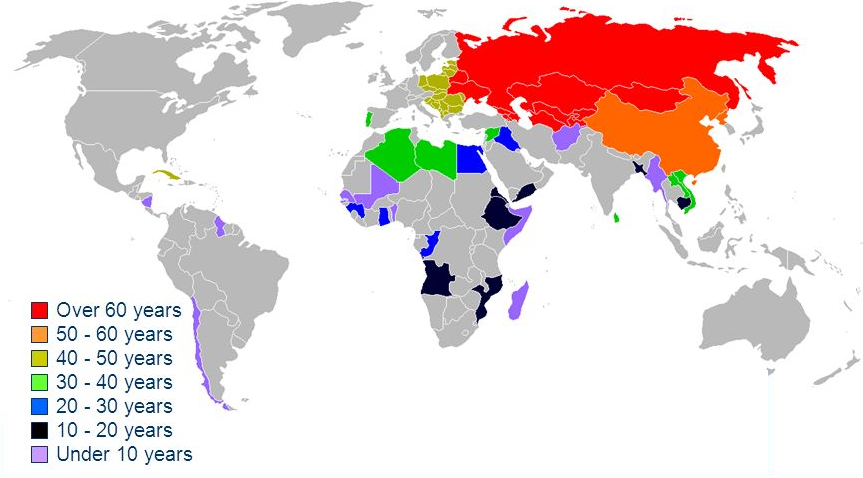

.source[Source: [Wikipedia](https://en.wikipedia.org/wiki/List_of_socialist_states#/media/File:Socialist_states_by_duration.png)]

]

---

# Influence of Marx and Marxism: Socialist Countries

.left-column[
.center[

.smaller[
Karl Marx

1818-1883
]
]
]

.right-column[
- Marx essentially brings about the end of the Classical system of Economics

- We will see shortly what emerges next, and what they thought of Marx

- Later, we will reexamine the economics of how socialism is supposed to work as economic system, because countries are going to try it!
  - .hi-purple[Socialist calculation debate] (1920s-1930s) between Marxist-Leninist socialist economists, Austrian economists, and neoclassical economists
]

---

# Influence of Marx and Marxism

.left-column[
.center[

.smaller[
Karl Marx

1818-1883
]
]
]

.right-column[
.smallest[
- Marx’s “laws of capitalism” explain only that there *are* contradictions, does not provide a theory to explain or predict depressions, monopolies, or unemployment; or how to solve them

- So what comes next (socialism), and how does it work? 

- In Marxian methodology: socialism is *defined as* merely the negation of capitalism
  - the antithesis to the thesis, that yields a synthesis
  - instead of bourgeois capitalists privately owning the means of production, they are seized by the Proletariat (through the State)
  - Marx spent little to no time on explaining how socialism ought to work, only wrote that it’s better! 🤷
]
]