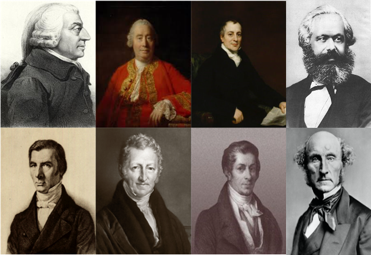

```{r setup, include=FALSE}
options(htmltools.dir.version = FALSE)
knitr::opts_chunk$set(echo=F,
                      message=F,
                      warning=F,
                      fig.retina=3)
library(tidyverse)
library(ggrepel)
library(ggthemes)
set.seed(256)
update_geom_defaults("label", list(family = "Fira Sans Condensed"))
```

class: inverse

# Outline

## [The Problem of Profit](#4)

## [The Problem of Interest](#17)

## [Böhm-Bawerk on Interest](#24)

## [Wicksell on Interest](#31)

## [Fisher on Interest](#37)

---

# Classical Confusion: Profits & Interest

.pull-left[

.smaller[
- Recall: Classical writers conflated profits and interest

- Divided up society in functional terms: land, labor, capital
  - each earns a return: wages, rent, profits

- Roles of capitalist and entrepreneur often were the same person, historically

- In modern times, capitalist and entrepreneur often (but not always) different persons
]
]
.pull-right[
.center[

]
]


---

class: inverse, center, middle

# The Problem of Profit

---

# Marginal Productivity Theory: The Problem of Profit

.left-column[
.center[


.smallest[
John Bates Clark

1847—1938
]
]
]

.right-column[
.smallest[
- J.B. Clark: is .hi[entrepreneurship] a *fourth* factor of production that is paid its marginal product?

- Entrepreneur *qua* .hi-turquoise[manager] of a firm does *not* earn profit, earns wage (for labor services of managing)

- .hi[“Pure profit”] must be a .hi-purple[residual] remaining after all factors of production (costs to firm) are paid
  - on competitive market in long run equilibrium, all factors are paid their marginal products, equal to opportunity cost, $p=MC$

- Real world profit exists, which must imply either:
  - real world markets are not perfectly competitive
  - real world markets are not in long run equilibrium
]
]

---

# Marginal Productivity Theory: The Problem of Profit

.left-column[
.center[


.smallest[
John Bates Clark

1847—1938
]
]
]

.right-column[
.smallest[
- Firms assume risks when they purchase factors of production in hopes of producing & selling output
  - Must contractually pay the factors
  - Must forecast consumers’ willingness to pay for the final product

- If $R(q)>C(q)$, then pure profits $\pi>0$
- If $R(q)<C(q)$, then losses $\pi<0$

- Profits in competitive markets must $\implies$ current disequilibrium as we are moving twaords long-run equilibrium (where $\pi = 0 )$
]
]

---

# Frank Knight

.left-column[
.center[


.smallest[
Frank H. Knight

1885-1972
]
]
]

.right-column[
.smallest[
- One of the key founders of the Chicago School of Economics
  - Milton Friedman, George Stigler, Ronald Coase, James Buchanan all famous students/influenced by Knight

- Marginalist who clarified the purpose of perfect competition model, profits, entrepreneurship
  - Largely from an exploration of *uncertainty*

- Famous 1921 dissertation from Cornell: *Risk, Uncertainty, and Profit*

- Other work on public policy, competition, implications of increasing returns, etc
]
]

---

# Profits and Uncertainty

.left-column[
.center[


.smallest[
Frank H. Knight

1885-1972
]
]
]

.right-column[

.smaller[
> ".hi[Uncertainty must be taken in a sense radically distinct from the familiar notion of Risk], from which it has never been properly separated...The essential fact is that .hi['risk' means in some cases a quantity susceptible of measurement], while at other times it is something distinctly not of this character; and there are far-reaching and crucial differences in the bearings of the phenomena depending on which of the two is really present and operating...It will appear that a measurable uncertainty, or 'risk' proper, as we shall use the term, is so far different from an unmeasurable one that it is not in effect an uncertainty at all," (p.21)

]
]

.source[Knight, Frank H, 1921, [*Risk, Uncertainty, and Profit*](https://oll.libertyfund.org/titles/knight-risk-uncertainty-and-profit)]

---

# Uncertainty $\neq$ Risk

.center[

<iframe width="560" height="315" src="https://www.youtube.com/embed/GiPe1OiKQuk" frameborder="0" allow="accelerometer; autoplay; encrypted-media; gyroscope; picture-in-picture" allowfullscreen></iframe>

]

---

# Uncertainty $\neq$ Risk

.left-column[
.center[

]
]

.right-column[

- **"Known knowns"**: .hi-purple[perfect information]

- **"Known unknowns"**: .hi-purple[risk]
  - We know the probability distribution of states that *could* happen
  - We just don't know *which* state will be realized
  - We can estimate probabilities, maximize expected value, minimize variance, etc.

]

---

# Uncertainty $\neq$ Risk

.left-column[
.center[

]
]

.right-column[

- **"Unknown unknowns**: .hi[uncertainty]
  - We don’t even know the probability distribution of states that *could* happen
  - No model to optimize in a world of uncertainty!
]

---

# Profits and Uncertainty

.left-column[
.center[


.smallest[
Frank H. Knight

1885-1972
]
]
]

.right-column[

> “The .hi[primary attribute of competition.]..is the .hi[‘tendency’ to eliminate profit or loss], and .hi[bring the value of economic goods to equality with their cost]...Hence .hi[the problem of profit is one way of looking at the problem between perfect competition and actual competition]....hi[The key to the whole tangle will be found to lie in the notion of risk or uncertainty] and the ambiguities concealed therein,” (pp.18-19).

]

.source[Knight, Frank H, 1921, [*Risk, Uncertainty, and Profit*](https://oll.libertyfund.org/titles/knight-risk-uncertainty-and-profit)]

---

# Profits and Uncertainty

.left-column[
.center[


.smallest[
Frank H. Knight

1885-1972
]
]
]

.right-column[

.smaller[

> “It is this .hi[‘true’ uncertainty], and .hi[not risk], as has been argued, which .hi[forms the basis of a valid theory of profit] and .hi[accounts for the divergence between actual and theoretical competition],” (pp.18-19).

> “The prime essential to that perfect competition which would secure in fact those results to which actual competition only ‘tends,’ is the absence of Uncertainty (in the true, unmeasurable sense)...[Risk] does not preclude perfect planning [and] cannot prevent the complete realization of the tendencies of competitive forces, or give rise to profit,” (pp.20-21)

]
]

.source[Knight, Frank H, 1921, [*Risk, Uncertainty, and Profit*](https://oll.libertyfund.org/titles/knight-risk-uncertainty-and-profit)]

---

# The Role of Entrepreneurial Judgment

.left-column[
.center[


.smallest[
Frank H. Knight

1885-1972
]
]
]

.right-column[

- .hi-purple[“Knightian uncertainty”]: not that we can’t assign probabilities to each outcome; we do not even have the knowledge necessary to list all possible outcomes!

- Requires .hi-purple[entrepreneurial judgment] to *both*:
  1. estimate possible actions *and*
  2. estimate the likelihood of their success

- .hi[Entrepreneur] is central player, earns pure profits (a residual, not a “marginal product”!) for *bearing uncertainty*
]

.source[Langlois, Richard L. and Metin Cosgel, 1993, "Frank Knight on Risk, Uncertainty, and the Firm: A New Interpretation," *Economic Inquiry* 31]

---

# Entrepreneurial Judgment

.left-column[
.center[

.smallest[
Henry Ford

1863-1947
]
]

]

.right-column[

> “If I had asked people what they wanted, they would have said **faster horses**.” - Henry Ford

]

---

# Entrepreneurial Judgment

.pull-left[
.center[

]
]

.pull-right[

> “It's really hard to design products by focus groups. A lot of times, **people don't know what they want until you show it to them**.” - Steve Jobs
]

---

class: inverse, center, middle

# The Problem of Interest

---

# The Problem of Interest

.pull-left[

- Remains controversial to this day

- “Capital” is:
  - hard to define or (especially) aggregate
  - necessarily bound up with time and uncertainty

]

.pull-right[
.center[

]
]

---

# History of Interest Theories

.pull-left[
.smallest[
- Mercatilists believed interest rates determined by monetary factors (money supply)
  - Cantillon: interest rates affected by real factors, but $\uparrow$ money supply might $\uparrow / \downarrow$ interest rates depending on who gets new money (savers or borrowers)

- Classicals argued for real (non-monetary) causes
  - Money is neutral, just a veil
  - Hume disproved monetary theory of interest rates with his thought experiments
  - interest determined by investment spending, productivity of capital
]
]

.pull-right[
.center[

]
]

---

# History of Interest Theories

.left-column[
.center[


Adam Smith

1723-1790
]
]

.right-column[
.smallest[

> “What is annually saved is as regularly consumed as what is annually spent, and nearly in the same time too; but it is consumed by a different set of people. That portion of his revenue which a rich man annually spends, is in most cases consumed by idle guests, and menial servants, who leave nothing behind them in return for their consumption. That portion which he annually saves, as for the sake of the profit it is immediately employed as a capital, is consumed in the same manner, and nearly in the same time too, but by a different set of people, by labourers, manufacturers, and artificers, who re-produce with a profit the value of their annual consumption,” (Book II, Chapter 3).

]
.source[Smith, Adam, 1776, [*An Enquiry into the Nature and Causes of the Wealth of Nations*](https://www.econlib.org/library/Smith/smWN.html)]

]

---

# History of Interest Theories

.left-column[
.center[


David Ricardo

1772-1823
]
]

.right-column[

> “[The interest rate depends] on the rate of profits which can be made by the employment of capital, and which is totally independent of the quantity, or of the value of money. Whether a Bank lent one million [£], ten million, or a hundred million, they would not permanently alter the market rate of interest, they would alter only the value of the money they had this issued.”

.source[Ricardo, David, 1817, *Principles of Political Economy and Taxation*]

]

---

# The Problem of Interest

.left-column[
.center[


.smallest[
John Bates Clark

1847—1938
]
]
]

.right-column[

- Marginal productivity theory & product exhaustion created a problem:
  - MPT explains all revenues from firm sales ultimately go to factors of production as income (costs to firm)
  - Each factor paid its marginal product, contribution to production

- So then what is this return on capital, interest, that seems *more* than is necessary to bring capital into use?
  - Capital owner seems to get *perpetual* flow of income as interest
]

---

# The Problem of Interest

.pull-left[
.quitesmall[
- .hi-turquoise[Capital is *not an original factor*], it is just land and labor combined in the past (i.e. someone had to make the shovel, the factory, etc. with land & labor)

- Marginal product of capital *should* just be the value of the land and labor used to make the capital in the past
  - But capital earns interest!

- Capital makes land & labor *more* productive, maybe interest is that extra productivity?
  - But: MPT implies that labor and land each are already paid *more* from their higher marginal products (due to having the capital)!

- Interest even exists in long-run equilibrium of perfect competition (when profits disappear)

]
]

.pull-right[
.center[

]
]

---

class: inverse, center, middle

# Böhm-Bawerk on Interest

---

# Eugen von Böhm-Bawerk

.left-column[
.center[


.smallest[
Eugen von Böhm-Bawerk

1851—1914
]
]
]

.right-column[

- Wrote to dispute Marxist exploitation theory (which condemns profit & interest as exploitation)
  - fundamental misunderstanding of capital, profit, and interest

- Writes against theories of interest based on:
  - monetary factors
  - exploitation (Marxism)
  - productivity of capital 

.source[Böhm-Bawerk, Eugen von, 1896 *Karl Marx and the Close of His System*

Böhm-Bawerk, Eugen von, 1884, *History and Critique of Interest Theories*
]
]

---
# Eugen von Böhm-Bawerk: On The Origin of Interest

.left-column[
.center[


.smallest[
Eugen von Böhm-Bawerk

1851—1914
]
]
]
.right-column[
.smallest[
- Source of interest is in the technological relationship between goods, independent of institutions
  - Even in a socialist society there would be interest

> “Present goods are, as a rule, worth more than future goods of a like kind a number. This proposition is the kernel and center of the interest theory which I have to present” (Positive Theory of Capital)

- Tried to explain why the exchange, the “agio” between present & Future goods is positive
  - premium on present goods
  - discount future goods

]
.source[Böhm-Bawerk, Eugen von, 1884, *History and Critique of Interest Theories*

Böhm-Bawerk, Eugen von, 1888, *The Positive Theory of Capital*

]
]

---

# Eugen von Böhm-Bawerk: On The Origin of Interest

.left-column[
.center[


.smallest[
Eugen von Böhm-Bawerk

1851—1914
]
]
]
.right-column[
.smallest[
- Famously gives three reasons for why present goods are valued higher than future goods

1. “Difference circumstances of want and provision in the present and future”

2. “We systemaically underestimate future wants, and the goods which are to satisfy them”

3. “More roundabout” methods of production are more productive than direct methods
  - not *all* roundabout methods, i.e. not Rube-Goldberg machines

]
.source[Böhm-Bawerk, Eugen von, 1884, *History and Critique of Interest Theories*

Böhm-Bawerk, Eugen von, 1888, *The Positive Theory of Capital*

]
]

---

# Eugen von Böhm-Bawerk: Roundaboutness

.left-column[
.center[


.smallest[
Eugen von Böhm-Bawerk

1851—1914
]
]
]
.right-column[
.smaller[
- Third reason generated the most controversy

- .hi-purple[“Roundaboutness”] implies a longer production period
  - Think about Menger’s (higher) orders of goods
  - Define .hi[“capital”] as .hi[“goods-in-process”] (orchard trees growing), i.e. goods of higher order (than 1)
  - Increasing capital inreases the length of the production process (reaches back into higher and higher orders)

- Tried to argue that production processes with more capital are more productive, and that they have a longer “average period of production” due to roundaboutness

]
.source[Böhm-Bawerk, Eugen von, 1888, *The Positive Theory of Capital*

]
]

---

# Eugen von Böhm-Bawerk: Roundaboutness

.left-column[
.center[


.smallest[
Eugen von Böhm-Bawerk

1851—1914
]
]
]
.right-column[
.smallest[
- Consider Robinson Crusoe fishing with his bare hands

.center[

]

]
.source[Böhm-Bawerk, Eugen von, 1888, *The Positive Theory of Capital*

]
]

---

# Eugen von Böhm-Bawerk: Roundaboutness

.left-column[
.center[


.smallest[
Eugen von Böhm-Bawerk

1851—1914
]
]
]
.right-column[
.smallest[
- Now suppose he invests in a net; by creating higher-order goods:
  1. increases the roundaboutness of production (goes through more orders, takes more time)
  2. increases the productivity of output

.center[

]

]
.source[Böhm-Bawerk, Eugen von, 1888, *The Positive Theory of Capital*

]
]

---

class: inverse, center, middle

# Wicksell on Interest

---

# Knut Wicksell on Interest

.left-column[
.center[


.smallest[
Knut Wicksell

1851—1926
]
]
]

.right-column[

- Praised and extended Böhm-Bawerk’s capital and interest theory

- Disagreed with roundaboutness (B-B's third reason), thought that waiting was sufficient to explain interest rates

]

---

# Knut Wicksell on Interest

.left-column[
.center[


.smallest[
Knut Wicksell

1851—1926
]
]
]

.right-column[
- Distinguished between:

- .hi[“Natural rate of interest”]: real rate of return on new capital

- vs. the “Market rate of interest”

- Saving = investment so long as market rate of interest $\approx$ natural rate of interest

.source[Wicksell, Knut, 1893, *Über Wert, Kapital und Rente*]
]

---

# Knut Wicksell’s Cumulative Process

.left-column[
.center[


.smallest[
Knut Wicksell

1851—1926
]
]
]

.right-column[
- .hi-purple[“Cumulative process”]: if market interest rates fall below the natural arte (because of banks overissuing credit), demand for loanable capital increases, but savings supplied would fall
  - investment would exceed savings (at lower rate)
  - this would increase spending, causing .hi-purple[inflation]

- Takes quantity theory of money and turns it into a full theory of prices

.source[Wicksell, Knut, 1893, *Über Wert, Kapital und Rente*]
]

---
# The Market for Loanable Funds

.pull-left[

- Consider the market for loanable funds

- Upward-sloping .red[Supply] of savings

- Downard-sloping .blue[Demand] for loans (credit)
  - investment — businesses looking for capital to build factories
  - consumption — consumers looking for auto loans, mortgages, etc

- Equilibrium “natural” rate of interest
]

.pull-right[
```{r}
demand=function(x){10-x}
supply=function(x){x}

# make plot 

lf<-ggplot(data.frame(x=c(0,10)), aes(x=x))+
  
  # curves 
  stat_function(fun=demand, geom="line", size=2, color="blue")+
  stat_function(fun=supply, geom="line", size=2, color="red")+
  geom_segment(x=5,y=0,xend=5,yend=5,linetype=3)+
  geom_segment(x=0,y=5,xend=5,yend=5,linetype=3)+
  #geom_text(aes(x=q_PC,y=w,label="N.E.",family = "Yanone Kaffeesatz Regular"),hjust=-0.1, vjust=-0.25, color="black")+
  annotate(geom = "label", x = 8, y = demand(8), label = "Demand (borrowers)",
           color = "blue", size = 6) +
  annotate(geom = "label", x = 8, y = supply(8), label = "Supply (savings)",
           color = "red", size = 6) +
  #annotate(geom = "label", x = 1.3, y = 5, label = "Consumer Surplus",
  #         color = "blue", size = 4.5) +
  scale_x_continuous(breaks = c(5),
                     labels = c(expression(q^{"*"})),
                     expand=c(0,0))+
  scale_y_continuous(breaks = c(5),
                     labels = c(expression(r^{"*"})),
                     limits = c(0,10),
                     expand=c(0,0))+
  theme_classic(base_family = "Fira Sans Condensed", base_size=20)+
  labs(x = "Quantity of Funds (q)",
       y = "Interest Rate (r)")
lf
```

]

---

# The Market for Loanable Funds

.pull-left[

- Suppose the market rate of interest $r_m$ is below the natural rate $r^\star$
  - likely caused by overissue of credit
  
- Here, savings, $q_s < q_d$, investment

- People will borrow and spend more than exists in real capital (savings)
  - leads to intial higher spending, inflation
  - may cause a boom and bust cycle, ending in depression (and deflation)
]

.pull-right[
```{r}
lf+geom_segment(x=3, y=3, xend=3, yend=0, linetype="dotted")+
  geom_segment(x=7, y=3, xend=7, yend=0, linetype="dotted")+
  geom_segment(x=0, y=3, xend=7, yend=3, linetype="dotted")+
  scale_x_continuous(breaks = c(3,5,7),
                     labels = c(expression(q[s]),expression(q[S==I]^{"*"}),expression(q[d])),
                     expand=c(0,0))+
  scale_y_continuous(breaks = c(3,5),
                     labels = c(expression(r[m]),expression(r^{"*"})),
                     limits = c(0,10),
                     expand=c(0,0))
```

]

---

class: inverse, center, middle

# Irving Fisher on Interest

---

# Irving Fisher

.left-column[
.center[


.smallest[
Irving Fisher

1867—1947
]
]
]

.right-column[
.smallest[
- One of the greatest American economists in the first half of 20<sup>th</sup> century

- Pioneer in capital & interest theory, quantity theory of money, debt-deflation theory of depression

- Inventor of the predecessor to Rolodex — earned a fortune

- A social reformer, a major Prohibitionist, teetotaler

- Probably the first “celebrity economist”
  - famously blew it in 1929, prognosticating that the “stock market has reached a permanently high plateau”

- 1907 *The Rate of Interest*, updated in 1930
]
]

---

# Fisher: Quantity Theory of Money

.left-column[
.center[


.smallest[
Irving Fisher

1867—1947
]
]
]

.right-column[
- .hi[“Equation of Exchange”]: $MV=PT$
  - $M$ is stock of money
  - $V$ is velocity of circulation
  - $P$ is price level
  - $T$ is index of transactions

- An accounting identity

- Developed theory of index numbers to measure $P$

]

---

# Fisher: Quantity Theory of Money

.left-column[
.center[


.smallest[
Irving Fisher

1867—1947
]
]
]

.right-column[

- .hi[“Equation of Exchange”]: $MV=PT$

- Exogenous $\Delta M \implies$ endogenous $\Delta P$ to equilibrate

- Two key results of quantity theory of money
  1. Money is neutral in the long run (no permanent change in $V$ or $Y)$ from $\Delta M$
  2. Price level is directly proportional to money stock $(P \propto M)$
]

---

# Fisher: The Fisher Equation

.left-column[
.center[


.smallest[
Irving Fisher

1867—1947
]
]
]

.right-column[
.smallest[
- .hi[Fisher hypothesis] (or .hi[Fisher effect]): .hi-purple[*real* interest rate] is independent of monetary factors (like nominal interest rate and expected inflation rate)
  - nominal interest rate must change exactly with inflation rate
  - monetary policy (e.g. new money) has no effect on real economy, money is neutral

- .hi[Fisher equation]: $r \approx i - \pi^{e}$
  - $r$: real interest rate
  - $i$: nominal interest rate
  - $\pi^e$: *expected* inflation rate
]
]
---

# Irving Fisher on Capital & Interest

.left-column[
.center[


.smallest[
Irving Fisher

1867—1947
]
]
]

.right-column[
.smallest[
- Thought Bohm-Bawerk's 3<sup>rd</sup> reason wouldn't exist without first two
  - For psychological reasons (first 2), individuals have a .hi-purple[time-preference] for present over future goods

- Discarded some incorrect parts of Bohm-Bawerk & essentially gave us our modern understanding of interest

- B-B had followed classical distinction: land, labor, capital
  - needed special theory to explain interest as return to capital, different from rent & wages

- Fisher objected to the sharp distinciton between wages, rent, interest
  - interest $\neq$ share of income going to capital
]
]

---
  
# Irving Fisher on Capital & Interest

.left-column[
.center[


.smallest[
Irving Fisher

1867—1947
]
]
]

.right-column[
- Examined .hi[flow of income] to all individuals (as factor owners) over time
  - .hi[“Capitalized value”] of income flow, discounted by current interest rate
  - Interest return on a resource $\implies$ comparing capitalized value with income flow over time

]

---

# Irving Fisher on Capital & Interest

.left-column[
.center[


.smallest[
Irving Fisher

1867—1947
]
]
]

.right-column[
.smallest[
- .hi-green[Example]: “Rent” on land — compare the future flow of rental income with capitalized value (price) of land, the return is *interest*
  - Price of land capitalizes the future-discounted flow of future services (income)

> “Rent and interest are merely two ways of measuring the same income,” (p.331)

- Same with labor income: obtaining higher skills will increase your future income flow, you are investing in your .hi-purple[human capital]
  - must decide if the cost is worth it, by comparing future-discounted expected income stream with vs. without skills

> “Interest is not a part, but the whole, of income.” (p.332)

]
]

---

# Irving Fisher on Capital & Interest

.left-column[
.center[


.smallest[
Irving Fisher

1867—1947
]
]
]

.right-column[
.smallest[
> “The value of the orchard depends upon the value of its crops: and in this dependence lurks implicitly the rate of interest itself.”

- .hi-purple[Interest rate is a price of future goods in terms of present goods]
  - How much individuals will pay to receive income now vs. later

> “the (percentage) excess of the present marginal want for one more unit of present goods over the present marginal want for one more unit of future goods”

- .hi-purple[Investment in capital]: present consumption can be saved to buy/build machinery that can increase future income flows

]
]

---

# Present vs. Future Goods

.pull-left[
- What *are* future goods?

- Futures: claims on goods to be delivered at a future date
  - corn futures, oil futures, etc.

- Financial assets: bonds, lottery winnings, IOUs

- Real goods: immature orchard of fruit trees; durable goods that yield output later

]

.pull-right[
.center[

]
]

---

# Present vs. Future Goods

.pull-left[
- Consider goods-bundles consumed now vs. consumed at later date
  - i.e. not apples vs. oranges, but apples and oranges **today** vs. apples and oranges **next year**

- .hi-purple[Agent's objective]: optimize time-profile of consumption, **maximize net present value**

- Fisher calls goods-bundles “income’ but he really just means *consumption*

]

.pull-right[
.center[

]
]

---

# Present vs. Future Goods

.pull-left[

.smallest[
- .hi-purple[Time Value of Money]: same nominal amount of money<sup>.magenta[†]</sup> is worth different amounts over time

$$\begin{align*}
PV &= \frac{FV}{(1+r)^n}\\
FV &= PV(1+r)^n\\ \end{align*}$$

- $PV$: present value
- $FV$: future value
- $r$: interest rate
- $n$: number of time periods
]

.footnote[<sup>.magenta[†]</sup> Or income, or consumption...]
]

.pull-right[
.center[

]
]

---

# Present vs. Future Goods

.pull-left[

- .hi-green[Example]: what is the present value of getting $1,000 one year from now at 5% interest?

$$\begin{align*}
PV &= \frac{FV}{(1+r)^n}\\
PV &= \frac{1000}{(1+0.05)^1}\\
PV &= \frac{1000}{1.05}\\
PV &= \$952.38\\ 
\end{align*}$$

]

.pull-right[
```{r}
ggplot(data = tibble(x=1:10), aes(x=x))+
    annotate("segment", x = 1, xend = 0.08, y = 1000, yend = 952.38, colour = "purple", size=2, alpha=1, arrow=arrow(length=unit(0.5,"cm"), ends="last", type="closed"))+
  geom_label(x=0.04,y=952.38,label="V(0)", color = "purple")+
  geom_label(x=1,y=1000,label="V(1)", color = "purple")+
  scale_x_continuous(breaks=seq(0,1,1),
                     limits = c(0,1.5),
                     expand = c(0,0))+
  scale_y_continuous(breaks=seq(0,1200,50),
                     labels = scales::dollar,
                     limits=c(900,1200))+
  coord_cartesian(clip = "off")+
  labs(x = "Time",
       y = "Value",
       title = "Discounting")+
  theme_classic(base_family = "Fira Sans Condensed", base_size =16)

```
]

---

# Present vs. Future Goods

.pull-left[

- .hi-green[Example]: what is the *future* value of $1,000 lent for one year at 5% interest?

$$\begin{align*}
FV &= PV(1+r)^n\\
FV &= 1000(1+0.05)^1\\
FV &= 1000(1.05)\\
FV &= \$1050\\
\end{align*}$$

]

.pull-right[
```{r}
ggplot(data = tibble(x=1:10), aes(x=x))+
    annotate("segment", x = 0, xend = 0.95, y = 1000, yend = 1050, colour = "purple", size=2, alpha=1, arrow=arrow(length=unit(0.5,"cm"), ends="last", type="closed"))+
  geom_label(x=0.04,y=1000,label="V(0)", color = "purple")+
  geom_label(x=1,y=1050,label="V(1)", color = "purple")+
  scale_x_continuous(breaks=seq(0,1,1),
                     limits = c(0,1.5),
                     expand = c(0,0))+
  scale_y_continuous(breaks=seq(0,1200,50),
                     labels = scales::dollar,
                     limits=c(900,1200))+
  coord_cartesian(clip = "off")+
  labs(x = "Time",
       y = "Value",
       title = "Earning Interest")+
  theme_classic(base_family = "Fira Sans Condensed", base_size =16)

```
]

---


# Time Preference: Present vs. Future Goods

.pull-left[
.smallest[
- Individuals have a .hi-purple[time preference] (“impatience”), a subjective ranking over bundles of consumption $(c_0,c_1)$:
  - $c_0$: current consumption (period $t=0)$
  - $c_1$: future consumption (period $t=1)$

- Represent as an indifference curve

- .hi-purple[Marginal Rate of (Intertemporal) Substitution]: rate at which person gives up future goods $(c_1)$ in order to obtain 1 more present good $(c_0)$
  - Just the slope
]
]

.pull-right[
```{r}
IC=function(x){6.5/x}

ic<-ggplot(data.frame(x=c(0,10)), aes(x=x))+
  stat_function(fun=IC, geom="line", size=2, color = "#73D055FF")+
  geom_label(x = 4.5, y = IC(4.5), color = "#73D055FF", label = expression(U[1]))+
    scale_x_continuous(breaks=NULL,
                     limits=c(0,5),
                     expand=expand_scale(mult=c(0,0.1)))+
  scale_y_continuous(breaks=NULL,
                     labels=c(0,expression(y[1]),expression(c[1]^{"*"}),expression(w[0]*(1+r))),
                     limits=c(0,10),
                     expand=expand_scale(mult=c(0,0.1)))+
    labs(x = expression(paste("Current Consumption, ", c[0])),
       y = expression(paste("Future Consumption, ", c[1]))
       #caption = expression(paste(u(x,y)== sqrt(xy), ", ", m, " = $20, ", p[x]," = $1, ", p[y]," = $2", sep=" "))
       )+
  theme_classic(base_family = "Fira Sans Condensed", base_size=20)
ic
```

]

---

# Time Preference: Present vs. Future Goods

.pull-left[
.smallest[

- Individual has current wealth $w_0$

- Opportunities for market exchange in .hi-purple[credit markets]
  - exchange present goods for claims on future goods with interest rate $r$
  - will enjoy future consumption $(1+r)$ times however much is saved & lent

]
]

.pull-right[

```{r}
BC=function(x){5-1*x}

ggplot(data.frame(x=c(0,10)), aes(x=x))+
  stat_function(fun=IC, geom="line", size=2, color = "#73D055FF")+
  geom_label(x = 4.5, y = IC(4.5), color = "#73D055FF", label = expression(U[1]))+
  stat_function(fun=BC, geom="line", size=2, color = "red")+
    scale_x_continuous(breaks=c(0,5),
                       labels=c(0,expression(w[0])),
                     limits=c(0,5),
                     expand=expand_scale(mult=c(0,0.1)))+
  scale_y_continuous(breaks=c(0,5),
                     labels=c(0,expression(w[0]*(1+r))),
                     limits=c(0,10),
                     expand=expand_scale(mult=c(0,0.1)))+
  
  labs(x = expression(paste("Current Consumption, ", c[0])),
       y = expression(paste("Future Consumption, ", c[1]))
       #caption = expression(paste(u(x,y)== sqrt(xy), ", ", m, " = $20, ", p[x]," = $1, ", p[y]," = $2", sep=" "))
       )+
  theme_classic(base_family = "Fira Sans Condensed", base_size=20)

```
]

---

# Time Preference: Present vs. Future Goods

.pull-left[
.smallest[
- For convenience, assume a .hi-turquoise[“numeraire”]: set price of current consumption $p_{c_0}=1$

- Conventionally, price of future goods in terms of present goods is $\frac{1}{(1+r)}$
  - e.g. if $r=0.10$ (10%), must give up 1.10 units of future good for 1 unit of present good, & vice-versa

- Slope of .red[market exchange line] is ratio of prices: $-\frac{\Delta c_1}{\Delta c_0}=-\frac{p_{c_0}}{p_{c_1}}$; with $p_{c_0}=1$, slope is $-(1+r)$
]
]

.pull-right[

```{r}
BC=function(x){5-1*x}

ggplot(data.frame(x=c(0,10)), aes(x=x))+
  stat_function(fun=IC, geom="line", size=2, color = "#73D055FF")+
  geom_label(x = 4.5, y = IC(4.5), color = "#73D055FF", label = expression(U[1]))+
  stat_function(fun=BC, geom="line", size=2, color = "red")+
    scale_x_continuous(breaks=c(0,5),
                       labels=c(0,expression(w[0])),
                     limits=c(0,5),
                     expand=expand_scale(mult=c(0,0.1)))+
  scale_y_continuous(breaks=c(0,5),
                     labels=c(0,expression(w[0]*(1+r))),
                     limits=c(0,10),
                     expand=expand_scale(mult=c(0,0.1)))+
  
  labs(x = expression(paste("Current Consumption, ", c[0])),
       y = expression(paste("Future Consumption, ", c[1]))
       #caption = expression(paste(u(x,y)== sqrt(xy), ", ", m, " = $20, ", p[x]," = $1, ", p[y]," = $2", sep=" "))
       )+
  theme_classic(base_family = "Fira Sans Condensed", base_size=20)

```
]

---

# Time Preference: Present vs. Future Goods

.pull-left[
.smallest[

- .hi-purple[Intertemporal “opportunity cost”]: 1 unit of present goods buys $(1+r)$ units of future goods; must give up $(1+r)$ units of future goods to get 1 unit of present good
  - Future goods are discounted by $\frac{1}{(1+r)}$

- Higher interest rate $r \implies$ steeper line, higher cost of present consumption relative to future consumption

- $r>0$, and slope is negative because it’s a price

]
]

.pull-right[

```{r}
BC=function(x){5-1*x}

ggplot(data.frame(x=c(0,10)), aes(x=x))+
  stat_function(fun=IC, geom="line", size=2, color = "#73D055FF")+
  geom_label(x = 4.5, y = IC(4.5), color = "#73D055FF", label = expression(U[1]))+
  stat_function(fun=BC, geom="line", size=2, color = "red")+
    scale_x_continuous(breaks=c(0,5),
                       labels=c(0,expression(w[0])),
                     limits=c(0,5),
                     expand=expand_scale(mult=c(0,0.1)))+
  scale_y_continuous(breaks=c(0,5),
                     labels=c(0,expression(w[0]*(1+r))),
                     limits=c(0,10),
                     expand=expand_scale(mult=c(0,0.1)))+
  
  labs(x = expression(paste("Current Consumption, ", c[0])),
       y = expression(paste("Future Consumption, ", c[1]))
       #caption = expression(paste(u(x,y)== sqrt(xy), ", ", m, " = $20, ", p[x]," = $1, ", p[y]," = $2", sep=" "))
       )+
  theme_classic(base_family = "Fira Sans Condensed", base_size=20)

```
]

---

# Time Preference: Present vs. Future Goods

.pull-left[
.smallest[
- Individual starts with some .hi-turquoise[endowment] bundle, Y: $(y_0,y_1)$
]
]

.pull-right[

```{r}
points1<-tribble(
  ~letter, ~x, ~y,
  "Y", 4, 1
)

ggplot(data.frame(x=c(0,10)), aes(x=x))+
  stat_function(fun=IC, geom="line", size=2, color = "#73D055FF")+
  geom_label(x = 4.5, y = IC(4.5), color = "#73D055FF", label = expression(U[1]))+
  stat_function(fun=BC, geom="line", size=2, color = "red")+
  geom_point(data = points1,
             mapping=aes(x=x, y=y),
             size = 3)+
  geom_text_repel(data = points1,
             mapping=aes(x=x, y=y,
             label = letter),
             size = 6,
             seed = 2)+
  geom_segment(x = 0, xend = 4, y = 1, yend=1, linetype="dotted", size=1)+
  geom_segment(x = 4, xend = 4, y = 1, yend=0, linetype="dotted", size=1)+
    scale_x_continuous(breaks=c(0,4,5),
                       labels=c(0,expression(y[0]), expression(w[0])),
                     limits=c(0,5),
                     expand=expand_scale(mult=c(0,0.1)))+
  scale_y_continuous(breaks=c(0,1, 5),
                     labels=c(0,expression(y[1]), expression(w[0]*(1+r))),
                     limits=c(0,10),
                     expand=expand_scale(mult=c(0,0.1)))+
  
  labs(x = expression(paste("Current Consumption, ", c[0])),
       y = expression(paste("Future Consumption, ", c[1]))
       #caption = expression(paste(u(x,y)== sqrt(xy), ", ", m, " = $20, ", p[x]," = $1, ", p[y]," = $2", sep=" "))
       )+
  theme_classic(base_family = "Fira Sans Condensed", base_size=20)
```
]

---

# Time Preference: Present vs. Future Goods

.pull-left[
.smallest[
- Individual starts with some .hi-turquoise[endowment] bundle, Y: $(y_0,y_1)$

- “Excess demand” amount consumer wishes to consume (for $c_0$ or $c_1)$ relative to their endowment
  - Positive or negative, depending on time preference and interest rate
  - Negative excess demand for $c_0 \implies$ will save & lend present goods
  - Positive excess demand for $c_1 \implies$ will consume more in future
]
]

.pull-right[

```{r}
points<-tribble(
  ~letter, ~x, ~y,
  "Y", 4, 1,
  "C", 2.5, 2.5)

opt<-ggplot(data.frame(x=c(0,10)), aes(x=x))+
  stat_function(fun=IC, geom="line", size=2, color = "#73D055FF")+
  geom_label(x = 4.5, y = IC(4.5), color = "#73D055FF", label = expression(U[1]))+
  stat_function(fun=BC, geom="line", size=2, color = "red")+
  geom_point(data = points,
             mapping=aes(x=x, y=y),
             size = 3)+
  geom_text_repel(data = points,
             mapping=aes(x=x, y=y,
             label = letter),
             size = 6,
             seed = 2)+
  geom_segment(x = 0, xend = 4, y = 1, yend=1, linetype="dotted", size=1)+
  geom_segment(x = 4, xend = 4, y = 1, yend=0, linetype="dotted", size=1)+
  
  geom_segment(x = 0, xend = 2.5, y = 2.5, yend=2.5, linetype="dotted", size=1)+
  geom_segment(x = 2.5, xend = 2.5, y = 2.5, yend=0, linetype="dotted", size=1)+
    scale_x_continuous(breaks=c(0,2.5,4,5),
                       labels=c(0,expression(c[0]^{"*"}),expression(y[0]),expression(w[0])),
                     limits=c(0,5),
                     expand=expand_scale(mult=c(0,0.1)))+
  scale_y_continuous(breaks=c(0,1,2.5,5),
                     labels=c(0,expression(y[1]),expression(c[1]^{"*"}),expression(w[0]*(1+r))),
                     limits=c(0,10),
                     expand=expand_scale(mult=c(0,0.1)))+
  labs(x = expression(paste("Current Consumption, ", c[0])),
       y = expression(paste("Future Consumption, ", c[1]))
       #caption = expression(paste(u(x,y)== sqrt(xy), ", ", m, " = $20, ", p[x]," = $1, ", p[y]," = $2", sep=" "))
       )+
  theme_classic(base_family = "Fira Sans Condensed", base_size=20)
opt
```
]

---

# Time Preference: Present vs. Future Goods

.pull-left[
.smallest[
- This individual will trade away (save & lend) $(y_0-c^*_0)$ of $c_0$ to earn $(c^*_1-y_1)$ of $c_1$

- To reach consumption optimum C: $(y_0^*,y_1^*)$
$$MRIS=\frac{p_{c_0}}{p_{c_1}}=\frac{1}{(1+r)}$$
]
]

.pull-right[
```{r}
opt+
  annotate("segment", x = 4, xend = 2.5, y = 1, yend = 1, colour = "purple", size=2, alpha=1, arrow=arrow(length=unit(0.5,"cm"), ends="last", type="closed"))+
  geom_label(x=3.5,y=1, label="Lend", color = "purple")+
  annotate("segment", x = 2.5, xend = 2.5, y = 1, yend = 2.5, colour = "purple", size=2, alpha=1, arrow=arrow(length=unit(0.25,"cm"), ends="last", type="closed"))+
  geom_label(x=2.5,y=1.75, label="Earn", color = "purple")
```
]

---

# Time Preference: Present vs. Future Goods

.pull-left[
.smallest[
- If the market interest rate changes from $r_1 \rightarrow r_2$, will change consumption optima to D

- Higher interest rate $r \implies$ steeper line, higher cost of present consumption relative to future consumption

- Increase in the interest rate $(r_1 \rightarrow r_2)$
  - Consume less today $y_0 \rightarrow c_0'$
  - Earn more in future $y_1 \rightarrow c_1'$

- Decrease in the interest rate $(r_1 \leftarrow r_2)$
  - Consume more today $y_0 \rightarrow c_0*$
  - Earn less in future $y_1 \rightarrow c_1*$

]
]

.pull-right[
```{r}
points3<-tribble(
  ~letter, ~x, ~y,
  "Y", 4, 1,
  "C", 2.5, 2.5,
  "D", 2.25,3.625)

BC2=function(x){7-1.5*x}
IC2=function(x){8.5/x}

ggplot(data.frame(x=c(0,10)), aes(x=x))+
  stat_function(fun=IC, geom="line", size=2, color = "#73D055FF")+
  geom_label(x = 4.5, y = IC(4.5), color = "#73D055FF", label = expression(U[1]))+
  stat_function(fun=IC2, geom="line", size=2, color = "#3CBB75FF")+
  geom_label(x = 4, y = IC2(4), color = "#3CBB75FF", label = expression(U[2]))+
  stat_function(fun=BC, geom="line", size=2, color = "red")+
  stat_function(fun=BC2, geom="line", size=2, color = "darkred")+
  geom_point(data = points3,
             mapping=aes(x=x, y=y),
             size = 4)+
  geom_text_repel(data = points3,
             mapping=aes(x=x, y=y,
             label = letter),
             size = 6,
             seed = 2)+
  geom_segment(x = 0, xend = 4, y = 1, yend=1, linetype="dotted", size=1)+
  geom_segment(x = 4, xend = 4, y = 1, yend=0, linetype="dotted", size=1)+
  
  geom_segment(x = 0, xend = 2.5, y = 2.5, yend=2.5, linetype="dotted", size=1)+
  geom_segment(x = 2.5, xend = 2.5, y = 2.5, yend=0, linetype="dotted", size=1)+
  
    geom_segment(x = 0, xend = 2.25, y = 3.625, yend=3.625, linetype="dotted", size=1)+
  geom_segment(x = 2.25, xend = 2.25, y = 3.625, yend=0, linetype="dotted", size=1)+

    scale_x_continuous(breaks=c(0,2.25,2.5,4,5),
                       labels=c(0,expression(c[0]*minute), expression(c[0]^{"*"}),expression(y[0]),expression(w[0])),
                     limits=c(0,5),
                     expand=expand_scale(mult=c(0,0.1)))+
  scale_y_continuous(breaks=c(0,1,2.5,3.625,5,7),
                     labels=c(0,expression(y[1]),expression(c[1]^{"*"}),expression(c[1]*minute),expression(w[0]*(1+r[1])), expression(w[0]*(1+r[2]))),
                     limits=c(0,10),
                     expand=expand_scale(mult=c(0,0.1)))+
  labs(x = expression(paste("Current Consumption, ", c[0])),
       y = expression(paste("Future Consumption, ", c[1]))
       #caption = expression(paste(u(x,y)== sqrt(xy), ", ", m, " = $20, ", p[x]," = $1, ", p[y]," = $2", sep=" "))
       )+
  theme_classic(base_family = "Fira Sans Condensed", base_size=20)
```
]

---

# Time Preference: Present vs. Future Goods

.pull-left[

- Market interest rate determined by summing up all individual:
  - .blue[Excess demand for `\\(c_0\\)`] (want to borrow for more present consumption)
  - .red[Excess demand for `\\(c_1\\)`] (willing to lend savings)
]

.pull-right[
```{r}
lf
```
]