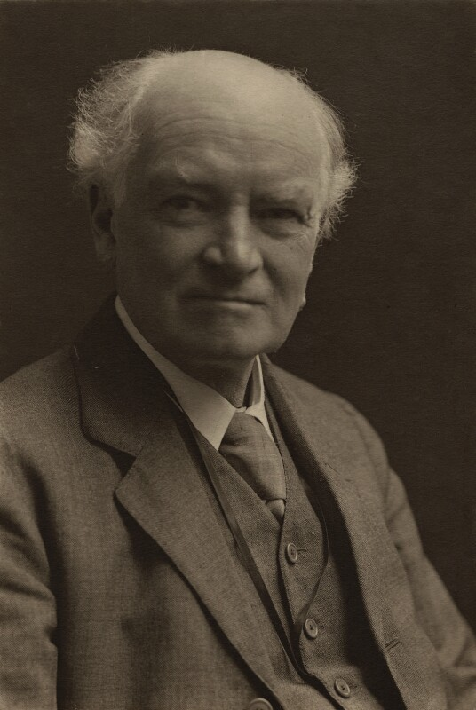
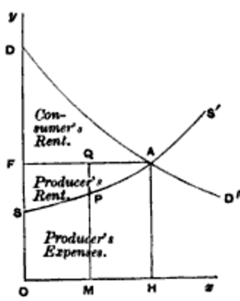

```{r setup, include=FALSE}
options(htmltools.dir.version = FALSE)
knitr::opts_chunk$set(echo=F,
                      message=F,
                      warning=F,
                      fig.retina=3)
library(tidyverse)
library(ggrepel)
library(ggthemes)
set.seed(256)
update_geom_defaults("label", list(family = "Fira Sans Condensed"))
```

class: inverse

# Outline

## [Alfred Marshall](#4)

## [Marshall on the Scope & Method of Economics](#17)

## [Marshallian Demand Theory](#24)

---

# Alfred Marshall

.left-column[
.center[


.smallest[
Alfred Marshall

1842-1924
]
]
]

.right-column[

- A momentous figure in the history of economic thought

- Arguably the father of .hi[“neoclassical economics”]
  - along with Walras and the general equilibrium theorists
  - a term coined by its critics, Thorstein Veblen

- Synthesized classical and marginalist economics
]

---

# Alfred Marshall

.left-column[
.center[


.smallest[
Alfred Marshall

1842-1924
]
]
]

.right-column[

- An academic, trained in mathematics
  - sought to transform Ricardo & Mill into mathematics

- Guided by deep humanitarian need to improve the lives of the poor

- Became professor of political economy at Cambridge
  - forged a generation of new students: Pigou, Keynes, Edgeworth, etc.

- Biggest goal was to make economics a separate & well-known discipline, accessible to the public and the business world
  - influenced his methodology and his (lack of) policy positions
  - synthesized many schools of thought; tried to please everyone, which led to attacks on all sides
  - endless questions about “what he really meant”

]

---

# Alfred Marshall

.left-column[
.center[


.smallest[
Alfred Marshall

1842-1924
]
]
]

.right-column[

- Very patient, thoughtful thinker and writer

- Supposedly discovered marginalism in 1860s, but tested and refined it with his students, didn’t publish until 1890

> [Keynes on marginalist revolution]: “Jevons saw the kettle boil and cried out with the delighted voice of a child; Marshall too had seen the kettle boil and sat down silently to build an engine.”

- His *Principles of Economics* went through 8 editions, and was the most popular economics textbook until Paul Samuelson’s in 1948
]


---

# Political Economy at a Crossroads

.left-column[
.center[


.smallest[
Alfred Marshall

1842-1924
]
]
]

.right-column[
- Classical economists focused almost exclusively on supply & cost

- Marginalists focused almost exclusively on demand and utility

- German Historical economists focused on context & institutions, no universal scientific laws

- Marshall wants to synthesize these things, “nature makes no leaps”
  - emphasizes *continuity* of older work, not radical change
]

---

class: inverse, center, middle

# Marshall on the Scope and Method of Economics

---

# Alfred Marshall: Scope of Economics

.left-column[
.center[


.smallest[
Alfred Marshall

1842-1924
]
]
]

.right-column[

>  “Political Economy or Economics is a study of mankind in the ordinary business of life; it examines that part of individual and social action which is most closely connected with the attainment and with the use of the material requisites of well being.”

- Chose the term *economics*

.source[Marshall, Alfred, 1890, *Principles of Economics*]
]

---

# Alfred Marshall: Scope of Economics

.left-column[
.center[


.smallest[
John Neville Keynes
]
]
]

.right-column[
.smallest[
- Marshall’s colleage John Neville Keynes (father of John Maynard Keynes) *The Scope and Method of Political Economy* (1891):
  1. .hi-purple[“Positive economics”]: study of what is, and how the economy works (scientific)
  2. .hi-purple[“Normative economics”]: study of what should be
  3. .hi-purple[“Art of economics”]: related lessons learned from positive economics to normative goals determined in the normative branch

]

---

# Alfred Marshall: Scope of Economics

.left-column[
.center[


.smallest[
Alfred Marshall

1842-1924
]
]
]

.right-column[
- Ironically, Marshall recognized the value of abstract theorizing, was motivated by normative question, but truly was best at the *art* of economics (political economy!)
  - very Smithean
  - for Marshall, one of the chief goals of economics was to understand and eliminate poverty
  - Castigated Ricardo for his failure to improve the lot of the working classes 

]
]
---

# Alfred Marshall: Scope of Economics

.left-column[
.center[


.smallest[
Alfred Marshall

1842-1924
]
]
]

.right-column[

>  “Economics has made greater advances than any other branch of the social sciences, because it is more definite and exact than any other. But every widening of its scope involves some loss of this scientific precision; and the question of whether the loss is greater than the gain resulting from its greater breadth of outlook, is not to be decided by any hard and fast rule.”

.source[Marshall, Alfred, 1890, *Principles of Economics*]

]
---

# Alfred Marshall: Scope of Economics

.left-column[
.center[


.smallest[
Alfred Marshall

1842-1924
]
]
]

.right-column[

> “For that part of economic doctrine, which alone can claim universality, has no dogmas. It is not a body of concrete truth, but an engine for the discovery of concrete truth.”

.source[Marshall, Alfred, 1890, *Principles of Economics*]
]

---

# Alfred Marshall: Scope of Economics

.left-column[
.center[


.smallest[
Alfred Marshall

1842-1924
]
]
]

.right-column[

- Marshall is not primarily interested in discovering static equilibrium allocation of resources like the marginalists

- He is primarily interested in *change*: 

> “The Mecca of the economist lies in economic biology rather than in economic dynamics”

.source[Marshall, Alfred, 1890, *Principles of Economics*]
]

---

# Alfred Marshall: Methodology of Economics

.left-column[
.center[


.smallest[
Alfred Marshall

1842-1924
]
]
]

.right-column[
.quitesmall[
> “I have not been able to lay my hands on any notes as to Mathematico-economics that would be of any use to you: and I have very indistinct memories of what I used to think on the subject. I never read mathematics now: in fact I have forgotten how to integrate a good many things.

> “But I know I had a growing feeling in the later years of my work at the subject that a good mathematical theorem dealing with economic hypotheses was very unlikely to be good economics: and I went more and more on the rules—(1) Use mathematics as a shorthand language, rather than as an engine of inquiry. (2) Keep to them until you have done. (3) Translate into English. (4) Then illustrate by examples that are important in real life. (5) Burn the mathematics. (6) If you can’t succeed in (4), burn (3). This last I did often.”

]

.source[Marshall, Alfred, 1906, Letter to A.L. Bowley]

]
---

# Alfred Marshall: Methodology of Economics

.left-column[
.center[


.smallest[
Alfred Marshall

1842-1924
]
]
]

.right-column[

.smallest[
- Marshall famously kept mathematics to a minimum (in the appendices), focused on teachable graphs

- His definitions of concepts are not very neat or tidy, but *practical*

- Again, goal of appealing to businesspeople and the educated public, not technical specialists

- Instead of the sharp Classical division of land vs. labor vs. capital, Marshall: .hi[“the factors of production”]

- For theory of the firm, “we shall have to study the expenses of a .hi[representative producer]”
  - not a statistical average, but a realistically-surveyed firm of normal ability and access to technology
]
]

---

# Partial Equilibrium Analysis

.left-column[
.center[


.smallest[
Alfred Marshall

1842-1924
]
]
]

.right-column[

- Marshall famously focused his attention on .hi[partial equilibrium]

- Marshall clearly recognized the validity of .hi[general equilibrium] (the Walrasians)
  - Mathematical Note XXI is a one-page general equilibrium model
]

---

# Partial Equilibrium Analysis

.left-column[
.center[


.smallest[
Alfred Marshall

1842-1924
]
]
]

.right-column[

.quitesmall[
> “[In terms of long run equilibrium,] nothing of this is true in the world in which we live. Here every economic force is constantly changing its action, under the influence of other forces which are acting around it. Here changes in the volume of production, in its method, and its cost are ever mutually modifying one another; they are always affecting and being affected by the character and the extent of demand. Further all these mutual influences take time to work themselves out, and, as a rule, no two influences move at an equal pace. In this world therefore every plain and simple doctrine as to the relations between costs of production, demand and value is necessarily false: and the greater the appearance of lucidity which is given to it by skillful exposition, the more mischievous it is. A man is likely to be a better economist if he trusts to his common sense, and practical instincts, than if he professes to study the theory of value and is resolved to find it easy.”

]
.source[Marshall, Alfred, 1906, Letter to A.L. Bowley]

]

---

# Partial Equilibrium Analysis

.left-column[
.center[


.smallest[
Alfred Marshall

1842-1924
]
]
]

.right-column[
.smallest[
- Because economics can run no experiments like physics, must do so with theoretical constructs by assumption to approximate causal relationships in the complex economy

- .hi[Ceterus paribus], hold all else equal to investigate the likely consequences of a single change

- Isolate a single market and ignore (but don’t deny) interdependencies with other markets (substitutes, complements, inputs, outputs, etc.)
  - Yields a first approximation of the consequence of a single change

> “Time is a chief cause of those difficulties in economic investigations which make it necessary for man with his limited powers to go step by step”

]
]

---

# The Marshallian Cross

.left-column[
.center[


.smallest[
Alfred Marshall

1842-1924
]
]
]

.right-column[

.smallest[
- It’s futile to argue whether demand or supply determines the price:

> “We might as reasonably dispute whether it is the upper or under blade of a pair of scissors that cuts a piece of paper, as whether value is governed by utility or costs of production. It is true that when one blade is held still, and the cutting is effected by moving the other, we may say with careless brevity that the cutting is done by the second; but the statement is not strictly accurate, and is to be excused only so long as it claims to be merely a popular and not a strictly scientific account of what happens.”

- Demand, supply, and price are all interrelated and simultaneously determined
]
]
---

# The Marshallian Cross

.left-column[
.center[


.smallest[
Alfred Marshall

1842-1924
]
]
]

.right-column[
.center[

]

]

---

class: inverse, center, middle

# Marshallian Demand Theory

---

# Marshall’s Demand Curve

.pull-left[
.smallest[
- Cournot was the first to draw demand curves on a graph
  - He used prices as the independent variable, and quantity as the dependent variable
  - Price adjusts to quantity

- Marshall switched the axes:
  - Price as dependent variable, quantity as independent variable
  - Quantity adjusts to price

- For better or worse (debatable!), we’ve used Marshall’s version ever since
]
]
.pull-right[
```{r, fig.height=4.5}
demand=function(x){10-x}
supply=function(x){x}

# make plot 

plot<-ggplot(data.frame(x=c(0,10)), aes(x=x))+
  stat_function(fun=demand, geom="line", size=2, color="blue")+
  stat_function(fun=supply, geom="line", size=2, color="red")+
  geom_segment(x=5,y=0,xend=5,yend=5,linetype=3)+
  geom_segment(x=0,y=5,xend=5,yend=5,linetype=3)+
  annotate(geom = "label", x = 8, y = demand(8), label = "Demand",
           color = "blue", size = 6) +
  annotate(geom = "label", x = 8, y = supply(8), label = "Supply",
           color = "red", size = 6)+
  theme_classic(base_family = "Fira Sans Condensed", base_size=16)

cournot<-plot+
  scale_x_continuous(breaks = seq(0,10,1),
                     labels = scales::dollar,
                     limits = c(0,10),
                     expand=c(0,0))+
  scale_y_continuous(breaks = seq(0,10,1),
                     limits = c(0,10),
                     expand=c(0,0))+
    labs(x = "Price (p)",
       y = "Quantity (q)",
       title = "Cournot")

marshall<-plot+
  scale_y_continuous(breaks = seq(0,10,1),
                     labels = scales::dollar,
                     limits = c(0,10),
                     expand=c(0,0))+
  scale_x_continuous(breaks = seq(0,10,1),
                     limits = c(0,10),
                     expand=c(0,0))+
    labs(x = "Quantity (q)",
       y = "Price (p)",
       title = "Marshall")

library(patchwork)
cournot+marshall
```

]

---

# Price Elasticity

.left-column[
.center[


.smallest[
Alfred Marshall

1842-1924
]
]
]

.right-column[

- Invents the idea of .hi[price elasticity] (of demand and of supply), expressing quantitative relationship between $(\% \Delta)$ quantity responding to $(\% \Delta)$ price

$$\epsilon_{q,p} = \frac{\% \Delta q}{\% \Delta p} = \frac{\partial q}{\partial p} \times \frac{p}{q}$$

- See my [ECON 306 class](https://microf20.classes.ryansafner.com/class/1.8-class) for a refresher
]

---

# Price Elasticity: Elastic vs. Inelastic

$$\epsilon_{q,p} = \frac{\% \Delta q}{\% \Delta p}$$

|                 | .hi["Elastic"] | "Unit Elastic" | .hi["Inelastic"] |
|-----------------|-----------|----------------|------------|
| **Intuitively**:    | **Large** response | Proportionate response | **Little** response |
| **Mathematically**: | $\vert \epsilon_{q_D,p}\vert > 1$ | $\vert \epsilon_{q_D,p}\vert = 1$ | $\vert \epsilon_{q_D,p} \vert < 1$ |
|                 | Numerator $>$ Denominator | Numerator $=$ Denominator | Numerator $<$ Denominator |
| **A 1% p-change** | **More than 1%** change in $q_D$ | **1%** change in $q_D$ | **Less than 1%** change in $q_D$ | 

---

# Elasticity Changes Along the Demand Curve

.pull-left[

```{r}
ggplot(data.frame(x=c(0,10)), aes(x=x))+
  stat_function(fun=demand, geom="line", size=2, color = "blue")+
  geom_label(aes(x=8.5,y=demand(8.5)), color = "blue", label="Demand", size = 6)+
    scale_x_continuous(breaks=seq(0,10,1),
                     limits=c(0,10),
                     expand=expand_scale(mult=c(0,0.1)))+
  scale_y_continuous(breaks=seq(0,10,1),
                     limits=c(0,10),
                     expand=expand_scale(mult=c(0,0.1)),
                     labels = function(x){paste("$", x, sep="")})+
  # line at 5,5 
  geom_segment(aes(x=0,xend=5, y=5, yend=5), linetype="dashed")+
  geom_segment(aes(x=5,xend=5, y=5, yend=0), linetype="dashed")+
  
  geom_label_repel(data = tibble(x=0, y=10),
                   aes(x=x, y=y),
                   segment.size = 2,
                  color="purple", label=expression(epsilon == infinity))+
  geom_label_repel(data = tibble(x=2.5, y=7.5),
                   aes(x=x, y=y),
                  color="purple",
                  label=expression(paste(epsilon > 1, ": Elastic")))+
  geom_label_repel(data = tibble(x=5, y=5),
                   aes(x=x, y=y),
                  color="purple",
                  label=expression(paste(epsilon == 1, ": Unit Elastic")))+
  geom_label_repel(data = tibble(x=7.5, y=2.5),
                   aes(x=x, y=y),
                  color="purple",
                  label=expression(paste(epsilon < 1, ": Inelastic")))+
  geom_label_repel(data = tibble(x=10, y=0),
                   aes(x=x, y=y),
                   color="purple",
                   label=expression(epsilon == 0))+
  labs(x = "Quantity of x",
       y = "Price of x")+
  theme_classic(base_family = "Fira Sans Condensed", base_size=20)
```
]

.pull-right[

$$\epsilon_{q,p} = \mathbf{\frac{\partial q}{\partial p}} \times \frac{p}{q}$$

- **Elasticity $\neq$ slope** (but they are related)!

- .hi-purple[Price elasticity changes along the demand curve]

- Gets *less* elastic as  $\downarrow$ price $(\uparrow$ quantity )
  - $\frac{1}{slope}$ is constant
  - $\frac{p}{q}$ gets smaller as $\downarrow p$ and $\uparrow q$

]

---

# Price Elasticity of Demand and Revenues

.pull-left[

.smallest[
$$R=pq$$

| Region of Demand Curve | $\Delta R$ and $\Delta p$ |
|------------------------|---------------------------|
| Elastic $\vert \epsilon \vert > 1$ | p & R change **opposite** |
| Elastic $\vert \epsilon \vert = 1$ | p & R **do not change** |
| Elastic $\vert \epsilon \vert < 1$ | p & R change **together** |

]
]

.pull-right[

```{r, fig.retina=3, fig.align="center", fig.height=4.5}
de<-ggplot(data.frame(x=c(0,10)), aes(x=x))+
  stat_function(fun=demand, geom="line", size=2, color = "blue")+
  geom_label(aes(x=8,y=demand(8)), color = "blue", label="Demand", size = 6)+
    scale_x_continuous(breaks=seq(0,10,1),
                     limits=c(0,10),
                     expand=expand_scale(mult=c(0,0.1)))+
  scale_y_continuous(breaks=seq(0,10,1),
                     limits=c(0,10),
                     expand=expand_scale(mult=c(0,0.1)),
                     labels = function(x){paste("$", x, sep="")})+
  # line at 5,5 
  geom_segment(aes(x=0,xend=5, y=5, yend=5), linetype="dashed")+
  geom_segment(aes(x=5,xend=5, y=5, yend=0), linetype="dashed")+
  
  #coord_cartesian(clip="off")+
  labs(x = "Quantity of x",
       y = "Price of x")+
  theme_classic(base_family = "Fira Sans Condensed", base_size=16)

tr=function(x){10*x-x^2}

rev<-ggplot(data.frame(x=c(0,10)), aes(x=x))+
  stat_function(fun=tr, geom="line", size=2, color = "green")+
  geom_label(aes(x=8,y=tr(8)), color = "green", label="Revenues", size = 6)+
    scale_x_continuous(breaks=seq(0,10,1),
                     limits=c(0,10),
                     expand=expand_scale(mult=c(0,0.1)))+
  scale_y_continuous(breaks=seq(0,25,5),
                     limits=c(0,25),
                     expand=expand_scale(mult=c(0,0.1)),
                     labels = function(x){paste("$", x, sep="")})+
  # line at 5,5 
  geom_segment(aes(x=0,xend=5, y=25, yend=25), linetype="dashed")+
  geom_segment(aes(x=5,xend=5, y=25, yend=0), linetype="dashed")+
  
  #coord_cartesian(clip="off")+
  labs(x = "Quantity of x",
       y = "Revenues")+
  theme_classic(base_family = "Fira Sans Condensed", base_size=16)

library(patchwork)
de/rev
```

.hi-purple[Revenue max. at price where `\\(\epsilon = - 1\\)`]
]

---

# Marshallian Utility Functions

.left-column[
.center[


.smallest[
Alfred Marshall

1842-1924
]
]
]

.right-column[
.smallest[
- Marshall: individuals desire goods because of the utility they provide
  - used .b[additive] utility functions: total utility simply is the sum of the quantity of each good consumed

$$U(x,y,z)=ax+by+cz$$

- This *does not allow* for complementarity and substitutability of goods in consumption
  - Modern utility functions, following Edgeworth and Fisher, are non-linear, e.g.
  - Allows for complementarity and substitutability
  
$$U(x,y,z)=x^{a}y^{b}z^{c}$$
]
]

---

# Marshallian Utility Functions

.left-column[
.center[


.smallest[
Alfred Marshall

1842-1924
]
]
]

.right-column[
.smallest[
- Marshall: assumed utility was measurable via prices
  - .hi-green[Example]: if person pays $2 for A and $1 for B, A must yield twice the utility of B

- The marginal utility of a good is equal to its price times the “marginal utility of money”:

$$MU_a=p_a * MU_m$$

- Marginal utility of money $(MU_m)$: marginal utility received from last dollar spent (or earned, if we consider “savings” a good)
]
]
---

# Marshallian Utility and Demand

.left-column[
.center[


.smallest[
Alfred Marshall

1842-1924
]
]
]

.right-column[
.smallest[
- Most important task was to explain shape of demand curves: .hi[law of demand]

> “The amount demanded increases with a fall in price, and dminishes with a rise in price.”

- Diminishing marginal utility (Gossen’s first law) $\implies$ downward sloping demand

- Optimum condition for maximizing utility: consumer will equalize the marginal utility on the last dollar spent on each good
  - Gossen’s second law/equimarginal principle:
  - Marshall: equates to the marginal utility of money, $MU_m$
  
$$\frac{MU_a}{p_a} = \frac{MU_b}{p_b} = \frac{MU_c}{p_c} = MU_m$$

]
]

---

# Marshallian Utility and Demand

.left-column[
.center[


.smallest[
Alfred Marshall

1842-1924
]
]
]

.right-column[

- Problems with Marshallian demand theory:
  - ignores (real) income effects (substitution effect only)
  - what about an inferior good? Does it have a downward sloping demand curve?
  - Giffen good example: upward sloping demand!

]

---

# Marshallian Utility and Demand

.pull-left[
.smallest[
- Marshall first defines .hi[consumers’ surplus]

$$MU_a = p_a \times MU_m$$

- Implies that $p_a = \frac{MU_a}{MU_m}$: price directly can measure marginal utility

- Consumers willing to pay more for earlier-consumed units of a good than for later-consumed units
  - But consumers are able to buy all the units they want at one price in the market
  - Gain from inframarginal units (paid less than what they would be willing to pay): surplus or “rent” to consumers
]
]

.pull-right[

```{r, fig.align="center"}
demand_1=function(x){10-x}
cs_1<-tribble(
  ~x, ~y,
  0, 10,
  0, 5,
  5, 5
)

cs<-ggplot(data.frame(x=c(0,10)), aes(x=x))+
  stat_function(fun=demand_1, geom="line", size=2, color = "blue")+
    geom_label(aes(x=9,y=demand_1(9)), color = "blue", label="Demand = Max WTP", size = 5)+
  geom_segment(x=0, xend=5, y=5, yend=5, size=1, linetype="dotted")+
  geom_segment(x=5, xend=5, y=0, yend=5, size=1, linetype="dotted")+
    scale_x_continuous(breaks=seq(0,10,1),
                     limits=c(0,10),
                     expand=expand_scale(mult=c(0,0.1)))+
  scale_y_continuous(breaks=seq(0,10,1),
                     limits=c(0,10),
                     expand=expand_scale(mult=c(0,0.1)),
                     labels = function(x){paste("$", x, sep="")})+
  labs(x = "Quantity (q)",
       y = "Price (p)")+
  ggthemes::theme_pander(base_family = "Fira Sans Condensed", base_size=18)

cs+geom_polygon(data=cs_1, aes(x=x,y=y), fill="blue", alpha=0.5)
```
]
