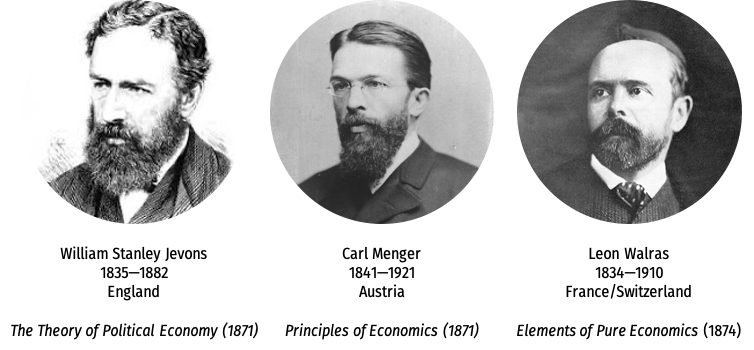
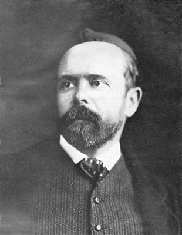

```{r setup, include=FALSE}
options(htmltools.dir.version = FALSE)
knitr::opts_chunk$set(echo=F,
                      message=F,
                      warning=F,
                      fig.retina=3,
                      fig.align="center")
library(tidyverse)
library(ggrepel)
library(ggthemes)
set.seed(256)
update_geom_defaults("label", list(family = "Fira Sans Condensed"))
```

class: inverse

# Outline

## [Léon Walras ](#4)

## [General Equilibrium Theory](#10)

---

# The Marginalist Revolution

.center[

]

---

class: inverse, center, middle

# Léon Walras

---

# Léon Walras

.left-column[
.center[


.smaller[
Marie-Esprit-Léon Walras

1834-1910
]
]
]

.right-column[
.smallest[
- Son of Auguste Walras, an economics teacher & friends with Cournot

- Leon came up with his own theory of marginalism in 1870s

- A very quarrelsome man, became very bitter against British economists
  - famously accuses Wicksteed of plagiarism
  - grudge against Edgeworth for not publishing his review in *EJ*

- Could not get a university job in his home country (France), became professor at Lausanne (Switzerland)
  - considered the founder of the “Lausanne School” of economics (with Pareto as his greatest student)

- But he was widely read and recognized

]
]

---

# Léon Walras

.left-column[
.center[


.smaller[
Marie-Esprit-Léon Walras

1834-1910
]
]
]

.right-column[

- 1874/1877 *Éléments d'économie politique pure (Elements of Pure Economics)*

- Extremely mathematical (look at your *Reader*!)

- Both pure and applied economics

- Two sections of his book on applied economics and social policies

]

---

# Léon Walras’ Politics

.left-column[
.center[


.smaller[
Marie-Esprit-Léon Walras

1834-1910
]
]
]

.right-column[
.smaller[
- Walras praised the virtues of free competition, but against the problem of monopoly and landlords (an even bigger problem in France than Britain)

- Walras suggested a sort of “synthetic socialism” on essentially Georgist lines
  - Government should own the land, people rent land from government, and government distributes the rents to society as a “social dividend”, essentially a basic income

- But was opposed to government management and central planning (for fear the government would become the new feudal landlords)
]
]

---

# Léon Walras’ Politics

.left-column[
.center[


.smaller[
Marie-Esprit-Léon Walras

1834-1910
]
]
]

.right-column[

> “Declaring individual land ownership [means] thwarting the beneficial effects of free competition by preventing the land from being used as is most advantageous for society.”

> “[By ending] individual landownership and monopolies [we can] suppress [the] true causes [of] feudality.”

]

---

# Léon Walras: Marginal Utility

.left-column[
.center[


.smaller[
Marie-Esprit-Léon Walras

1834-1910
]
]
]

.right-column[

- Like Menger & Jevons, independently discovered idea of marginal utility as the source of price
  - again, nobody called it “marginal utility” until Wieser
  - Walras called it “rarité” (never caught on)

- Derives Gossen’s second law/equimarginal principle for optimum

- Walras is far more important for first coming up with a *complete system* to describe the economic in static terms

]

---

class: inverse, center, middle

# General Equilibrium Theory

---

# General Equilibrium Theory Predecessors: Cournot

.left-column[
.center[


.smaller[
Antoine Augustin Cournot

1801-1877
]
]
]

.right-column[
.smaller[
- Cournot had demonstrated the interrelatedness and simultaneity of many economic phenomena
  - most famously, the game-theoretic strategic interactions between two duopolists
  - equilibrium is simultaneously determined by players mutually responding to one another’s actions

- Unlike Menger & Jevons’ awkward algebra, Cournot had used calculus to find optima
  - i.e. derive first order conditions & second order conditions to prove a maximum/minimum
]
.source[Cournot, Antoine Augustin, 1838, *Researches on the Mathematical Principles of the Theory of Wealth*]

]

---

# General Equilibrium Theory Predecessors: Cournot

.left-column[
.center[


.smaller[
Antoine Augustin Cournot

1801-1877
]
]
]

.right-column[

- Can demonstrate that prices can adjust to clear a *single* market $(Q_d=Q_s)$; does an equilibrium set of prices exist that clear *all markets simultaneously?*
  - Cournot thought sufficiently advanced math did not yet exist to answer this question

> “for a complete and rigorous solution of the problems relative to some parts of the economic system,  it [is] indispensable to take the entire system into consideration”

.source[Cournot, Antoine Augustin, 1838, *Researches on the Mathematical Principles of the Theory of Wealth*]

]

---

# Léon Walras: General Equilibrium

.left-column[
.center[


.smaller[
Marie-Esprit-Léon Walras

1834-1910
]
]
]

.right-column[
.smallest[
- Followed Cournot: can demonstrate that prices can adjust to clear a *single* market $(Q_d=Q_s)$; does an equilibrium set of prices exist that clear *all markets simultaneously?*
  - This has been the lure of .hi[general equilibrium] for decades

- Walras’ math was quite crude (he failed to get into the prestigious Ecole Polytechnique because he failed the math exam)

- But he sketched the outline of the problem, suggested how to find solutions, and elucidated many flaws that would take decades to understand & correct
  - Finally rigorously proved in 1950s!
]
]

---

# General Equilibrium, A Motivation

.quitesmall[
> “We have shown that consumers with given money incomes maximize utility relative to prices ruling in the market so as to obtain the same marginal utility per dollar from every product they purchase. At the same time, producers maximize profits relative to factor and product prices by employing the factors of production in such quantities and proportions as to obtain the same marginal value product per dollar of factor outlays; this leads them in the long run to build plants of optimal scale, producing levels of output at which average costs are minimized and marginal supply prices are equal to the given demand price for the final product. When we sum the demand prices of the consumers in a particular product market, the market demand price must in equilibrium equal the market supply price obtained by a similar process of summing the individual supply prices of the participating firms in the market. At the same time, however, the resulting demand prices of all industries in a particular factor market must equal the supply prices of the owners of factor services. The aggregate demand for all factors in any period must equal the incomes received by households from supplying factor services in the same period. This provides the household with the given incomes with which we started the analysis of consumer behavior, thus completing the circle. But what reason do we have for thinking that the whole process hangs together? Business firms enter product markets as suppliers but they enter factor markets as buyers; households, on the other hand, are buyers in product markets but suppliers in factor markets. Is equilibrium in product markets necessarily consistent with equilibrium in factor markets? Does the market mechanism guarantee convergence on a general equilibrium solution? If so, is this solution unique or are there several configurations of prices that will satisfy a solution? Even if a unique multimarket equilibrium exists, will it be stable in the sense that a departure from equilibrium sets up automatic forces that bring the system back to equilibrium?” (Blaug, 570).

]

---

# Léon Walras: General Equilibrium

.left-column[
.center[


.smaller[
Marie-Esprit-Léon Walras

1834-1910
]
]
]

.right-column[

- Focuses entirely on purely competitive conditions

- Like Cournot (and *unlike* Marshall), expresses supply & demand functions as algebraic and geometric functions with price as independent variable and quantity as dependent variable

]

---

# Léon Walras: General Equilibrium

.left-column[
.center[


.smaller[
Marie-Esprit-Léon Walras

1834-1910
]
]
]

.right-column[

.smallest[
- .hi-purple[Walras’ law]: $\displaystyle \sum^n_{i=1} p_i(D_i-S_i) = 0$
  - excess demands $(+$ or $-$, which is excess supply) across *all* $n$ individual markets must sum to 0
  - an excess demand in one market $\implies$ an excess supply exists in another market, and versa
  - any particular market must be in equilibrium iff all other markets in the economy are in equilibrium

- .hi-purple[Simultaneous determination] of all (final & factor) good prices
  - Since one market price will always affect other markets
  - Essentially substitute in Cournot-like “reaction functions” of how one market will respond to changes in others, *ad infinitum*
]
]

---


# General Equilibrium: Basic Idea

.smallest[
- (Price) changes in a single market often spill over into other markets
]

--

.smallest[
- Suppose the demand for corn increases, this not only increases the price of corn, but also ultimately affects:
  - the price of **substitutes** for corn (wheat, soy, flax)
  - the price of **complements** with corn (butter, hamburgers)
  - the price of **downstream goods** that corn is an input to [and their complements & substitutes] (corn syrup, sugar, ethanol, gasoline)
  - the price of **upstream goods** for which corn is an output [and their complements & substitutes] (seeds, fertilizer, plows)
]

--

.smallest[
- Changes in each of those markets (even resulting from the corn change) often have feedback back into the corn market!

- We hold *all of this constant* when we examine the .hi-purple[partial equilibrium] of just the corn market
]

---

# General Equilibrium: Basic Idea

.smallest[
- General equilibrium is about *simultaneously determined* market equilibria
]

--

.smallest[
- .hi-green[Example]: Consider two markets, wheat $(w)$ and corn $(c)$
]

--

.smallest[
$$\begin{align*}
q^{D}_{c}&=20-p_c+p_w\\
q^{D}_{w}&=20-p_w+p_c\\
q^{S}_{c}&=p_c\\
q^{S}_{w}&=p_w\\
\end{align*}$$
]

--

.smallest[
- Solve for the set of prices $(p_w, p_c)$ and quantities $(q_w,q_c)$ for which $q^{D}=q^{S}$ in each market
]

--

.smallest[
- Via substitution, can find the market-clearing vector of prices & quantities:
  - $(p_w, p_c) =$ ($20, $20)
  - $(q_w, q_c) =$ (20, 20)
]

---

# General Equilibrium: Basic Idea

- Now extend this to $n$ goods...and find the $n \times 1$ vector of prices (and quantities) that clears all markets simultaneously

$$\begin{bmatrix}
p_1 \\
p_2 \\
\vdots \\
p_n \\
\end{bmatrix} \text{and} \begin{bmatrix}
q_1 \\
q_2 \\
\vdots \\
q_n \\
\end{bmatrix} \text{such that for each good }i: q^{D}_i=q^{S}_i$$

---

# Léon Walras: General Equilibrium

.left-column[
.center[


.smaller[
Marie-Esprit-Léon Walras

1834-1910
]
]
]

.right-column[
- There are $2n+2m-1$ independent equations to solve, which is exactly equal to the $2n+2m-1$ unknowns in the system
  - 1 good is treated as .hi-purple[numéraire]: its price is set to 1, so all denoted prices are relative to this good 
  - $n$: number of factors of production
  - $m$: number of consumer goods
  - Each factor of production, and each final good has a supply and demand function (hence the $2n$ and $2m)$

.source[Walras, Léon, 1874/1877, *Éléments d'économie politique pure (Elements of Pure Economics)*]

]

---

# Léon Walras: General Equilibrium

.left-column[
.center[


.smaller[
Marie-Esprit-Léon Walras

1834-1910
]
]
]

.right-column[
.smallest[
- Walras thought merely an .hi-turquoise[existence proof] for general equilibrium consisted in counting the number of equations and unknowns to ensure that the solution is uniquely determined (# of equations $=$ # of unknowns)

- But this is not sufficient:
  - there may still be multiple equilibria
  - we often need additional constraints for economically meaningful answers (non-negative and finite prices & quantities!)
  
- Walras is a bit clumsy and cannot solve his system, but he points out a number of problems that future generations could solve
]

.source[Walras, Léon, 1874/1877, *Éléments d'économie politique pure (Elements of Pure Economics)*]
]

---

# Léon Walras: General Equilibrium

.left-column[
.center[


.smaller[
Marie-Esprit-Léon Walras

1834-1910
]
]
]

.right-column[

- A few major questions arise about general equilibrium:

1. Does a general equilibrium *exist*

2. Is the general equilibrium *unique* (determinate), or are there multiple equilibria?

3. Is the general equilibrium *stable*?

- By the 1950s, all of these would be *proved* (very mathematically)!
]

---

# The Walrasian Auctioneer and Tâtonnement

.left-column[
.center[


.smaller[
Marie-Esprit-Léon Walras

1834-1910
]
]
]


.right-column[

- How does the real world market achieve a stable general equilibrium like that of the simultaneous determination of the prices in the Walrasian equations?

- “False” (non market-clearing) prices $\rightarrow$ alter excess demand prices of participants, which changes the final equilibrium solution

- Walras’ solution: .hi-purple[tâtonnement] (French for “trial and error”) or “groping” towards an equilibrium

]

---

# The Walrasian Auctioneer and Tâtonnement

.left-column[
.center[


.smaller[
Marie-Esprit-Léon Walras

1834-1910
]
]
]


.right-column[
.smallest[
- Trade only takes place when an equilibrium set of prices is found

- Often interpretted as a Walrasian auctioneer that takes bids and then only allows trade to take place at the market-clearing prices
  - Apparently this was a *major* mistranslation of Walras’ “crieurs” (criers) into “auctioneers”

- People shout prices they are willing to pay and accept in order to buy and sell
]
]

---

# The Walrasian Auctioneer and Tâtonnement

.left-column[
.center[


.smaller[
Marie-Esprit-Léon Walras

1834-1910
]
]
]


.right-column[
- Walras hoped to find a realistic description of how prices adjust to equilibrium in real life, but failed

- “Tâtonnement” and “Walrasian auctioneer” are not realistic, Walras viewed them only as an abstract model, not the real life process to equilibrium
]

---

# Influence of Walras

.left-column[
.center[


.smaller[
Marie-Esprit-Léon Walras

1834-1910
]
]
]

.right-column[

.smallest[

> “There is no general history of economic thought in English which devotes more than passing reference to his work. … This sort of empty fame in English-speaking countries is of course attributable in large part to Walras's use of his mother tongue, French, and his depressing array of mathematical formulas.” — George Stigler, 1941, *Production and Distribution Theories*

> “Walras is...greatest of all economists. His system of economic equilibrium, uniting, as it does, the quality of ‘revolutionary’ creativeness with the quality of classic synthesis, is the only work by an economist that will stand comparison with the achievements of theoretical physics” — Joseph Schumpeter, 1954, *History of Economic Analysis*

]
]

---

# General Equilibrium vs. Partial Equilibrium

.pull-left[
.smallest[
- Lausanne School (Walras, Pareto) always denigrating the Cambridge/British School (Marshall, Jevons, etc.) for not using general equilibrium theory and only focusing on partial equilibrium

- This bitterness unproductively isolated both groups from each other, to everyone’s detriment

- We saw that Marshall understood the idea of general equilibrium, be he was emanently practical, wanted to be helpful in explaining and suggesting policy in the real world, hence: partial equilibrium

]
]
.pull-right[
.center[

]
]

---

# General Equilibrium vs. Partial Equilibrium

.pull-left[
.smallest[
- Excessive and redundant to make demand a function of $n$ commodities! Just focus on the 1-2 you are trying to explain

- John Hicks’ favorite technique: look at 1 commodity and then amalgamate “all other goods” into a single composite good!

]
]
.pull-right[
.center[

]
]
