```{r setup, include=FALSE}
options(htmltools.dir.version = FALSE)
knitr::opts_chunk$set(echo=F,
                      message=F,
                      warning=F,
                      fig.retina=3,
                      fig.align="center")
library(tidyverse)
library(ggrepel)
library(ggthemes)
set.seed(256)
update_geom_defaults("label", list(family = "Fira Sans Condensed"))
```

class: inverse

# Outline

## [Francis Ysidro Edgeworth &  The Mathematical Tools](#4)

## [Vilfredo Pareto & Paretian Welfare Economics](#10)

## [A.C. Pigou, Externalities & Marshallian Welfare Economics](#10)

---

# Welfare Economics: A Summary

.pull-left[
.quitesmall[

- Today we will zig-zag between the Marshallian/British and the Paretian/Lausanne approaches to .hi[welfare economics]
  - Focus on applying economic theory to *measuring* the costs/benefits of .hi-purple[policy]
  - Edgeworth & Pigou: Marshallian/Cambridge
  - Pareto & Barone: Walrasian/Lausanne

- From 1930s to today, development of the .hi[“New” Welfare Economics]
  - ordinal utility, general equilibrium
  - mathematical proofs of the “two fundamental welfare theorems,” and existence of general equilibrium
  - John Hicks, Abram Bergson, Abba Lerner, Paul Samuleson, Ken Arrow, Gerard Debreu
]
]

.pull-right[
.center[

]
]
---

class: inverse, center, middle

# Francis Ysidro Edgeworth & The Mathematical Tools

---

# Francis Ysidro Edgeworth

.left-column[
.center[


.smaller[
Francis Ysidro Edgeworth

1845-1926
]
]
]

.right-column[

- Professor at Oxford, friends with Jevons & Marshall

- Founding & long-time editor of *The Economic Journal*

- Restated utilitarian ethical & economic analysis in mathematical form

- Polite but famously prickly in debates

> “Francis is all right to get on with, but beware of Ysidro” — Marshall

]

---

# Francis Ysidro Edgeworth

.left-column[
.center[


.smaller[
Francis Ysidro Edgeworth

1845-1926
]
]
]

.right-column[

.smallest[
- 1881 *Mathematical Psychics: An Essay on the Application of Mathematics to the Moral Sciences*
  - Famously unintelligible

]

.quitesmall[
> “This book shows clear signs of genius, and is a promise of great things to come...His readers may sometimes wish that he had kept his work by him a little longer till he had worked it out a little more fully, and obtained that simplicity which comes only through long labour. But taking it as what it claims to be, ‘a tentative study’, we can only admire its brilliancy, force, and originality.” — Marshall

> “Whatever else readers of this book may think about it, they would probably all agree that it is a very remarkable one...There can be no doubt that in the style of his composition Mr. Edgeworth does not do justice to his matter. His style, if not obscure, is implicit, so that the reader is left to puzzle out every important sentence like an enigma” — Jevons

]

]

---

# Francis Ysidro Edgeworth

.left-column[
.center[


.smaller[
Francis Ysidro Edgeworth

1845-1926
]
]
]

.right-column[

- A major advocate of mathematical economics

- Major innovations:
  - indifference curves<sup>.magenta[†]</sup>
  - more realistic utility functions<sup>.magenta[†]</sup>
  - “Edgeworth box” (see below, with Pareto)

- Focused on limits to determinant answers (in Jevons & Walras)
  - led to debates for next few decades
  - would be rediscovered later in more formalist economics

.footnote[<sup>.magenta[†]</sup> Irving Fisher in the U.S. also used and developed his own version of these!]
]

---

# Edgeworth: Mathematical Economics

.left-column[
.center[


.smaller[
Francis Ysidro Edgeworth

1845-1926
]
]
]

.right-column[

- Economics as a series of maximization problems:

.quitesmall[
> “Now, it is remarkable that the principle inquiries in Social Science may be viewed as *maximium-problems*. For Economics investigates the arrangements between agents each tending to his own *maximium* utility...Since, then, Social Science, as compared with the Calculus of Variations, starts from similar data...and travels to a similar conclusion — determinations of *maximum* — why should it not pursue the same method, Mathematics?” (p.481 in *Reader*)

]

.source[Edgeworth, Francis Y, 1881, *Mathematical Psychics*]
]

---

# Edgeworth: Mathematical Economics

.left-column[
.center[


.smaller[
Francis Ysidro Edgeworth

1845-1926
]
]
]

.right-column[

- Economic analysis is .hi-turquoise[repeated application of *maximization problems*]

- Why go through the redundancy of different institutional contexts? Merely abstract to the essence: mathematical model

- Accused Marshallian economists of being seduced by the “zigzag windings of the flowery path of literature.”

.source[Edgeworth, Francis Y, 1881, *Mathematical Psychics*]
]

---

# Edgeworth: Mathematical Economics & Physics

.left-column[
.center[


.smaller[
Francis Ysidro Edgeworth

1845-1926
]
]
]

.right-column[

- Very clearly tried to apply tools of physics to Economics

.quitesmall[

> “The Economical Calculus investigates the equilibrium of a system of hedonic forces each tending to maximum individual utility; the Utilitarian Calculus, the equilibrium of a system in which each and all tend to maximum universal utility,” (p. 484 in *Reader*)

]

- Thought utility was measurable, in cardinal units, similar to energy in physics (“pleasure-energy”)
  - Future developments in “physio-psychology” could one day create a “hedonimeter” to measure utility

.source[Edgeworth, Francis Y, 1881, *Mathematical Psychics*]
]

---

# Edgeworth Contra Jevons & Walras on Exchange

.left-column[
.center[


.smaller[
Francis Ysidro Edgeworth

1845-1926
]
]
]

.right-column[

- Jevons thought prices would be definite & determinate, based on utility functions:

> “The ratio of exchange of any two commodities will be the reciprocal of the ratio of the final degrees of utility of the quantities of commodity available for consumption after the exchange is completed” (Jevons)

- Walras’ tâtonnement conceptualized people shouting their bids and asks, changing them, and trading only at market-clearing prices

]

---

# Edgeworth: Recontracting and Market Process

.left-column[
.center[


.smaller[
Francis Ysidro Edgeworth

1845-1926
]
]
]

.right-column[

- Edgeworth points out the .hi[“indeterminacy of contract”], and focuses on .hi[“recontracting”]

- Edgeworth’s idea of market process: people in the market go around to each other and make trial bargains which they can later change or revoke
  - When they have better information about other participants (and their bids/asks), parties try to *recontract*
  - Contracts are finally settled, and a determinate outcome (among *many possible* outcomes) is reached
  
]

---

# Edgeworth: Recontracting and Market Process

.left-column[
.center[


.smaller[
Francis Ysidro Edgeworth

1845-1926
]
]
]

.right-column[

.quitesmall[

> “Is [economic competition] peace or war? ... It is both, *pax* or *pact* between contractors during contract, *war*, when some of the contractors *without the consent of others recontract*. Thus, an auctioneer having been in contact with the last bidder (to sell at such a price *if* no higher bid) *recontracts* with a higher bidder. So a landlord on expiry of lease recontracts, it may be, with a new tenant. The *field of competition* with reference to a contract, or contracts, under consideration consists of all the individuals who are willing and able to recontract about the articles under consideration. Thus, in an auction the field consists of the auctioneer and all who are effectively willing to give a higher price than the last bid. In this case, as the transaction reaches determination, the field continually diminishes and ultimately vanishes. But this is not the case in general.” (p.485 in *Reader*).

> “A *settlement* is a contract which cannot be varied with the consent of all the parties to it. A *final settlement* is a settlement which cannot be varied by recontract, within the field of competition. Contract is *indeterminate* when there are an indefinite number of *final settlements*,” (p.485 in *Reader*)

.source[Edgeworth, Francis Y, 1881, *Mathematical Psychics*]

]
]

---

# Edgeworth on Exchange

.left-column[
.center[


.smaller[
Francis Ysidro Edgeworth

1845-1926
]
]
]

.right-column[
.smallest[
- In the process, invents 2 key tools:
  1. .hi[Indifference curves] describing bundles of goods that provide equal utility
  2. .hi[“The Edgeworth Box”] (what we call it today) and the .hi[“Contract curve”]

]
]

---


# Edgeworth on Exchange

.left-column[
.center[


.smaller[
Francis Ysidro Edgeworth

1845-1926
]
]
]

.right-column[
.smaller[
- Reaches several conclusions & implications that still are valid today:
  1. Exchanges between individuals (final settlements) must be on the contract curve
  2. Competitive market equilibrium must be on the contract curve
  3. Indeterminacy of equilibrium in two-party bargaining (bilateral monopoly problem)
  4. “Edgeworth conjecture” (“recontracting theorem”): as # of traders increases, contract curve shrinks to single point: competitive equilibrium
]
]

---

# Edgeworth on Exchange

.left-column[
.center[


.smaller[
Francis Ysidro Edgeworth

1845-1926
]
]
]

.right-column[

.smallest[
> “If we then enquire in what directions [persons] X and Y will consent to move *together*, the answer is, in any direction between their respective lines of indiffernce, in a direction *positive* as it may be called *for both.* At what point then will they refuse to move at all? When their *lines of indifference* are coincident (and *lines of preference* not only coincident, but in opposite directions)...” (p.487 in *Reader*).

> “The locus [of all such points] it is here proposed to call the *contract-curve*” (p.486 in *Reader*)

> “Then...it appears that the *total utility of the system is a relative maximum at any point on the pure contract-curve,*” (p.488 in *Reader*).

]

.source[Edgeworth, Francis Y, 1881, *Mathematical Psychics*]

]

---

# Edgeworth on Exchange

.left-column[
.center[


.smaller[
Francis Ysidro Edgeworth

1845-1926
]
]
]

.right-column[

.center[
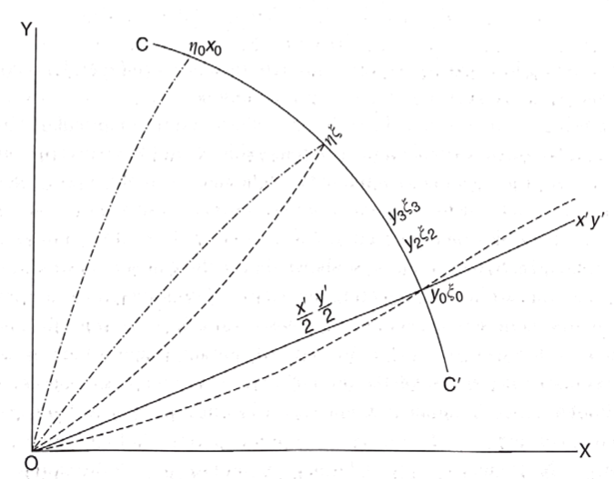
]

.source[Edgeworth, Francis Y, 1881, *Mathematical Psychics*]

]

---

# Edgeworth on Exchange

.left-column[
.center[


.smaller[
Francis Ysidro Edgeworth

1845-1926
]
]
]

.right-column[

> “[From any point on the contract curve] in whatever direction we take an infinitely small step, [the utilities of both parties] do not increase together, but that, while one increases, the other decreases.”

> “It seems to follow on general dynamical principles applied to this special case that equilibrium is attained when the total pleasure-energy of the contractors is a maximum relative, or subject, to conditions...”

.source[Edgeworth, Francis Y, 1881, *Mathematical Psychics*]

]


---


# Influence of Edgeworth


---

class: inverse, center, middle

# Vilfredo Pareto & Paretian Welfare Economics

---

# Vilfredo Pareto

.left-column[
.center[
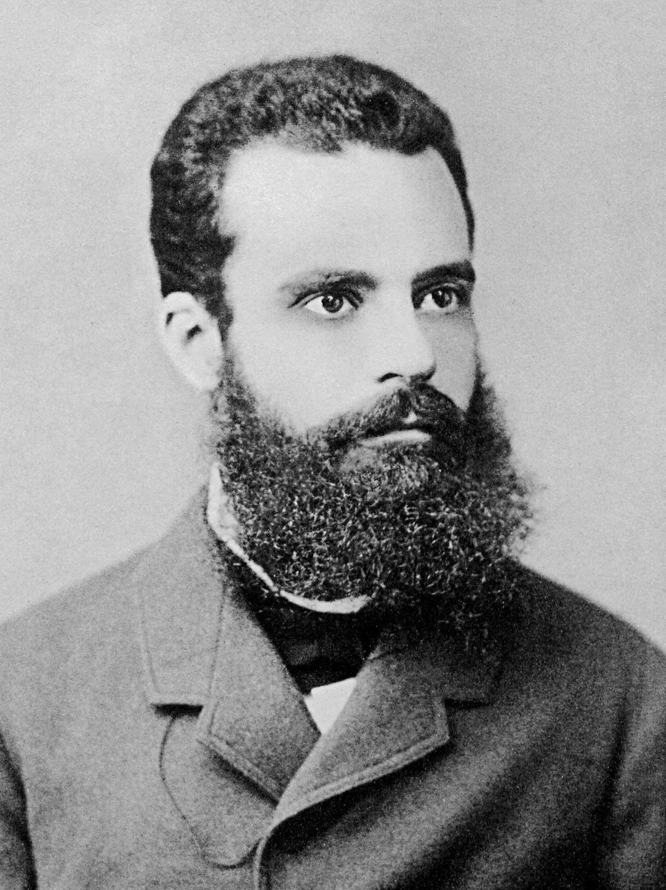

.smaller[
Vilfredo Pareto

1848-1923
]
]
]

.right-column[

- A civil engineer turned economist

- Student of Walras, and then succeeded him as Chair of Political Economy at U. of Lausanne

- Extends general equilibrium theory to policy questions
]

---

# Vilfredo Pareto: The Sociologist

.left-column[
.center[


.smaller[
Vilfredo Pareto

1848-1923
]
]
]

.right-column[

.smallest[
- A founding father of sociology
  - Supposedly turned to sociology when the abstract mathematical theories of economics did not seem to explain everything

- 1916, *Trattato di Sociologia Generale (The Mind and Society)*
  - Most of human social activities are “non-logical” (we are driven by “residues”) we merely come up with “rationalizations” (“derivations”) to disguise our actions (to ourselves & others) as being rational
  - Coins the term “elite” for dominant social class
  - Circulation of elies: Social change & revolutions are merely one elite overthrowing and replacing an existing elite

> “History is a graveyard of aristocracies”

]
]

---

# Vilfredo Pareto: The Sociologist

.pull-left[
.smallest[
- Famous .hi-purple[“80-20 rule”], or the .hi-purple[“Pareto principle”]
  - 80% of outcome comes from 20% of the causes (“the vital few”)
  - e.g. 80% of the property in Italy is owned by 20% of the population
  - e.g. 80% of sales come from 20% of customers

- Thought he had discovered a universal empirical law
  - it turns out this keeps coming up with such regularity that it might as well be universal law!

]
]

.pull-right[
.center[
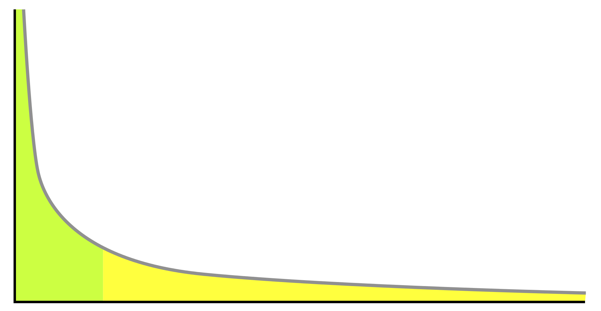
]
]

---

# Vilfredo Pareto: The Sociologist

.pull-left[

.smallest[
- “Pareto distribution” (a kind of power law distribution)
$$f(x) = ax^{-k}$$

Taking logs:
$$\ln f(x) = a - k \ln x$$

]

.quitesmall[
> “A power law, also called a scaling law, is a relation of the type $Y =aX^β$, where $Y$ and $X$ are variables of interest, $β$ is called the power law exponent, and $a$ is typically an unremarkable constant. For instance, if $X$ is multiplied by a factor of 10, then $Y$ is multiplied by $10β$—one says that $Y$ “scales” as $X$ to the power $β$.” (Gabaix, 2016: 186)

]
]

.pull-right[
.center[

]
]


---

# Vilfredo Pareto’s Politics

.left-column[
.center[


.smaller[
Vilfredo Pareto

1848-1923
]
]
]

.right-column[
- Big advocate of classical liberalism and fierce opponent to socialism & Marxism

- Near the end of his life, after his sociological study and 80-20 rule, became sympathetic towards (then rising 1920s Italian) fascism
  - had always thought democracy was a facade, an elite always emerges and enriches itself
  - hurt his reputation, though his economic analysis is enormously influential

]

---

# Influence and Controversy

.quitesmall[
> “One of Pareto’s equations achieved special prominence, and controversy. He was fascinated by problems of power and wealth. How do people get it? How is it distributed around society? How do those who have it use it? The gulf between rich and poor has always been part of the human condition, but Pareto resolved to measure it. He gathered reams of data on wealth and income through different centuries, through different countries: the tax records of Basel, Switzerland, from 1454 and from Augsburg, Germany, in 1471, 1498 and 1512; contemporary rental income from Paris; personal income from Britain, Prussia, Saxony, Ireland, Italy, Peru. What he found – or thought he found – was striking. When he plotted the data on graph paper, with income on one axis, and number of people with that income on the other, he saw the same picture nearly everywhere in every era. Society was not a ‘social pyramid’ with the proportion of rich to poor sloping gently from one class to the next. Instead it was more of a ‘social arrow’ – very fat on the bottom where the mass of men live, and very thin at the top where sit the wealthy elite. Nor was this effect by chance; the data did not remotely fit a bell curve, as one would expect if wealth were distributed randomly. ‘It is a social law’, he wrote: something ‘in the nature of man.’ At the bottom of the Wealth curve, he wrote, Men and Women starve and children die young. In the broad middle of the curve all is turmoil and motion: people rising and falling, climbing by talent or luck and falling by alcoholism, tuberculosis and other kinds of unfitness. At the very top sit the elite of the elite, who control wealth and power for a time – until they are unseated through revolution or upheaval by a new aristocratic class. There is no progress in human history. Democracy is a fraud. Human nature is primitive, emotional, unyielding. The smarter, abler, stronger, and shrewder take the lion's share. The weak starve, lest society become degenerate: One can, Pareto wrote, ‘compare the social body to the human body, which will promptly perish if prevented from eliminating toxins.’ Inflammatory stuff – and it burned Pareto's reputation.”

]
.source[Mandelbrot, Benoit, 2006, *The Misbehavior of Markets: A Fractal View of Financial Turbulence*]

---

# Vilfredo Pareto’s Economics

.left-column[
.center[


.smaller[
Vilfredo Pareto

1848-1923
]
]
]

.right-column[

.smallest[
- Pareto is enormously influential for establishing subjective welfare economics
  - Later economists would create .hi[“new” welfare economics] on Paretian foundations

- Previous (English) writers (Mill, Jevons, Edgeworth) treated “welfare” as the sum of cardinally-measurable utilities of individuals
  - Benthamite utilitarianism: “the greatest good for the greatest number”

]
]

---

# Vilfredo Pareto’s Economics

.left-column[
.center[


.smaller[
Vilfredo Pareto

1848-1923
]
]
]

.right-column[

- Pareto *decisively* breaks away from cardinal utility and additive utility functions; ruthlessly commits himself to making no interpersonal comparisons ever

- Optimum conditions of exchange depend only on *intra*personal, never *inter*personal comparisons of utility

- Pareto even disliked the word “utility” for its connotation of Benthamite utilitarianism, the cardinal use of “utils,” etc.
  - Instead preferred the word “ophelimity” 🤷
]
]

---
  
# Vilfredo Pareto’s Economics

.left-column[
.center[


.smaller[
Vilfredo Pareto

1848-1923
]
]
]

.right-column[

- 1906/1909 *Manual of Political Economy*

- Key innovations:
  - Focus on *normative* policy analysis using economic tools: efficiency (**Pareto efficiency**) defined in normative way
  - Fully subjective approach to utility
  - First draws indifference curves (Edgeworth only described the math)
  - Draws the modern version of the “Edgeworth box”
  - Uses this to derive (in essence) the Two Fundamental Laws of Welfare Economics
]

---

# Indifference Curves

.pull-left[

- .blue[Person 1] starts with an endowment of 1 apple, 9 bananas, at $E$

- Has subjective preferences, represented by .blue[indifference curve]

- We can conceive of a .red[budget constraint] based on market prices

- Can trade in marketplace to reach higher indifference curve
  - Reach $O$

]

.pull-right[

.center[
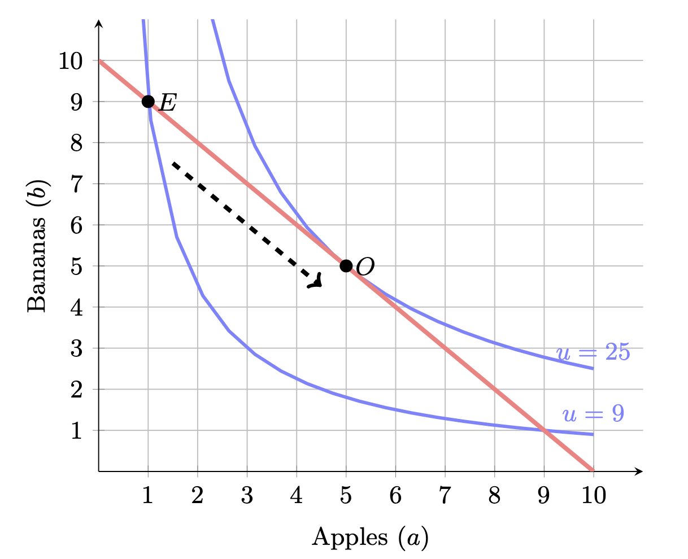
]
]

---

# Indifference Curves

.pull-left[

- But what is “the marketplace?” Other people with their own endowments!

- Start with simple case of two people

- .green[Person 2]’s endowment at $E^2$ and .green[indifference curves]

- Can trade in marketplace at .red[market prices] to reach higher indifference curve
  - Reach $O^2$

]

.pull-right[

.center[
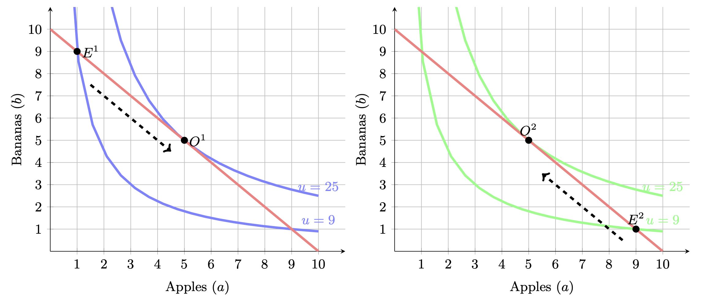
]
]

---

# The Edgeworth Box

.pull-left[

- Now merely take .green[Person 2]’s indifference curves, rotate them, and superimpose them in the same graph as .blue[Person 1]

- What we now call the .hi[“Edgeworth Box”]
  - Again, Edgeworth described this and had some rudimentary drawing
  - But it’s Pareto who actually *draws this*!

]

.pull-right[

.center[
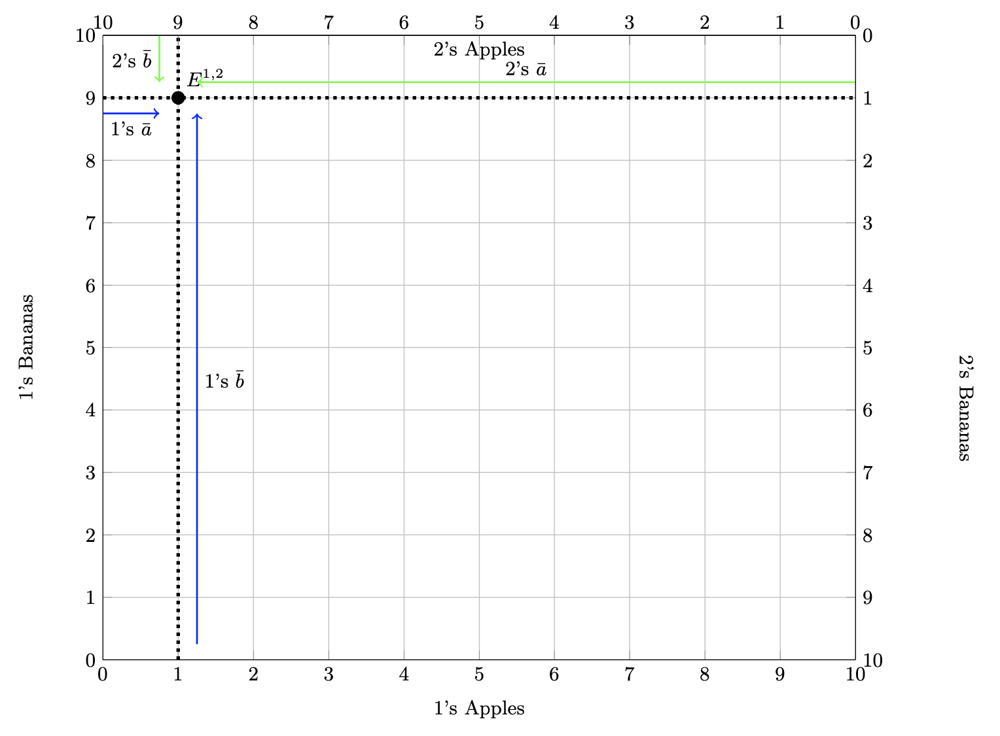
]
]

---

# The Edgeworth Box

.pull-left[

- Movement to NE: improvements in .blue[person 1]’s utility (more $a$ and $b)$

- Movement to SW: improvements in .green[person 2]’s utility (more $a$ and $b)$

- Both parties start with endowment at $E^{1,2}$
  - .blue[Person 1]: 1 apple, 9 bananas
  - .green[Person 2]: 9 apples, 1 banana
]

.pull-right[

.center[
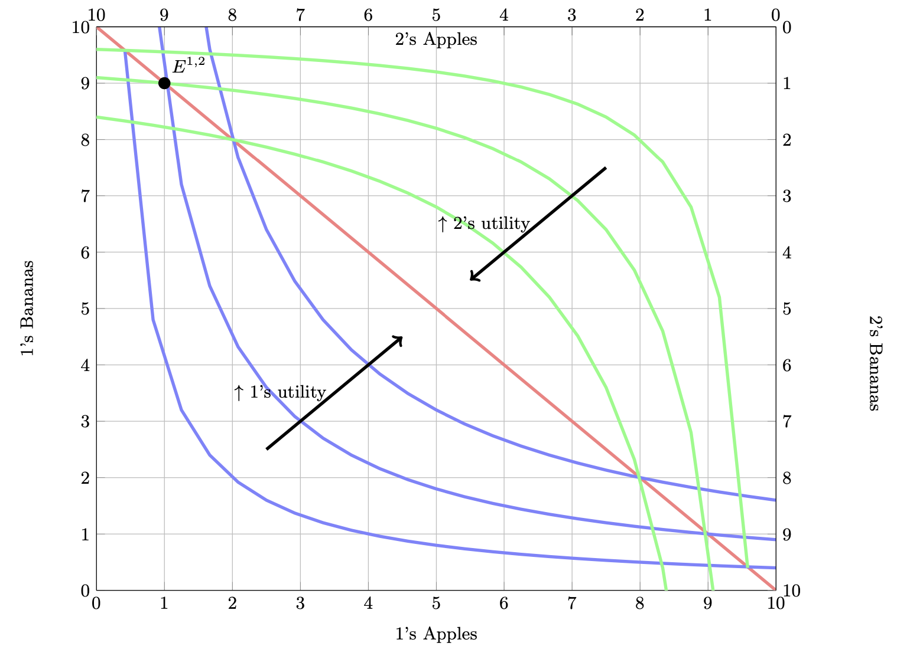
]
]

---

# The Edgeworth Box

.pull-left[

- Both parties start with endowment at $E^{1,2}$ on original indifference curves
  - .blue[Person 1]: 1 apple, 9 bananas
  - .green[Person 2]: 9 apples, 1 banana

- .purple[Gains from trade] shown as the shaded area *between* initial indifference curves
  - .blue[Person 1] and .green[Person 2] can *both* be made better off (get on higher indifference curve) in this shaded area
]

.pull-right[

.center[
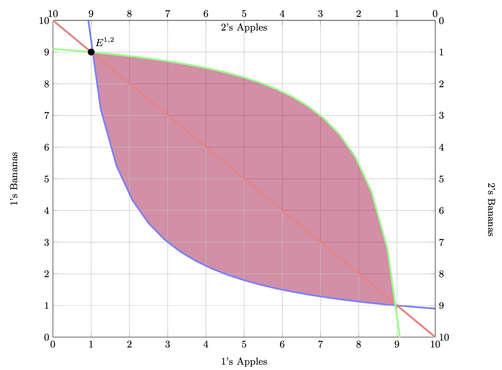
]
]

---

# The Edgeworth Box

.pull-left[

- Suppose both parties exchange at exchange rate of 1 apple for 1 banana
  - .blue[Person 1] gives 4 apples
  - .green[Person 2] gives 4 bananas

- Both people reach higher indifference curves at $O^{1,2}$, from endowments $E^{1,2}$
  - .blue[Person 1] now has 5 apples, 5 bananas
  - .green[Person 2] now has 5 apples, 5 bananas

]

.pull-right[

.center[
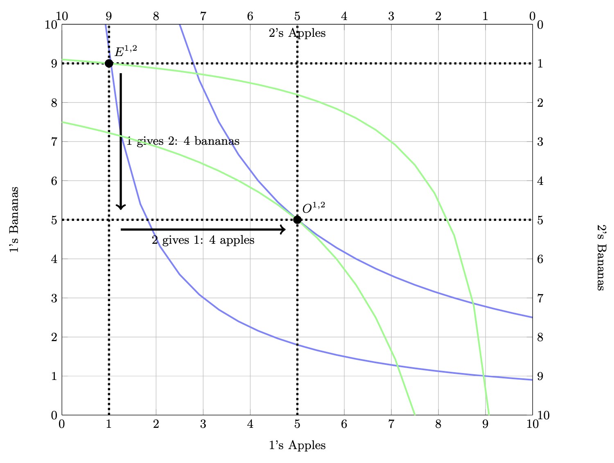
]
]

---

# The Edgeworth Box

.pull-left[

- But it turns out there are actually *many* possible exchanges from their endowment point $E$ that could take place that make both parties better off!
  - Points B, C, D, F, G
  - This set of points is called (using Edgeworth’s term), the .hi[contract curve]

]

.pull-right[

.center[
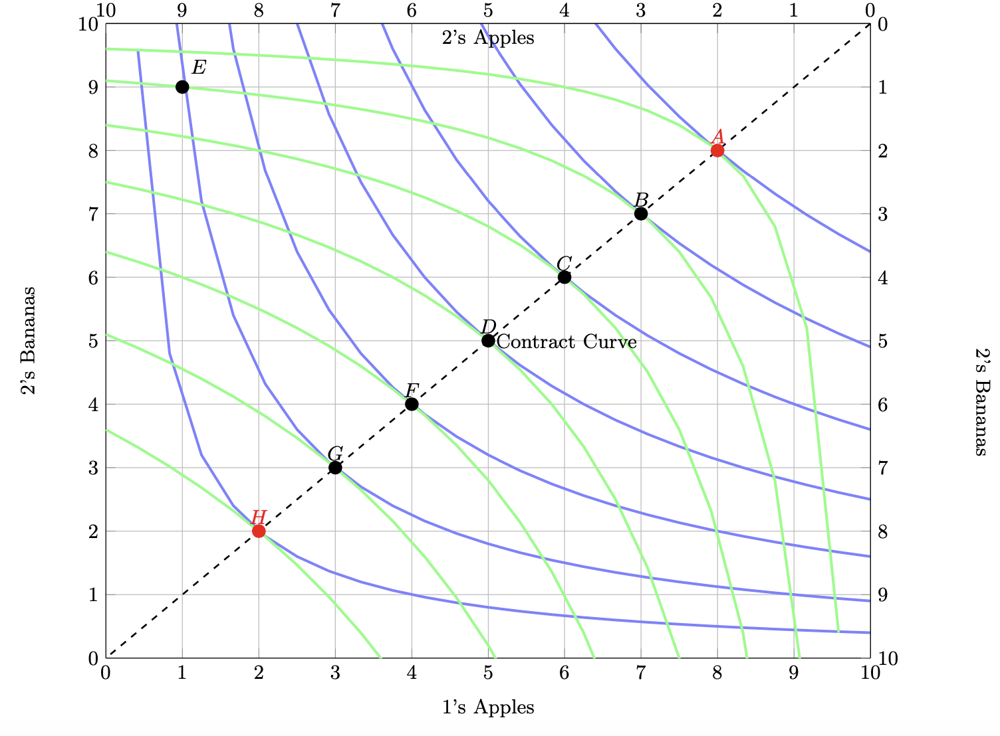
]
]

---

# The Edgeworth Box and Welfare Comparisons

.left-column[
.center[


.smaller[
Vilfredo Pareto

1848-1923
]
]
]

.right-column[

.smallest[
- Pareto fiercely was against making interpersonal utility comparisons

- To evaluate .hi[economic welfare] of an individual from economic changes, Pareto only allowed comparisons where individuals are *unambiguously* better or worse off

- To evaluate welfare for a *society* from economic changes, limit to the case where *nobody* is clearly worse off
]

]

---

# The Edgeworth Box

.pull-left[

- .hi-purple[Pareto superior] change (or a .hi-purple[Pareto improvement]) makes at least one party better off (reach higher indifference curve), and no party worse off (does not fall to lower indifference curve)
  - From point E: points B, C, D, F, G

]

.pull-right[

.center[

]
]

---

# The Edgeworth Box

.pull-left[

- Note, from point E, points A and H are .hi-purple[Pareto inferior]! Someone is made *worse* off
  - .blue[Person 1] falls to lower indifference curve at H
  - .green[Person 2] falls to lower indifference curve at A

]

.pull-right[

.center[

]
]

---

# The Edgeworth Box

.pull-left[

- Points on the contract curve are .hi[Pareto efficient] (or .hi[Pareto optimal]): there are no possible Pareto improvements!
  - no reallocation of resources (exchange) that could be made that would make at least one party better off and no party worse off

]

.pull-right[

.center[
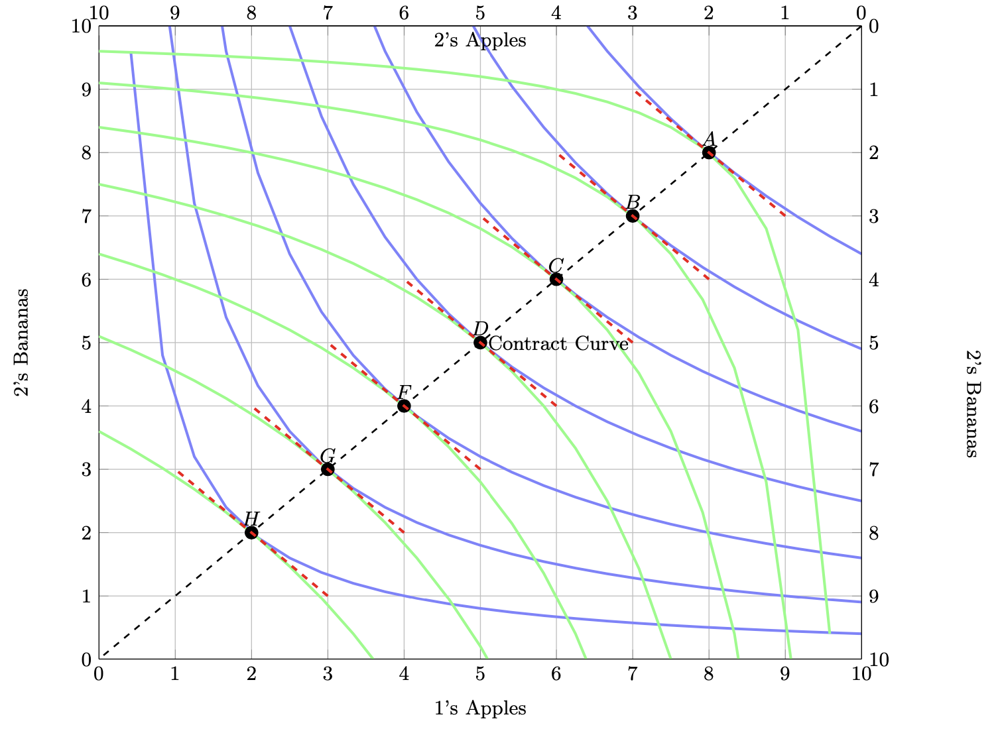
]
]

---

# The Edgeworth Box

.pull-left[

- What is unique about points on the contract curve? .hi-turquoise[All parties indifference curves are tangent to each other]
  - All parties’ indifference curves have the same slope
  - All parties’ .hi-purple[marginal rate of substitution] are equalized (to the market-price ratio)!
  - Market prices are determined by individual exchanges, and exchange equalizes everyone’s MRS!

]

.pull-right[

.center[

]
]

---

# The First Fundamental Welfare Theorem

.left-column[
.center[


.smaller[
Vilfredo Pareto

1848-1923
]
]
]

.right-column[

.smallest[
- Individual optimization $\implies$ social optimization (the Invisible Hand!)

For any persons $1$ and $2$:

$$\underbrace{\frac{MU_x^1}{MU_y^1}}_{MRS_{x,y}^1}=\frac{p_x}{p_y}=\underbrace{\frac{MU_x^2}{MU_y^2}}_{MRS_{x,y}^2}$$

- Thus, .hi-purple[any Pareto efficient allocation is a market equilibrium] (nobody would want to change)

- .hi[The First Fundamental Welfare Theorem]: all competitive market allocations are Pareto efficient

]

]

---

# The First Fundamental Welfare Theorem

.left-column[
.center[


.smaller[
Vilfredo Pareto

1848-1923
]
]
]

.right-column[
.smallest[
- Pareto defines an increase in “opelimity” as a move onto a higher indifference curve

> “We will say that the members of a collectivity enjoy a maximum of ophelimity at a certain position when it is impossible to move a small step away such that the ophelimity enjoyed by each individual in the collectivity increases, or such that it diminishes. That is to say that any small step is bound to increase the ophelimity of some individuals while diminishing that of others.”

> “For phenomena of type I [perfect competition], when equilibrium takes place at a point of tangency of indifference curves, the members of the collectivity enjoy a maximum of ophelimity.”


]
.source[Pareto, Vilfredo, 1906/1909 *Manual of Political Economy*]
]


---

# The Second Fundamental Welfare Theorem

.pull-left[

- Recall that the set of possible Pareto efficient outcomes (the contract curve) **depends on the endowments individuals start with**

- If instead of point $E$, we start with endowment at point $J$:
  - .blue[Person 1] has 8 apples, 2 bananas
  - .green[Person 2] has 2 apples, 8 bananas

- Then there is a *different* range of outcomes that are Pareto efficient
]

.pull-right[
.center[
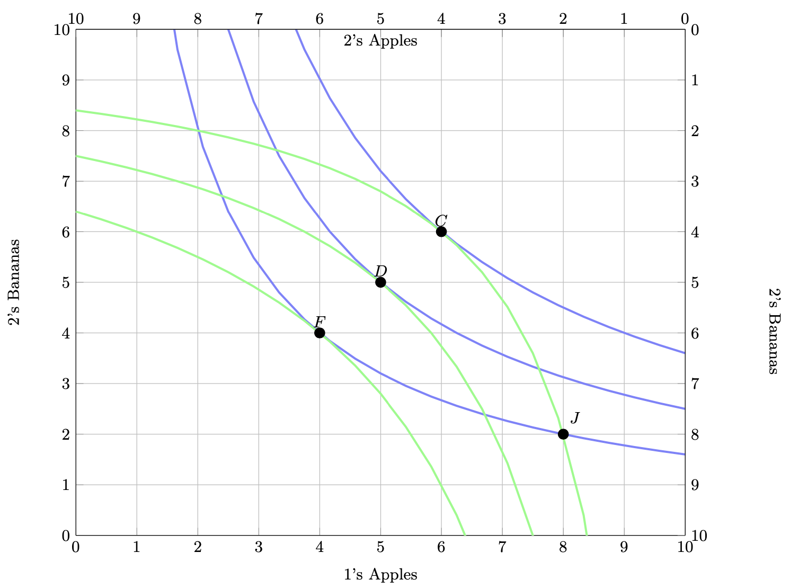
]

]

---

# The Second Fundamental Welfare Theorem

.left-column[
.center[


.smaller[
Vilfredo Pareto

1848-1923
]
]
]

.right-column[
.smallest[
- .hi[The Second Fundamental Welfare Theorem]: any *particular* Pareto efficient allocation can be achieved by *starting* from a *particular* endowment, and then allowing competitive markets
  - if, for example, you care about (in)equality of outcomes

- Implies an initial, targetted, redistribution of resources can lead to an efficient outcome by then leaving markets alone to operate afterward
  - Economists are *against* interventions that distort prices
  - Economists are *for* initial reallocations (tax & transfer of resources) that *then* leave markets alone
]
]

---

# Enrico Barone

.left-column[
.center[
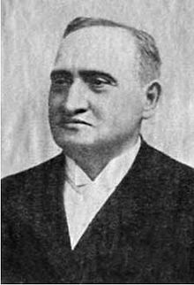

.smaller[
Enrico Barone

1859-1924
]
]
]

.right-column[
.smallest[
- Suggested that all changes in individual welfare could be expressed as the amount of real income an individual is willing to pay or willing to recieve to return them to their original endowment
  - .hi-purple[The willingness to pay] criterion

- Also showed that the marginal conditions work for *production*, and introduced idea of .hi[production possibilities frontier], and showed Pareto’s approach works as well

- See today’s reading page for a great summary by Blaug on the marginal conditions for equilibrium

]
.source[Barone, Enrico, 1908, “The Ministry of Production of the Collectivist State”]
]

---

# So Can Socialist Central Planning Do This Instead?

.left-column[
.center[


.smaller[
Vilfredo Pareto

1848-1923
]
]
]

.right-column[

.smallest[
> “Consider a collectivist society which seeks to maximise the ophelimity of its members. The problem divides into two parts. Firstly we have a problem of distribution: how should the goods within a society be shared between its members? And secondly, how should production be organised so that, when goods are so distributed, the members of society obtain the maximum ophelimity?”

His answer is an informal precursor of the second welfare theorem:

> “Having distributed goods according to the answer to the first problem, the state should allow the members of the collectivity to operate a second distribution, or operate it itself, in either case making sure that it is performed in conformity with the workings of free competition.”

]

.source[Pareto, Vilfredo, 1906/1909 *Manual of Political Economy*]

]

---

class: inverse, center, middle

# A.C. Pigou, Externalities, & Marshallian Welfare Economics

---

# A.C. Pigou

.left-column[
.center[


A.C. Pigou

1877-1959
]
]

.right-column[

- Student of Marshall, took over his Chair of Political Economy at Cambridge

- 1920, *The Economics of Welfare*

- Principle of .hi["payment in accordance with product"]

- People should pay average externality of their actions
  - Markets generally do this automatically
  - If markets fail, policy can force the market to work again

- .hi-purple[Problem with externality is that there is a missing price!]
]

---

```{r}
library("mosaic")
demand_1=function(x){10-x}
supply_1=function(x){x}

changes<-ggplot(data.frame(x=c(0,10)), aes(x=x))+
  stat_function(fun=demand_1, geom="line", size=2, color = "blue")+
    geom_label(aes(x=9,y=demand_1(9)), color = "blue", label="MSB", size = 8)+
  stat_function(fun=supply_1, geom="line", size=2, color = "#e64173")+
    geom_label(aes(x=9,y=supply_1(9)), color = "#e64173", label="MSC", size = 8)+
  geom_segment(x=0, xend=5, y=5, yend=5, size=1, linetype="dotted")+
  geom_segment(x=5, xend=5, y=0, yend=5, size=1, linetype="dotted")+
    scale_x_continuous(breaks=seq(0,10,1),
                     limits=c(0,10),
                     expand=expand_scale(mult=c(0,0.1)))+
  scale_y_continuous(breaks=seq(0,10,1),
                     limits=c(0,10),
                     expand=expand_scale(mult=c(0,0.1)),
                     labels = function(x){paste("$", x, sep="")})+
  labs(x = "Quantity (q)",
       y = "Price (p)")+
  theme_classic(base_family = "Fira Sans Condensed", base_size=20)
```

# Supply and Demand: Social Costs & Benefits

.pull-left[

```{r, fig.retina=3}

changes
```

]

.pull-right[

- .hi-blue[Demand: marginal social benefit (MSB)]
  - value to consumers of consuming output

- .hi-pink[Supply: marginal social cost (MSC)]
  - opportunity cost of pulling resources out of other uses

- **Equilibrium**: $MSB=MSC$
  - using resources efficiently, no *better* alternative uses
]

---

# Supply and Demand: Social Costs & Benefits

.pull-left[

```{r, fig.retina=3}

changes
```

]

.pull-right[

- **Price system** mitigates costs and benefits of people's actions

- People using scarce resources must **account for consequences**:
  - Pay to pull scarce resources out of other uses in society
  - Compensated for producing something valuable for others

]

---

# Externality 

.pull-left[

- .hi[Externality]: an action that incurs a cost or a benefit not compensated via prices

- Often interpretted as an action that affects (benefits or harms) a third party not privy to the action

]

.pull-right[

.center[

]
]

---

# Externality 

.pull-left[
- The real problem is that it is .hi-purple[external] to the price system!

- People base decisions off of their preferences and opportunity costs of resources for society (captured in prices)

- Prices properly negotiate the opportunity costs and provide information to people 

- But without price, decisions do not .hi-purple[internalize] those effects! 
]

.pull-right[

.center[

]
]

---

# Negative Externality

.pull-left[

```{r, fig.retina=3}
supply_up=function(x){x-2}

changes+
  stat_function(fun=supply_up, geom="line", size=2, color = "#fb6107")+
    geom_label(aes(x=9,y=supply_up(9)), color = "#fb6107", label="MPC", size = 8)+
  geom_segment(x=0, xend=6, y=4, yend=4, size=1, linetype="dotted")+
  geom_segment(x=6, xend=6, y=0, yend=4, size=1, linetype="dotted")+
  geom_point(aes(x = c(5,6),
                 y = c(5,4)),
             size = 4)+
  geom_text(x=5,y=5.5, label="A", size=8)+
  geom_text(x=6,y=4.5, label="B", size=8)
```

]

.pull-right[

.hi-pink[Marginal _Private_ Cost] to producer
is less than
.hi-red[Marginal _Social_ Cost] to society

**Market Equilibrium (B)** too much $q$ at too low $p$ compared to **Social Optimum (A)**
]

---

# Negative Externality

.pull-left[

```{r, fig.retina=3}
changes+
  stat_function(fun=supply_up, geom="line", size=2, color = "#fb6107")+
    geom_label(aes(x=9,y=supply_up(9)), color = "#fb6107", label="MPC", size = 8)+
  geom_segment(x=0, xend=6, y=4, yend=4, size=1, linetype="dotted")+
  geom_segment(x=6, xend=6, y=0, yend=4, size=1, linetype="dotted")+
  geom_point(aes(x = c(5,6),
                 y = c(5,4)),
             size = 4)+
  geom_text(x=5,y=5.5, label="A", size=8)+
  geom_text(x=6,y=4.5, label="B", size=8)+
  
  annotate("segment", x = 6, xend = 6, y = 4, yend = 6, colour = "purple", size=2, alpha=1, arrow=arrow(length=unit(0.5,"cm"), ends="both", type="closed"))+
  geom_label(x=8, y=5, label="External Cost", color = "purple", size =8)+
    geom_segment(x=0, xend=6, y=6, yend=6, size=1, linetype="dotted")


```

]

.pull-right[

.hi-pink[Marginal _Private_ Cost] to producer
is less than
.hi-red[Marginal _Social_ Cost] to society

**Market Equilibrium (B)** too much $q$ at too low $p$ compared to **Social Optimum (A)**

- Overproduction due to external cost

]

---

# Negative Externality

.pull-left[

```{r, fig.retina=3}
dwl_neg<-tribble(
  ~x, ~y,
  5, 5,
  6, 6,
  6, 4
)

changes+
  geom_polygon(data = dwl_neg,
               aes(x = x,
                   y = y),
               fill = "black",
               alpha = 0.7)+
  stat_function(fun=supply_up, geom="line", size=2, color = "#fb6107")+
    geom_label(aes(x=9,y=supply_up(9)), color = "#fb6107", label="MPC", size = 8)+
  geom_segment(x=0, xend=6, y=4, yend=4, size=1, linetype="dotted")+
  geom_segment(x=6, xend=6, y=0, yend=4, size=1, linetype="dotted")+
  geom_point(aes(x = c(5,6),
                 y = c(5,4)),
             size = 4)+
  geom_text(x=5,y=5.5, label="A", size=8)+
  geom_text(x=6,y=4.5, label="B", size=8)+
  
  annotate("segment", x = 6, xend = 6, y = 4, yend = 6, colour = "purple", size=2, alpha=1, arrow=arrow(length=unit(0.5,"cm"), ends="both", type="closed"))+
  geom_label(x=8, y=5, label="External Cost", color = "purple", size =8)+
    geom_segment(x=0, xend=6, y=6, yend=6, size=1, linetype="dotted")
```

]

.pull-right[

.hi-pink[Marginal _Private_ Cost] to producer
is less than
.hi-red[Marginal _Social_ Cost] to society

**Market Equilibrium (B)** too much $q$ at too low $p$ compared to **Social Optimum (A)**

- Overproduction due to external cost

- A **deadweight loss** from overproduction
]

---

# Negative Externality: Pigouvian Solution

.left-column[
.center[


A.C. Pigou

1877-1959
]
]

.right-column[

- Policy solutions to externalities should .hi-purple[focus on the missing price]
  - Narrowly tailor policy to create or modify price

- "Pigouvian" tax or subsidy
]

---

# Negative Externality: Pigouvian Solution

.pull-left[

```{r, fig.retina=3}
ggplot(data.frame(x=c(0,10)), aes(x=x))+
  stat_function(fun=demand_1, geom="line", size=2, color = "blue")+
    geom_label(aes(x=9,y=demand_1(9)), color = "blue", label="MSB", size = 8)+
  stat_function(fun=supply_1, geom="line", size=2, color = "red")+
    geom_label(aes(x=9,y=supply_1(9)), color = "red", label="MSC=MPC+t", size = 8)+
  geom_segment(x=0, xend=5, y=5, yend=5, size=1, linetype="dotted")+
  geom_segment(x=5, xend=5, y=0, yend=5, size=1, linetype="dotted")+
    scale_x_continuous(breaks=seq(0,10,1),
                     limits=c(0,10),
                     expand=expand_scale(mult=c(0,0.1)))+
  scale_y_continuous(breaks=seq(0,10,1),
                     limits=c(0,10),
                     expand=expand_scale(mult=c(0,0.1)),
                     labels = function(x){paste("$", x, sep="")})+
  labs(x = "Quantity (q)",
       y = "Price (p)")+
  theme_classic(base_family = "Fira Sans Condensed", base_size=20)
```

]

.pull-right[

- Set a specific tax 
$$t = MSC-MPC$$

- Eliminates the DWL

- .hi-purple[Internalizes the externality] into the price system

- Producers (and consumers) now consider the true cost to society
  - $MPC$ (with tax) $=MSC$
]
