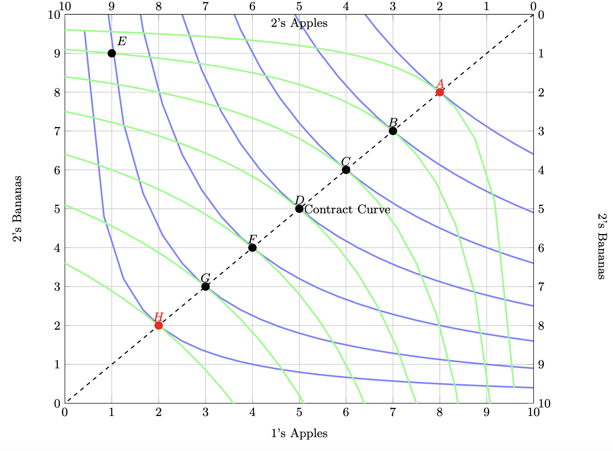

```{r setup, include=FALSE}
options(htmltools.dir.version = FALSE)
knitr::opts_chunk$set(echo=F,
                      message=F,
                      warning=F,
                      fig.retina=3,
                      fig.align="center")
library(tidyverse)
library(ggrepel)
library(ggthemes)
set.seed(256)
update_geom_defaults("label", list(family = "Fira Sans Condensed"))
```

class: inverse

# Outline

### [The Decline of Marshallian Economics](#3)

### [John Hicks and Revising Consumer Theory](#9)

### [“New” Welfare Economics and General Equilibrium Theory](#20)

### [Paul Samuelson and Formalist Economics](#32)

### [Alternatives to Formalist Economics](#37)

---

class: inverse, center, middle
# The Decline of Marshallian Economics

---

# The Decline of Marshallian Economics

.left-column[
.center[


.smallest[
Alfred Marshall

1842-1924
]
]
]

.right-column[

- Focus on partial equilibrium, applications to policy

- Loose and vague definitions & concepts, mathematics in the background

- Focus on the *art* of economics and policy, rather than positive or normative economics, or pure economic theory

- Joan Robinson: “Marshall had the ability to recognize hard problems and hide them in plain sight”

]
---

# The Decline of Marshallian Economics

.left-column[
.center[


.smallest[
Alfred Marshall

1842-1924
]
]
]

.right-column[

- Up through the 1930s, it was clear that Marshallian economics was the leading version of economics in the English-speaking world

- Criticisms from institutionalists
  - too much theory, not enough institutional detail

- Critics from formalists
  - not enough theory, too imprecise, not scientific enough
  - partial equilibrium inadequate, need general equilibrium

]

---

# The Decline of Marshallian Economics

.left-column[
.center[


.smallest[
Alfred Marshall

1842-1924
]
]
]

.right-column[
.smallest[
- Marshallian economics gets us about 80% of the way to what we teach undergraduates in microeconomics

- 1920s-1940s culmination of Neoclassical economics:

- Tweaks to consumer theory
  - John Hicks & Roy Allen on indifference curves, general equilibrium, and demand

- Tweaks to producer theory
  - Jacob Viner on long-run cost curves
  - Rediscovery of Cournot’s marginal revenue curve, $MC=MR$
  - Joan Robinson, Edward Chamberlain on monopolistic competition
  - Industrial organization & game theory (1940s-1980s)
]
]
---

# The Decline of Marshallian Economics

.left-column[
.center[


.smallest[
Alfred Marshall

1842-1924
]
]
]

.right-column[
.smallest[
- New welfare economics
  - LSE tradition: Hicks, Kaldor, Robbins
  - Harvard tradition: Abram Bergson, Paul Samuelson
  - Public/social choice: Kenneth Arrow, James Buchanan
  
- More formalist mathematical methods
  - Paul Samuelson, Kenneth Arrow
]
]
---

# The Decline of Marshallian Economics

.left-column[
.center[


.smallest[
Alfred Marshall

1842-1924
]
]
]

.right-column[
.smallest[
- Change in methodology and character of economics

- Becoming more abstract pure theory, *independent* of institutions

- More advanced mathematics
  - calculus & geometry $\rightarrow$ set theory & real topology

- Greater precision in definitions, assumptions, formalizing Marshall:
  - Marshall’s “reasonable businessman” $\rightarrow$ rational maximizer
  - Marshall’s “competitive market” $\rightarrow$ price-taking firms in perfect competition
]
]

---

class: inverse, center, middle

# John Hicks and Revising Consumer Theory

---

# John Hicks

.left-column[
.center[


.smallest[
Sir John Hicks

1904-1989

Economics Nobel 1972
]
]
]

.right-column[
.quitesmall[
- Professor of Economics at London School of Economics

- Won the 4<sup>th</sup> Economics Nobel Prize in 1972 with Kenneth Arrow “for their pioneering contributions to general economic equilibrium theory and welfare theory” 

- 1939 *Value and Capital*

- Revision of (Marshallian) consumer theory into its modern form:
  - ordinal utility
  - indifference curves
  - income-compensated demand curve
  - differentiates income vs. substitution effects
  - general equilibrium

- Came up with the “Kaldor-Hicks” criterion for efficiency (in part, with Kaldor)

- Also created the IS-LM model to summarize (his view of) Keynesian macroeconomics (and the idea of a liquidity trap)
]
]
---

# John Hicks: Indifference Curves

.left-column[
.center[


.smallest[
Sir John Hicks

1904-1989

Economics Nobel 1972
]
]
]

.right-column[

- Hicks, along with Roy Allen, and Lionel Robbins at LSE, brought Lausanne School ideas (esp. Pareto) to an English audience

- Frontal assault against cardinal utility, and measurable “utils”
  - Marshallians like Pigou and Edgeworth were still hung up on this utilitarianism


.source[Hicks, John, and Roy Allen, 1934, “A Reconsideration of the Theory of Value”, *Economica*]

]

---

# John Hicks: Utility and Demand

.left-column[
.center[


.smallest[
Sir John Hicks

1904-1989

Economics Nobel 1972
]
]
]

.right-column[

- [Assumptions about preferences](https://microf20.classes.ryansafner.com/class/1.4-class/#material-on-preferences) and indifference curves
  1. Reflexivity 
  2. Completeness
  3. Transitivity
  4. Monotonicity
  5. Convexity

- Beginning with *ordinal* utility, derive demand curves

- Indifference curves (from Edgeworth and Fisher)

- Individual utility maximization subject to budget constraint

.source[Hicks, John, and Roy Allen, 1934, “A Reconsideration of the Theory of Value”, *Economica*]

]

---

# John Hicks: Utility and Demand

.pull-left[

$$\max_{x,y} u(x,y)$$
$$s.t. p_xx+p_yy=m$$

- Yields first order condition (Gossen’s second law):

$$\underbrace{\frac{MU_x}{MU_y}}_{MRS_{x,y}}=\frac{p_x}{p_y}$$

]

.pull-right[

```{r, fig.retina=3}
library("mosaic")

points<-tribble(
  ~letter, ~x, ~y,
  "A", 10, 5,
)

IC_8=function(x){64/x}
IC_7=function(x){50/x}
IC_6=function(x){32/x}
BC=function(x){10-0.5*x}

opt<-ggplot(data.frame(x=c(0,10)), aes(x=x))+
  stat_function(fun=IC_8, geom="line", size=2, color = "#73D055FF")+
  stat_function(fun=IC_7, geom="line", size=2, color = "#3CBB75FF")+
  stat_function(fun=IC_6, geom="line", size=2, color = "#20A387FF")+
  stat_function(fun=BC, geom="line", size=2, color = "red")+
    geom_label(aes(x=5,y=IC_8(5)), color = "#73D055FF", label=expression(u[3]), size = 4)+
    geom_label(aes(x=3.5,y=IC_7(3.5)), color = "#3CBB75FF", label=expression(u[2]), size = 4)+
    geom_label(aes(x=2,y=IC_6(2)), color = "#20A387FF", label=expression(u[1]), size = 4)+
    geom_label(aes(x=2,y=BC(2)), color = "red", label="BC", size = 4)+
  geom_point(data = points,
             mapping=aes(x=x, y=y),
             size = 3)+
  geom_text_repel(data = points,
             mapping=aes(x=x, y=y,
             label = letter),
             size = 6,
             seed = 2)+
  geom_segment(aes(x = 0, xend = 10, y = 5, yend=5), linetype="dotted", size=1)+
  geom_segment(aes(x = 10, xend = 10, y = 5, yend=0), linetype="dotted", size=1)+
  scale_x_continuous(breaks=c(10),
                     limits=c(0,20),
                     labels=c(expression(x[1])),
                     expand=expand_scale(mult=c(0,0.1)))+
  scale_y_continuous(breaks=c(5),
                     labels=c(expression(y[1])),
                     limits=c(0,20),
                     expand=expand_scale(mult=c(0,0.1)))+
  labs(x = "x",
       y = "y",
       title = "The Marshallian Problem")+
  theme_classic(base_family = "Fira Sans Condensed", base_size=14)
opt
```
]

---

# John Hicks: Utility and Demand

.left-column[
.center[


.smallest[
Sir John Hicks

1904-1989

Economics Nobel 1972
]
]
]

.right-column[

- This is the .hi[“Marshallian”] or .hi[uncompensated” demand function”]: conflates income effects with substitution effects

- .hi-purple[Marshallian demand problem]: maximize utility subject to budget (market prices & income)

$$\max_{x,y} u(x,y)$$
$$s.t. p_xx+p_yy=m$$

- Yields a solution $M(p,m)$ as function of prices and income (i.e. demand)

]

---

# John Hicks: Utility and Demand

.left-column[
.center[


.smallest[
Sir John Hicks

1904-1989

Economics Nobel 1972
]
]
]

.right-column[

- Define an indirect utility function of prices & income as equal to the utility gained from Marshallian demand function $V(p,m)=u(M(p,m))$

- The .hi-purple[“Hicksian” demand problem]: minimize expenditure subject to fixed amount of utility

$$\min_{x,y} p_xx+p_yy=m$$
$$s.t. u(x,y) = \bar{u}$$

- Yields a solution $H(p, \bar{u})$ as function of prices and fixed amount of utility

]

---

# John Hicks: Utility and Demand

.pull-left[
$$\min_{x,y} p_xx+p_yy=m$$
$$s.t. u(x,y) = \bar{u}$$

- Yields identical first order condition (Gossen’s second law):

$$\underbrace{\frac{MU_x}{MU_y}}_{MRS_{x,y}}=\frac{p_x}{p_y}$$

]

.pull-right[

```{r, fig.retina=3}
points_opt<-tribble(
  ~letter, ~x, ~y,
  "A", 10, 5
)

iq_opt=function(x){50/x}
IC_10=function(x){10-0.5*x}
IC_14=function(x){14-0.5*x}
IC_12=function(x){12-0.5*x}
IC_8=function(x){8-0.5*x}

ggplot(data.frame(x=c(0,10)), aes(x=x))+
  stat_function(fun=iq_opt, geom="line", size=2, color = "#3CBB75FF")+
  stat_function(fun=IC_10, geom="line", size=2, color = "red")+
    geom_label(aes(x=3,y=iq_opt(3)), color = "#3CBB75FF", label=expression(bar(u)==u[2]), size = 4)+
    geom_label(aes(x=2,y=IC_10(2)), color = "red", label=expression(E[3]), size = 4)+
  
  stat_function(fun=IC_14, geom="line", size=2, color = "darkred")+
      geom_label(aes(x=2,y=IC_14(2)), color = "darkred", label=expression(E[2]), size = 4)+

  stat_function(fun=IC_8, geom="line", size=2, color = "pink")+
      geom_label(aes(x=2,y=IC_8(2)), color = "pink", label=expression(E[1]), size = 4)+
  geom_point(data = points_opt,
             mapping=aes(x=x, y=y),
             size = 3)+
  geom_text_repel(data = points_opt,
             mapping=aes(x=x, y=y,
             label = letter),
             size = 6)+
  geom_segment(aes(x = 0, xend = 10, y = 5, yend=5), linetype="dotted", size=1)+
  geom_segment(aes(x = 10, xend = 10, y = 5, yend=0), linetype="dotted", size=1)+
    scale_x_continuous(breaks=c(10),
                     limits=c(0,20),
                     labels=c(expression(x[1])),
                     expand=expand_scale(mult=c(0,0.1)))+
  scale_y_continuous(breaks=c(5),
                     labels=c(expression(y[1])),
                     limits=c(0,20),
                     expand=expand_scale(mult=c(0,0.1)))+
  #scale_colour_manual("Curves", values = line_colors, guide=F)+
  labs(x = "x",
       y = "y",
       title = "The Hicksian Problem")+
  theme_classic(base_family = "Fira Sans Condensed", base_size=14)
```
]

---

# John Hicks: Duality of Problems

.left-column[
.center[


.smallest[
Sir John Hicks

1904-1989

Economics Nobel 1972
]
]
]

.right-column[
- .hi-purple[*Duality* of consumer’s problem]: a Marshallian solution maximizes utility, the Hicksian solution minimizes expenditures for that amount of utility

- Similar duality for firms: profit maximization $\iff$ cost minimization
]

---

# Income & Substitution Effects

.pull-left[
.smallest[
- .hi-purple[Slutsky equation]: change in demand for good $i$ in response to a change in the price of good $j$: 

$$\frac{\partial x_i(p,m)}{\partial p_j}= \underbrace{\frac{\partial H_i(p,u)}{\partial p_j}}_{S.E.}-\underbrace{x_j(p,m)\frac{\partial x_i(p,m)}{\partial m}}_{I.E.}$$

- RHS: change in demand for good $i$ holding utility fixed at u $-$ quantity of good $j$ demanded, multiplied by the change in demand for good $i$ when income changes
  - First term is substitution effect, second term is (real) income effect
]
]

.pull-right[

]

---

# John Hicks: Simple General Equilibrium

.pull-left[

- Can generalize the 2-good case to the case of one good and a composite of all $n-1$ other goods

- Shows that optimal conditions hold for broader equilibrium across all markets

]

.pull-right[

```{r, fig.retina=3}
ggplot(data.frame(x=c(0,10)), aes(x=x))+
  stat_function(fun=iq_opt, geom="line", size=2, color = "#3CBB75FF")+
    geom_label(aes(x=3,y=iq_opt(3)), color = "#3CBB75FF", label=expression(U), size = 4)+
  stat_function(fun=IC_10, geom="line", size=2, color = "pink")+
    geom_label(aes(x=2,y=IC_10(2)), color = "red", label=expression(BC), size = 4)+
  geom_point(data = points_opt,
             mapping=aes(x=x, y=y),
             size = 3)+
  geom_text_repel(data = points_opt,
             mapping=aes(x=x, y=y,
             label = letter),
             size = 6)+
  geom_segment(aes(x = 0, xend = 10, y = 5, yend=5), linetype="dotted", size=1)+
  geom_segment(aes(x = 10, xend = 10, y = 5, yend=0), linetype="dotted", size=1)+
    scale_x_continuous(breaks=c(10),
                     limits=c(0,20),
                     labels=c(expression(u[1])),
                     expand=expand_scale(mult=c(0,0.1)))+
  scale_y_continuous(breaks=c(5),
                     labels=c(expression(u[2])),
                     limits=c(0,20),
                     expand=expand_scale(mult=c(0,0.1)))+
  #scale_colour_manual("Curves", values = line_colors, guide=F)+
  labs(x = "Good X",
       y = "All Other Goods")+
  theme_classic(base_family = "Fira Sans Condensed", base_size=14)
```
]


---

class: inverse, center, middle

# “New” Welfare Economics & General Equilibrium Theory

---

# Robbins’ Definition of Economic Science

.left-column[
.center[


.smaller[
(Lord) Lionel Robbins

1898-1984
]
]
]

.right-column[

.smallest[
> “Economics is the science which studies human behaviour as a relationship between ends and scarce means which have alternative uses” (p.15)

> “Economics is entirely neutral between ends;...in so far as any end is dependent on scarce means, it is germane to the preoccupations of the economist” (p.24)

> “Economics as science is about ‘ascertainable facts’ of the positive as distinct from normative (ethical) judgments on economic policy. It is incapable of deciding as between the desirability of different ends. It is fundamentally distinct from Ethics.” (p.24)

]

.source[Robbins, Lionel, 1932, *Essay on the Nature and Significance of Economic Science*]
]

---

# Robbins’ Definition of Economic Science

.left-column[
.center[


.smaller[
(Lord) Lionel Robbins

1898-1984
]
]
]

.right-column[

- Many saw Robbins’ statements as saying economics cannot recommend policy *at all*

- Pareto had devised his criterion where at least one person is unambiguously better off and nobody unambiguously worse off
  - But this is unrealistic in the real world!

]

---

# The “New” Welfare Economics

.pull-left[

- Led to the birth of the .hi[“New” Welfare Economics] in 1930s on Paretian foundations, with two major interpretations/traditions:

- Harvard tradition:
  - Paul Samuelson, Abram Bergson

- LSE tradition:
  - Nicholas Kaldor, John Hicks, Tibor Scitovsky

]

.pull-right[
.center[

]
]

---

# The “New” Welfare Economics

.pull-left[
.smallest[
- All agree with Pareto that utility is not cardinal, and cannot be compared across people
  - proper modification of Pareto’s conditions

- Harvard: choice of social optimum is a *normative* issue, but can be assisted with economic theory

- LSE: strictly *positive* examination of social choice, not a *normative* issue
  - As Robbins might approve: strictly an analysis of means for given ends
  - Hicks: the analysis will reach the same conclusions whther “one is a liberal or a socialist, a nationalist or an internationalist, a christian or a pagan”
]
]

.pull-right[
.center[

]

]

---

# Harvard Tradition: The Social Welfare Function

.pull-left[
.quitesmall[
- Abram Bergson introduces the .hi[social welfare function]

> “to state in precise form the value judgments required for the derivation of the conditions of maximum economic welfare”

- A real valued, continuous, and differentiable utility function to describe the utility of society as a whole

$$W=W(U_1,U_2, \cdots, U_H)$$
where $W$ is welfare of society, $U$ are utility functions for households 1 through $H$
  - note it is *not* additive! (as Benthamite utilitarianism might have it)

- Overtly normative, a maximization problem for a social planner

]
]
.pull-right[

```{r, fig.retina=3}
ggplot(data.frame(x=c(0,10)), aes(x=x))+
  stat_function(fun=iq_opt, geom="line", size=2, color = "#3CBB75FF")+
    geom_label(aes(x=3,y=iq_opt(3)), color = "#3CBB75FF", label=expression(W), size = 4)+
  stat_function(fun=IC_10, geom="line", size=2, color = "pink")+
    geom_label(aes(x=2,y=IC_10(2)), color = "red", label=expression(GUPF), size = 4)+
  geom_point(data = points_opt,
             mapping=aes(x=x, y=y),
             size = 3)+
  geom_text_repel(data = points_opt,
             mapping=aes(x=x, y=y,
             label = letter),
             size = 6)+
  geom_segment(aes(x = 0, xend = 10, y = 5, yend=5), linetype="dotted", size=1)+
  geom_segment(aes(x = 10, xend = 10, y = 5, yend=0), linetype="dotted", size=1)+
    scale_x_continuous(breaks=c(10),
                     limits=c(0,20),
                     labels=c(expression(u[1])),
                     expand=expand_scale(mult=c(0,0.1)))+
  scale_y_continuous(breaks=c(5),
                     labels=c(expression(u[2])),
                     limits=c(0,20),
                     expand=expand_scale(mult=c(0,0.1)))+
  #scale_colour_manual("Curves", values = line_colors, guide=F)+
  labs(x = expression(U[1]),
       y = expression(U[2]),
       title = "The Social Welfare Function")+
  theme_classic(base_family = "Fira Sans Condensed", base_size=14)
```
]

---

# LSE Tradition: Kaldor-Hicks-Scitovsky

.pull-left[
.smallest[
- Alternative criteria for judging whether allocations were “preferable” given by Nicholas Kaldor, John Hicks, and Tibor Scitovsky (and based off Barone)

- .hi[Kaldor criterion]: a change is preferable if the winners can in principle, compensate the losers with some of the gains, and still be better off

- .hi[Hicks criterion]: a change is preferable if the losers from the change cannot bribe the winners enough to prevent them from desiring the change

- .hi[Scitovsky double criterion]: both criteria must be true simultaneously 
]
]

.pull-right[
.center[

]
]

---

# Markets and Kaldor-Hicks Efficiency

.pull-left[
.smallest[
- .hi[Kaldor-Hicks Improvement]: an action improves efficiency its generates more social gains than losses
    - those made better off could in principle compensate those made worse off

- .hi[Kaldor-Hicks efficiency]: no potential Kaldor-Hicks improvements exist

- Keeps intuitive appeal of Pareto but more practical
    - Every Pareto improvement is a KH-improvement (but not the other way around!)
    
- Consider policies where winners' maximum WTP $>$ losers' minimum WTA

- Policies should **maximize social value of resources**
]
]

.pull-right[

.center[


]
]

---
# Arrow-Debreu and General Equilibrium

.left-column[
.center[


.smallest[
Kenneth Arrow

1921-2017

Economics Nobel 1972
]
]
]

.right-column[
.quitesmall[
- Prove, using the [Kakutani fixed-point theorem](https://en.wikipedia.org/wiki/Kakutani_fixed-point_theorem) that (Walrasian) general equilibrium exists

- With additional assumptions about preferences, proved that a *unique* equilibrium exists if utility functions be strongly concave and twice continuously differentiable

- *Extremely* general, works even for contingent-claims markets under uncertainty
  - Complete set of prices for all contracts that individuals trade, including contingent-contracts on future delivery of goods based on various conditions, e.g. “1 ton of Winter red wheat, delivered on 3rd of January in Minneapolis, if there is a hurricane in Florida during December”

- Prove that “the Invisible Hand works” under specific conditions
]
]

---

# Arrow on Social Choice Theory

.left-column[
.center[


.smallest[
Kenneth Arrow

1921-2017

Economics Nobel 1972
]
]
]

.right-column[
.quitesmall[
- Arrow is also known for his work in .hi[social choice theory]

- Want a voting systen that meets the following criteria:
  1. .hi-purple[Unanimity/Pareto Criterion]: if all individuals prefer $X \succ Y$, then $X$ must be chosen over $Y$
  2. .hi-purple[Transitivity]: the social choice mechanism is transitive such that if $X$ is chosen over $Y$, and $Y$ over $Z$, then $X$ must be chosen over $Z$
  3. .hi-purple[Unrestricted Domain]: all individuals are able to rank all alternatives
  4. .hi-purple[Independence of Irrelevant Alternatives]: pairwise comparisons between two alternatives are not affected by the rank of *other* alternatives
  5. .hi-purple[Non-dictatorship]: there is no individual that always gets their way regardless of other voters
]

]

---

# Arrow on Social Choice Theory

.left-column[
.center[


.smallest[
Kenneth Arrow

1921-2017

Economics Nobel 1972
]
]
]

.right-column[
- .hi[Arrow’s Impossibility Theorem]: no social choice mechanism exists that can fulfill all 5 criteria simultaneously

- Alternative specification: the only social choice mechanism that can fulfill conditions 1-4 is .hi[dictatorship]

- Learn more in my [Public Economics course (Lesson 3.1)](https://publics20.classes.ryansafner.com/class/3.1-class/)
]

---

# Buchanan on Public Choice Theory

.left-column[
.center[


.smallest[
James M. Buchanan

1919-2013

Economics Nobel 1986
]
]
]

.right-column[
.smallest[
- Buchanan and Gordon Tullock pioneered .hi[public choice theory]

- Society/government is not a choosing-agent, individuals have *different interests* as consumers, producers, voters, elected officials, bureaucrats, etc.
  - there is no “social welfare function”!

- Economic analysis of politics: individuals with separate interests making exchanges with one another

- Focus on constitutional rules, rational ignorance, rent-seeking, concentrated benefits and dispersed costs, etc.

- Learn more in my [Public Economics course](https://publics20.classes.ryansafner.com/class/3.1-class/)
]
]

---

class: inverse, center, middle

# Paul Samuelson and Formalist Economics

---

# Paul Samuelson

.left-column[
.center[


.smallest[
Paul A. Samuelson

1915-2009

Economics Nobel 1970
]
]
]

.right-column[

.quitesmall[
- Formalistic methods

- Neoclassical synthesis between neoclassical microeconomics and Keynesian macroeconomics
  - the leading mainstream

- 1946 *Foundations of Economic Analysis*

- 1948 *Economics: An Introductory Analysis*
  - best-selling economics textbook for decades
  - 19 editions, coauthored with William Nordhaus, 4 million sold

- Almost single-handedly established MIT as a powerhouse in economics

]
]

---

# Paul Samuelson

.left-column[
.center[


.smallest[
Paul A. Samuelson

1915-2009

Economics Nobel 1970
]
]
]

.right-column[

.quitesmall[

- Won the 2<sup>nd</sup> Economics Nobel Prize (first American to do so):
]

.quitesmall[
> “More than any other contemporary economist, Samuelson has helped to raise the general analytical and methodological level in economic science. He has simply rewritten considerable parts of economic theory. He has also shown the fundamental unity of both the problems and analytical techniques in economics, partly by a systematic application of the methodology of maximization for a broad set of problems. This means that Samuelson's contributions range over a large number of different fields.” — Nobel Prize Committee

]
]

---
# Paul Samuelson: Mathematical Economics

.left-column[
.center[


.smallest[
Paul A. Samuelson

1915-2009

Economics Nobel 1970
]
]
]

.right-column[

.quitesmall[
- *Foundations of Economic Analysis*, his magnum opus based on his doctoral dissertation

- Inspired by classical thermodynamics (and friends with William Gibbs)

> “[Goal is to] examine underlying analogies between central features in theoretical and applied economics and
study how operationally meaningful theorems can be derived with a small number of analogous methods.”

- Unifies many branches of economics into a series of repeated models: maximizing agents & stable equilibrium

- Comparative statics method of comparing equilibria

> “By a meaningful theorem, I mean simply a hypothesis about empirical data which could conceivably be refuted, if only under ideal conditions.”

]
.source[Samuelson, Paul A, 1946, *Foundations of Economic Analysis*]

]

---

# Paul Samuelson: Mathematical Economics

.left-column[
.center[


.smallest[
Paul A. Samuelson

1915-2009

Economics Nobel 1970
]
]
]

.right-column[

- Saw Cournot, Jevons, Edgeworth, Fisher, and Pareto as true founders of modern  (mathematical) economics

.smallest[
> “I have come to feel that Marshall’s dictum that ‘it seems doubtful whether any one spends his time well in reading lengthy translations of economic doctrines into mathematics...’ should be exactly reversed. The laborious literary working over of essentially simple mathematical concepts such as is characteristic of much of modern economic theory is not only unrewarding from the standpoint of advancing science, but involves as well mental gymnastics of a peculiarly depraved type,” (p.6).
]

.source[Samuelson, Paul A, 1946, *Foundations of Economic Analysis*]

]

---
class: inverse, center, middle

# Alternatives to Formalist Economics


---

# Milton Friedman

.left-column[
.center[


.smallest[
Milton Friedman

1912-2006

Economics Nobel 1976
]
]
]

.right-column[

.quitesmall[
- Counterweight to Paul Samuelson’s formalism and counterweight to Keynesian macroeconomics

- Methodology: positivism & “as-if” modeling (see Class 1.2)

- Work on consumption, demand, monetary theory and history

- Free-market classical liberalism

- 1976 Nobel Prize in Economics “for his achievements in the fields of consumption analysis, monetary history and theory and for his demonstration of the complexity of stabilization policy”
]

.source[
Friedman, Milton, 1953, *Essays in Positive Economics*

Friedman, Milton, 1957, *A Theory of the Consumption Function*

Friedman, Milton, 1962, *Capitalism and Freedom*

Friedman, Milton and Anna Schwartz, 1963, *A Monetary History of the United States, 1867-1960*


]
]

---

# The Chicago School of Economics

.left-column[
.center[


.smallest[
Milton Friedman

1912-2006

Economics Nobel 1976
]
]
]

.right-column[

.quitesmall[
> “In discussions of economic policy, “Chicago” stands for belief in the efficiency of the free market as a means of organizing resources, for skepticism about government affairs, and for emphasis on the quantity of money as a key factor in producing inflation.”
“In discissusion of economic science, “Chicago” stands for an approach that takes seriously the use of economic theory as a tool for analyzing a statingly wide range of concrete problems, rather than as an abstract mathematical structure of great beauty but little power; for an approach that insists on the empirical testing of theoretical generalizations and that rejects alike facts without theory and theory without facts,” (quoted in Landreth & Colander, p. 400) 

]
]
---

# The Chicago School of Economics

.left-column[
.center[


.smallest[
Milton Friedman

1912-2006

Economics Nobel 1976
]
]
]

.right-column[

- Marshallian-style application of price theory and partial equilibrium to all social problems
  - maximizing individuals, stable preferences, equilibrium

- Not overly mathematical or formalist, more intuitive and logical application of price theory

- Gary Becker: economic analysis of the family, discrimination, addiction, “irrational” behavior
  - “economic imperialism” into other social sciences
]

---

# The Chicago School

.center[

]

- 13 Nobel Prizes to Chicago-based economists

---

# Coase and the Return to Institutions

.left-column[
.center[


.smaller[
Ronald H. Coase

(1910-2013)

Economics Nobel 1991]

]
]

.right-column[

> “The traditional [Pigouvian] approach [to externalities] has tended to obscure the nature of the choice that has to be made. The question is commonly thought of as one in which A inflicts harm on B and what has to be decided is: how should we restrain A? But this is wrong. We are dealing with a problem of a reciprocal nature. To avoid the harm to B would inflict harm on A. The real question that has to be decided is: should A be allowed to harm B or should B be allowed to harm A?” (p.2)


]

.source[Coase, Ronald H, 1960, "The Problem of Social Cost," *Journal of Law and Economics* 3:1-44]

---

# Externalities as a Property Rights Problem

.left-column[
.center[


.smaller[
Ronald H. Coase

(1910-2013)

Economics Nobel 1991]

]
]

.right-column[

- Harm is often .hi[bilateral], not unilateral

- Takes two parties to have a dispute
- A $\iff$ B

- Origin of the problem is rights are not clear (undefined or unenforced)!

- Who has right/responsibility over activity creating the external harm? 


]

.source[Coase, Ronald H, 1960, "The Problem of Social Cost," *Journal of Law and Economics* 3:1-44]

---

# Property Rights and Externalities

.pull-left[
- Court must must imposing a cost on either the defendant or plaintiff

- Real issue is the social balance of efficiency

- .hi[At what rate is society willing to give up confections for medical services, and vice versa?]

]

.pull-right[
.center[

]
]

---

# The "Coase Theorem"

.pull-left[
.smallest[
- .hi[Coase Theorem]: if transactions costs are low, clearly defined property rights allow parties to bargain to the efficient social outcome *regardless* of who has the property right

- Wealth and **distribution** effects *will* change (who pays who)

- If there are mutual gains from exchange to be had, parties will find a way to capture them
  - Resources will flow towards highest-valued uses
  - Coase: there's nothing new here if you understand Adam Smith! 

]
]

.pull-right[
.center[

]
]

---

# The "Coase Theorem" in the Real World

.pull-left[

- In real world of transactions costs, .hi[the assignment of property rights matters!]

- Property rights and resources are sticky! 

- Means some allocations are more efficient than others! 

]

.pull-right[
.center[

]
]

---

# The "Coase Theorem" in the Real World

.pull-left[
.smaller[
- Coase: forget "**Blackboard economics**" and go study the **real world** of institutions

- Launches .hi-purple["Law & Economics"] field, and .hi-purple[“property rights” economics]
  - Armen Alchian, Harold Demsetz, Richard Posner, etc.

> *How should property rights be assigned to minimize the total cost of externalities and to maximize efficiency?*

]
]
.pull-right[
.center[

]
]

---

# New Institutional Economics

.center[

]

- Focus on role of institutions (and transaction costs) in structuring incentives of individuals, firms, and governments

---

# How Much of Modern Microeconomics is Neoclassical?

.pull-left[
- .hi-purple[Neoclassical economics assumes strict rationality]
  - Behavioral economics
  - Bounded rationality & “satisficing”
  - Ecological rationality

]

.pull-right[
.center[

]
]

---

# How Much of Modern Microeconomics is Neoclassical?

.pull-left[
- .hi-purple[Neoclassical economics focuses almost exclusively on marginal conditions at the optimum among price—takers]
  - Game theory — strategic interactions
  - Austrians — entrepreneurship, uncertainty, market process
  - Evolutionary economics — adaptation
  - Industrial organization — theory of the firm, market power
  - New Institutional economics — economics of organization

]

.pull-right[
.center[

]
]

---

# How Much of Modern Microeconomics is Neoclassical?

.pull-left[
- .hi-purple[Neoclassical economics focuses only on individuals]
  - Complexity science
  - Agent-based modeling
  - New Institutional economics — economics of organization

]

.pull-right[
.center[

]
]

---

# How Much of Modern Microeconomics is Neoclassical?

.pull-left[
- .hi-purple[Neoclassical economics assumes away institutions]
  - New Institutional Economics
  - Public Choice & Social choice economics
  - Property rights economics
  - Law & Economics
]

.pull-right[
.center[

]
]

---

# How Much of Modern Microeconomics is Neoclassical?

.pull-left[
- Go back to lessons

- [1.1 — Introduction](/class/1.1-class)
- [1.2 — What Exactly Is Economics?](/class/1.2-class)

and reconsider:
  - orthodox vs. heterodox economics
  - proper scope and methodology of economics
  - what is economics?
]

.pull-right[
.center[

]
]
