```{r setup, include=FALSE}
options(htmltools.dir.version = FALSE)
knitr::opts_chunk$set(echo=F,
                      message=F,
                      warning=F,
                      fig.retina=3,
                      fig.align="center")
library(tidyverse)
library(ggrepel)
library(ggthemes)
set.seed(256)
update_geom_defaults("label", list(family = "Fira Sans Condensed"))
```

class: inverse

# Outline

### [Hayek and Austrian Business Cycle Theory](#)
### [Neo-Keynesianism](#)
### [The New Classical (Counter) Revolution](#)

---

class: inverse, center, middle

# Hayek and Austrian Business Cycle Theory

---

# Hayek and Austrian Business Cycle Theory

.left-column[
.center[


.smallest[
Friedrich August von Hayek

1899-1992

Economics Nobel 1974
]
]
]

.right-column[
.smallest[
- Hayek came to LSE during this time, hired by Lionel Robbins

- Became the major competing theory of the business cycle and macroeconomics to Keynes in 1930s

- Focus on capital theory, building off of Mises’ theory of money and credit & Wicksell’s theory of the natural rate of interest

- Revival of Austrian Business Cycle Theory (and Keynesian theory) as possible explanation of 2008-2009 financial crisis

- 1931 *Prices and Production*

- 1941 *The Pure Theory of Capital*
]
]

---

# Hayek and Austrian Business Cycle Theory

.left-column[
.center[


.smallest[
Friedrich August von Hayek

1899-1992

Economics Nobel 1974
]
]
]

.right-column[
.smallest[

> “Mr. Keynes’ aggregates conceal the most fundamental mechanisms of change.”
		
> “Mr. Keynes’ assertion that there is no automatic mechanism in the economic system to keep the rate of saving and the rate of investing equal might with equal justification be extended to the more general contention that there is no automatic mechanism in the economic system to adapt production to any shift in demand. I begin to wonder whether Mr. Keynes has ever reflected upon the function of the rate of interest...”

]

.source[Hayek, F. A., 1931, *Prices and Production*]
]

---

# Hayek and Austrian Business Cycle Theory

.left-column[
.center[


.smallest[
Friedrich August von Hayek

1899-1992

Economics Nobel 1974
]
]
]

.right-column[

- Focuses on the role of interest rates as prices that coordinate capital investment over time
  - Higher interest rates discourage longer term, riskier projects
  - Lower interest rates encourage longer term, riskier projects
  
- Recall, interest rates are determined by the supply (time preference of savers) and demand of loanable funds

- Hayek’s work is a little abstract and difficult to follow, better interpretted by some modern Austrians
  - Garrison, Roger, 2000, *Capital-Based Macroeconomics*
]

---

# Hayek and Austrian Business Cycle Theory

.left-column[
.center[


.smallest[
Friedrich August von Hayek

1899-1992

Economics Nobel 1974
]
]
]

.right-column[

> “Before we can even ask how things might go wrong, we must first explain how they could ever go right.”

.source[Hayek, F.A., 1948, “Economics and Knowledge” in *Individualism and Economic Order*]

]

---

# Structure of Production

.pull-left[
 
- Take Menger’s idea of higher-order goods and arrange an analytical “structure of production” through time
]

.pull-right[
.center[
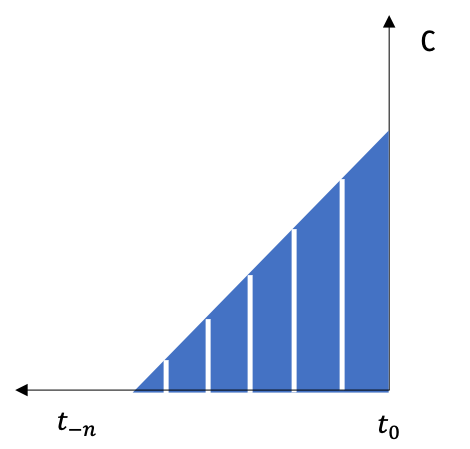
]
]

---

# Theory of Capital

.pull-left[
.smallest[
 
- Capital is .hi[heterogeneous] — not one identical aggregate “blob” $K$, but a variety of goods
  - e.g. beer barrels, blast furnaces, computers, trucks, hammers, etc

- Capital is .hi[specific] to particular uses and not others, with a cost of switching uses
  - e.g. can’t turn a pencil factory into a tank factory

- Capital is .hi[complementary] to other goods that must be fit together into a single plan
]
]

.pull-right[
.center[


]
]

---

# Time Preferences

.pull-left[
.smallest[
- .hi[Time-preference]: make tradeoff between present consumption and saving/investment (in hopes of *higher* future consumption)
  - Decrease in time preference: $(I,S_1, c_1) \rightarrow (I,S_2, c_2)$
  - Increase in time preference: $(I,S_1, c_1) \leftarrow (I,S_2, c_2)$
]
]
.pull-right[
.center[
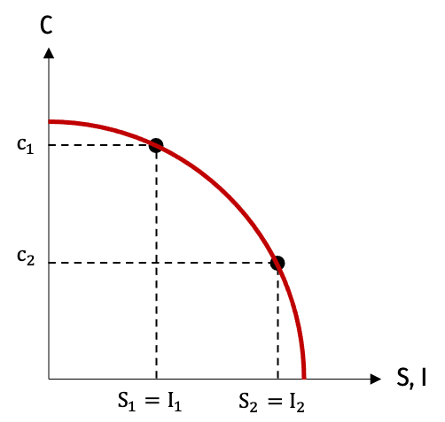
]
]

---

# Time Preferences and the Structure of Production

.pull-left[

- Structure of production determined by time preferences 
]

.pull-right[
.center[
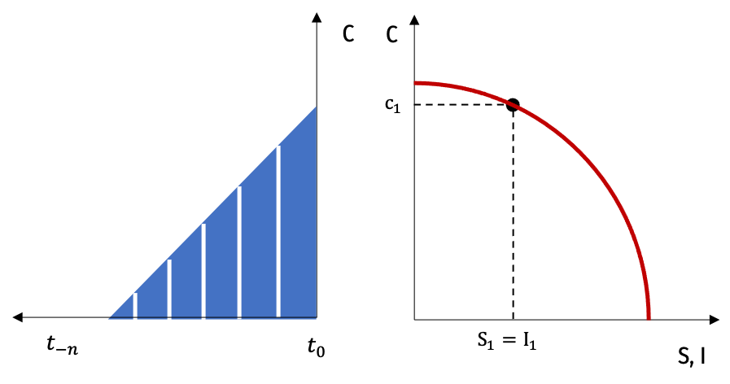
]
]

---

# Time Preferences and the Structure of Production

.pull-left[

- Structure of production determined by time preferences

- Decrease in time preferences (more investment, less consumption)
  - Decreases investment in 1st-order consumption goods
  - Increases investment in earlier, higher-order goods
]

.pull-right[
.center[
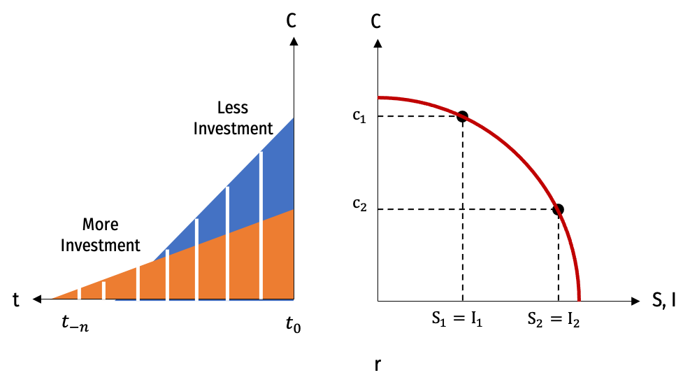
]
]

---

# Market for Loanable Funds

.pull-left[

- Market for loanable funds
  - .red[Supply] of savings
  - .blue[Demand] to borrow
  - determines market interest rate $r$
]

.pull-right[
.center[
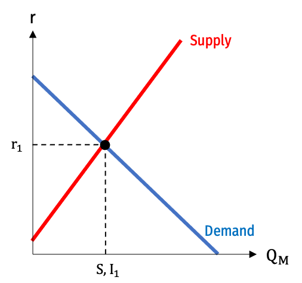
]
]

---

# Decrease in Time Preferences

.left-column[

- Decrease in time preference

- Increases .red[supply of savings]

- Lowers interest rates

- Increases investment in long-term projects, decreases investment in late-stage projects
]

.right-column[
.center[

]
]

---

# Economic Growth

.left-column[

- Economic growth
]

.right-column[
.center[
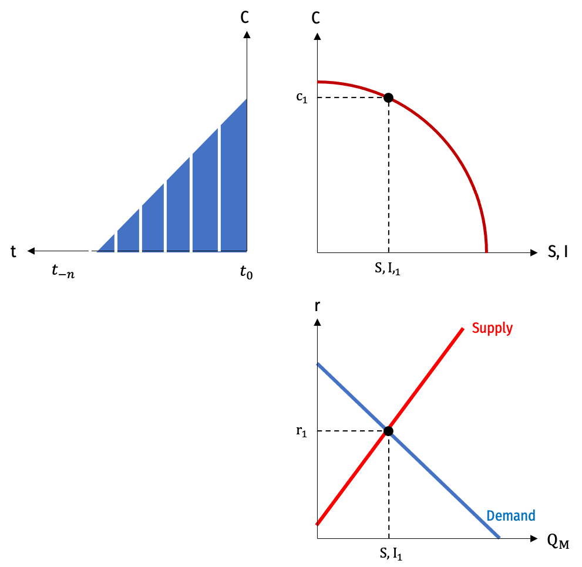
]
]

---

# Economic Growth

.left-column[

- Economic growth
]

.right-column[
.center[
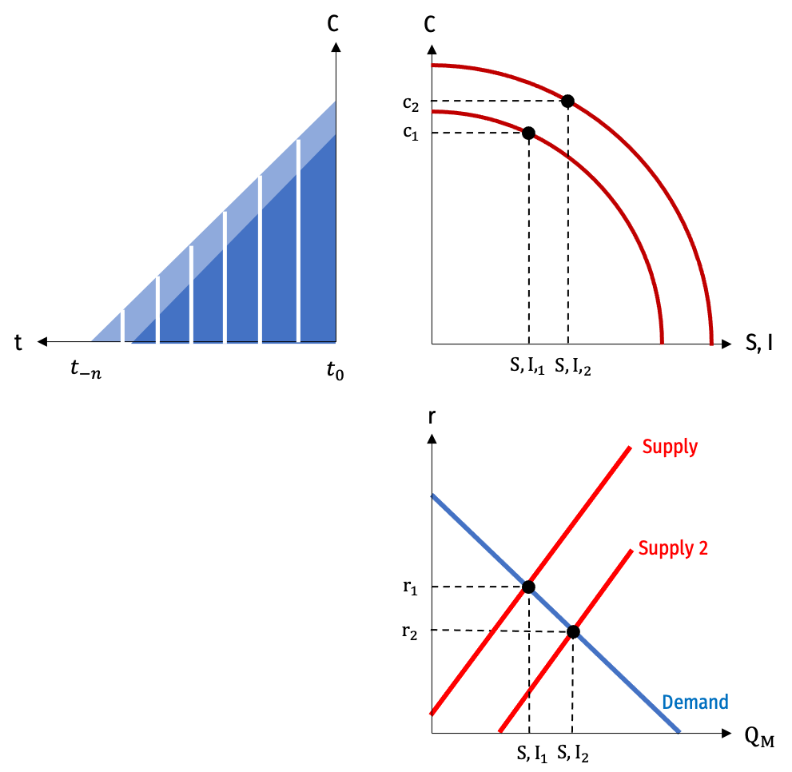
]
]

---

# Bad Monetary Policy Creates Boom-Bust Cycle

.pull-left[

- Suppose through credit expansion (Central bank monetary policy), interest rates are artificially lowered tor $r_2$
  - below the “natural rate” determined by real savings & demand, $r_1$

- At $r_2$, investment $I_2>S_2$ savings

]

.pull-right[
.center[
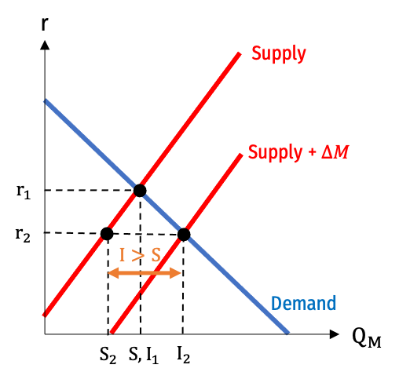
]
]

---

# Bad Monetary Policy Creates Boom-Bust Cycle

.pull-left[

- Creates an .hi[artificial economic boom]
  - beyond the PPF!
  - more consumption and more investment than is possible
  
- Unsustainable, cannot last
  - Some investments are not backed by sufficient real resources!
]

.pull-right[
.center[
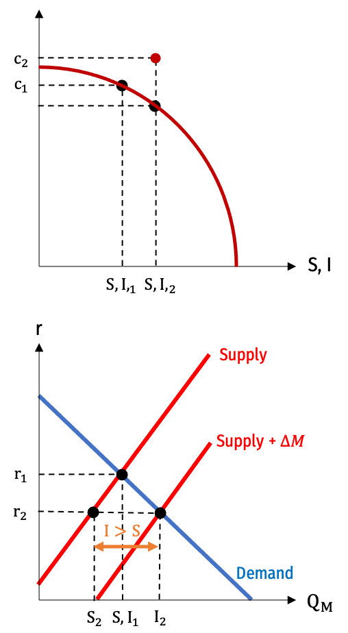
]
]

---

# Bad Monetary Policy Creates Boom-Bust Cycle

.pull-left[

- Boom will burst, requiring liquidation of bad investments, fall in consumption

- Economy will retreat *inside* of PPF

- Capital has been misallocated to wrong sectors of the economy, costly to reallocate capital to different uses
]

.pull-right[
.center[
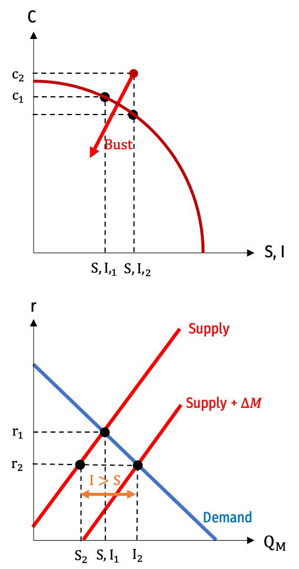
]
]

---

# Bad Monetary Policy Creates Boom-Bust Cycle

.left-column[

- Boom will burst, requiring liquidation of bad investments, fall in consumption

- Economy will retreat *inside* of PPF

- Capital has been misallocated to wrong sectors of the economy, costly to reallocate capital to different uses
]

.right-column[
.center[
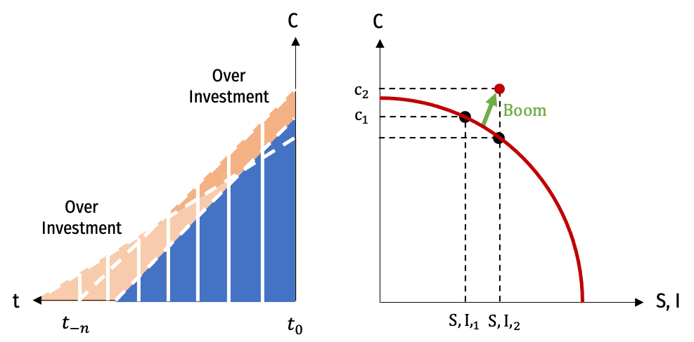
]
]

---

class: inverse, center, middle

# Neo-Keynesianism

---

# Simon Kuznets and National Income Accounts

.left-column[
.center[
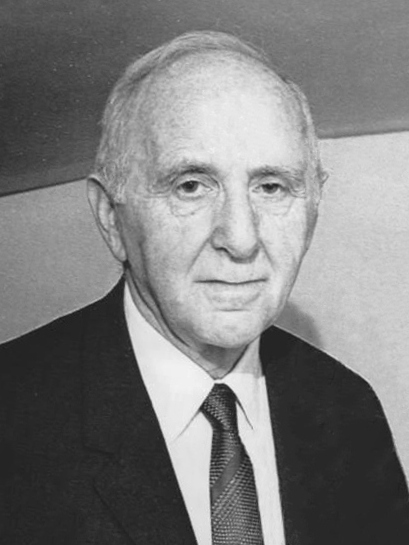

.smallest[
Simon Kuznets

1901-1985

Economics Nobel 1971
]
]
]

.right-column[
.smallest[
- Student of Wesley Clair Mitchell (a famous American institutionalist)
  - Worked at NBER (founded by Mitchell), empirically studying business cycles
  - 15-25 year “Kuznets cycles”

- .hi-purple[National Income Accounts], first at NBER, later at U.S. Department of Commerce
  - GDP and GNP
  - Disapproved of it as a measure of welfare:

> “the welfare of a nation can scarcely be inferred from a measure of national income.”

]

]

---

# Simon Kuznets and National Income Accounts

.left-column[
.center[


.smallest[
Simon Kuznets

1901-1985

Economics Nobel 1971
]
]
]

.right-column[
.smaller[
- Work in empirical macroeconomics, compiling data on income, output, consumption, and savings
  - helped fuel the Keynesian Revolution by testing Keynesian hypotheses

- Also known for the “Kuznets curve”: an upside-down U-shaped relationship between economic growth and income inequality
]
]

---
# GDP

.pull-left[
.quitesmall[
- .hi[Gross Domestic Product (GDP)]: the market value of all final goods and services produced within a country in a year 

$$Y=C+I+G+(X-M)$$

- $Y$: national income
- $C$: consumption
- $I$: investment
- $G$: government spending
- $X$: exports
- $M$: imports

- .hi[Gross National Product]: GDP + production by citizens *living abroad*
]
]
.pull-right[
.center[

]
]

---

# Income, Expenditures, and the Circular Flow

.pull-left[

- Can calculate GDP or GNI as .hi-purple[expenditures] or as .hi-purple[income]

- As expenditures:
  - consumption + investment + government spending + net exports

- As income:
  - wages + rent + capital income

- For a country: $\sum$ expenditures $=$ $\sum$ income
]
.pull-right[
.center[

]
]

---

# GDP as Expenditures

.center[
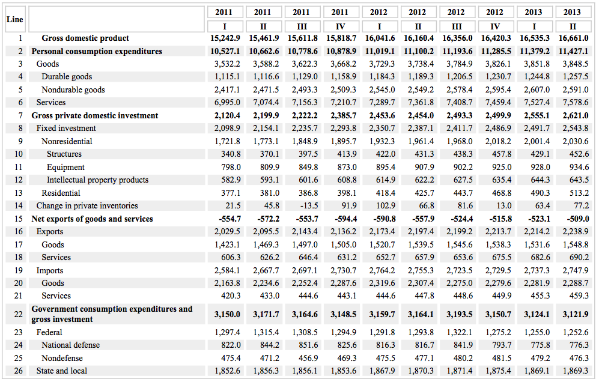
]

---

# GDP as Income

.center[
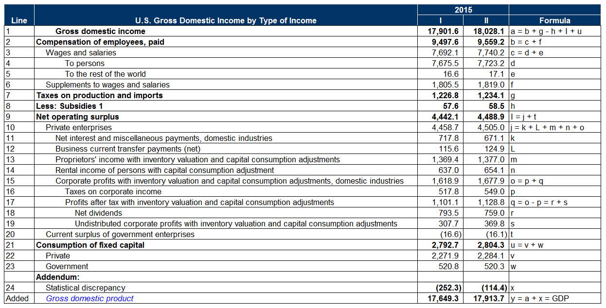
]

---

# The Circular Flow

.center[

]

---

# Samuelson and Keynesian Cross

.left-column[
.center[


.smallest[
Paul A. Samuelson

1915-2009

Economics Nobel 1970
]
]
]

.right-column[

- Samuelson’s 1948 textbook, *Economics* incorporated Keynes’ insights into neoclassical models
  - “Keynesian Cross”
  - “Liquidity trap”
  - Aggregate demand aggregate supply analysis
  - Fiscal policy & multipliers
]

---

# Samuelson and Keynesian Cross

.pull-left[
.smallest[
- Aggregate income (real GDP) as independent variable

- Aggregate planned expenditures (aggregate demand) as dependent variable

- 45* line: “aggregate supply” — if at less than full employment, anything demanded will be supplied

- Not all expenditures are planned (some inventories unsold)

- Equilibrium: where $AE$ intersects 45* line
]
]

.pull-right[
.center[

]
]

---

# Hicks and IS-LM

.left-column[
.center[


.smallest[
Sir John Hicks

1904-1989

Economics Nobel 1972
]
]
]

.right-column[

.center[
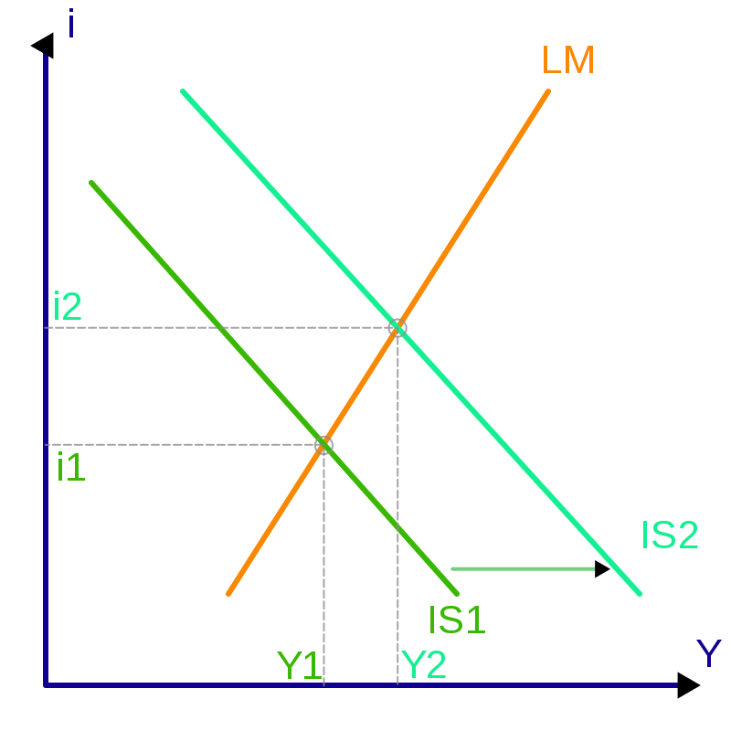
]
]

---

# Aggregate Demand & Aggregate Supply

.pull-left[

- Take the quantity theory of money
$$\underbrace{MV}_{\text{nominal spending}}=\underbrace{Py}_{\text{nominal income}}$$

- .hi-blue[Aggregate demand]: all combinations of $M$ and $y$ consistent with same $MV$ (nominal spending)

- Downward-sloping
  - if $\uparrow M$, $\downarrow y$ to maintain $MV$
]

.pull-right[
.center[
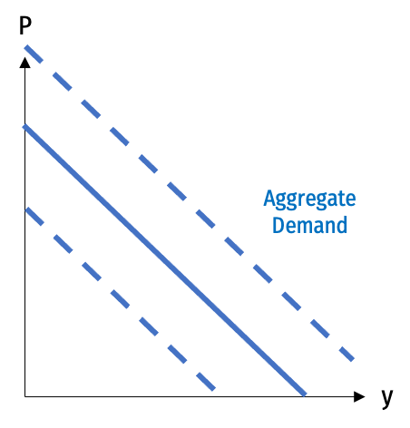
]
]

---

# Aggregate Demand & Aggregate Supply

.pull-left[

- Take the quantity theory of money
$$\underbrace{MV}_{\text{nominal spending}}=\underbrace{Py}_{\text{nominal income}}$$

- .hi-blue[Aggregate demand]: all combinations of $M$ and $y$ consistent with same $MV$ (nominal spending)

- Downward-sloping
  - if $\uparrow M$, $\downarrow y$ to maintain $MV$
]

.pull-right[
.center[

]
]

---

# Aggregate Demand & Aggregate Supply

.pull-left[

- .hi-red[Aggregate supply]: economy has potential output determined by production function
$$Y=f(A,L,K)$$

- In long run: vertical, determined by these **real factors**
]

.pull-right[
.center[
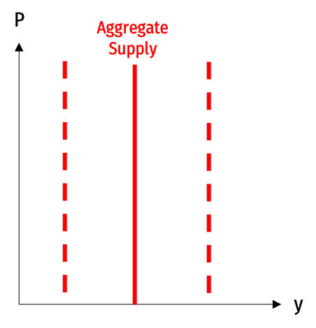
]
]

---

# Aggregate Demand & Aggregate Supply

.pull-left[

- Equilibrium level of $M$ and $y$

- Can talk about how major changes to the economy (.hi[“shocks”])  can cause changes in $M$ (inflation) and $y$ (real GDP growth)

- Two major sources of shocks:

]

.pull-right[
.center[
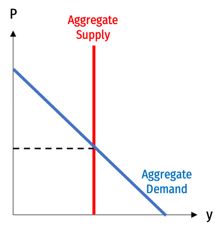
]
]

---

# Aggregate Demand & Aggregate Supply

.pull-left[

- Equilibrium level of $M$ and $y$

- Can talk about how major changes to the economy (.hi[“shocks”])  can cause changes in $M$ (inflation) and $y$ (real GDP growth)

- Two major sources of shocks:
  - .red[Aggregate Supply shocks]
]

.pull-right[
.center[
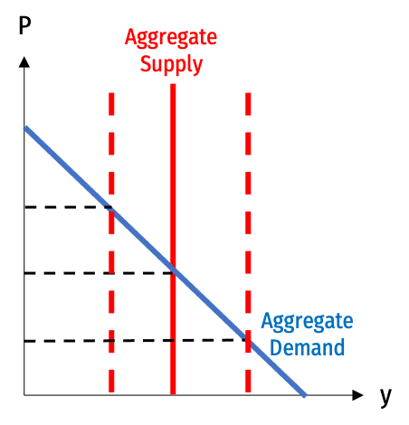
]
]

---


# Aggregate Demand & Aggregate Supply

.pull-left[

- Equilibrium level of $M$ and $y$

- Can talk about how major changes to the economy (.hi[“shocks”])  can cause changes in $M$ (inflation) and $y$ (real GDP growth)

- Two major sources of shocks:
  - .red[Aggregate Supply shocks]
  - .blue[Aggregate Demand shocks]
]

.pull-right[
.center[
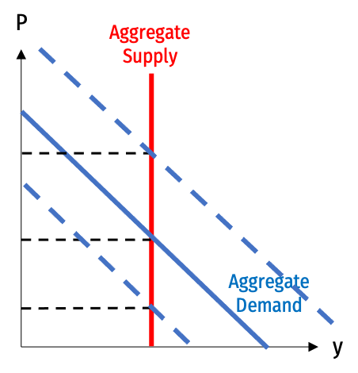
]
]

---

# Keynesian Aggregate Demand Management

.pull-left[
.smaller[
- .hi-purple[(Neo)-Keynesians] emphasize .hi-purple[insufficient aggregate demand]
  - Consumption affected by MPC
  - Investment driven by “animal spirits”

- Government spending can makeup shortfalls in C, I, to achieve high nominal spending $(MV)$
  - public works programs
  - fiscal policy
  - “priming the pump” and “steering the economy”

]
]\
.pull-right[
.center[

]
]

---

# Keynesian Models of the Macroeconomy

.pull-left[
.center[
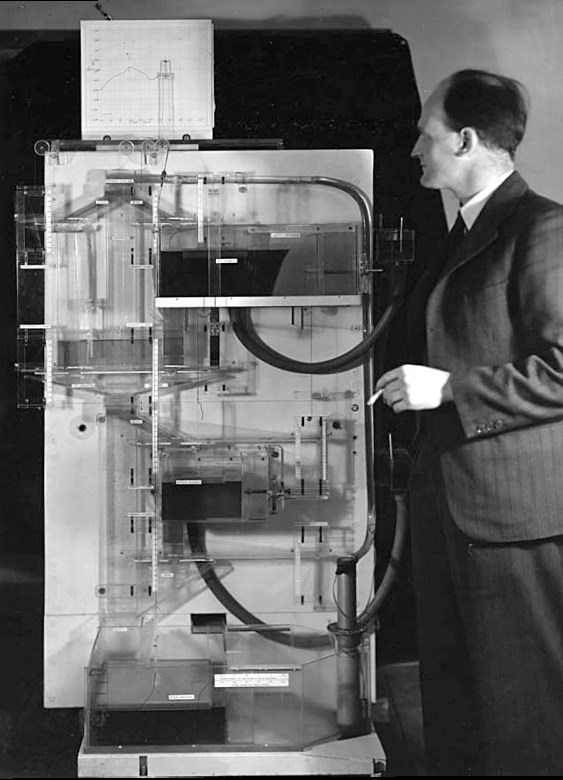
]
]

.pull-right[

- Neo-Keynesian economists focused on making macroeconometric models of the macroeconomy

- Deriving optimal fiscal policies
]

---

class: inverse, center, middle

# The New Classical (Counter) Revolution

---

# Friedman and Monetarism

.left-column[
.center[


.smallest[
Milton Friedman

1912-2006

Economics Nobel 1976
]
]
]

.right-column[

- Work on consumption function: permanent income hypothesis, consumption smoothing

- Many macroeconomic problems are caused by bad monetary policy
  - Great Depression prolonged by bad Federal Reserve policy

- “Inflation is always and everywhere a monetary phenomenon”

- Importance of rules vs. discretion

]

---

# New Classical Macroeconomics

.left-column[
.center[


.smallest[
Robert Lucas Jr.

1937—

Economics Nobel 1995
]
]
]

.right-column[

- .hi[“Lucas Critique”]: relationships that *appear* to hold in a model cannot be *exploited* by policymakers, because changing policy *changes the relationships* in the real world
  - Macroeconomic relationships are endogenous to policy
  - .hi-green[Example:] “the Phillips curve” apparent negative relationship between inflation & unemployment

- Cannot derive an econometric model of the macroeconomy *and then use it* to make policy

- Begins the call for .hi-purple[microfoundations of macroeconomics]
]

---

# New Classical Macroeconomics

.left-column[
.center[


.smallest[
L: Edward Prescott

R: Finn Kydland
]
]
]

.right-column[

- .hi[“New Classical” Macroeconomics]
  - rejection of Keynesian aggregate demand theory and macroeconometric modeling
  - focus on **real** determinants of economic growth and fluctuations
  - .hi-purple[microfoundations of macroeconomics]

- Rational expectations

- Real business cycle theory

- Representative agents
]

---

# New Classical Macroeconomics

.pull-left[

- .hi[“Real Business Cycle” Theory]
  - most recessions in history (even pre-capitalism) came from negative supply shocks
  - war, famine, bad weather, **pandemics**, bad harvest, oil shocks, etc.

- Only changes in real productivity (short run and long run) determine outcomes
]

.pull-right[
.center[

]
]

---

# What Are We Missing (For Time)?

.quitesmall[
- Cambridge capital controversy
  - can’t aggregate capital
  - Robinson, Sraffa vs. Samuelson, Solow

- Growth theory
  - Exogenous growth model (Harrod-Domar, Solow)
  - Endogenous growth model (Romer)

- Post-Keynesianism
  - coordination failures, disequilibrium expectations
  - Robinson, Leijonhufvud, Davidson

- New Keynesianism
  - “macrofoundations of microeconomics”
  - microeconomics origins of wage and price rigidities, menu costs
  - Mankiw, Krugman, Stiglitz, 
]

---

# A Good Summary

.center[
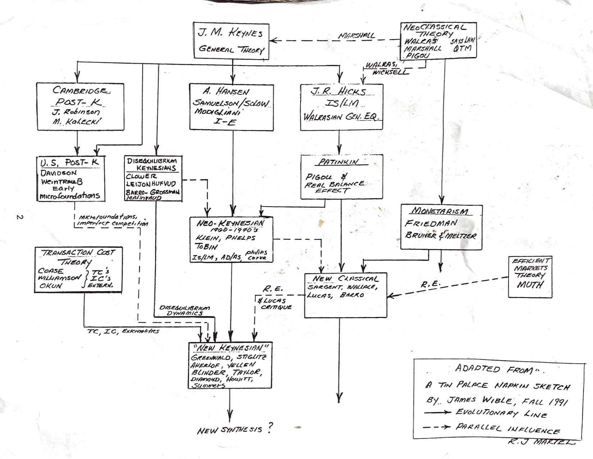
]